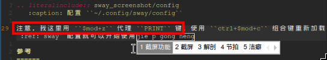

.. _sway_screenshot:

===================================
Wayland环境(sway)截屏
===================================

在 :ref:`wayland` 的 :ref:`sway` 桌面，我需要做一些截图以便撰写文档:

- 通过 sway 的快捷键执行脚本，完成屏幕截图
- 简单的截图标记(文字和线框等)

参考 `Taking Screenshots on Wayland <https://seeminglyrandom.net/posts/wayland-screenshot/>`_ 略作修改(主要是我 :ref:`archlinux_on_mba` ，而 :ref:`mba11_late_2010` 没有 ``print`` 按键):

- 在 :ref:`arch_linux` 上安装以下软件包:

.. literalinclude:: sway_screenshot/install
   :caption: 安装截屏需要的软件包

- 创建 ``~/bin/screenshot.sh`` 脚本(注意需要通过 ``chmod +x ~/bin/acreenshot.sh`` 设置可执行属性):

.. literalinclude:: sway_screenshot/screenshot.sh
   :caption: 创建 ``~/bin/screenshot.sh`` 脚本

- 配置 ``~/.config/sway/config`` (只做了一点点修改以适应我的使用，你也可以自己定义不同的快捷键) :

.. literalinclude:: sway_screenshot/config
   :caption: 配置 ``~/.config/sway/config``

注意，我这里用 ``$mod+z`` 代理 ``PRINT`` 键。使用 ``ctrl+$mod+c`` 组合键重新加载 :ref:`sway` 配置就可以开始使用截屏功能

   
   使用 ``$mod+z`` 对屏幕区域进行截屏，效果

此外，最终处理程序 ``swaypy`` 还提供了简单的图片标注功能

脚本解释
===============

使用到3个程序的pipeline:

.. literalinclude:: sway_screenshot/screenshot_cmd
   :caption: 组合了3个程序实现屏幕区域截图

- 首先是 ``grim`` 会通过 ``-g`` 参数表示从 ``region`` (区域)截屏( ``region`` 值是 ``slurp`` 提供的)
- 接下来 ``slurp`` 程序会获得 从 ``(x,y)`` 开始到 ``(<width>x<height>)`` 的座标，这个座标会被 ``grim`` 程序读取(即 ``-g`` 获得的区域范围)以便截图
- 通过管道 ``|`` 将截取的图片传输给 ``swaypy`` (交互的简单图片处理程序)处理
- 此外的截取窗口或输出则是由 :ref:`sway` 平台的 ``swaymsg`` 实现

参考
======

- `Taking Screenshots on Wayland <https://seeminglyrandom.net/posts/wayland-screenshot/>`_
