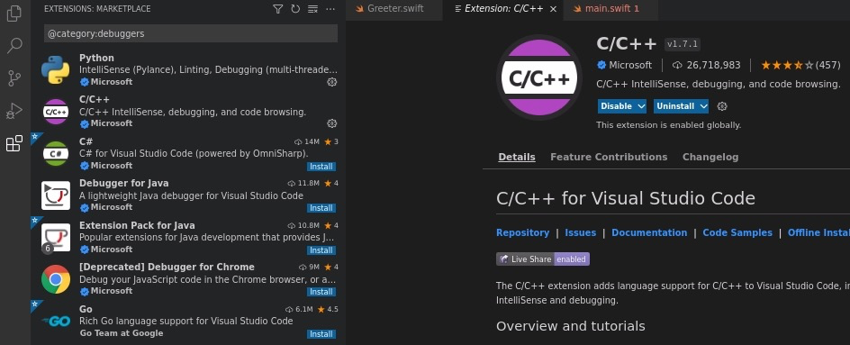

.. _vscode_debugging:

=======================
VS Code内建Debugging
=======================

Debugger extensions
=====================

VS Code内建了 :ref:`nodejs` 运行时的debug支持，并且可以debug JavaScript, TypeScript 或其他可以转译成JavaScript的语言。要debugging其他语言和运行时，例如 PHP, Ruby, Go, C#, Python, C++, PowerShell 以及更多语言，则需要从VS Code市场上找寻Debuggers extensions，或者从上层 ``Run`` 菜单选择 ``Install Additional Debuggers`` 。

.. note::

   通过 ``Run`` 菜单选择 ``Install Additional Debuggers`` 可以安装多个debugging插件

在VS Code中，需要在 ``.vscode`` 目录下生成 ``launch.json`` 和 ``tasks.json`` 文件，可以通过 VS Code 内置功能自动生成

参考
=======

- `VSCode Debugging <https://code.visualstudio.com/docs/editor/debugging>`_
