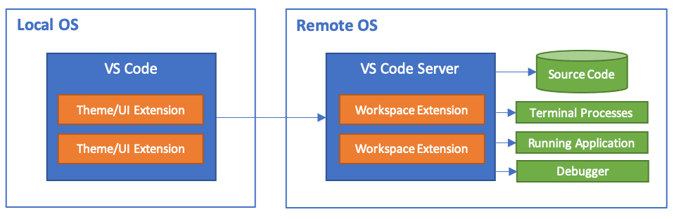

.. _vscode_remote_dev:

================
VS Code远程开发
================

VS Code Remote Development允许使用container容器，远程服务器或者Windows Subsystem for Linux (WSL)作为全功能开发环境:

- 可以在和部署环境完全相同的操作系统中开发，或者使用更为强劲或特殊的硬件
- 开发环境沙箱化可以避免影响本地主机配置
- 更容易让那个新的开发者起步和保持一致的环境
- 使用的工具或者云心管ing不再受限雨本地操作系统，或者能够管理运行环境的多个版本
- 可以在云计算环境中开发Linux部署应用
- 可以在不同主机或环境下访问相同的开发环境
- 随时随地可以在客户站点或者云计算环境中调试运行程序

本地不需要任何源代码存储，在远程开发扩展包中的每个扩展都能够运行命令以及在容器或远程主机中直接使用，就好像本地运行一样。

.. note::

   另一种远程服务器上运行大型图形程序的方法是使用 :ref:`xpra` ，可以方便在远程服务器上调试和运行大型图形程序，并且网络断开也不影响服务器端运行

远程开发扩展包(Remote Development extension pack)
==================================================

`Remote Development extension pack <https://aka.ms/vscode-remote/download/extension>`_ 包含3个扩展:

- :ref:`vscode_remote_dev_ssh`
- :ref:`vscode_remote_dev_containers`
- `Remote - WSL <https://code.visualstudio.com/docs/remote/wsl>`_

.. note::

   我主要实践在 :ref:`priv_cloud_infra` 通过 :ref:`kvm` 和 :ref:`docker` 来完成，所以将实践上述:

   - :ref:`vscode_remote_dev_ssh`
   - :ref:`vscode_remote_dev_containers`

此外，微软还提供了 `vscode.dev <https://vscode.dev/>`_ SaaS服务(收费)， 实现浏览器中开发调试本地代码或者直接调试github中代码。不过，也有第三方开发了基于node.js部署的 :ref:`vscode_in_browser` ，可以作为远程开发的平台。

参考
=========

- `VS Code Remote Development <https://code.visualstudio.com/docs/remote/remote-overview>`_
- `Remote Development tutorials <https://code.visualstudio.com/docs/remote/remote-tutorials>`_
