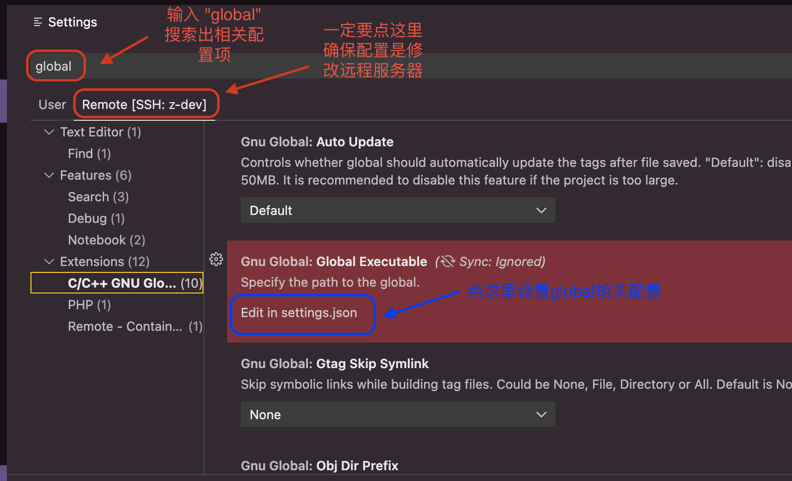

.. _vscode_remote_dev_kernel:

==============================
VS Code远程开发Linux Kernel
==============================

在我的工作中，大部分开发和运维都在Linux服务器端，而为了方便工作，使用 :ref:`macos` 作为主要的工作平台。这就带来了跨平台开发的问题，需要远程 :ref:`ssh` 登陆到远程Linux服务器采用终端黑屏模式进行。

:ref:`vscode_remote_dev_ssh` 可以让我们借助服务器强大的计算能力，来实现远程开发调试程序。对于 :ref:`kernel` 开发，通过简单的设置，也可以实现方便的内核代码浏览和开发。内核开发需要加载大量的代码，对编辑器有内存和CPU要求，所以直接采用 :ref:`linux_desktop` 成本较高。

准备工作
============

我是在 :ref:`priv_cloud_infra` 构建虚拟机 ``z-dev`` ，然后通过 :ref:`priv_ssh` ( :ref:`ssh_proxycommand` ) 登陆到服务器上:

- :ref:`kvm` 虚拟机提供了硬件伸缩性，并且可以通过 :ref:`priv_kvm_sr-iov` 实现PCIe设备加速，例如采用 :ref:`ovmf` 访问NVMe存储，采用 :ref:`nvidia_vgpu` 进行 :ref:`cuda` 开发

远程服务器
============

远程服务器需要安装 ``global`` 用于解析符号表::

   sudo dnf install global

安装完成后，系统有2个二进制文件: ``global`` 和 ``gtags``

- 内核源代码下载可以从 https://www.kernel.org 或者 `Github torvalds / linux <https://github.com/torvalds/linux>`_ 获取，这里举例::

   wget https://mirrors.edge.kernel.org/pub/linux/kernel/v2.6/linux-2.6.34.tar.gz
   tar xfz linux-2.6.34.tar.gz

本地主机
============

- 本地主机(我使用的是macOS) :ref:`vscode_remote_dev_ssh` 安装好 ``Remote-SSH`` 插件
- 在 VSCode 中 按下 ``F1`` 或 ``⇧⌘P`` 启动命令行面板，然后选择 ``Remote-SSH: Connect to Host...``  ，然后输入需要访问的SSH服务器 ``z-dev``
- 此时VSCode会在远程 ``z-dev`` 服务器上自动下载并运行一个 ``vscode-server`` 并完成初始化: 初始化完成后，在远程 ``z-dev`` 上执行 ``ps aux | grep code`` 可以看到这个服务进程

远程服务器
=============

- 此时在本地 VSCode 的左下角有一个提示表明现在连接的是远程服务 ``>< SSH: z-dev`` ，这表示我们现在的操作，包括安装插件将在远程服务器上完成。这点非常重要，因为我们接下来需要在远程 ``vscode-server`` 上安装方便我们开发的插件

- 在远程服务器上打开存放源代码的目录，这里案例是 Kernel 2.6.34 代码，打开目录后，后续 ``global`` 命令就知道对当前目录创建符号表解析

- 点击 VSCode 最左边的导航按钮 ``Extensions ⇧⌘X`` ，然后搜索安装 ``C/C++ GNU Global`` ，并确保是安装在远程服务器上 ``SSH:Z-DV - INSTALLED``

- 在VSCode配置(注意，点一下 ``Remote[SSH:z-dev]`` 确保配置是在远程服务器上生效)

输入以下配置::

   {
       "gnuGlobal.globalExecutable": "/usr/bin/global",
       "gnuGlobal.gtagsExecutable": "/usr/bin/gtags",
       // 指明生成的符号表存放在哪个位置(目录必须有当前用户的写入权限
       "gnuGlobal.objDirPrefix": "/home/huatai/.global"
   } 

注意："gnuGlobal.objDirPrefix" 的路径必须要手动创建好，如果不存在，会导致后续 Rebuild 的失败::

   mkdir /home/huatai/.global

- 按下 ``⇧⌘P`` 调出命令面板，然后执行 ``Global: Show GNU Global Version`` ，如果前面正确设置，就会在 VSCode 右下角显示版本号 ``global (GNU GLOBAL) 6.6.5`` 表示一切就绪

- 按下 ``⇧⌘P`` 调出命令面板，然后执行 ``Global: Rebuild Gtags Database`` 运行不报错对话并提示 ``Build tag files successfully`` ，则会在 ``/home/huatai/.global`` 目录下生成对应源代码的 ``GPATH  GRTAGS  GTAGS`` (这里案例就是 ``/home/huatai/.global/home/huatai/github.com/linux-2.6.34`` 目录下)

- 然后就可以使用 VSCode 进行代码阅读以及开发  

参考
=======

- `VSCode 阅读 Linux 代码怎么才不卡顿 <https://mp.weixin.qq.com/s/dK5P4nbGw7IvzULDTLVYSg>`_
