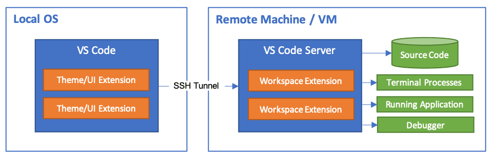
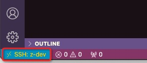

.. _vscode_remote_dev_ssh:

===========================
VS Code远程开发-SSH模式
===========================

``Visual Studio Code Remote - SSH`` 扩展可以让你打开任何使用SSH服务的主机，虚拟机或容器上的一个远程目录，并且能够使用所有VS Code的功能。一旦连接服务器，就可以访问远程服务器文件系统中任何文件和目录。

本地不需要保存任何代码，扩展是在远程服务器上运行命令。最新的VS Code提供了和本地一样的开发体验，包括所有的智能会话()

系统要求
========

- 本地: 安装 OpenSSH 兼容 SSH 客户端
- 远程SSH服务器: 运行 SSH Server，硬件配置 1GB 内存，2-core CPU 。可以是x86_64或ARMv7l (AArch32), 和 ARMv8l (AArch64) 

安装
========

- 在 :ref:`hpe_dl360_gen9` 服务器上采用 :ref:`priv_cloud_infra` 部署 :ref:`priv_kvm` 虚拟机 ``z-dev`` 作为开发环境( :ref:`fedora_dev_init` )
- 在远程服务器 ``z-dev`` 中 :ref:`vscode_linux` ，并通过 :ref:`xpra_startup` 来验证VS Code正常运行(可选)

.. note::

   远程服务器上可以安装 Visual Studio Code 或 Visual Studio Code Insiders (Insiders是beta版本)

- 在远程服务器 ``z-dev`` 的 VS Code中，安装 `Remote Development extension pack <https://aka.ms/vscode-remote/download/extension>`_ 

  - 使用 VS Code 的 Extension 管理安装

- (可选)对于Linux和macOS的SSH服务器，可以同时有多个用户访问，建议激活 VS Code的 ``Remote.SSH: Remote Server Listen On Socket`` 

- (可选)虽然也支持密码认证，但是建议SSH服务器采用 :ref:`ssh_key` 认证增强安全性

连接远程服务器
==================

- 现在可以在本地，例如我在 macOS 客户端，先验证 ssh 登陆远程SSH服务器( :ref:`priv_ssh` )::

   ssh z-dev

- 在本地macOS上启动一个VS Code，然后按下 ``F1`` 或 ``⇧⌘P`` 启动命令行面板，然后选择 ``Remote-SSH: Connect to Host...`` ，然后输入需要访问的SSH服务器 ``z-dev`` 

此时VS Code会弹出一个新的窗口连接到远程SSH服务器，开始初始化开发环境，完成后虽然看上去是本地的IDE，但是仔细观察就会看到左下角标识了远程服务器 ``SSH: z-dev`` :

- 此时 ``File > Open...`` 或 ``File > Open Workspace...`` 打开的是远程服务器上目录，并且安装插件都是在远程VS Code中安装，就可以非常方便完成开发

.. note::

   使用 VS Code Remote SSH 方式开发的优点是比 :ref:`xpra` 更为接近本地原生程序体验，使用更为流畅和方便。

连接远程服务器 :ref:`alpine_linux`
====================================

我在 :ref:`alpine_docker_image` 构建的Docker容器上尝试使用 remote ssh 开发模式，发现实际上是失败的:

.. literalinclude:: vscode_remote_dev_ssh/dynamic_port_forwarding_fail
   :caption: 远程端口启动失败
   :emphasize-lines: 28

这个报错是因为默认 ``sshd_config`` 关闭了TCP端口转发，所以需要修改 :ref:`alpine_docker_image` 运行容器的 ``/etc/ssh/sshd_config`` ，设置

.. literalinclude:: vscode_remote_dev_ssh/sshd_config
   :caption: 调整 ``AllowTcpForwarding``

然后重启容器，再次执行 remote ssh 连接服务器，就能够完成vscode远程开发环境初始化，并在安装不同语言插件之后进行开发。

重启服务端
==============

远程服务端可能需要重启来修正一些问题，则使用 ``Remote-SSH: Kill VS Code Server on Host`` ，可以移除服务器端的Code Server。然后再次重联到新的会话。

参考
=======

- `Remote Development using SSH <https://code.visualstudio.com/docs/remote/ssh>`_
