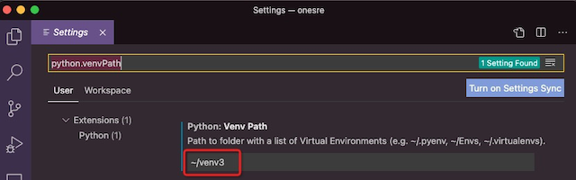
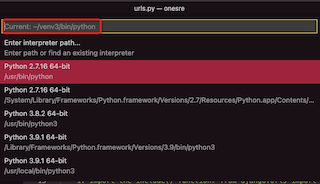

.. _vscode_virtualenv:

==================================
在VS Code中使用Python virtualenv
==================================

在Python中所谓"环境"是指Python程序的运行上下文。Python环境包含了Python解释器和一系列安装的Python包。VS Code的Python扩展提供了不同环境的有效集成工作功能。

选择和激活环境
===============

默认情况下，Python扩展会搜索和使用在系统目录中找到的第一个Python解释器。如果VS Code没有找到任何解释器，就会提示一个警告。在macOS中，VS Code扩展也会在使用系统预装Python解释器时候提示一个警告，因为通常用户都是直接安装使用解释器。不管哪种情况，你都可以通过设置 ``python.disableInstallationCheck`` 为 ``true`` 来关闭告警。

- 选择指定环境，在 ``Command Palete`` ( ``⇧⌘P`` )中选择使用 ``Python:Select Interpreter``

.. figure:: ../../../_static/linux/desktop/vscode/select-interpreters-command.png

.. note::

   扩展自动从以下位置查找解释器:

   - 标准安装目录，如 ``/usr/local/bin`` , ``/usr/sbin`` , ``/sbin`` , ``c:\\python27`` , ``c:\\python36`` 等
   - 在workspace(项目)目录下直接定位虚拟环境
   - 在General settings中设置 ``python.venvPath`` 指定Python虚拟环境，这个设置可以包含多个虚拟环境。扩展会查看 ``venvPath`` 的5层子目录中的虚拟环境
   - 对 `virtualenvwrapper <https://virtualenvwrapper.readthedocs.io/>`_ 的 ``~/.virtualenvs`` 指定目录的虚拟环境
   - 通过 `pyenv <https://github.com/pyenv/pyenv>`_ 安装的解析器
   - 为 `virtualenvwrapper <https://virtualenvwrapper.readthedocs.io/>`_ 使用的通过 ``WORKON_HOME`` 指定的路径中的虚拟环境
   - Conda环境包含的Python解析器
   - 在workspace(项目)目录下的 ``.direnv`` 目录下安装的解析器

我使用 General settings中设置 ``python.venvPath`` 指定Python虚拟环境:

在 Workspace Settings中设置 ``python.pythonPath`` 中设置好自己的解析器(原先设置内容是 ``python`` ，修订成 ``~/venv3/bin/python`` ):

.. figure:: ../../../_static/linux/desktop/vscode/vscode_pythonpath.png

这两个配置完成后，检查 ``$HOME/Library/Application\ Support/Code/User/settings.json`` 可以看到如下配置::

   ...
   "python.venvPath": "~/venv3",
   "python.pythonPath": "~/venv3/bin/python",
   ...

- 完成以上 ``python.venvPath`` 和 ``python.pythonPath`` 设置之后， ``需要重启一次VS Code`` ，然后使用 ``Python:Select Interpreter`` 就会看到默认的解释器就是虚拟环境中的Python了： ``~/venv3/bin/python``

上述设置之后，在 VS Code中启动一个内建的Terminal可以看到如下输出::

   source /Users/huatai/venv3/bin/activate
   huatai@my-studio onesre % source /Users/huatai/venv3/bin/activate
   (venv3) huatai@my-studio onesre %

则证明已经启动Python Virtualenv环境，并且在Terminal中执行 ``python`` 进入交互模式，并执行 ``import 模块名`` 检查你之前安装过的模块，例如 :ref:`django` 不应该有任何报错。

参考
======

- `Using Python environments in VS Code <https://code.visualstudio.com/docs/python/environments>`_
