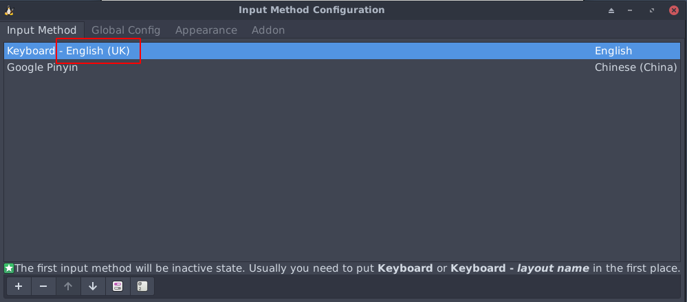

.. _xfce_startup:

============
Xfce快速起步
============

Xfce是我最喜欢的 :strike:`轻量级桌面` 桌面之一，兼顾了Gnome丰富的功能和LXDE资源节约，达到了够用好用的平衡。这个桌面系统开发历史悠久，交互方式非常稳定。整个桌面仅包含必要的组件，但能够完成日常工作的方方面面，是最适合硬件性能有限或者专注于充分发挥系统性能到关键目标的开发者。

.. note::

   随着Xfce不断迭代发展，现在xfce已经向易用性作出了极大的改进，随之而来的是Xfce已经不再是资源占用极少的轻量级桌面。为了能够更为节约资源，目前我已经全面转向 :ref:`sway` 。不过，对于普通用户，选择Xfce不失为一个简便的方案。

.. figure:: ../../../_static/linux/desktop/xfce/xfce_layers.png
   :scale: 80

.. note::

   另外也推荐使用LXDE轻量级桌面，例如，树莓派默认的桌面就是基于LXDE定制的PIXEL桌面，对资源使用极少，适合硬件性能有限的平台。

安装Xfce
==========

Arch
------

- 安装XFce4::

   sudo pacman -S xfce4

.. note::

   参考 `arch linux文档 - Xfce <https://wiki.archlinux.org/index.php/Xfce>`_ 设置Xfce，安装步骤可以参考 `How to Set Up the XFCE Desktop Environment on Arch Linux <https://www.maketecheasier.com/set-up-xfce-arch-linux/>`_ 和 `How to install Arch Linux with XFCE Desktop - Page 2 <https://www.howtoforge.com/tutorial/arch-linux-installation-with-xfce-desktop/2/>`_

   xfce4组合包含了基础软件包，如果还安装 ``xfce4-goodies`` 则会包含桌面组件

- 可以直接启动Xfce::

   startxfce4

Ubuntu/Debian/Raspberry Pi OS
---------------------------------

- 安装::

   sudo apt install xserver-xorg xfce4 

.. note::

   如果需要一些Xfce的桌面小组件，还可以安装 `xfce4-goodies <https://packages.debian.org/stretch/xfce/xfce4-goodies>`_ 提供了诸如CPU见识，邮件查看，Notes以及lm-sensors插件等。此外还包括mousepad编辑器，xfce4-dict字典，任务管理器等等。不过，这些独立应用也可以手动安装，例如我就安装了 ``xfce4-terminal`` 。

- 我在 :ref:`pi_400` 上安装 Raspberry Pi OS Lite版本，所以Xfce4安装以后，默认还是字符界面启动，可以通过以下命令检查是否默认启动图形界面::

   sudo systemctl get-default

如果不是 ``graphical.target`` 可以通过以下命令切换::

   sudo systemctl set-default graphical.target

中文设置
==========

中文字体
---------

只需要安装一种中文字体'文泉驿'就可以正常在图形界面显示中文，并且这个字体非常小巧

- Arch安装命令::

   pacman -S wqy-microhei

- Debian安装::

   apt install fonts-wqy-microhei

中文输入法
-----------

安装输入法fcitx(主要考虑轻量级)::

   pacman -S fcitx fcitx-sunpinyin fcitx-im

.. note::

   fcitx-im 是为了包含所有输入模块，包括 fcitx-gtk2, fcitx-gtk3, 和 fcitx-qt5

   fcitx-sunpinyin 是输入速度和输入精度较为平衡的输入法，并且轻巧

   此外，现在推荐 fcitx-googlepinyin 

.. note::

   中文设置参考 `arch linux 文档 - Localization/Chinese <https://wiki.archlinux.org/index.php/Localization/Chinese>`_

   输入法fcitx参考 `arch linux 文档 - Fcitx (简体中文) <https://wiki.archlinux.org/index.php/Fcitx_(%E7%AE%80%E4%BD%93%E4%B8%AD%E6%96%87)>`_

安装了fcitx之后，重新登陆Xfce桌面会自动启动fcitx(这里利用了session恢复)，如果使用了显示管理器 LightDM 则会自动启动fcitx。如果是字符界面使用 ``startx`` 启动桌面，则采用在 ``.xinitrc`` 中明确配置启动fcitx::

   export GTK_IM_MODULE=fcitx
   export QT_IM_MODULE=fcitx
   export XMODIFIERS=@im=fcitx
   exec fcitx &

此时还没有能够通过 ``ctrl+space`` 唤出中文输入法。这里建议安装 ``fcitx-configtool`` 工具，安装以后在终端运行 ``fcitx-config-gtk3`` 命令就可以打开图形界面配置。

配置方法: 对于新安装的英文系统，要取消只显示当前语言的输入法（Only Show Current Language），才能看到和添加中文输入法(Pinyin, Libpinyin等)。添加输入法之后，按下 ``ctrl+space`` 就可以正常输入中文。

- 编辑 ``~/.xinitrc`` 添加::

   exec startxfce4

这样就可以简单执行 ``startx`` 启动桌面。

- 更方便使用显示管理器 LightDM ::

   sudo pacman -S lightdm

- 切换默认字符或默认图形桌面管理::

   # 切换图形桌面
   systemctl set-default graphical.target

   # 切换字符界面
   systemctl set-default multi-user.target

.. _keyboard_layout:

Keyboard Layout之谜
--------------------

我 :ref:`pi_400_desktop` 安装使用Xfce4曾经遇到非常奇怪的键盘布局问题。

- 通过 ``respi-config`` 交互工具可以设置 (参考 `Changing the Keyboard Layout for your Raspberry Pi <https://pimylifeup.com/raspberry-pi-keyboard-layout/>`_ ) 键盘布局，这个交互设置实际上就是调整 ``/etc/default/keyboard`` :

.. literalinclude:: xfce_startup/keyboard
   :language: bash
   :linenos:
   :caption:

这个配置是全局生效，此时在字符终端中测试键盘，可以看到键盘是按照US键盘布局，完全匹配我购买的US键盘树莓派400。

但是，当我启动Xfce4桌面，我意外发现键盘布局悄悄变成了UK布局。我反复检查Xfce的配置 ``keyboard`` 确实是使用 ``Use system defaults`` :

.. figure::  ../../../_static/linux/desktop/xfce/xfce_keyboard_layout.png
   :scale: 50

我尝试了使用参考 `debian wiki - keyboard <https://wiki.debian.org/Keyboard>`_ 方法通过 ``setxkbmap us`` 调整，但是只是设置瞬间正常，一会就又变成UK布局。折腾好久，我偶然发现输入法 ``fcitx`` 没有启动时候在Xfce中keyboard layout是正常的，一旦启动 ``fcitx`` 就立即切换成了UK布局。

打开 ``fcitx-config-gtk3`` 我恍然发现，原来 ``fcitx`` 启动时候加载了 ``UK`` 布局键盘作为英文输入:

解决方法就是删除 ``fcitx`` 输入设置中的UK布局键盘，添加一个US布局键盘。

Theme
-----------

.. note::

   `7 Great XFCE Themes for Linux <https://www.maketecheasier.com/xfce4-desktop-themes-linux/>`_ 介绍了不同的XFCE themes，可以选择一个喜欢的安装。

   不过，我发现默认安装的theme，选择 Apperance 中的 Adwaita-dark Style就已经非常美观简洁，除了图标比较简陋以外，其他似乎不需要再做调整。

以下文档可参考Xfce theme:

- `8 Great XFCE Themes To Check Out <https://www.addictivetips.com/ubuntu-linux-tips/great-xfce-themes/>`_
- `Make Xfce look modern and beautiful <https://averagelinuxuser.com/xfce-look-modern-and-beautiful/>`_
- `4 Ways You Can Make Xfce Look Modern and Beautiful <https://itsfoss.com/customize-xfce/>`_

我感觉比较modern的是平面型(flat)的风格，推荐可以尝试一下 Arc 风格::

   pacman -S arc-gtk-theme

此外，图标可以选择安装 Flat Remix icons ::

   yay -S flat-remix

.. note::

   我在 :ref:`jetson_xfce4` 中没有安装其他第三方theme，主要是为了精简和减轻系统负担。不过，默认安装的xfce4 theme也有比较精巧的界面，例如，我选择 ``Greybird-compact`` 作为窗口管理器风格： ``Settings >> Window Manager`` 然后选择 ``Greybird-compact`` 可以使得窗口标题条占用较少的屏幕空间。

   我在 :ref:`pi_400_desktop` 中同样也没有安装附加的theme，也是为了减轻系统压力。我直接采用了 ``Window Manager`` 中的 ``Kokodi`` 风格，这个风格在高分屛上大小比较合适，并且提供了窗口的边缘立体阴影，非常有macOS的窗口风格。

.. note::

   对于高分辨率屏幕，字体有可能会显示较小，看起来比较吃力。在不修改显示器分辨率(不使用默认显示器分辨率虽然能够使得字体放大但是显示会模糊)，可以通过修改显示DPI来解决: ``Settings >> Appearance >> Fonts`` 然后调整 ``DPI`` 使用 ``Custom DPI settings`` 进行调整，例如，对于2K屏幕，调整为 ``108`` 可以达到普通屏幕 ``96`` DPI的显示效果。

   注意，DPI调整只影响字体显示，对图标显示不影响，适合编码工作放大字体。请参考 `DPI Calculator / PPI Calculator <https://www.sven.de/dpi/>`_ 进行计算以及常用显示器配置参考。

- 在 :ref:`pi_400` 上运行 Xfce4 我选择 ``arc-theme`` + ``moka-icon-theme`` ，这个风格非常现代化，采用一种平面化的柔和配色，也是现代Gnome采用的风格。是的，Xfce4可以使用Gnome的桌面风格。

以下是我在 :ref:`jetson` 中使用xfce4的设置::

   Appearance >>
     Style >>
       Xfce
     Icons >>
       Ubuntu-Mono-Light
     Fonts >>
       Default Font: Sans 9
       Default Monospace Font: Monospace 9
       Rendering: Enable anti-aliasing
       DPI: 

   Window Manager >>
     Style >>
       Theme: Greybird-compact
       Title font: Sans Bold 9

   Window Manager Tweaks >>
     Compositor >> (我感觉启用display compositing会消耗资源)
       去除 Enable display compositing 选择

   Panel >>
     Panel1 >>
       Display >>
         Measurements >>
           Row Size (pixels) : 20 (默认是30，该数值调小可以使得工具条变窄)
     Panels2 >>
       Display >>
         Measurements >>
           Row Size (pixels) : 33 (默认是?，该数值调小可以使得工具条变窄)

高分辨率调优
----------------

高分辨率显示器下主要调整如下：

- 修改显示DPI来放大字体 120%: ``Settings >> Appearance >> Fonts`` 然后调整 ``DPI`` 使用 ``Custom DPI settings`` 进行调整，例如，对于2K屏幕，调整为 ``108`` 可以达到普通屏幕 ``96`` DPI的显示效果。
- Firefox和chromium放大 120%: 浏览器支持Preference调整zoom
- mupdf阅读器调整字体也是放大 120%就足够清晰

性能优化(降低资源使用)
========================

在 :ref:`pi_400` 有限的硬件资源下使用xfce4，我希望窗口管理器消耗资源越少越好

隐藏窗口内容(Hide content of windows)
--------------------------------------

当移动窗口和调整窗口大小，窗口管理器需要重绘窗口，非常消耗资源。可以配置成在移动窗口时不重绘移动窗口的内容，会部分降低Xorg的CPU消耗(在 :ref:`pi_400` 上可以把单核CPU使用率从37%降低到25%)::

   Settings Manager => Window Manager
                         => Advanced 面板
                           => Hide content of windows
                             => 勾选 When moving 和 When resizing

平铺窗口
===========

以往使用macOS的时候，非常羡慕Windows用户有一个平铺窗口(Tile window)的内置功能。好在虽然macOS没有提供的Tile window可以通过第三方软件来实现。

切换到Linux工作平台，开始使用Xfce桌面，惊喜发现这个平铺窗口的功能是Xfce的内置功能，只需要把窗口拖放到桌面的边缘就可以实现窗口平铺。不过，也有一个烦恼，就是由于默认的multi workspace，会导致拖放窗口切换到其他工作台。

改进的方法就是使用Xfce Window Manager快捷键，这样就不需要使用鼠标，完全可以做到和macOS平台的第三方窗口平铺软件一样的功能。

注意：系统默认没有给平铺窗口预设快捷键，需要使用 ``Setting >> Window Manger >> Keyboard`` 设置，我为了和macOS使用的第三方软件快捷键一致，采用如下快捷键

================================   ===================== 
平铺方式                             快捷键                  
================================   ===================== 
 Tile window to the top            ``Ctrl+Super+Up``       
 Tile window to the bottom         ``Ctrl+Super+Down``     
 Tile window to the left           ``Ctrl+Super+Left``     
 Tile window to the right          ``Ctrl+Super+Right``    
 Tile window to the top-left       ``Ctrl+Super+U``        
 Tile window to the top-right      ``Ctrl+Super+I``        
 Tile window to the bottom-left    ``Ctrl+Super+J``        
 Tile window to the bottom-right   ``Ctrl+Super+K``        
 Maximize window                   ``Ctrl+Super+Return``   
================================   ===================== 

屏幕锁定
==========

对于轻量级系统，我不希望搞复杂的屏保(占用磁盘也消耗内存)，仅仅需要一个简单的黑屏锁定。

`slock <http://tools.suckless.org/slock/>`_ 是一个简单的X display locker，简单到只有黑屏和单色屏幕，并且安装只占用几百K磁盘空间。

使用方法::

   slock

当触动锁屏状态的键盘，则现实一个单色的屏幕，此时也没有任何输入窗口或者按键。实际上，此时只要盲打输入当前帐号的密码就可以解开锁屏。非常轻量级。

slock还可以结合 ``xautolock`` 来使用，例如，没有交互10分钟自动锁屏::

   xautolock -time 10 -locker slock

.. note::

   如果采用了 LightDM 图形界面管理器，则默认加载了screen lock，就不必采用上述方法。直接点菜单锁定屏幕即可。

快捷键输入字符串
=================

线上维护需要反复输入一些命令，打字非常浪费生命。所以安装X window平台 `xdotool <http://www.semicomplete.com/projects/xdotool/xdotool.xhtml>`_  工具。

以下脚本存储为 `~/bin/sendtext.sh` ::

   #!/usr/bin/bash
   text=(
   windowid=$(xdotool getwindowfocus)
   sleep 0.1 && xdotool windowactivate --sync $windowid type $text

在LXQt和Xfce管理桌面快捷键中创建一个新的快捷键 ``Meta-t`` ，则在Windows或Mac系统按下 ``Window`` 键/ ``Command`` 键加上 ``t`` 键，就会向当前窗口发送`text`这个字符串。只需要修改一下脚本，替换成你希望输入的大段文本，就可以一键输入大量的文字，堪称节约生命的神器。

应用软件
==========

thunar
---------

thunar轻量级强大的文件管理器，提供了插件支持文件压缩和解压缩::

   pacman -S thunar-archive-plugin

xfce4-terminal
------------------

xfce4-terminal兼顾了轻量级和功能丰富，可以在xfce桌面替代常用的uxterm/xterm。

GoldenDict(取消)
-------------------

`GoldenDict <http://goldendict.org/>`_ 是使用WebKit引擎的字典软件，支持各种字典文件，也支持在线字典查询。不过软件以来qt5-webkit，会占用较大的系统资源(安装占用140MB磁盘空间)。

- 安装::

   pacman -S goldendict

.. note::

   现在已经不再单独安装字典软件，而是采用在线的google translate。

flameshot
---------------

`Flameshot <https://flameshot.js.org/>`_ 是一个轻量级截图软件，并且支持直接图形编译，添加一些标注。并且flameshot和Xfce集成非常完美，能够在托盘驻留，编辑后的截图还可以传送给其他程序进一步出来。

- 安装::

   pacman -S flameshot

ristretto
----------------

`Ristretto <https://docs.xfce.org/apps/ristretto/getting-started>`_ 是xfce4默认内置图片浏览器，非常轻量级，速度极快。

pinta(取消)
--------------

`Pinta <https://www.pinta-project.com/>`_ 是开源的画笔软件，跨平台支持。不过，使用 ``mono`` 开发，安装需要274MB( :ref:`freebsd` 平台)，所以没有太大需求我就不安装了。

mupdf
----------------

`mupdf <https://mupdf.com>`_ 是一个开源的采用C语言编写的PDF, XPS和EPUB阅读器，性能非常卓越，并且安装体积小依赖少::

   pacman -S mupdf

mupdf非常简洁，甚至没有提供菜单，但是基本功能完备。使用 ``ctrl`` 键结合鼠标滚轮可以方法缩小页面（对于MacBook Pro的Retina屏幕，epub和pdf显示的字体都太小了)。

midori(取消)
----------------

虽然chrome已经成为浏览器的事实标准，但是chromium实在太庞大沉重了。xfce项目推荐的集成的浏览器是midori。虽然midori一度停止开发，但是现在再次活跃开发。作为轻量级的 webkit 引擎浏览器，比chromium消耗资源少，也能兼容大多数网站。

在 :ref:`jetson_nano` 上使用的默认浏览器是chromium，可以通过 :ref:`arm_build_midori` 方式安装。

.. note::

   我实践发现midori兼容性不能满足日常使用，所以还是只结合采用firefox和chromium: chromium主要用于工作(大量的工作网站只兼容chrome)，个人使用则主要采用firefox(感觉更为轻巧)

.. warning::

   在树莓派上，默认Raspberry Pi OS提供了chromium浏览器，没有直接提供firefox。我实践发现在滚动页面时，firefox非常消耗CPU资源(Xorg把整个CPU资源都用完了)，而chromium使用Xorg的CPU资源只有firefox的1/4。应该是chromium采用了图形硬件加速。这方面后续有机会再研究对比一下。

参考
========

- `Install the XFCE desktop on your Raspberry PI <https://www.pragmaticlinux.com/2020/11/install-the-xfce-desktop-on-your-raspberry-pi/>`_
- `How to disable windows' contents to be moved on dragging, so that only a frame is draggend and window redrawed at drop? <https://askubuntu.com/questions/574024/how-to-disable-windows-contents-to-be-moved-on-dragging-so-that-only-a-frame-i>`_
