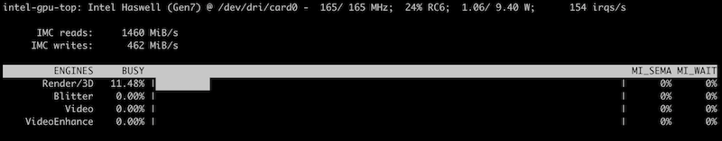

.. _gentoo_intel:

===================
Gentoo Intel显卡
===================

``intel`` 是从Intel 810开始的 Intel GMA 板载显卡和 Intel Arc 专用显卡的开源显卡驱动程序。Intel显卡对开源友好，虽然性能不佳，也没有 :ref:`nvidia_gpu` 在 :ref:`machine_learning` 上深耕的 ``CUDA`` 护城河，但是作为主板(处理器)集成显卡，具有价廉物美的特点。

硬件检测
=============

- 使用 ``lspci`` 检测VGA显卡，在我的 :ref:`mba13_early_2014` 上:

.. literalinclude:: gentoo_intel/mba13_intel_vga
   :caption: 在 :ref:`mba13_early_2014` 输出检测到的VGA芯片

可以看到是集成显卡 ``Haswell-ULT Integrated Graphics Controller``

根据 `gentoo linux wiki: Intel#Feautre_support <https://wiki.gentoo.org/wiki/Intel#Feature_support>`_ 可以看到 Haswell 是 ``Gen 7.5`` : 部分功能 OpenCL / Vulkan 是通过已经不再维护的Intel Legacy OpenCL drivers 支持的

安装
========

Firmware
-----------

- 使用 Skylake, Broxton 或更新的Intel图形芯片需要从 ``sys-kernel/linux-firmware`` 软件包获得附加的firmware:

.. literalinclude:: install_gentoo_on_mbp/install_firmware
   :language: bash
   :caption: 安装 ``sys-kernel/linux-firmware``

DMC firmware
---------------

.. note::

   参考文档，我没有将DMC firmware编译进内核，而是将intel图形芯片编译为模块，这样加载模块同时会自动加载 :ref:`initramfs` 中的firmware。

``Display Microcontroller firmware`` (显示微控制器firmware)提供了高级图形芯片低功耗idle状态。

要在内核中编译进 ``DMC firmware`` (以下是 ``i915`` 案例)可以使用如下方法配置:

.. literalinclude:: install_gentoo_on_mbp/dmc_firmware
   :caption: 在内核编译进图形芯片 ``DMC firmware``

.. warning::

   直接将firmware编译进内核可能会导致内核挂起，所以可以将firmware加入到 :ref:`initramfs` 中，通过图形芯片内核模块加载时自动从 :ref:`initramfs` 中加载firmware

GuC/HuC firmware
------------------

``Graphics µController firmware`` 提供了将功能从主机驱动卸载到硬件加速的架构上，例如 ``HEVC/H.265 µController firmware`` 可以加速多媒体编码。

不过，这个功能似乎需要 Gen 9 以上，我的古老硬件不支持这个功能。

内核
==========

.. literalinclude:: gentoo_intel/kernel
   :caption: 内核配置支持Intel图形芯片

.. note::

   ``GVT-g graphics virtualization`` 技术是Broadwell之后的处理器才支持的虚拟化GPU技术，我的 :ref:`mba13_early_2014` 处理器是 Haswell 不支持这个功能

   ``Intel PXP support and the Intel Management Engine Interface`` 用于支持 ``GuC/HuC firmware`` ，由于我的硬件不支持所以没有编译

   还有一些细节有待研究

工具
========

``x11-apps/igt-gpu-tools`` 提供了debugging工具

- 检查Intel GPU min/max/current 频率:

.. literalinclude:: gentoo_intel/intel_gpu_frequency
   :caption: 检查Intel GPU频率

- ``intel_gpu_top`` 提供了类似 ``top`` 显示GPU状态:

.. literalinclude:: gentoo_intel/intel_gpu_top
   :caption: 类似 ``top`` 展示GPU的 ``intel_gpu_top``

显示输出还挺直观的，类似:

上述 ``Video`` 使用率是 ``0%`` ，原因是没有使用硬件解码和编码，我在通过 :ref:`gentoo_firefox` 观看B站视频时候发现确实 ``video`` 没有负载，说明没有使用GPU硬件加速。这个问题后续再优化

参考
=======

- `gentoo linux wiki: Intel <https://wiki.gentoo.org/wiki/Intel>`_
