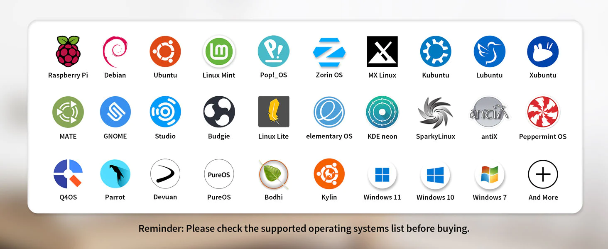

.. _gentoo_mba_wifi:

====================================
Gentoo Linux在MacBook Air配置Wifi
====================================

.. note::

   所有淘宝上售卖的不同品牌 ``AX300`` 免驱动WiFi6无线网卡 ，实际上都是 RealTek 开发芯片 ``aic8800`` , BrostTrend 代工的 ``AX5L`` WiFi6 USB无线网卡。

   该 ``aic8800`` 可能是 Realtek ``RTL8188EU`` 芯片的改进型号，但是驱动没有进入Linux主线内核，需要独立编译安装

   支持WiFi标准:

   - WiFi 4: 802.11n
   - WiFi 6: 802.11ax

我的 :ref:`mba13_mid_2013` 和 :ref:`mbp15_late_2013` 配置的是完全一样的 ``Boradcom BCM4360`` 蓝牙无线网卡，这款网卡对开源非常不兼容，导致 :ref:`gentoo_mbp_wifi` 实践遇到很多波折。

虽然最终能够通过hack方式使用 ``Boradcom BCM4360`` ，但是性能损失和kernel的特性损失导致得不偿失。所以我分别采用了不同的方法来解决这两台MacBook的无线网络问题:

- :ref:`mbp15_late_2013` 购买了 :ref:`bcm943602cs` 硬件来实现 :ref:`gentoo_brcmfmac_wifi`
- :ref:`mba13_mid_2013` 没有升级硬件，则采用外接USB无线网卡(本文)

硬件
=========

- 选了一款 WiFi6 的USB网卡 - ``COMFAST CF-940AX 免驱动WiFi6无线网卡``

  - 主要考虑露出USB接口部分比较小，比较便携
  - WiFi6现在逐渐普及，这样在 2.4GHz 频率下能够速率翻倍(比原先WiFi4)，达到300Mbps
  - :strike:`比较担心Linux兼容性` **真没想到非常巧，原来AX300是Realtek开发BrosTrend代工的Linux的无线网卡** ，广告宣传是免驱动，实际上只有Win10/11是内置驱动，其他是通过插入USB无线网卡后默认内置一个小容量U盘提供驱动安装

- 插入 ``CF-940AX`` USB无线网卡后，执行 ``lsusb`` 可以看到这款网卡设备显示:

.. literalinclude:: gentoo_mba_wifi/aicsemi
   :caption: ``COMFAST CF-940AX`` 显示设备名

好奇怪的设备名字，居然没有型号

- google一下，找到了以下两篇厂商文档:

  - `腾达（Tenda） U2 V5 AX300无线网卡Linux系统安装方法 <https://www.tenda.com.cn/faq/10279.html>`_
  - `[deb] 爱科微 AIC8800 芯片的无线网卡驱动(Debian 11.8, linux-image-6.1.0-0.deb11.11-amd64) <https://forums.debiancn.org/t/topic/4210>`_

看起来，这款USB无线网卡是 `爱科微 <https://www.aicsemi.com/>`_ 公司的WiFi6无线芯片 ``aic8800``

这款 aic8800 驱动没有进入Linux内核，所以要通过 out-of-tree 方式编译安装:

根据 `BrosTrend官方Linux文档 <https://linux.brostrend.com/>`_ ，从 Kernel 6.2 开始，已经包含 ``AC1L, AC3L, AC5L`` :

- ``AC1L,AC3L`` 使用 Realtek ``rtl88x2bu`` 驱动
- ``AC5L`` 使用 Realtek ``rtl8821cu`` 驱动
- ``AX5L`` 是最新Realtek为BrosTrend 开发的 ``aic8800`` 芯片，尚未进入Linux内核

在 Gentoo 中也提供了这个驱动的ebulid `net-wireless/aic8800 <https://packages.gentoo.org/packages/net-wireless/aic8800>`_ ，源代码是从 `brostrend公司Linux源代码网站 <https://linux.brostrend.com/troubleshooting/source-code/>`_ 获取。在官方Linux源代码网站说明:

- brostrend公司的WiFi芯片是由Realtek公司开开发: 参考 `[deb] 爱科微 AIC8800 芯片的无线网卡驱动(Debian 11.8, linux-image-6.1.0-0.deb11.11-amd64) <https://forums.debiancn.org/t/topic/4210>`_ 网友补充信息，看起来是 Realtek ``r8188eu`` 
- ``aic8800`` (芯片型号)也就是 AX5L(USB无线网卡成品型号) ，应该是比较新型号

安装包实际上提供了源代码以及将源代码注册到 :ref:`dkms` 系统，这样在新内核安装时会自动重新编译。

- 兼容众多Linux发行版(当然也包括 :ref:`windows` 和 :ref:`macos` )

  - 提供X86_64 和 :ref:`arm` 架构支持，实际上只要使用Kernel 6.2发行版都支持，较低版本内核则主要支持 Debian/ :ref:`ubuntu_linux` 系列(具体参考 `BrosTrend Linux Supported distributions <https://linux.brostrend.com/supported-distributions/>`_ )
  - 支持 :ref:`raspberry_pi`

   ``AX300`` ( **BrosTrend AX5L** )支持众多Linux发行版以及Windows和macOS

根据腾达公司 和 爱科微公司(似乎是BrosTrend的国内公司名) 提供的编译安装文档，看起来这款设备的文档都是2023年10月发布的，应该都是 ``brostrend`` 代工产品(Realtek公司开发)。BrosTrend官方文档 `BrosTrend AX300 WiFi 6 Linux Compatible WiFi Adapter, 2.4GHz Only, Nano Linux WiFi Adapter for PC, Raspberry Pi 2+, for Ubuntu, Mint, Debian, Kubuntu, Mate, Zorin, PureOS etc, USB WiFi Dongle 286Mbps <https://www.brostrend.com/products/ax5l>`_ 介绍这款AX300 Linux WiFi 6 USB Adapter对Linux兼容和支持较好:

.. youtube:: sq-vrLFZYos

安装
=======

- 安装 ``net-wireless/aic8800`` :

.. literalinclude:: gentoo_mba_wifi/install_aic8800
   :caption: 安装 ``aic8800`` 驱动

参考
=======

- `腾达（Tenda） U2 V5 AX300无线网卡Linux系统安装方法 <https://www.tenda.com.cn/faq/10279.html>`_
- `[deb] 爱科微 AIC8800 芯片的无线网卡驱动(Debian 11.8, linux-image-6.1.0-0.deb11.11-amd64) <https://forums.debiancn.org/t/topic/4210>`_
