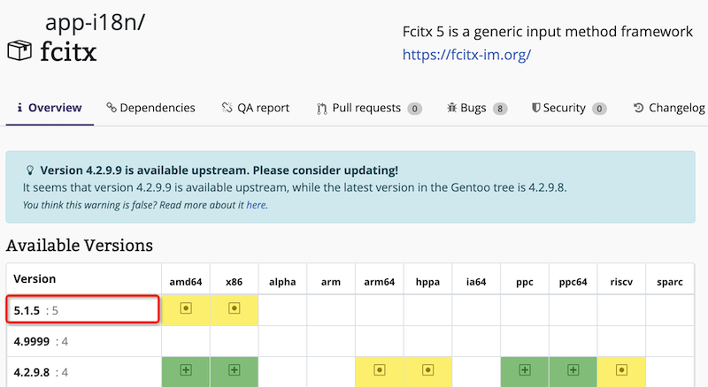

.. _gentoo_version_specifier:

========================
Gentoo版本指定器 
========================

在Gentoo的Packages仓库中，往往会提供多个版本。通常默认安装的是稳定版本，但是如何安装其他更高版本(测试版本)呢？

举例: :ref:`gentoo_sway_fcitx` 的 `gentoo package: app-i18n/fcitx <https://packages.gentoo.org/packages/app-i18n/fcitx>`_ 就提供了两个系列: 稳定版本 ``4.2.9.8`` 和 测试版本 ``5.1.5`` :

   ``fcitx`` 提供了 4.x 和 5.x 两个版本

由于我采用 :ref:`sway` 和 :ref:`wayland` 图形系统，所以需要最新的 fcitix 来支持。

根据版本
=============

可以指定版本匹配方式:

.. literalinclude:: gentoo_version_specifier/install_software_by_version
   :caption: 通过指定版本来安装软件

.. _version_by_slot:

根据SLOT确定版本
==================

所谓slot，可以理解为版本系列，例如版本5，版本4。输入指定SLOT是采用 ``:5`` 或 ``:4`` 这样的方法，没有前缀(具体版本号):

.. literalinclude:: gentoo_version_specifier/install_fcitx5
   :caption: 通过指定 ``:5`` SLOT来安装 fcitx5

参考
======

- `gentoo linux wiki: Version specifier <https://wiki.gentoo.org/wiki/Version_specifier>`_
