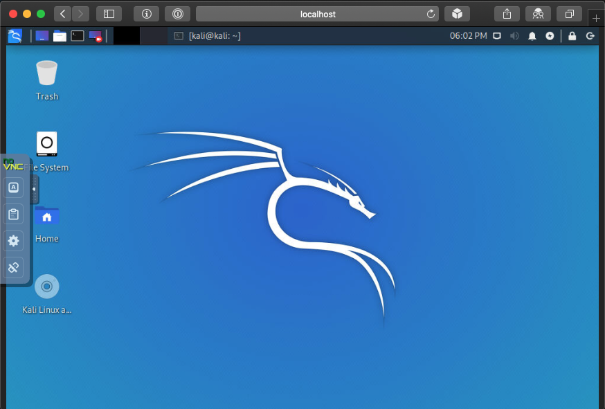

.. _kali_novnc:

==========================
在浏览器中访问Kali(noVNC)
==========================

除了我们常用的通过ssh访问Kali Linux，我们也会配置VNC来访问远程图形桌面，但是需要确保安全: VNC仅监听loopback地址并且通过SSH port forward访问。

使用VNC远程访问图形桌面通常需要安装客户端软件，并非每个电脑都会安装VNC client，所以我们希望能够在浏览器中使用VNC，就无需安装客户端。

.. note::

   noVNC是一个基于浏览器的轻量级解决方案，适合单机使用。更为完整的集群解决方案是使用 :ref:`guacamole` 。

- 安装 ``x11vnc`` 作为VNC服务，结合NoVNC可以实现一个轻量级解决方案::

   sudo apt update
   sudo apt install -y novnc x11vnc

- 在loopback回环地址上启动VNC会话，这可以确保安全::

   x11vnc -display :0 -autoport -localhost -nopw -bg -xkb -ncache -ncache_cr -quiet -forever

此时显示::

   The VNC desktop is:      kali:0
   PORT=5900

- 检查监听端口::

   ss -antp | grep vnc

显示输出::

   tcp        0      0 0.0.0.0:5900            0.0.0.0:*               LISTEN
   tcp6       0      0 :::5900                 :::*                    LISTEN

这里有一个问题，虽然使用了 ``-localhost`` 但是却监听在所有接口上，和预期不符

改为参数 ``-listen localhost`` 但是发现这个参数在命令行参数中间会报错，不过如果这个参数在命令行最后则正确启动监听在回环地址::

   x11vnc -display :0 -autoport -nopw -bg -xkb -ncache -ncache_cr -quiet -forever -listen localhost

所以尝试修改上述命令，将 ``-localhost`` 放到参数最后，果然也解决了仅监听在回环地址上:

.. literalinclude:: kali_novnc/x11vnc
   :caption: 启动 ``x11vnc`` 监听在回环地址上

- 再次检查端口监听::

   ss -antp | grep vnc

现在是正确的::

   LISTEN 0      32         127.0.0.1:5900        0.0.0.0:*     users:(("x11vnc"<Plug>PeepOpenid=4582,fd=8))
   LISTEN 0      32             [::1]:5900           [::]:*     users:(("x11vnc"<Plug>PeepOpenid=4582,fd=9))

- 运行 noVNC :

.. literalinclude:: kali_novnc/novnc
   :caption: 运行noVNC连接本地运行的x11vnc

.. note::

   这里使用参数 ``--listen localhost:8081`` 可以强制noVNC监听在回环地址，如果使用 ``--listen :8081`` 就会监听在所有端口，则存在安全隐患。

- 在服务器上启动SSH::

   sudo systemctl enable ssh --now

- 在远程客户端上通过SSH访问::

   ssh kali@192.168.6.7 -L 8081:localhost:8081

也可以配置 ``~/.ssh/config`` 添加配置::

   Host kali
       HostName 192.168.6.7
       User huatai
       LocalForward 8081 127.0.0.1:8081

- 通过浏览器访问本地客户端 http://127.0.0.1:8081 来访问远程服务器的VNC桌面

参考
=======

- `Kali In The Browser (noVNC) <https://www.kali.org/docs/general-use/novnc-kali-in-browser/>`_
