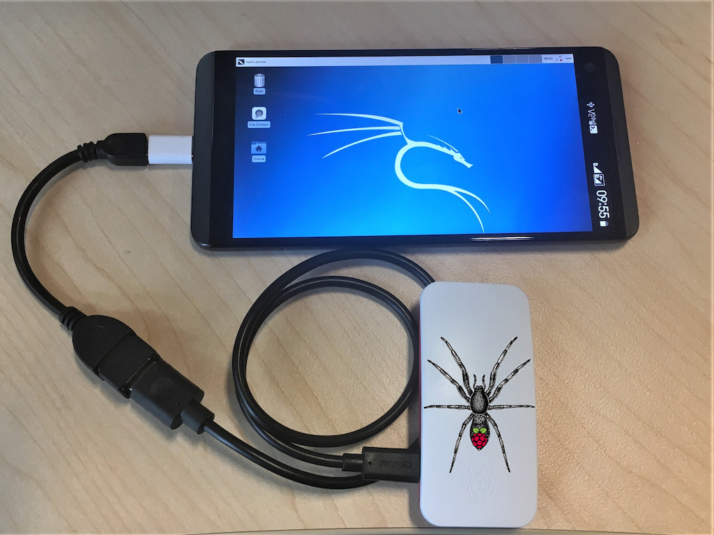

.. _pi-tail:

===============================================
手机配合Pi Zero运行Kali Linux On ARM (Pi-Tail)
===============================================

.. note::

   待实践...

Pi-Tail特点
===============

.. figure:: ../../../_static/linux/kali_linux/arm/pi-tail-logo.png

- 针对 :ref:`pi_zero` 以及 Zero 2 W优化，提供 tethering 能力
- 连接简单，只需要一根连线就可以解决蓝牙和Wi-Fi的 ``Tethering`` ( 参考 :ref:`vpn_hotspot` )
- 大约2分钟就能完成镜像、配置、连接和启动
- 只需要在智能手机中安装一个ConnectBoot和VNC viewer
- 可以自动切换USB ethernet和mass storage

工作原理
===============

快速安装配置
=============

参考
========

- `Kali On Pi Zero (Pi-Tail) <https://www.kali.org/docs/arm/raspberry-pi-zero-w-pi-tail/>`_
