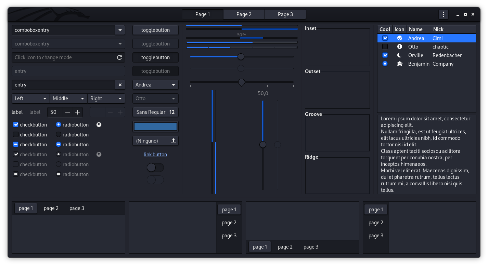

.. _install_kali_pi:

======================
树莓派安装Kali Linux
======================

Kali Linux支持多种平台运行，对于 :ref:`arm` 设备，通过 `Kali-ARM-Build-Scripts <https://gitlab.com/kalilinux/build-scripts/kali-arm>`_ 工具，提供了不同 `Kali Linux ARM Images <https://www.offensive-security.com/kali-linux-arm-images/>`_ ，并且针对不同的树莓派设备提供了32位和64位镜像。

.. note::

   我准备在 :ref:`pi_400` 和 :ref:`pi_zero` 上分别实践64位和32位的ARM版本Kali Linux，学习Linux安全技术以及尝试ARM平台开发。

安装
=======

ARM版本的Kali Linux安装和其他ARM Linux操作系统安装方法类似，都是采用 ``dd`` 命令将镜像复制到SD卡，然后通过SD卡启动设备::

   xzcat kali-linux-2021.1-rpi4-nexmon-64.img.xz | dd of=/dev/sdb bs=4M

启动设备之后，首次登陆用户名和密码都是 ``kali`` 需要立即修改账号密码。见 `Kali's Default Credentials <https://www.kali.org/docs/introduction/default-credentials/>`_

启动和运行
===========

首次启动Kali Linux，系统会自动扩展文件系统到整个SD卡，默认启动到图形登陆界面。

和 :ref:`pi_400_4k_display` 相似，默认时显示器周边有黑边，这和 ``Underscan/overscan`` 相关，不过Kali Linux Raspberry Pi没有提供 ``raspi-config`` ，所以我参考 :ref:`pi_400_4k_display` 通过 ``raspi-config`` 工具生成的 ``/boot/config.txt`` 修改如下::

   disable_overscan=1   

然后重启一次系统生效

Kali Linux 2021.1 Release
==========================

我所使用的Kali Linux 2021.1版本是2021年2月24日发布，具有很多有趣的特性:

- 默认采用 Xfce 4.16 版本: Xfce 4.16当前最新的 :ref:`xfce` 稳定版本(2020年12月22日发布)，Kali Linux在此基础上作了优化(基于Xfce调优了GTK3 theme)，形成了非常美观的现代化界面

- 提供了可选的 KDE 5.20 (Plasma) 作为Kali官方支持的桌面，安装过程也可以选择GNOME。此外，系统安装完成后，还可以选择安装Enlightenment, i3, LXDE 和 MATE

- 提供了不同终端工具

- 提供了 ``command-not-found`` 工具来帮助使用(当输入命令错误时会提供相近命令提示)，激活方法如下::

   # enable command-not-found if installed
   if [ -f /etc/zsh_command_not_found  ]; then
       . /etc/zsh_command_not_found
   fi

参考
=====

- `Kali on Raspberry Pi2 <https://www.kali.org/docs/arm/kali-linux-raspberry-pi-2/>`_
- `Kali Linux 2021.1 Release (Command-Not-Found) <https://www.kali.org/blog/kali-linux-2021-1-release/>`_
