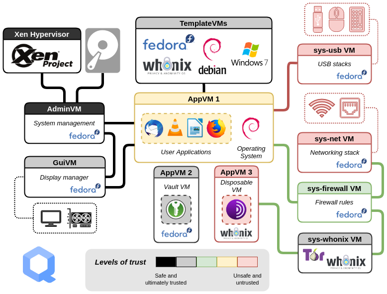

.. _intro_qubes_os:

=====================
Qubes OS简介
=====================

Qubes OS和 :ref:`tails_linux` 都是面向安全设计开发的操作系统，但是有着显著不同:

- Qubes OS主要假设攻击来自互联网，并没有像Tails假设你是用的笔记本会被物理接触破解(Tails 不保存任何本地数据，用后即焚)，所以主要通过虚拟机来隔离不同的使用场景，以确保某个场景被攻破后依然保持操作系统的其他部分安全

  - 假设不存在完美无缺的桌面系统
  - 当某个组件受到攻击，恶意程序只能访问该环境中的数据( :ref:`app-sandbox` 也是这样的假设，不过是基于类似容器的沙箱，对数据和设备的访问需要授权，另外内核只有一个导致内核漏洞会影响全局 )

- Qubes OS的隔离分为两个维度:

  - 硬件控制器可以隔离到功能域(如网络域、USB控制器域)
  - 用户不同使用场景制定为不同信任级别的安全域

.. note::

   共享模版是类似 :ref:`zfs` 的 snapshot + clone ? 或者是类似 :ref:`docker` 的分层文件系统？ **待实践**

.. note::

   学术界将Qubes OS这样的操作系统称为 **融合多机安全** ``Converged Multi-Level Secure (MLS)`` 系统

   Qubes OS架构

Xen hypervisor 和 domains
==========================

:ref:`xen` hypervisor为托管的虚拟机(在Xen中称为 ``domain`` )提供隔离:

- Xen启动的第一个domain是特权管理domain，称为 ``dom0`` 
- 管理域 ``dom0`` :

  - 从 Qubes OS 4.1.2 开始， ``dom0`` 运行的操作系统是 :ref:`fedora` ，运行这半虚拟化 ``paravistualized`` Linux 内核
  - ``dom0`` 的Linux内核通过标准的Linux内核设备驱动程序控制并代理所有物理系统硬件的访问
  - 操作系统托管用户的图形桌面
  - 基础图形桌面由 X Server, Xfwm窗口管理器和 :ref:`xfce` 桌面组成
  - 根据设计 ``dom0`` 与Qubes的直接交互尽可能少，以最大限度降低攻击面
  - ``dom0`` 操作系统和所包含的模版操作系统镜像的更新通过特殊机制执行，该机制不需要 ``dom0`` 操作系统直接连接到网咯(代理?)
   
- 设置不同的信任级别，所有的窗口都显示在一个统一桌面环境，并使用不同的颜色窗口边界来区分不同的安全级别
- 每个Qubes运行时通常基于一个独特的底层操作系统模版: 

  - 模版提供了一个单一的、不可变的根文件系统，可以由多个Qubes共享
  - 对给定魔棒的更新会自动被所有Qubes继承
  - 共享模版可以大大减少存储需求

用户domains: ``qubes``
=========================

- 应用 ``qube`` 提供安全、隔离的标准用户应用程序执行，例如 Web 浏览器、电子邮件客户端或文本编辑器。
- 应用 qube 的运行由 Qube 管理器控制: 管理器启动独立的应用qube，并将其应用程序作为普通进程窗口呈现在 dom0 的桌面上
- 遵循沙盒的理念: 在运行应用程序、查看文档等操作后，整个一次性资源将在关机时销毁。
- Qubes OS将所有应用 qube 集成到一个通用的桌面环境中:

  - 每个应用 qube 针对特定进程的身份由一个不可伪造的彩色窗口边框提供，该边框在应用 qube 的属性中定义
  - 通过允许多个应用 qube 共享一个以只读模式维护的通用“模板”根文件系统映像，可以最大限度地减少 dom0 中的磁盘使用量。

网络域
==========

- 由于网络机制最容易受到安全攻击，所以被单独隔离在一个独立的、非特权的domain中，称为 ``network domain``
- 防火墙域是另外一个独立Linux内核虚拟机，所以即使网络域被攻破，防火墙域仍受到隔离和保护

参考
=======

- `WikiPedia: Qubes OS <https://en.wikipedia.org/wiki/Qubes_OS>`_
- `What is Qubes OS? <https://www.qubes-os.org/intro/>`_
