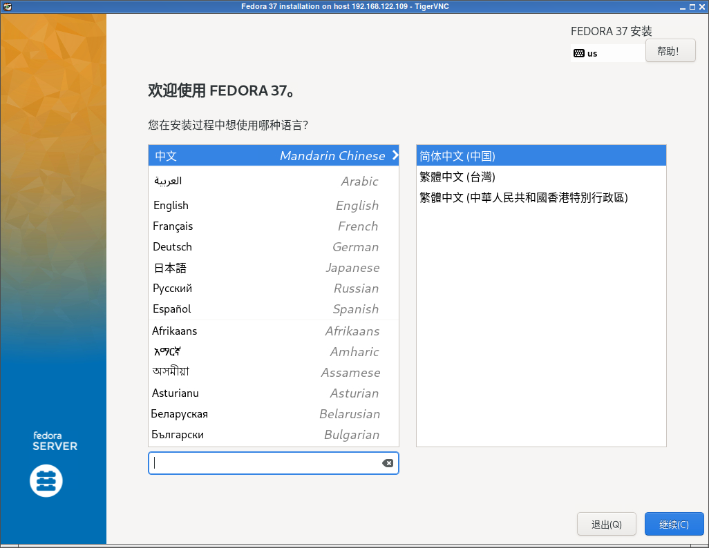
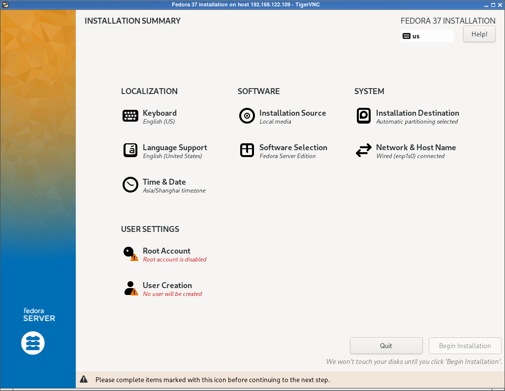
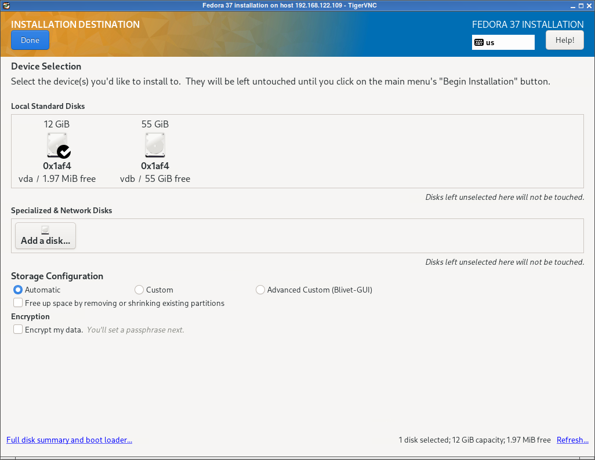
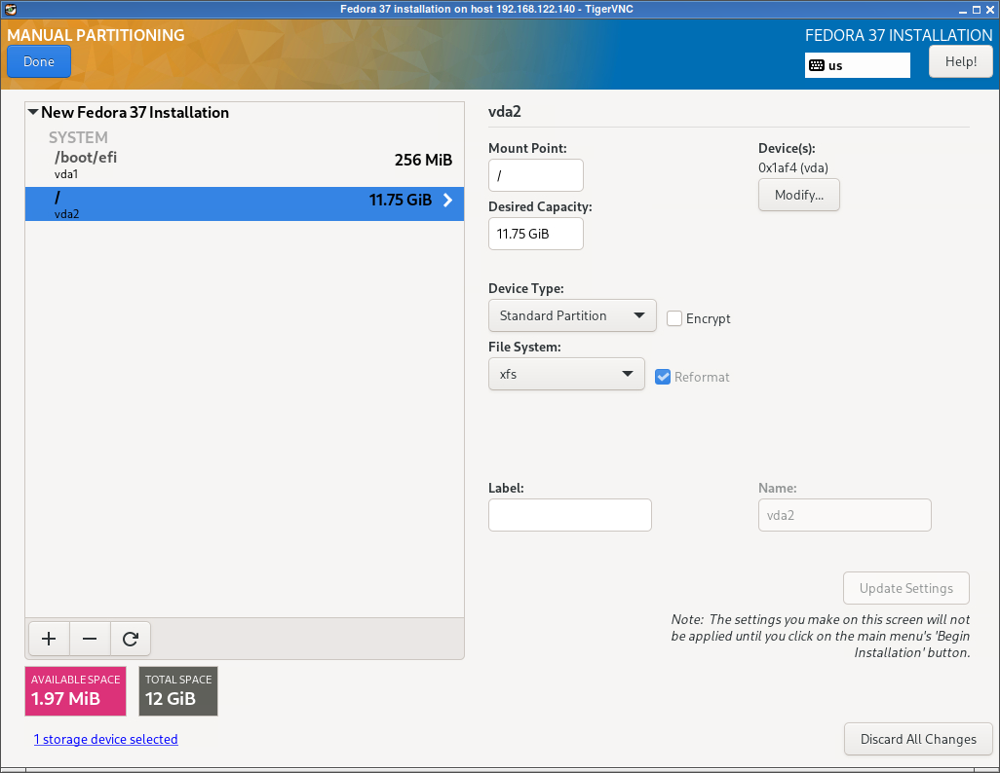
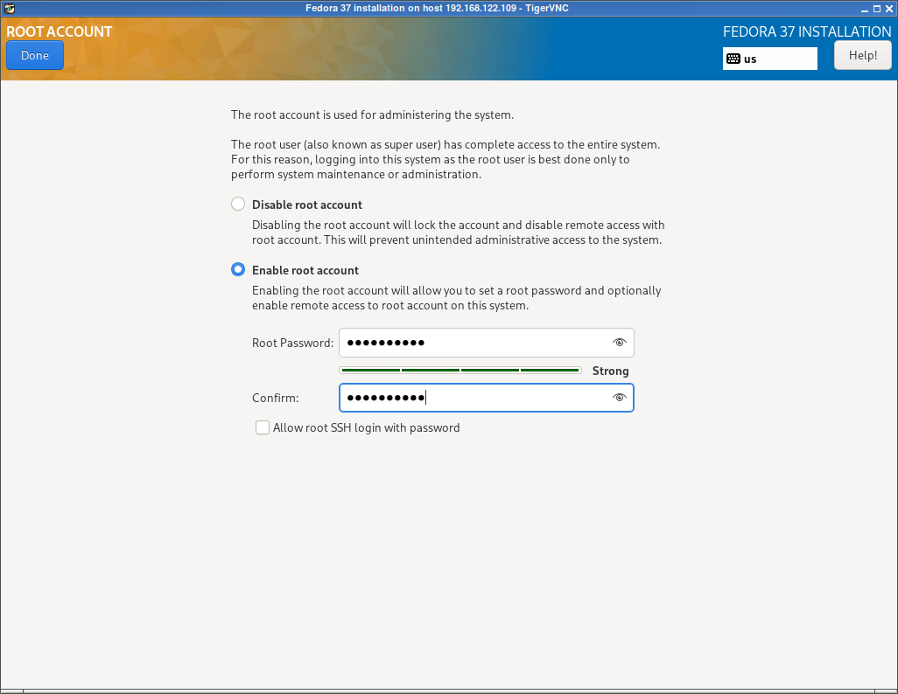

.. _fedora37_installation:

===========================
Fedora 37 Server安装
===========================

:ref:`archlinux_arm_kvm` 环境安装Fedora 37 Server ARM64，主要难点是解决 :ref:`arm_kvm` ，在能够正常运行虚拟机之后，难点则转为ARM虚拟化的性能优化。

安装Fedora 37
===============

- 启动安装后首页:

选择英文交互界面

- 安装选项中需要调整的内容有:

  - Installation Destination: 安装目标磁盘(虚拟机有2块磁盘)
  - Root Account: 设置Root用户密码
  - User Creation: 创建常规用户账号

- Installation Destination: 安装目标磁盘选择 ``12GB`` 的 ``vda`` :

我选择采用自定义磁盘分区( ``/boot/efi`` 分配256M，其余磁盘空间分配给 ``/`` )

- Root Account: 设置Root用户密码(没有选择 ``Allow root SSH login with password`` ，避免安全隐患):

- User Creation: 创建常规用户账号(按需创建)

默认安装的 Server Edition 是最小化的安装，可以作为定制基础
