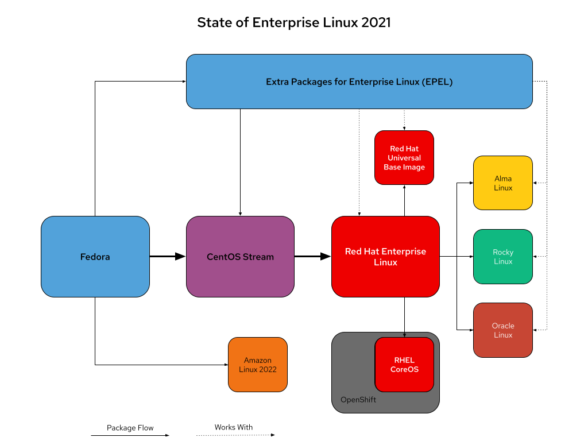
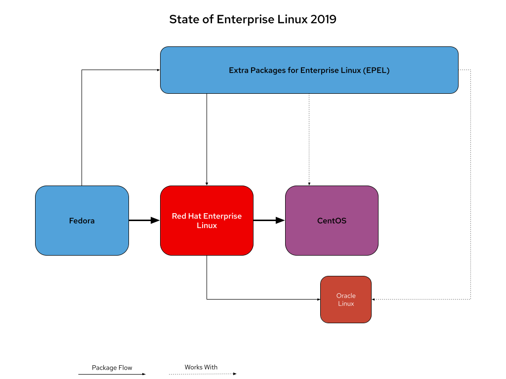

.. _redhat_linux_state:

========================
Red Hat系企业级Linux版本
========================

   Red Hat系企业级Linux版本关系图

众所周知，Red Hat早已宣布了在2020年底，CentOS已经不再发布，取而代之的是位置关系移动到Red Hat Enterprise Linux(RHEL)上有的CentOS Stream。也就是说，从前大家默认视为社区版企业级RHEL(CentOS)已经不再是天然继承RHEL的稳定性和可靠性了，CentOS stream将作为滚动发布的探索者。

社区为了能够继续(占便宜?)借助Red Hat企业级RHEL的优势，宣布了Alma Linux和Rocky Linux。另外，传统的数据库厂商Oracle也有基于RHEL的下游版本Oracle Linux。

.. note::

   开源产品和项目实际上并不意味着成本降低，你需要雇佣精通开源软件产品的开发和运维技术人员，如果你自己来干，那么也需要投入大量的时间和精力来掌握开源技术。

   换句话说，你要么付出时间，要么付出金钱，才能从开源获得真正的力量。

2019年的Red Hat系版本关系
===========================

在2019年以及之前，Red Hat系的版本关系非常简单，见下图:

   2019年以及之前，Red Hat系各发行版之间关系

也就是在2019年， :ref:`fedora` 是一切创新和探索的发源地，完全是由Fedora来实现集成、测试和使用最新的上游代码来构建社区发行版，重点聚焦于企业级的创新。

在这种版本架构关系下，每隔3到5年，新的RHEL版本就会从Fedora的上游版本中诞生。例如RHEL 8大致基于Fedora 28。当RHEL确定版本并开始密集开发，几乎完全脱离社区在Red Hat内部完成，然后RHEL作为新的主要版本连同完整的源代码向外部发布。

.. note::

   Red Hat作为开源社区重量级的企业，一直完整提供Red Hat Enterprise Linux完整源代码。这也是各个社区版本能够在Red Hat Enterprise Linux基础上再次发布的原因所在。

   其实并不存在所谓的和RHEL兼容的 **自主版权** Linux发行版，因为RHEL一直是开源的，Red Hat坚守开源精神为世界提供了良好集成的Linux发行版，所有在此基础上编译打包都应该感谢Red Hat以及社区，而不是自夸为自主版权。 

当Red Hat Enterprise Linux发布之后，Fedora项目会构建并维护一个社区支持度软件包仓库(community supported package repository)，称为企业级Linux的扩展包(Extra Packages for Enterprise Linux,
EPEL)。EPEL的软件版本和RHEL的主要版本保持一致，这样使用RHEL的用户能够轻松运行RHEL不支持的依赖软件包(也就是说，EPEL提供的软件包可以不做修改在RHEL上运行)。虽然EPEL的软件包质量并没有达到RHEL所要求的质量水平(为经过严格测试)，但是通常认为EPEL的软件包质量是和Fedora相似的，能够满足大多数用户的需求。

但是，上述运作方式存在不足:

- Red Hat Enterprise Linux(RHEL)一旦发布，下游的衍生产品 CentOS Linux , Oracle Linux在RHEL基础上会延后半年到一年发布，但是实际上却几乎没有改进
- 下游发行版实际上是基于RHEL的发行版快照构建的，也就是说在下游CentOS上提交的的错误或者补丁都不能返回给RHEL。这是因为RHEL一旦发布就是只读的开源项目，类似于谷歌的Android
- RHEL的客户可以向Red Hat提交支持工单，但是没有流程从下游CentOS获取补丁以及错误改进
- 所有社区改进只有从上游的 :ref:`fedora` 获得，但是实际作用到Red Hat Enterprise Linux则会延迟3~5年

.. note::

   简单来说，这个尴尬的发行版矛盾是因为Red Hat依赖RHEL的收费用户来盈利，所以其改进和反馈完全面向商业用户。也就是说，类似Oracle这样的商业公司，Red Hat的内部知识库和补丁是收费的，然后通过一定的时间差再释放给社区。通过这种差异化服务，保持了收费用户的价值。

   但是这种商业模式也使得社区反馈改进只能从上游Fedora获得，而无法从下游CentOS获得(因为RHEL发布以后，只有大版本发布时才对外公开，此时已经是一个只读快照而不是能够得到社区改进的版本了)。这样Red Hat Enterprise Linux虽然稳定，但是改进无法像其他发行版(如 :ref:`ubuntu_linux` )那样即时获得。

2022年的Red Hat系版本关系
=============================

CentOS Stream是将CentOS从Red Hat Enterprise Linux的下游转换到上游，并形成一个滚动发布的持续交付发行版。你可以将其视为类似 :ref:`arch_linux` 但是使用RPM包管理的Red Hat Enterprise Linux beta版本。(我的看法)

显然CentOS Stream并没有达到Red Hat Enterprise Linux的质量水平(为了快速迭代的代价)。而企业级商业用户，则无法再依赖CentOS，只能采用Red Hat Enterprise Linux。除非是非常小规模的企业，才能使用16节点，免费的RHEL个人开发者订阅。

Red Hat提供免费的16节点个人开发者订阅，用于开发、演示、原型制作、QA、小型生产用途等。这种小规模的免费RHEL可以获得补丁的完整访问，但是显然无法再作为大规模部署。大型企业不能再免费白嫖Red Hat企业版Linux了。

RHEL CoreOS
--------------

RHEL CoreOS不是一个独立操作系统，而是基于RHEL 8的容器镜像，由 :ref:`openshift` 管理

Red Hat Universal Base Image(Universal Base Image, UBI)
-----------------------------------------------------------

Red Hat UBI是基于RHEL的可自由再分发的，专为使用容器的开发和生产用例而设计:

- 一组基础镜像（micro、minimal、standard、init）
- 一组应用程序镜像（python、ruby、node.js、httpd、nginx 等）
- 一组不受限制的 RPM 存储库

参考
=======

- `The State Of Enterprise Linux In 2022 <https://crunchtools.com/the-state-of-enterprise-linux-in-2022/>`_ 本文作者是Re Hat的RHEL Server的产品经理，所以观点反映了Red Hat公司内部视角
