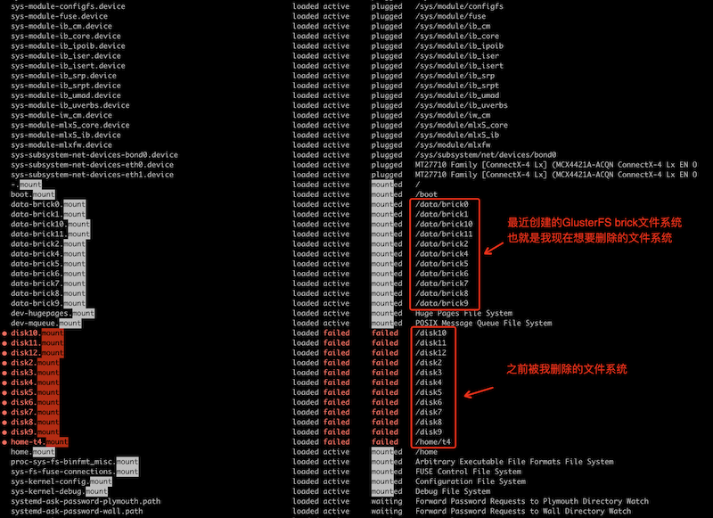

.. _systemd_mount:

==========================
Systemd挂载文件系统(自动)
==========================

我在 :ref:`deploy_centos7_gluster11_lvm_mdadm_raid10` 时，前置步骤是 :ref:`mdadm_raid10` 。我使用了一些简便的脚本命令来快速完成原先的磁盘卸载和分区擦除重建工作:

.. literalinclude:: ../../../linux/storage/software_raid/mdadm_raid10/init_disk_for_mdadm
   :caption: 批量初始化服务器的12块 :ref:`nvme` 磁盘

但是我万万没有想到，只一转眼，已经卸载掉的XFS磁盘文件系统居然自动挂载好了，使用 ``df -h`` 又看到了我刚才卸载并准备不再使用的文件系统:

.. literalinclude:: ../../../gluster/deploy/centos/centos_gluster_init/parted_xfs_df
   :caption: 分区和格式化、挂载好的12块磁盘的文件系统

我揉了揉眼睛，以为自己糊涂了，还是生产环境有什么神秘的监控脚本会自动把破坏的文件系统重新挂载好？

回想了一下之前的操作步骤，这里能够自动挂载是因为我只重建了分区表，但是很不幸实际上分区表和之前完全一致(差别是分区标记从XFS改为RAID)，而实际的第一个分区的 :ref:`xfs` 并没有抹除，所以才会这样被自动挂载。

究竟是什么原因会把我之前的文件系统重新挂载，而且我明明已经删除了 ``/etc/fstab`` 中对应配置，所以也不可能是简单的 ``mount -a`` 就能挂载的...

我突然想到 ``systemd`` 服务，想是不是有类似 ``autofs`` 这样的自动文件系统挂载服务...巧了，虽然没有发现 ``autofs`` ，我却发现了一些确实和文件系统挂载有关的 ``mount`` 服务:

   
   神秘的文件系统自动挂载

但是，这些 ``data-brick0.mount`` 配置是怎么注入到 ``systemd`` 配置的呢？

`How to mount partition using systemd unit file? <https://www.golinuxcloud.com/mount-partition-using-systemd/>`_ 提供了在 ``systemd`` 中配置unit配置文件来实现磁盘挂载，但是我在 ``/etc/systemd/system`` 目录下并没有找到上述这些目录挂载配置...

`systemd.mount — Mount unit configuration <https://www.freedesktop.org/software/systemd/man/systemd.mount.html>`_ 说明了 ``.mount`` 配置文件，系统中当前有:

.. literalinclude:: systemd_mount/systemd_mount_list
   :caption: 系统中现有的 ``.mount`` 文件列表

在 `systemd.mount — Mount unit configuration <https://www.freedesktop.org/software/systemd/man/systemd.mount.html>`_ 提到了 ``systemd-mount`` 命令能够在命令行动态且瞬时创建 ``.mount`` 和 ``.automount`` units。那么上述这些挂载配置是不是通过 ``systemd-mount`` 创建的呢？

- 使用 :ref:`systemctl` 列出 ``mount`` 类型units:

.. literalinclude:: systemd_mount/systemctl_list-units_mount
   :caption: 使用 :ref:`systemctl` 检查 ``mount`` 类型 units

输出显示:

.. literalinclude:: systemd_mount/systemctl_list-units_mount_output
   :caption: ``mount`` 类型 units 可以看到要删除但是没有删除成功的挂载配置

- 对比 ``systemctl`` 的 ``unit-files`` 就会看到持久化的配置文件中并没有包含我要找的那些 ``mounts`` :

.. literalinclude:: systemd_mount/systemctl_list-unit-files_mount
   :caption: 使用 :ref:`systemctl` 检查 ``mount`` 类型 units 文件

输出显示持久化的unit配置文件实际不多，并没有我要找的 ``mounts`` :

.. literalinclude:: systemd_mount/systemctl_list-unit-files_mount_output
   :caption: ``mount`` 类型 units 文件(持久化的)并不多

也就是说这些挂载确实是动态的配置(没有配置文件)

:ref:`systemd_fstab_generator`
==================================

**找到了**

这些动态生成的 ``unit`` 虽然没有 ``unit-file`` ，但是确实可以查看到( 使用 ``systemctl cat`` 命令 ):

- 检查 ``data-brick0.mount`` unit:

.. literalinclude:: systemd_mount/systemctl_cat_data-brick0.mount
   :caption: 使用 ``systemctl cat`` 输出unit内容

可以看到这个配置unit完全是自动生成的:

.. literalinclude:: systemd_mount/systemctl_cat_data-brick0.mount_output
   :caption: 使用 ``systemctl cat`` 输出 ``data-brick0.mount`` 内容
   :emphasize-lines: 12-15

原来 ``systemctl daemon-reload`` 就能刷新 :ref:`systemd_fstab_generator` 配置
===============================================================================

- 我以为( **其实不是** )要先通过 ``stop`` 来停止 ``xxxx.mount`` ，所以尝试:

.. literalinclude:: systemd_mount/systemctl_stop_data-brick0.mount
   :caption: 尝试停止 ``data-brick0.mount``

此时提示:

.. literalinclude:: systemd_mount/systemctl_stop_data-brick0.mount_output
   :caption: 尝试停止 ``data-brick0.mount``

- 此时检查 ``ls -lh /run/systemd/generator/`` 会发现该目录下所有units都没有变化，包括 ``data-brick0.mount`` 配置文件也还在

- 我按照提示执行了一次:

.. literalinclude:: systemd_mount/systemctl_daemon-reload
   :caption: 执行 ``daemon-reload`` 刷新

**Binggo**

- 我突然发现 ``/run/systemd/generator/`` 所有在 ``/etc/fstab`` 删除掉的配置行对应的 units 文件全部消失了...

**明白了**

原来对应于 :ref:`systemd_fstab_generator` 自动生成的 ``.mount`` unit文件，不需要手工去停止或删除，只需要正确修改 ``/etc/fstab`` ，然后执行

.. literalinclude:: systemd_mount/systemctl_daemon-reload
   :caption: 执行 ``daemon-reload`` 刷新

就可以完全同步刷新配置。之后就可以手工 ``umount`` 挂载文件系统以及做磁盘初始化了 **好折腾**

参考
======

- `How to mount partition using systemd unit file? <https://www.golinuxcloud.com/mount-partition-using-systemd/>`_
- `Working with Systemd Mount Units <https://www.pluralsight.com/cloud-guru/labs/aws/working-with-systemd-mount-units>`_
- `systemd.mount — Mount unit configuration <https://www.freedesktop.org/software/systemd/man/systemd.mount.html>`_ ``systemd.mount`` 官方手册
