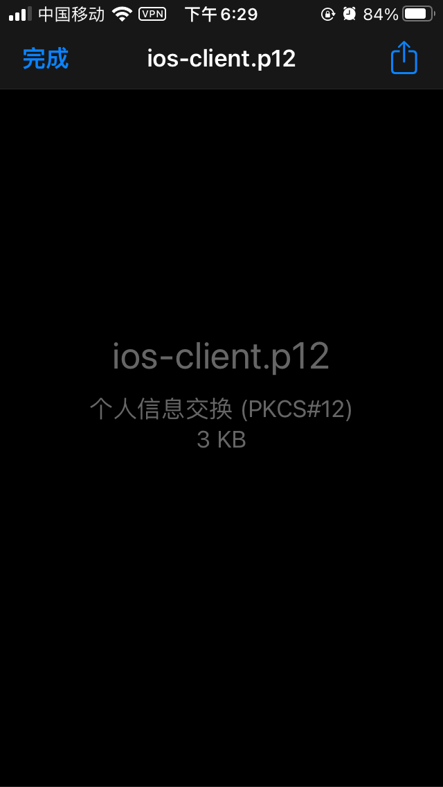
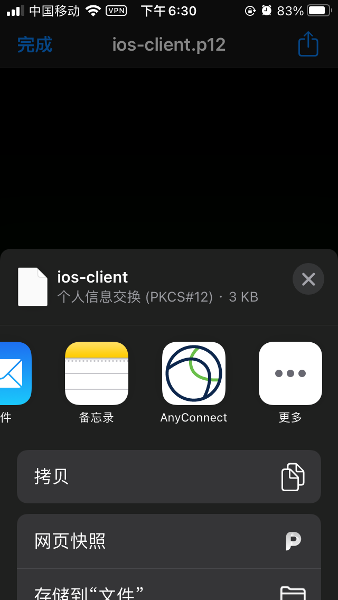
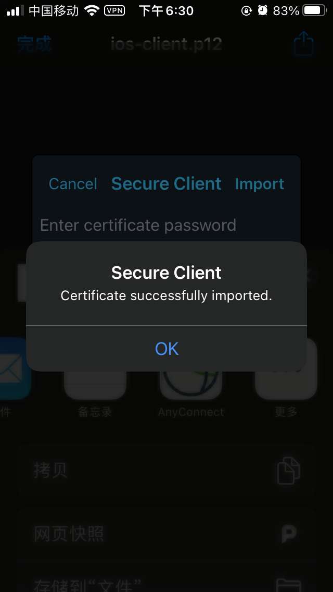
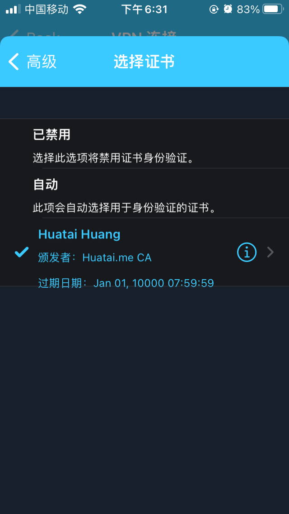

.. _client_certificate_ocserv:

================================================
OpenConnect VPN服务器(ocserv)证书认证客户端配置
================================================

我在 :ref:`openconnect_vpn` 初步完成了一个OpenConnect VPN服务器(ocserv)部署，VPN客户端是通过密码认证方式连接VPN的。不过，每次输入密码确实有些麻烦，没有 :ref:`wireguard` 这种完全靠不对称密钥认证(无需密码)方便(ocserv配置也过于复杂了)

通过使用自己的CA(Certificate Authroity, 证书颁发机构)来签署客户端证书，ocserv可以通过证书方式来认证客户端(客户端无需密码)。注意，ocserv daemon继续使用Let's Encrypt颁发的TLS服务器证书，所以客户端软件不会显示安全警告。

设置自己的CA(Certificate Authority)
=====================================

由于Let's Encrypt不颁发客户端证书，所以需要自己创建CA。可以使用 ``openssl`` 来完成这项工作，但是 ``ocserv`` 推荐使用GnuTLS。

- 在 ``ocserv`` 服务器上安装 ``gnutils`` :

对于 :ref:`ubuntu_linux` ::

   sudo apt install gnutls-bin

对于 :ref:`redhat_linux` ::

   sudo dnf install gnutls-utils

- 在 ``ocserv`` 服务器的 ``/etc/ocserv/`` 目录下创建一个子目录来存储私钥和证书，并进入该工作目录::

   sudo mkdir /etc/ocserv/ssl/
   cd /etc/ocserv/ssl/

- 使用 ``certtool`` 命令创建用于CA的私钥，默认生成3072位RSA密钥::

   sudo certtool --generate-privkey --outfile ca-privkey.pem

- 在生成CA证书前，首先要创建一个CA证书模版文件，该模版文件格式可以在 ``certtool`` 的man手册中找到:

.. literalinclude:: client_certificate_ocserv/ca-cert.cfg
   :language: bash
   :caption: CA证书模版配置文件 ca-cert.cfg ，高亮部分请替换成实际配置
   :emphasize-lines: 4,7

- 使用上述模版配置文件生成CA证书::

   sudo certtool --generate-self-signed --load-privkey ca-privkey.pem --template ca-cert.cfg --outfile ca-cert.pem

现在我们就有了一个CA证书文件 ``ca-cert.pem``

生成客户端证书
================

- 执行以下命令生成一个客户端私钥:

.. literalinclude:: client_certificate_ocserv/generate-privkey
   :language: bash
   :caption: 生成客户端私钥

- 创建一个客户端证书模版文件 ``client-cert.cfg`` ，注意，这里 ``uid`` 是之前在 :ref:`openconnect_vpn` 部署时已经添加到 ``/etc/ocserv/ocpasswd`` 文件中的一个用户名 :

.. literalinclude:: client_certificate_ocserv/client-cert.cfg
   :language: bash
   :caption: 客户端证书模版配置文件 client-cert.cfg ，高亮部分请替换成实际配置
   :emphasize-lines: 3,6,9

- 执行以下命令创建客户端证书 ``client-cert.pem`` ，这个证书已经被CA私钥签名::

   sudo certtool --generate-certificate --load-privkey client-privkey.pem --load-ca-certificate ca-cert.pem \
       --load-ca-privkey ca-privkey.pem --template client-cert.cfg --outfile client-cert.pem

- 将客户端私钥和证书合并到受PIN保护的PKCS #12文件中::

   sudo certtool --to-p12 --load-privkey client-privkey.pem --load-certificate client-cert.pem --pkcs-cipher aes-256 --outfile client.p12 --outder

此时提示为密钥创建一个名字，可以输入这个密钥的拥有者名，并增加保护密码::

   Generating a PKCS #12 structure...
   Loading private key list...
   Loaded 1 private keys.
   Enter a name for the key: huatai
   Enter password:
   Confirm password:

此时有了一个客户端私钥和证书结合的统一文件 ``client.p12``

- 需要注意Cisco AnyConnect 和 iOS不支持 ``AES-256`` 密码，会拒绝倒入客户端证书。所以如果用户使用iOS设备，可以选择 ``3des-pkcs12`` 密码::

   sudo certtool --to-p12 --load-privkey client-privkey.pem --load-certificate client-cert.pem --pkcs-cipher 3des-pkcs12 --outfile ios-client.p12 --outder

此时有了一个iOS专用的客户端私钥和证书结合的统一文件 ``ios-client.p12``

多用户证书签名请求
====================

.. note::

   本段仅用于多用户的VPN配置，也就是每个用户各自生成私钥，然后发给VPN管理员签名

对于需要各自保存私钥的多用户VPN，每个用户可以使用自己的私钥来生成证书签名请求(certificate signing request, CSR)，然后将证书发送给管理员，管理员再像用户颁发客户端证书。

- 每个用户首先使用上文的方法生成一个客户端私钥和客户端证书模版

.. literalinclude:: client_certificate_ocserv/generate-privkey
   :language: bash
   :caption: 生成客户端私钥

.. literalinclude:: client_certificate_ocserv/client-cert.cfg
   :language: bash
   :caption: 客户端证书模版配置文件 client-cert.cfg ，高亮部分请替换成实际配置
   :emphasize-lines: 3,6,9

- 每个用户执行以下命令创建CSR，这里 ``request.pem`` 文件由用户的私钥签名::

   certtool --generate-request --load-privkey client-privkey.pem --template client-cert.cfg --outfile request.pem

- 然后用户将 ``request.pem`` 文件和 ``client-cert.cfg`` (模版文件中有该用户名)文件发送给管理员，管理员执行以下命令生成对应用户的客户端证书::

   sudo certtool --generate-certificate --load-ca-certificate ca-cert.pem --load-ca-privkey ca-privkey.pem \
       --load-request request.pem --template client-cert.cfg --outfile client-cert.pem

然后，将 ``client-cert.pem`` 证书发送给用户

在 ocserv 服务端激活证书认证
=============================

- 修改 ``ocserv`` 服务器配置文件 ``/etc/ocserv/ocserv.conf`` 将密钥认证激活::

   # 密码认证
   auth = "plain[passwd=/etc/ocserv/ocpasswd]"
   # 密钥认证
   auth = "certificate"

如果要允许用户自己选择证书认证或者密码认证，则修改成::

   enable-auth = "plain[passwd=/etc/ocserv/ocpasswd]"
   auth = "certificate"

.. note::

   这里有一个疑惑，当激活了 ``certificate`` 时，会强制客户端必须发送证书，所以之前仅仅通过密码认证就行不通了会被服务器强制断开。我尝试了上述两种配置，发现Cisco Secure Client不发送客户端证书，是无法进行密码认证的。所以我觉得启用了证书认证之后，可以关闭掉密码认证。( **我最后就是采用证书认证方法** )，所以我的 ``/etc/ocserv/ocserv.conf`` 配置实际为::

      #auth = "plain[passwd=/etc/ocserv/ocpasswd]"
      auth = "certificate"
   
   `Recipes for Openconnect VPN <https://gitlab.com/openconnect/recipes/-/tree/master>`_ 提供了详细的认证配置方法，很多可以结合到企业级密码认证系统，例如FreeIPA, Microsoft AD 等

- 然后找到 ``ca-cert`` 参数

对于 Debian/Ubuntu ，则是::

   ca-cert = /etc/ssl/certs/ssl-cert-snakeoil.pem

对于 CentOS 8/RHEL 8则是::

   ca-cert = /etc/ocserv/ca.pem

需要将 ``ca-cert`` 修改成我们自己的CA证书来验证客户端证书，所以修改成::

   ca-cert = /etc/ocserv/ssl/ca-cert.pem

- 然后找到以下行::

   cert-user-oid = 0.9.2342.19200300.100.1.1

这一行不需要修改， ``0.9.2342.19200300.100.1.1`` 代表客户端证书中归档的 UID。 上面的行告诉 ocserv 守护进程从客户端证书的 UID 字段中找到用户名。 如果客户端证书成功通过 CA 证书验证并且 ocserv 守护程序可以在 /etc/ocserv/ocpasswd 文件中找到匹配的用户名，则客户端可以登录。

- 保存配置修改，然后重启 ``ocserv`` ::

   sudo systemctl restart ocserv

iOS设备证书认证设置方法
============================

iOS用户可以使用Cisco AnyConnect应用程序(现在已经改名为Cisco Secure Client)，对于Android应用商店也提供Cisco Secure Client，所以两者设置方法类似。

- 设置的主要步骤就是将前面生成的 ``PKCS #12`` 文件导入到Cisco Secure Client中: 

可以通过邮件附件方式，在iOS的邮件客户端，打开包含 ``ios-client.p12`` 客户端文件，然后点一下 ``共享`` 按钮(右上角)

   iOS中通过邮件客户端附件共享方式导入客户端证书

将该文件共享给 Cisco Secure Client

   iOS Cisco Secure Client导入证书

此时输入PIN(也就是证书的保护密码)就可以导入证书文件。

   iOS Cisco Secure Client导入证书需要输入证书的PIN码

导入证书之后，编辑Cisco Secure Client中的VPN连接配置，选择 ``Advanced -> Certificate`` 然后选择导入的客户端证书，

   iOS Cisco Secure Client修改VPN连接，选择刚才导入的证书，这样后续VPN连接就不需要密码

参考
=======

- `Set up Certificate Authentication in OpenConnect VPN Server (ocserv) <https://www.linuxbabe.com/ubuntu/certificate-authentication-openconnect-vpn-server-ocserv>`_ 采用自签名证书来完成服务器证书、客户端证书签名配置，适合企业自己控制证书分发(不实用 Let's Encrypt颁发的证书)
