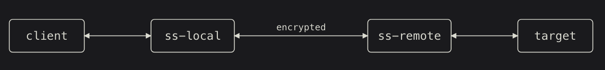

.. _intro_shadowsocks:

===========================
Shadowsocks简介
===========================

Shadowsocks上一个大致基于(loosely based on) ``SOCKS5`` 的安全分割代理(secure split proxy)

   Shadowsocks工作原理图

Shadowsocks 本地组件 (ss-local) 的作用类似于传统的 SOCKS5 服务器，为客户端提供代理服务。它加密并转发来自客户端的数据流和数据包到 Shadowsocks 远程组件 (ss-remote)，后者解密后转发给目标。目标的回复同样会被加密，并由 ss-remote 转发回 ss-local，ss-local 解密后最终返回给原始客户端。

通过(官方)上文描述，可以看出Shadowsocks和 :ref:`ssh_tunneling_dynamic_port_forwarding` 工作原理非常相似

.. csv-table:: SSH Dynamic Forward(ssh -D) 和 Shadowsocks(SS)原理对比
   :file: intro_shadowsocks/ssh_d_vs_ss.csv
   :widths: 20,40,40
   :header-rows: 1

但是 :ref:`ssh_tunneling_dynamic_port_forwarding` 对于翻墙有一个关键性缺陷，也使得和SS有明显的区别:

- SSH Tunnel 设计初衷是为了远程安全运维，不是为了翻墙，所以握手阶段有非常明显的 **协议特征** ，会 ``明文宣告自己的SSH版本等`` )。防火墙(GFW)可以通过深度包检测(DPI)极其轻松地识别出SSH流量，所以在GFW收紧时期常常会出现SSH Tunnel无法稳定使用的问题
- Shadowsocks 设计初衷是为了穿透防火墙，所以传输时会进行 **混淆和全流量加密** (早期时One-Time Auth，现在时AEAD加密如 ``aes-256-gcm`` )。对于防火墙来看，SS的流量完全是 **无特征的随机乱码(Heuristic/Entropy)** ，很难被精准识别和拦截
- SSH只支持TCP协议，这对于手机上的一些需要UDP协议的应用(如语音通话)，SSH Tunnel无法代理这些UDP流量
- Shadowsocks 原生支持 TCP 和 UDP，小火箭可以通过 SS 完美代理手机上的所有网络请求。

.. note::

   SSH这种握手阶段明文发送版本字符串导致被GFW阻断，这个案例和我之前在阿里云上构建HTTPS服务但是未备案导致拦截，原因就是TLS(HTTPS)的SNI被防火墙检测到导致的( :ref:`sni_esni_ech` )

AEAD 加密
==========

Shadowsocks（尤其是目前主流的 SS-AEAD 协议，如 ``aes-256-gcm`` 或 ``chacha20-ietf-poly1305`` ）彻底抛弃了传统的“明文握手”阶段。

不过，现在防火墙已经能够利用 "流量指纹分析" (Traffic Fingerprinting / Traffic Analysis）来识别 Shadowsocks:

- 包长度分布（Packet Length Profile）: 浏览器访问网页时，由于 HTTP 请求、HTML 加载、图片下载的顺序和大小是相对固定的，即使被 SS 加密，产生的密文数据包大小依然会呈现出特定的统计学分布。
- 包到达时间间隔（Inter-Arrival Time, IAT）: 浏览网页时的“点击-阅读-再点击”行为，在时序上有着强烈的交互特征。这与 VPS 之间进行纯数据备份（持续、均匀、高速的流量）完全不同。
- 连接行为特征：单 IP 长期保持一个长连接，且该连接不断有高熵（随机）流量吞吐，而该 IP 并没有注册合法的 SSL 证书或运行标准的 HTTP 服务。

由于上述特征，GFW防火墙还是会大致判断出SS流量，并进行端口阻断或限速。

参考
=======

- `What is Shadowsocks? <http://shadowsocks.org/doc/what-is-shadowsocks.html>`_
- gemini
