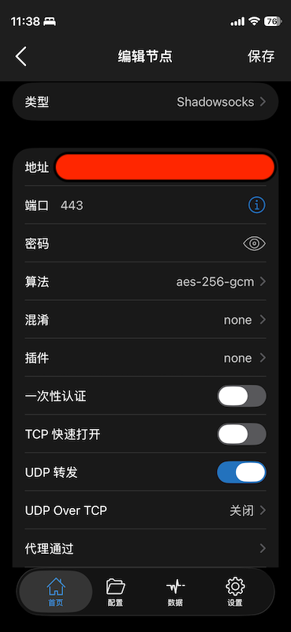

.. _shadowrocket_ss:

============================
Shadowrocket使用SS
============================

既然 :ref:`shadowrocket_ssh` 无法 :ref:`across_the_great_wall` ，并且对 :ref:`ios` 不友好。那么，放弃直接使用SSH Tunnel，改用 **shadowsocks** (SS)。

.. note::

   `GitHub: alireza0/x-ui <https://github.com/alireza0/x-ui>`_ 提供了流行的 ``x-ui`` 可视化面板，一键生成小火箭支持的节点。

   不过，本文使用简便的 :ref:`docker` 方式来直接运行

Shadowsocks服务端
===================

我的VPS采用了 :ref:`alpine_linux` ，所以先完成服务器端 :ref:`alpinelinux_docker`

- 在服务器上运行SS容器:

.. literalinclude:: shadowrocket_ss/docker
   :caption: 在Docker中运行shadowsocks
   :emphasize-lines: 7

参数说明:

- 运行 ``ss-server`` 参数 ``-p 443`` 是指定容器内服务进层监听在443端口，该参数可以按照需求进行调整
- 运行 ``ss-server`` 参数 ``-m aes-256-gcm`` 指定了 ``aes-256-gcm`` 算法: 现代的 AEAD 加密簇。它不仅加密数据，还包含一个身份验证标签（Tag），用于防止“主动探测”攻击

Shadowsocks客户端
====================

iOS客户端可以直接从AppStore安装 ``Shadowrocket`` ，配置方法非常简洁

- 点击 ``+`` 添加一个 **本地节点**
- 选择 ``Shadowsocks`` 类型，然后依次填写 ``地址`` , ``端口`` , ``密码`` 等:

  - 端口设置 ``443`` 对应上述 Shadowsocks 服务器的服务端口
  - 算法选择对应 Shadowsocks 服务器使用的算法 ``aes-256-gcm``
  - 混淆保持默认不要设置，原因是 ``aes-256-gcm`` 属于 **AEAD** 加密，本身就免疫GFW的"主动探测"，并且在小流量下就像一串无意义的二级制流(当前很多传统的混淆方式特征陈旧，反而更容易被识别)
  - TCP快速打开(TCP Fast Open, TF)) 需要服务端配合(见下文优化)
  - UDP转发: **必须开启** Shadowsocks 协议本身支持 TCP 和 UDP。开启此选项后，手机上的 UDP 流量（如 DNS 查询、语音通话数据、即时游戏包）会通过 SS 隧道发送。
  - UDP Over TCP (UDP 隧道): 一种“伪装”技术。它把原本的 UDP 数据包强行封装在 TCP 协议里面进行传输。默认关闭，除非 UDP 极度不稳定。该选项开启会带来严重的延迟叠加（TCP 的三次握手和确认机制会显著拖慢 UDP 的实时性）。
  - **代理通过** 保持默认的 ``本地节点``

.. note::

   最上一层有一个 **全局路由** ，保持默认的 ``配置`` 就可以: 根据配置文件规则转发流量。

   这个设置相当于内置的PAC，也就是国内流量默认直连，只有被GFW屏蔽的网站按照规则通过SS转发给加密VPN通道，这是最高效的一个配置

服务器端TFO优化(TCP快速打开)
==============================

- 在服务器端执行以下命令开启内核的TFO特性:

.. literalinclude:: shadowrocket_ss/tcp_fastopen
   :caption: 启用TFO
