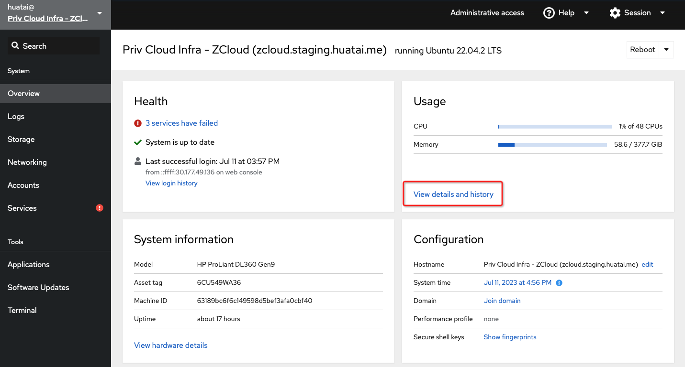
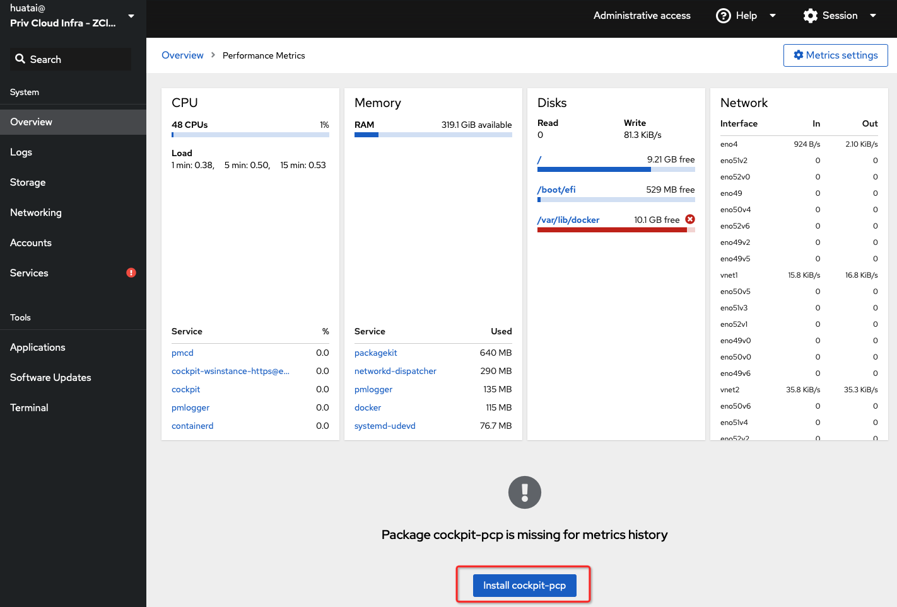
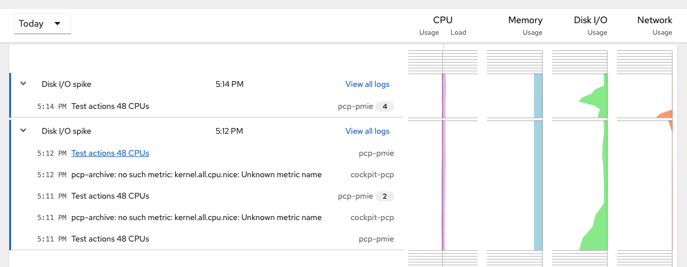
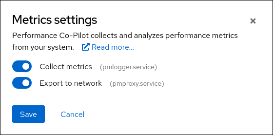
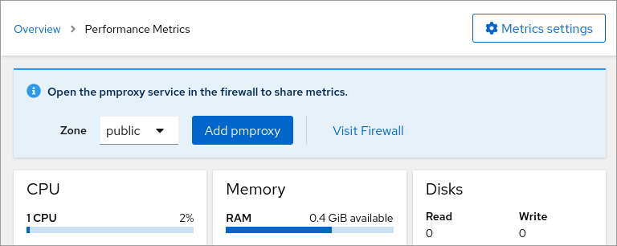
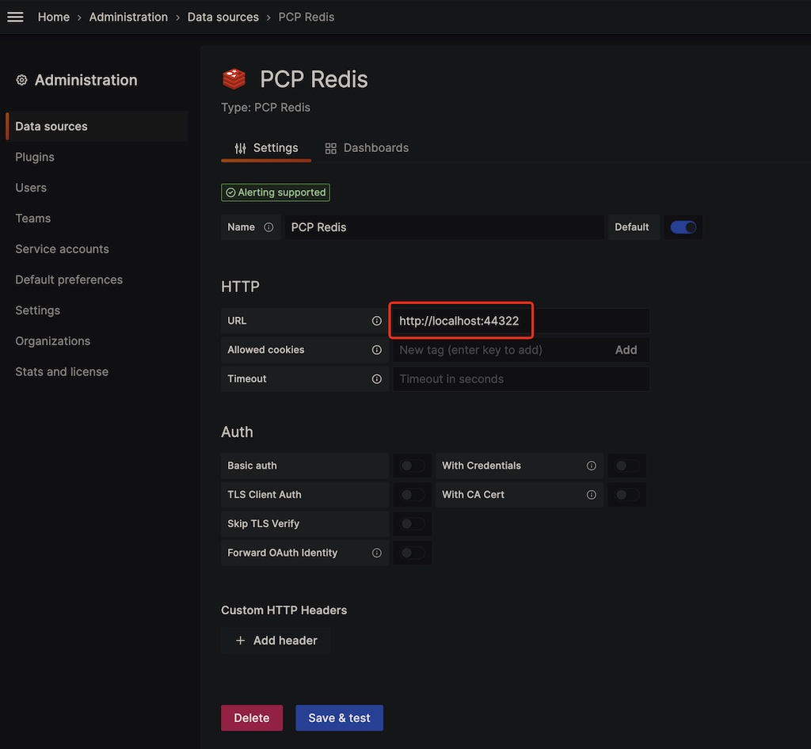
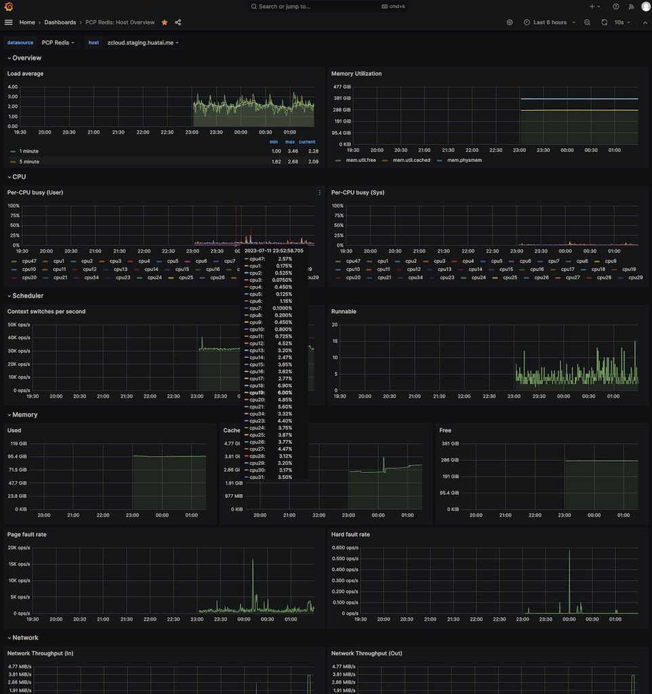

.. _cockpit-pcp:

===================
cockpit-pcp
===================

在 :ref:`ubuntu_linux` 上激活 ``Cockpit`` 之后，默认就能实现一些基本的系统监控。不过，要获取CPU/内存更为详细性能数据需要使用 :ref:`pcp`

.. note::

   可能需要 :ref:`cockpit_cannot_refresh_cache_whilst_offline` 才能安装 ``cockpit-pcp``

安装
======

- 访问 Cockpit 的 ``Overview`` 页面，点击 ``View details and history`` :

- 此时页面下方会提示你 ``Package cockpit-pcp is missing for metrics history`` :

- 可以点击安装 ``cockpit-pcp``

- 命令行安装方式其实也很简单:

安装 :ref:`pcp` :

.. literalinclude:: pcp/install_pcp/apt_install_pcp
   :caption: Ubuntu 使用 :ref:`apt` 安装 PCP

然后安装 ``cockpit-pcp`` 组件并重启一次 ``cockpit`` 服务:

.. literalinclude:: cockpit-pcp/install_cockpit-pcp
   :caption: 安装 ``cockpit-pcp`` 并重启 ``cockpit`` 服务刷新

- 重新访问  Cockpit 的 ``Overview`` 页面，点击 ``View details and history`` 就可以看到页面下半部分出现了详细的 ``metrics`` 页面(CPU/Memory/Disk/Network):

多服务器Metrics
================

上述观察服务器的 Metrics 看起来非常简陋，并且虽然 Cockpit 支持多服务器切换观察，但是实际上只支持最多20个服务器。

实际上Cockpit社区也放弃了Dashboard页面(从Cockpit 234移除了)，改为采用现代化的 :ref:`grafana` 来实现大规模多服务器监控。这样就避免了上述限制。

:ref:`pcp` 提供了一个 :ref:`grafana-pcp` 来实现主机的metrics输出到本地或远程的 :ref:`grafana` 。

配置被监控主机
==================

要设置主机的metrics发送给 :ref:`grafana` 需要执行一系列步骤，这些步骤在较新的Cockpit版本中可以自动完成:

- :ref:`install_pcp` : 并激活 ``pmlogger.service`` 来启动数据搜集( 安装步骤中所安装的 ``pcp-zeroconf`` 已自动配置并启动对应服务)
- 激活 ``pmproxy.service`` ，此时 :ref:`pcp` 组件会向网络输出一个只读的 metrics query API
- ``pmproxy.service`` 需要 :ref:`redis` 数据库，所以当在 ``Overview`` 点击右上角的 ``Metrics Settings`` 并启用 ``Export to network`` 时候，会提示将安装 ``redis`` 

这里应该也可以手工安装redis:

.. literalinclude:: ../../../redis/install_redis_startup/apt_install_redis
   :caption: 在Debian/Ubuntu环境安装redis

不过，我发现如果没有安装redis也能通过 ``systemctl start pmproxy.service`` ，但是配置可能不正确，所以建议先使用平台来激活 ``pmproxy`` 然后检查配置用于后续批量部署

   启用 ``pmproxy.service`` 服务，也就是对网络输出metrics

如果服务器上已经运行了防火墙，则 ``Cockpit`` 还会提示设置防火墙以便共享metrics:

   服务器有防火墙情况下， ``Cockpit`` 会提示配置对外输出端口

上述页面操作可以参考 `PCP Metrics <https://cockpit-project.org/guide/latest/feature-pcp.html>`_ 通过命令行完成配置:

.. literalinclude:: cockpit-pcp/pcp_metrics
   :caption: 配置 ``pmproxy`` 输出主机PCP metrics

Grafana设置
============

- 首先 :ref:`install_grafana` (视操作系统安装方法不同)，或者在 :ref:`kubernetes` 中 :ref:`helm3_prometheus_grafana`
- 安装 :ref:`grafana-pcp` 安装以后在 Grafana ``Administration`` 面板的 ``Plugins`` 中能够找到 ``Performance Co-Pilot`` ，点击 ``Enable`` 激活

- 然后选择 ``Configuration → Data sources`` 添加 ``PCP Redis`` 数据源

在这个添加页面，配置好访问 PCP Redis 主机URL，然后点击 ``Save & Test`` 按钮

- 默认数据源也包含了一些 Dashboards ，其中比较有用的是 ``PCP Redis: Host Overview`` ，请在这个页面点击 ``Dashboards`` 页面，然后选择 ``PCP Redis: Host Overview`` 并点击 ``Import`` 导入

- 导入之后，就可以在Dashboard中找到 ``PCP Redis: Host Overview`` 访问这个页面就能够看到服务器的星系监控信息:

.. note::

   多服务器监控待续...

参考
======

- `Setting up PCP and Grafana metrics with Cockpit <https://cockpit-project.org/blog/pcp-grafana.html>`_
