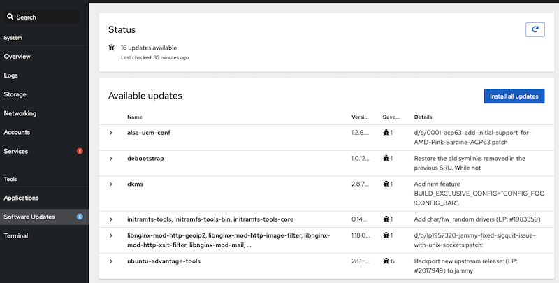

.. _cockpit_cannot_refresh_cache_whilst_offline:

======================================================
Cockpit "Cannot refresh cache whilst offline" 报错处理
======================================================

问题
======

在使用 Cockpit 时，访问 ``Software Updates`` 页面报错::

   Loading available updates failed
   Cannot refresh cache whilst offline
   
   Please reload the page after resolving the issue.

此外，在 :ref:`cockpit-pcp` 页面执行 ``Install cockpit-pcp`` ，也同样报错::

   Install software
   cockpit-pcp will be installed.

   Danger alert:Error: Cannot refresh cache whilst offline

导致无法安装

排查
=====

在 Ubuntu 中，如果安装使用了 :ref:`networkmanager` ，就需要至少管理一个网络接口，否则就会报告系统处于 ``offline`` 状态。由于 ``PackageKit`` 查询这个信息，就会导致以为系统处于 ``offline`` 状态。

我的 ``zcloud`` 使用了 :ref:`systemd_networkd` 来替代 :ref:`networkmanager` 管理网络(通过 :ref:`switch_nm` )，所以在 :ref:`netplan` 的配置中，所有 ``renderer`` 配置都是 ``networkd``

执行检查 :ref:`networkmanager` ::

   nmcli d

输出显示::

   DEVICE   TYPE      STATE      CONNECTION
   br0      bridge    unmanaged  --
   docker0  bridge    unmanaged  --
   virbr0   bridge    unmanaged  --
   eno1     ethernet  unmanaged  --
   ...

由于所有网络接口都不在 :ref:`networkmanager` 管理中，就导致了上述问题

参考文档 `Ubuntu: packagekit cannot refresh cache whilst offline #8477 <https://github.com/cockpit-project/cockpit/issues/8477>`_ 中提出配置一个 ``dummy`` 网络给 :ref:`networkmanager` 管理，我试验了一下没有成功:

- 原先采用 :ref:`systemd_networkd` 配置了复杂的网络，切换更改比较麻烦
- 我也尝试保留 :ref:`systemd_networkd` 配置，仅单独配置一个 ``/etc/netplan/03-fake-config.yaml`` 来激活一个 ``fake0`` 网络接口，同时启动运行 :ref:`networkmanager` ，但是刷新 访问 ``Software Updates`` 页面报错依旧(现在回想起来也许是漏了重启 ``packagekit.service`` )

感觉在 :ref:`ubuntu_linux` 环境中， :ref:`switch_nm` 切换回NetworkManager应该可以。但是既然我直接切换 :ref:`networkmanager` 失败该怎么解决呢？

`packagekit: Debian 10 Buster without NetworkManager: Cannot refresh cache whilst offline #13002 <https://github.com/cockpit-project/cockpit/issues/13002>`_ 提供了解决线索: `PackageKit won't work without NetworkManager <https://fedoraproject.org/wiki/PackageKit_Frequently_Asked_Questions#PackageKit_won.27t_work_without_NetworkManager>`_ (PackageKit官方FAQ) :

不使用 :ref:`networkmanager` 的情况下使用 PackageKit ，要么禁止 ``NetworkManager`` 服务，要么修订 ``/etc/PackageKit/PackageKit.conf`` 配置 ``UseNetworkManager=false``

解决
======

所以，我实践解决的方法是:

- 修改 ``/etc/PackageKit/PackageKit.conf`` 在 ``[Daemon]`` 段落添加::

   UseNetworkManager = false

- 然后重启 ``PackageKit`` 服务( 重要，否则访问 ``Software Updates`` 页面依然报错 )::

   systemctl restart packagekit.service

然后访问 ``Software Updates`` 页面等待页面刷新以后就能够看到刷新出需要更新的系统软件包:

参考
=====

- `How to use Cockpit to Manage Linux Server with Ease <https://www.starwindsoftware.com/blog/how-to-use-cockpit-to-manage-linux-server-with-ease>`_
- `Ubuntu: packagekit cannot refresh cache whilst offline #8477 <https://github.com/cockpit-project/cockpit/issues/8477>`_
- `packagekit: Debian 10 Buster without NetworkManager: Cannot refresh cache whilst offline #13002 <https://github.com/cockpit-project/cockpit/issues/13002>`_ 参考找到线索
- `PackageKit won't work without NetworkManager <https://fedoraproject.org/wiki/PackageKit_Frequently_Asked_Questions#PackageKit_won.27t_work_without_NetworkManager>`_
