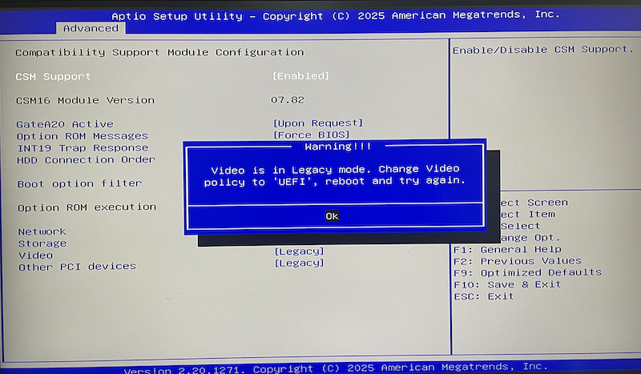

.. _above_4g_decoding:

===========================
Above 4G Decoding BIOS设置
===========================

我现在自己组装了一台台式机，来实现卧室内静音7x24运行。虽然使用杂牌的 :ref:`nasse_c246` ，但是我依然通过改造散热器安装了 :ref:`tesla_p10` 来实现基础的 :ref:`machine_learning` ( :ref:`llm` )。

和 :ref:`dl360_gen9_large_bar_memory` 类似，主机出于兼容性默认关闭了 ``Above 4G decoding`` ，也就是 HPE 文档中 术语 ``Support 64-Bit Addressing`` 和 ``Large BAR`` 。这个设置通常不需要，但是对于:

- 物理主机和虚拟机都采用EFI引导模式
- 虚拟机系统是64位操作系统
- GPU需要大规格(16GB或更多)内存映射才能实现 :ref:`gpu_passthrough_with_kvm` 或 :ref:`bhyve_pci_passthru`
- 虚拟机激活 ``64位 Memory Mapped I/O (MMIO)`` 

Above 4G Decoding原理
========================

显卡GPU和CPU通讯时，处理器(CPU)通常会将数据的副本或缓存存储在RAM中以便和显卡(GPU)协同工作。然后，CPU通过PCI总线将这些数据传输到显卡。通常(兼容模式)，存储这些信息到区域仅限于内存RAM的前4G。

但是在现代软件、操作系统和处理器使用64位处理器以来，就必须管理更大的内存空间(理论上可达16EB，现有硬件实现只有256TB):

- 显卡内存超过4GB
- 系统内存超过16GB(实际经验是如果计算机只有8-12GB内存启用 ``Above 4G Decoding`` 可能会因为内存过度消耗导致不稳定，所以通常建议物理主机超过16GB再启用这个功能)

通过激活 ``Above 4G Decoding`` 功能可以获得更好的计算性能，此时可以一次处理超过4GB的数据，对于Tesla显卡上的科学计算、3D渲染或加密币挖掘都会收到性能提升。

``Above 4G Decoding`` 这个功能实际上早在10多年前就已经纳入了PCIe标准，所以甚至很旧的Z390服务器处理芯片也支持。

我的BIOS配置
=============

我现在构建 :ref:`freebsd_virtual` :ref:`bhyve_pci_passthru` 同样需要设置 :ref:`nasse_c246` BIOS开启 ``Above 4G Decoding`` 功能:

.. figure:: ../../../../_static/linux/server/hardware/chipset/above_4gb_decoding.png

另外，在我的 :ref:`nasse_c246` BIOS设置中，我还将所有legency模式全部切换成UEFI模式(之前安装 :ref:`freebsd` 已经采用了UEFI模式，所以这个切换没有影响):

此外，BIOS中还有一项是 ``above 4GB mmio BIOS Assignment`` ，我不太确定，也做了激活配置:

.. figure:: ../../../../_static/linux/server/hardware/chipset/above_4gb_mmio_bios_assignment.png

参考
======

- `What is Above 4G Decoding – your BIOS's dark horse. Should it be enabled? <https://www.gameunion.tv/en/games/above-4g-decoding-your-bioss-dark-horse-what-it-and-should-it-be-105>`_
- `What is "Above 4G decoding"? <https://superuser.com/questions/1239231/what-is-above-4g-decoding>`_
