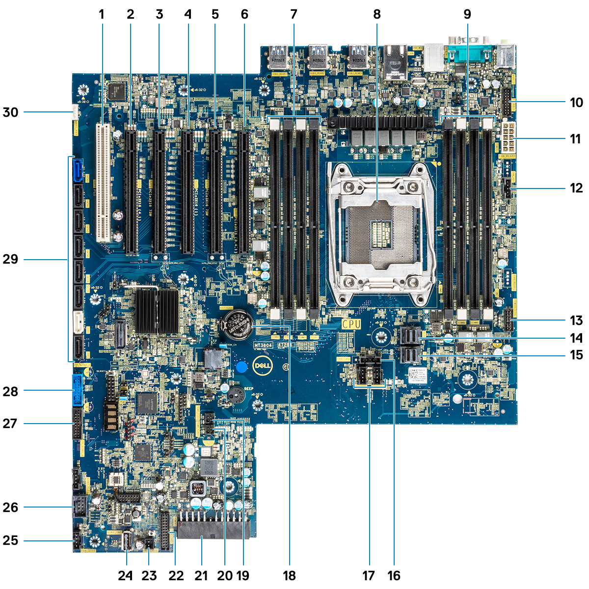
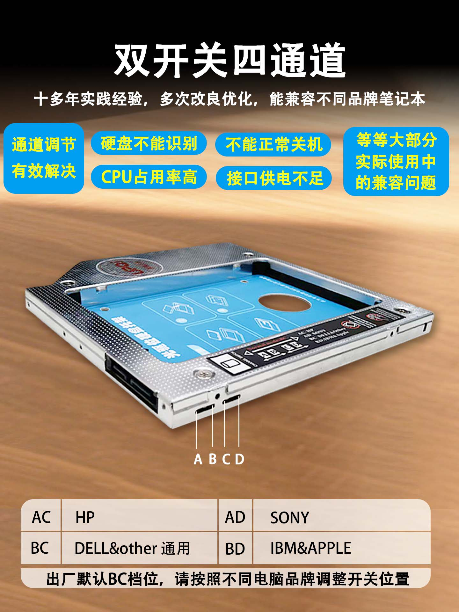

.. _dell_t5820:

=============================
Dell Precision T5820 工作站
=============================

2026年3月底剁手了二手的 Dell Precision T5820工作站，950W电源的准系统(有2个U.2位的背板)只需要1100元，是目前感觉能够承担的较为经济实惠的主机:

- 静音台式工作站，应该能够解决我使用机架式 :ref:`hpe_dl380_gen9` 烦人的噪音困扰
- 能够充分利旧我之前在 :ref:`hpe_dl380_gen9` 投资的大量ECC DDR4内存(这是最主要原因，2026年内存价格暴涨到原先的3-5倍)

  - 提供了 **8根** DIMM内存槽，这是我横向对比了同价位主机的选择，再低端的HP Z440,同级别的Z640(单路)都只有4个DIMM
  - 再高端的DELL T7820/T7920 或者 :ref:`hp_z8_g4` 虽然内存扩展更好(24根)但是准系统价格需要乘以3-4倍，性价比不如T5820

- 提供了5根PCIe插槽，虽然对于我同时安装 2个 :ref:`amd_mi50` 和 2个 :ref:`tesla_a2` 依然非常拥挤(甚至难以布局)，但是还是算这个价位单处理器工作站中比较好的PCIe扩展性

技术规格
==========

- 支持 至强 W-21xx 和 W-22xx 处理器

  - 提供了 :ref:`vnni` 指令集(AVX512升级)，为使用 :ref:`openvino` 部署CPU推理加速提供了硬件支持

系统主板
-----------

   T5820主板

.. csv-table:: Dell T5820 主板
   :file: dell_t5820/mainboard.csv
   :widths: 10,30,60
   :header-rows: 1

内存
-------

8根DIMM内存插槽，支持 DDR4 ECC RDIMM (仅通过 :ref:`xeon_w` CPU提供支持) 和 DDR4非ECC UDIMM (通过酷睿X系列CPU提供支持):

- 2666MT/s
- 2933MT/s
- 3200MT/s

.. note::

   Cascade Lake系列CPU将支持T5820每个内存槽最高64GB，所以最大支持512GB内存；但使用Sky Lake系列CPU则只支持每个内存槽最高32GB，所以最大支持256GB内存。

   **内存速度取决于系统中的CPU**

PCIe插槽
---------

我选择 T5820 的一个重要原因是PCIe扩展能力，该主机提供了5个 ``PCIe`` 和 1个 ``PCI`` 插槽:

.. csv-table:: Dell T5820 PCIe (使用 :ref:`xeon_w-2225` )
   :file: dell_t5820/pcie.csv
   :width: 20,20,30,30
   :header-rows: 1

U.2背板和NVMe
===============

Dell T5820前面板有4个硬盘槽位，分为2个版本:

- 全SATA版本: 4个槽位可以安装4个 3.5寸SATA 硬盘(通过转接支架也可以安装2.5寸SATA硬盘)
- 2个U.2+2个SATA: 升级版本，其中2个槽位的背板换成了U.2接口。这个版本的U.2接口不仅能够安装企业级U.2接口SSD硬盘，而且通过专用的 ``NVMe Flexbay`` 能够转接NVMe SSD，这样就能够充分利旧家用型NVMe设备，如 :ref:`kioxia_exceria_g2`

.. figure:: ../../../../_static/linux/server/hardware/dell/m2_u2_box.avif

   通过NVMe Flexbay可以将U.2转接NVMe SSD设备

.. note::

   如果要使用企业级的U.2 SSD硬盘，建议购买 ``2个U.2+2个SATA`` 版本T5820，实际上是通过更换 FlexBay 1 的背板，来直接支持在主机前面方便更换 :ref:`nvme` 

   `升级 Dell Precision 5820、7820 和 7920 塔式工作站中的存储 <https://www.dell.com/support/kbdoc/zh-cn/000146243/%E5%8D%87%E7%BA%A7-dell-precision-5820-7820-%E5%92%8C-7920-%E5%A1%94%E5%BC%8F%E5%B7%A5%E4%BD%9C%E7%AB%99%E4%B8%AD%E7%9A%84%E5%AD%98%E5%82%A8>`_ 视频介绍了如何安装NVMe设备，前提条件是选购 **U.2** 背板的T5820

   不过，实际上U.2或NVMe的支持是通过主板集成的 PCIe0 和 PCIe1 端口提供连接，该接口也可以直接用于连接GPU设备，这样实际上可以多安装2块 :ref:`tesla_a2` : :ref:`dell_t5820_sff-8654_tesla_a2`

硬盘安装
==========

超薄光驱转2.5" SSD
---------------------

T5820有一个超薄光驱位置，当然二手服务器上，这个光驱位是空的，但是有一个光驱连接的SATA接口，所以非常适合安装一块OS使用的2.5" SSD硬盘:

这种超薄光驱是标准化的，可以在淘宝上找到非常廉价的转接支架

3.5"机械硬盘
---------------

T5820的FlexBay(除了U.2背板还有2个SATA硬盘)可以安装2块SATA硬盘，我准备安装之前购买的旧3.5"机械硬盘。由于现在半导体价格狂飙，导致购买新的SSD硬盘和机械硬盘成本非常高，所以我采用以前购买的旧硬盘来组建 :ref:`zfs` 存储，用于数据备份。

考虑到只有2个SATA 3.5"安装位置，准备将主机的光驱(ODD)位置也转为安装一块 3.5" 机械硬盘，这样总共可以安装 **3块 3.5“机械硬盘** ，特别适合安装静音的监控级硬盘，用于数据离线备份

.. note::

   通过脚本来离线挂起机械硬盘，仅在需要备份时候加载，来降低噪音和耗电: :ref:`stop_hdd`

参考
======

- `戴尔 Precision 5820 Tower 用户手册 <https://dl.dell.com/content/manual34500682-%E6%88%B4%E5%B0%94-precision-5820-tower-%E7%94%A8%E6%88%B7%E6%89%8B%E5%86%8C.pdf?language=zh-cn>`_
- `升级 Dell Precision 5820、7820 和 7920 塔式工作站中的存储 <https://www.dell.com/support/kbdoc/zh-cn/000146243/%E5%8D%87%E7%BA%A7-dell-precision-5820-7820-%E5%92%8C-7920-%E5%A1%94%E5%BC%8F%E5%B7%A5%E4%BD%9C%E7%AB%99%E4%B8%AD%E7%9A%84%E5%AD%98%E5%82%A8>`_
