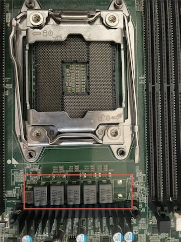

.. _dell_t5820_crash_debug:

=============================
Dell T5820宕机异常排查
=============================

考虑到 :ref:`vnni` 支持，以及核心数多、二手价格便宜，我最初购买 :ref:`xeon_w-2235` 作为T5820的处理器:

- 官方手册 `戴尔 Precision 5820 Tower 用户手册 <https://dl.dell.com/content/manual34500682-%E6%88%B4%E5%B0%94-precision-5820-tower-%E7%94%A8%E6%88%B7%E6%89%8B%E5%86%8C.pdf?language=zh-cn>`_ 列出的 ``W-22xx`` 包含了这款经济实惠的处理器，也是我能够接受的500元以内预算
- 6核心12超线程，是500元以下性能最强(发布时售价高达610美元)

但是，万万没有想到，小心组装完成后，开机就出现 ``连续4次琥珀色报警灯闪烁`` 并自动关机!!!

和gemini讨论之后，初步定位可能有:

- 电源老化损坏或者主板短路或者CPU辅助供电线松动
- 内存故障或不兼容
- 开机瞬间多GPU导致券功率检测状态(Inrush current)失败
- CPU针脚歪斜导致电压检测失败

然而，实际排查却排除了上述可能:

- 插拔了可能的电源线确保电源连接可靠
- 内存仅保留slot1，并替换排查多根内存
- 去掉所有可能高功率设备(显卡)，仅保留CPU和一根内存
- 通过观察CPU底座针脚反光确认没有出现针脚歪斜

折腾了很久也没有解决，问了淘宝卖家，卖家说他们的技术在大量装机和售后实践确定这个T5820只支持到 W-2225 ，不支持 W-2235，即使刷新到最新的2.48 BIOS版本也是这样。

WAHT?

为何Dell手册却列出了支持多种W-22xx处理器，包括 :ref:`xeon_w-2235` ，我运气这么不好吗？

.. note::

   根据现象来看，4次闪烁琥珀色告警，但是没有出现白色闪烁，说明故障大概率和电源有关。因为手册列出的告警灯闪烁，白色闪烁灯是BIOS启动之后开始CPU和内存检测异常才会出现。

   也就是说，没有出现白色告警闪烁，说明还没有进入BIOS检测就宕机了，多数和电源不稳定相关。

gemini提到了启动时电流不稳定会导致自动宕机，讨论到了主板的供电相(Phases)在早期型号中只有5-7相:

CPU 是一个极其“渴电”的精密器件。W-2235 (130W) 在满载时，核心电压约 1.2V，这意味着电流会激增到 100A 以上。如果只靠一组电路来转换，发热量会瞬间烧毁电子元器件:

主板采用了**多相并联（Multi-Phase）**技术。每一“相”通常由三个核心组件构成:

- WM 控制器：指挥官，决定每一相什么时候“开闸放水”。
- MOSFET (场效应管)：开关，负责切断和导通电流（产生热量的主要来源）。
- 电感 (Choke)：储能和滤波，通常是主板 CPU 插槽周围那些黑色的方块。

在 2019 年出厂的 T5820 主板上，肉眼观察 CPU 插槽左侧和上方的黑方块：

如果只有 5-6 个：那么这块主板面对 130W 的 W-2235 确实处于临界点。启动瞬间，为了给 6 个核心同时充满电荷，VRM 负载会瞬间爆表，导致 琥珀色灯闪（供电轨故障）。

根据gemini提示，我观察了主板CPU周围电感，果然发现异常:

   CPU旁边的电感只有5个，并且有一个空白未焊接电感

我购买的T5820的CPU旁边的电感只有 **5个** ，有一个空白未焊接电感的位置。这表明Dell为了降低成本，早期T5820主板削减了1个电感。虽然这能够满足2019年及之前Intel CPU，但是对于之后发布的高功率大电流的CPU，则缺乏硬件支持。所以即使升级BIOS也无法解决这个支持W-2235。

也许后期发布的T5820版本补充了这个电感，所以后续T5820通过升级BIOS是能够支持 :ref:`xeon_w-2235` 。

.. csv-table:: 主板的电阻、电容、电感
   :file: dell_t5820_crash_debug/parts.csv
   :widths: 25,25,25,25
   :header-rows: 1

参考
======

- `戴尔 Precision 5820 Tower 用户手册 <https://dl.dell.com/content/manual34500682-%E6%88%B4%E5%B0%94-precision-5820-tower-%E7%94%A8%E6%88%B7%E6%89%8B%E5%86%8C.pdf?language=zh-cn>`_
