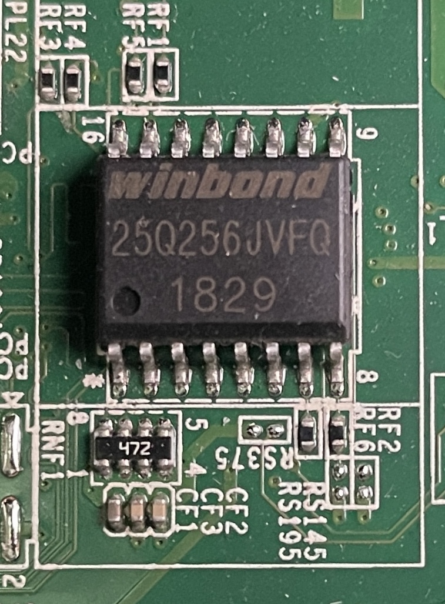

.. _dell_t5820_flash_modified_bios:

============================
Dell T5820刷入修改过的BIOS
============================

.. _external_eeprom_flasher:

外部EEPROM烧录器
====================

T5820主板BIOS芯片
-------------------

在主板CMOS电池旁边可以找到BIOS芯片，通常是Winbond(华邦), MXIC(旺宏)或Micron(美光)。我在主板CMOS电池旁边找到了芯片 ``winbond 25Q256JVFQ 1829`` :

   ``winbond 25Q256JVFQ 1829`` BIOS芯片

- ``25Q256JVFQ`` : ``JV`` 结尾代表 ``3.3V`` ，在淘宝上购买的 **CH341A编辑器+转接板+SOP16夹子线** 默认提供的就是3V，可直接使用(如果芯片是1.8V还需要1.8V适配器)
- 芯片左下角有一个凹陷小圆坑（旁边印着数字 1）， ``SOP16`` 夹子上的红线必须对准这个圆坑所在的引脚
- 芯片引脚表面有一层淡淡的氧化层或助焊剂残留: 在使用SOP16夹子是，需要用酒精擦拭一下 16 个引脚，能极大地提高“识别成功率”

烧录软件
-----------

使用 ``NeoProgrammer`` 驱动和软件

- 取出 T5820 CMOS电池，然后按几次主机电源按钮放电，避免影响烧录
- 夹好芯片，在软件里选 ``W25Q256JV``
- 备份，得到 ``32MB`` 的bin文件

.. note::

   这里备份得到的 ``bin`` 文件可以解决我之前在 :ref:`dell_t5820_config_aperture_size` 反复尝试都失败没能正确提取的bin文件问题。这是一个完整的包含主机Service Tag等信息的BIOS bin，甚至不会引发Windows授权失效。

参考
======

- gemini
- `xCuri0/ReBarUEFI: List of working motherboards #11 <https://github.com/xCuri0/ReBarUEFI/issues/11>`_ 用户 @zhiwoo 提供了 Dell Precision T5810 的实践信息: **External EEPROM flasher required. Dell BIOS flasher would not allow the flashing of modified BIOS.** 这启发了我找寻外部EEPROM烧录器来实现BIOS备份和定制
