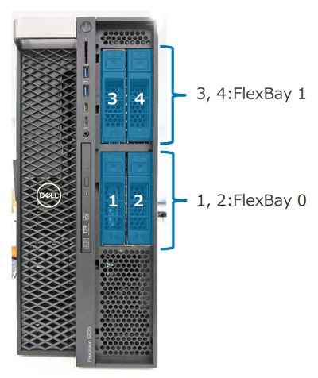
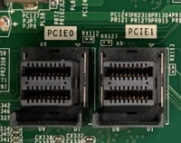

.. _dell_t5820_nvme:

======================================
Dell T5820通过FlexBay安装NVMe
======================================

:ref:`dell_t5820` 前面板有用于安装存储的FlexBay，分为2个FlaxBay，每个FlaxBay后部安装了一块背板，其安装的背板类型决定了是使用U.2接口硬盘还是SATA硬盘。

Dell T5820主板CPU旁边有 ``PCIe 0`` 和 ``PCIe 1`` 两个接口，该接口通过SFF-8654接口转接U.2，为 ``FlexBay 1`` 提供了数据通讯功能:

   FlexBay 1安装了U.2接口，数据线连接到主板CPU旁的 ``PCIe 0`` 和 ``PCIe 1`` 接口

   主板CPU旁边的 ``PCIe 0`` 和 ``PCIe 1`` 接口

参考
======

- `如何为 Precision 5820 和 7820 塔式机切换 NVMe <https://www.dell.com/support/kbdoc/zh-cn/000185631/%E5%A6%82%E4%BD%95%E4%B8%BA-precision-5820-%E5%92%8C-7820-%E5%A1%94%E5%BC%8F%E6%9C%BA%E5%88%87%E6%8D%A2-nvme>`_
