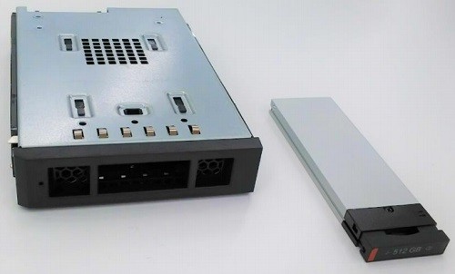
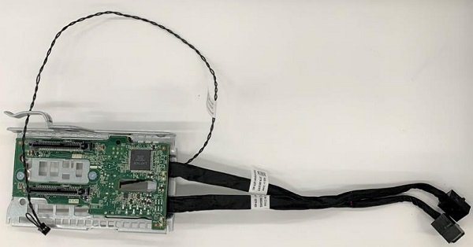

.. _dell_t5820_nvme:

======================================
Dell T5820通过FlexBay安装NVMe
======================================

:ref:`dell_t5820` 前面板有用于安装存储的FlexBay，分为2个FlaxBay，每个FlaxBay后部安装了一块背板，其安装的背板类型决定了是使用U.2接口硬盘还是SATA硬盘。

Dell T5820主板CPU旁边有 ``PCIe 0`` 和 ``PCIe 1`` 两个接口，该接口通过SFF-8654接口转接U.2，为 ``FlexBay 1`` 提供了数据通讯功能:

.. figure:: ../../../../_static/linux/server/hardware/dell/sff-8654.jpg

   主板CPU旁边的 ``PCIe 0`` 和 ``PCIe 1`` 接口

.. figure:: ../../../../_static/linux/server/hardware/dell/t5820_flexbay_1.jpg

   FlexBay 1安装了U.2接口，数据线连接到主板CPU旁的 ``PCIe 0`` 和 ``PCIe 1`` 接口

不过，通过Flex Bay安装 :ref:`nvme` 需要使用Dell专用的 ``NVMe Flexbay`` : 如果你购买的是4个SATA接口的T5820，那么需要购买官方套装: Flexbay的M.2模块(575-BBSH)和HDD FlexBay转为PCIe SSD FlexBay套件(750-ABDF)

   Flexbay的M.2模块(575-BBSH)

   HDD FlexBay转PCIe SSD FlexBay套件(750-ABDF)

安装有点小复杂，需要参考 `如何为 Precision 5820 和 7820 塔式机切换 NVMe <https://www.dell.com/support/kbdoc/zh-cn/000185631/%E5%A6%82%E4%BD%95%E4%B8%BA-precision-5820-%E5%92%8C-7820-%E5%A1%94%E5%BC%8F%E6%9C%BA%E5%88%87%E6%8D%A2-nvme>`_

优点
======

- 通过前面板安装 :ref:`nvme` 非常方便和整洁

缺点
======

- 需要另外购买 ``NVMe Flexbay`` 转接盒，目前价格大约125元/个
- 每个安装位置只能安装 **1块NVMe** ，占用了非常宝贵的PCIe接口，这样消耗了2个PCIe接口只能安装2块NVMe。如果为了支持更多的GPU，例如低功耗 :ref:`tesla_a2` ，我可能会将这2个PCIe接口用于 :ref:`dell_t5820_sff-8654_tesla_a2`

实践
=======

我最终在淘宝上购买了2个 ``NVMe Flexbay`` 转接盒，花费了250元，安装比较顺利，Dell为这个NVMe Flexbay设计了抽取盒子，只需要3个外部螺丝就能够固定住NVMe盘(内部不需要螺丝，直接卡住)

不过，我注意到一旦安装了 ``NVMe Flexbay`` ，主机的风扇转速明显提高，能够感觉到风噪比没有安装NVMe之前大了不少。我安装了 :ref:`lm_sensor` 和 :ref:`nvme-cli` 来检查验证

.. literalinclude:: dell_t5820_nvme/install_lm_sensor_nvme-cli
   :caption: 安装 lm_sensor 和 nvme-cli

然后执行 ``sensors`` 命令，可以看到系统传感器报告风扇转速和温度:

.. literalinclude:: dell_t5820_nvme/sensors_output
   :caption: 执行 ``sensors`` 命令观察主机温度和风扇转速
   :emphasize-lines: 3,6,15,18

可以看到感受到风扇噪音主要是因为fan1和fan4转速提到到>1000rpm，当系统风扇转速低于1000时几乎感觉不到声音。

T5820 的 FlexBay 如果安装了 U.2 NVMe 硬盘，主板会认为该区域出现了高发热组件。相比传统的 SATA/SAS 硬盘，NVMe 硬盘在满载时控制器温度可以轻松突破 70°C。为了防止 PCIe 控制器过热导致系统崩溃，BIOS 会强制提升 **前置进风扇（Front Intake Fan）** 的阶梯转速。

不过，目前我使用的消费级 :ref:`kioxia_exceria_g2` 待机时温度很低

另外一个检查nvme温度的方法是使用 :ref:`nvme-cli` :

.. literalinclude:: dell_t5820_nvme/nvme-cli
   :caption: 使用 ``nvme-cli`` 检查 smart-log

输出类似:

.. literalinclude:: dell_t5820_nvme/nvme-cli_output
   :caption: 使用 ``nvme-cli`` 检查 smart-log
   :emphasize-lines: 3

参考
======

- `如何为 Precision 5820 和 7820 塔式机切换 NVMe <https://www.dell.com/support/kbdoc/zh-cn/000185631/%E5%A6%82%E4%BD%95%E4%B8%BA-precision-5820-%E5%92%8C-7820-%E5%A1%94%E5%BC%8F%E6%9C%BA%E5%88%87%E6%8D%A2-nvme>`_
