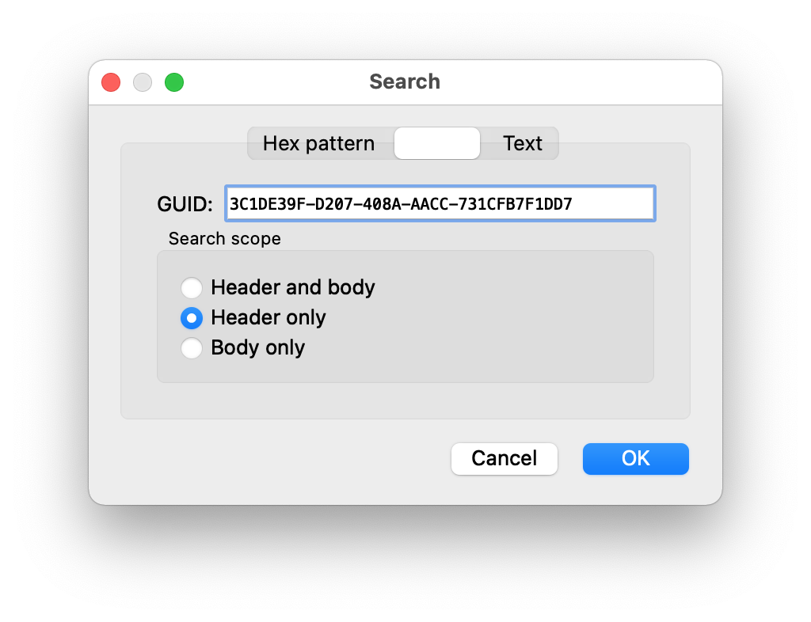
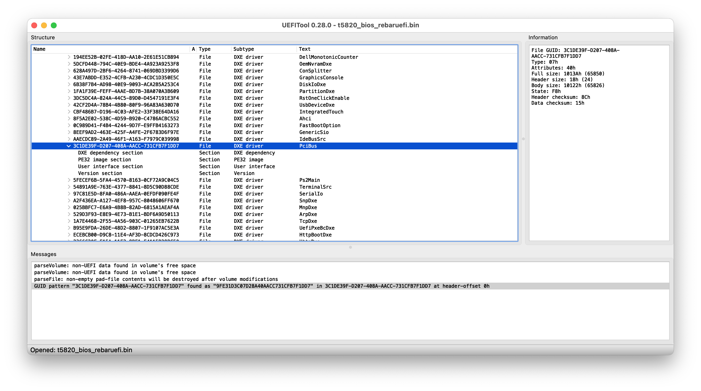
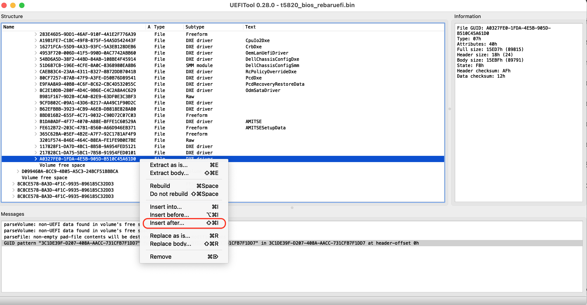
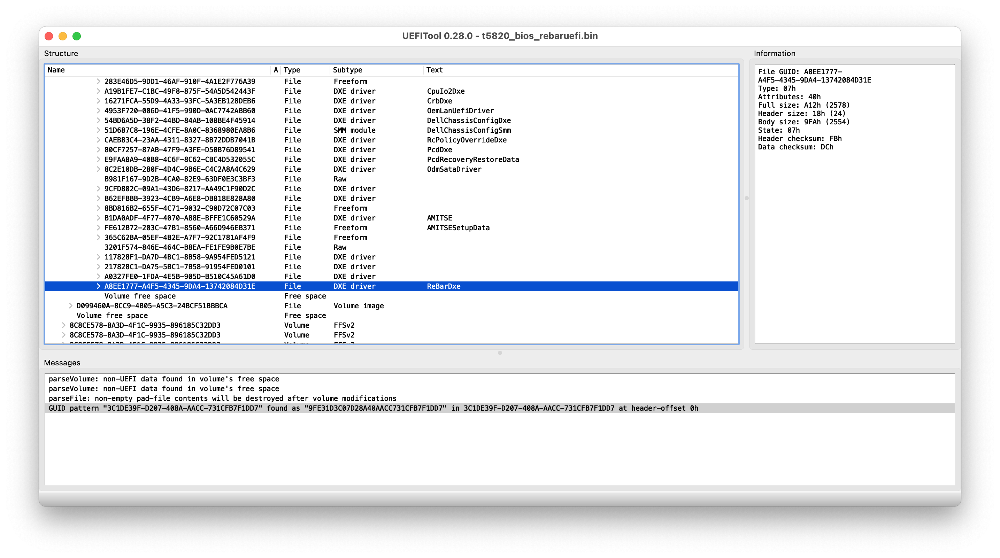

.. _dell_t5820_rebaruefi:

=======================================
Dell T5820通过ReBarUEFI工具强制修改BAR
=======================================

Dell T5820这款早期工作站的主板有一个巨大缺陷是不支持 :ref:`tesla_a2` 和 :ref:`amd_mi50` 这样的服务器GPU计算卡的大规格BAR，导致无法启动主机。我在反复折腾 :ref:`amd_mi50_change_vbios_bar_size` 失败之后，gemini终于推荐了使用开源工具 `xCuri0/ReBarUEFI <https://github.com/xCuri0/ReBarUEFI>`_ 来为主板BIOS注入一个 UEFI 驱动（DXE Driver），这样可以将显卡的 BAR 强制限制在 256MB、512MB 或 1GB，即使显卡固件请求32GB，主板也只会给他分配一个小窗口，从而允许顺利开机。

.. note::

   和AI对话就像即时战略游戏中的无尽地图，通过不断的排列组合试探，才能在某一个瞬间触发发现新大陆!!!

.. warning::

   由于 :ref:`dell_t5820` 对BIOS写入有签名保护，所以自制的BIOS是无法直接刷入主机BIOS的，需要采用 :ref:`external_eeprom_flasher` 绕过主板上的PRR(写保护寄存器)

分析
=======

为何我的 :ref:`amd_mi50` 一直无法在 :ref:`dell_t5820` 上启用，我经过各种尝试后推测如下:

`evilJazz/MI50_32GB_VBIOS.md <https://gist.github.com/evilJazz/14a4c82a67f2c52a6bb5f9cea02f5e13>`_ 列出了 :ref:`amd_mi50` 原生的VBIOS ``113-D1631711-100`` 是一个Legacy only VBIOS(不支持UEFI)，同时不支持ReBAR。既然GPU不支持ReBAR，那么 :ref:`dell_t5820` 不支持ReBAR也没关系。但是这里有一个关键点就是这款MI50数据中心计算卡，由于不支持ReBAR，就会强制要求主机提供一个32GB的大型BAR。

这种大型BAR的要求，对于 :ref:`hpe_dl380_gen9` 这样的标准数据中心服务器是能够满足的，但是对于 :ref:`dell_t5820` 则无法做到。虽然T5820也支持工作站系列的NVIDIA RTX，并且支持高达48GB的显存，但是工作站显卡显然不会采用数据中心这种申请整块巨大BAR的方式，而是采用传统的Small BAR，所以在T5820上大规格显存的工作站显卡可以使用。

我后来刷新了 :ref:`amd_mi50` 的VBIOS，采用了V420的VBIOS，此时由于V420的VBIOS是UEFI格式，并且支持ReBAR协商，理论上应该更好地适应工作站主板或者兼容台式机(在2017年以后的台式机主板普遍支持ReBAR)。此时就凸显出了T5820的短板: 不支持ReBAR协商，这导致它无法和MI50握手协商一个双方都能够支持的BAR Size。

目前最佳的用于工作站的 :ref:`amd_mi50` VBIOS是用于V420的VBIOS，兼顾了UEFI和ReBAR，这意味着能够用于无法直接支持32GB大BAR的普通工作站。现在需要解决的就是如何让 :ref:`dell_t5820` 也支持ReBAR协商，以便能够和 :ref:`amd_mi50` 握手确定一个最佳BAR。

准备工作
============

ReBarUEFI需要修订原厂的BIOS，这个步骤结合 :ref:`dell_t5820_flash_modified_bios` 来完成。因为之前我尝试 :ref:`dell_t5820_config_aperture_size` 采用直接从Dell官网下载的BIOS更新执行程序中提取BIOS的bin文件失败，经过探索， :ref:`dell_t5820_flash_modified_bios` 能够提取完整原生的BIOS bin文件，所以在执行 ReBarUEFI 之前，先采用该方法(使用外接的EEPROM编程器获取BIOS bin) 

- 通过 :ref:`flashrom` 获取主机BIOS bin:

.. literalinclude:: dell_t5820_flash_modified_bios/backup
   :caption: 两次执行备份，确保备份的BIOS bin文件正确

- 复制其中一个BIOS bin文件准备进行后续修订:

.. literalinclude:: dell_t5820_rebaruefi/cp_backup1.bin
   :caption: 复制一个新的BIOS文件 ``t5820_bios_rebaruefi.bin`` 待修订

.. _rebaruefi:

ReBarUEFI
============

`xCuri0/ReBarUEFI <https://github.com/xCuri0/ReBarUEFI>`_ 提供了 ``ReBarUEFI`` 为官方不支持Resiable BAR的系统提供了一个UEFI DXE驱动，来实现ReBAR支持。这样就为陈旧的老主机带来了支持最新ReBAR协议的能力，可以安装类似 :ref:`intel_gpu` Arc 系列这样必须使用ReBAR的显卡。

准备
------

- (可选)激活 ``4G Decoding`` : 在BIOS中激活 :ref:`above_4g_decoding` ，没有激活这个选项那么就会被限制在 ``1GB BAR`` 甚至 ``512MB BAR`` ，这种情况下最多可以设置为 ``2GB BAR``
- (可选)BIOS 支持Large BARs : **ReBarUEFI** 能够修复和这个相关的大多数问题

添加FFS模块
-------------

修订 ``t5820_bios_rebaruefi.bin`` 需要使用 `LongSoft/UEFITool <https://github.com/LongSoft/UEFITool>`_ ，这是一个图形程序，在Linux环境下需要使用Qt，所以运行环境安装还是比较繁重的，并且在 :ref:`alpine_linux` 下(musl libc)安装比较折腾，需要安装 ``gcompat`` 来运行为glibc编译的Linux预编译包:

.. literalinclude:: dell_t5820_rebaruefi/alpine_uefitool
   :caption: 在Alpine Linux环境需要gcompat来兼容运行UEFItool

为了方便完成，更为简单的方法是在 :ref:`macos` 或 :ref:`windows` 环境使用UEFITool

.. note::

   不要下载最新的 ``UEFITool_NE`` 版本，最新的UEFITool只支持查看不支持修改!!!

   只有 `UEFITool non-NE (0.28) <https://github.com/LongSoft/UEFITool/releases/tag/0.28.0>`_ 支持添加模块: 别问我为什么，ReBarUEFI文档是这么写的，我头铁尝试了最新版本， ``Insert after`` 等菜单都是灰色不可用，最后还是乖乖按照文档下载了指定的 ``0.28`` 版本

   注意，这个 ``0.28`` 版本没有签名，所以需要在 ``System Preferences >> Security & Privacy`` 中设置允许运行这个程序才能使用！

- 在UEFITool中使用 ``Search`` 功能，搜索 ``Header only GUID`` :

   搜索 ``Header only GUID``

搜索的结果是 ``GUID pattern "3C1DE39F-D207-408A-AACC-731CFB7F1DD7" found as "9FE31D3C07D28A40AACC731CFB7F1DD7" in 9E21FD93-9C72-4C15-8C4B-E77F1DB2D792/.../PciBus at header-offset 00h`` ，此时可以看到在一个 ``PciBus`` 下找到这个GUID

   找到PciBus

在这个PciBus所在的Volume的最后就是需要插入 `ReBarDxe.ffs <https://github.com/xCuri0/ReBarUEFI/releases>`_ (<=需要下载该文件)的地方，所以滚动到搜索这个 ``Header only GUID`` 的卷的末尾，选择最后一个 ``module`` 并右击鼠标，选择 ``Insert after`` 菜单:

   在该卷的最后一个模块后面插入 ``ReBarDxe.ffs``

插入 ``ReBarDxe.ffs`` 之后，就可以看到最后增加了一个名为 ``ReBarDxe`` 的模块:

   可以看到卷末尾增加了一个 ``ReBarDxe`` 模块

- 最后使用 ``File -> Save image file`` 保存修改后的BIOS文件，我命名为 ``t5820_bios_rebaruefi_fixed.bin``

UEFIPatch
-------------

由于大多数消费级主板在处理64位BAR存在问题，而 Resiable BAR功能 需要64位BAR才能正常工作，所以需要使用 UEFIPatch (UEFITool的一部分)来修补UEFI，使其兼容64位BAR并解决各种问题。

前面插入了 ``ReBarDxe.ffs`` 只是将功能放入了BIOS，但是许多主板（尤其是 Dell、HP 这种商业大厂）的 BIOS 固件中存在硬编码限制，会限制 PCIe BAR 的大小，或者在启用 ``Above 4G Decoding`` 时依然存在内存对齐 Bug。 ``UEFIPatch`` 的作用就是 **“暴力拆除”** 这些限制:

- **解除 4GB 限制** ：许多老款 BIOS 即便开启了 ``Above 4G`` ，也会将单个 PCIe 设备的显存分配限制在 ``2GB`` 或 ``4GB`` 以内。 :ref:`amd_mi50` 有 32GB，不打补丁几乎肯定会报错。
- **修复权限/校验** ：补丁可以自动修改 BIOS 中的汇编指令，允许系统分配更大的内存地址空间（ ``mmio`` ）给 GPU。

- 下载 `UEFITool non-NE (0.28) <https://github.com/LongSoft/UEFITool/releases/tag/0.28.0>`_ 中的 ``UEFIPatch`` (我在macOS平台执行，所以下载的是 ``UEFIPatch_0.28.0_mac.zip``

- 下载 `patches.txt <https://github.com/xCuri0/ReBarUEFI/blob/master/UEFIPatch/patches.txt>`_ 并存放到 ``UEFIPatch`` 执行程序和 ``t5820_bios_rebaruefi_fixed.bin`` (BIOS文件)所在的目录下

按照 `Using UEFIPatch <https://github.com/xCuri0/ReBarUEFI/wiki/Using-UEFIPatch>`_ 文档，对于不同系列的CPU **对应的主板芯片** 需要添加不同的补丁内容。我的 :ref:`dell_t5820` 使用的 :ref:`xeon_w-2225` 属于 **Cascadelake** 架构，主机 :ref:`dell_t5820` 的芯片集是 :ref:`intel_c422` ，文档中没有要求再修订 patches.txt

另外，我检查了下载的 ``patches.txt`` 内容，其中的注释说明了patches补丁是针对哪种处理器架构的，我没有找到 **Cascadelake** 架构(intel第10代处理器)对应的配置(最高的配置是针对 ``Remove <64GB BAR size limit (Skylake/Kaby Lake/Coffee Lake)`` ): 这说明 Cascade Lake这代处理器架构已经足够先进，已经避开了4GB寻址的硬编码陷阱。

所以我决定先采用 **不执行UEFIPatch** 的 ``t5820_bios_rebaruefi_fixed.bin`` 刷入 :ref:`dell_t5820` ，然后观察 :ref:`amd_mi50` 的 Large Memory Range 是否成功分配生效。如果出现 ``Code 12`` 错误，提示"该设备找不到足够的可用资源"，则表明BIOS 的 MMIO 窗口确实被限制了，无法容纳 32GB 的 BAR。或者出现即使开启了 ``Above 4G`` 依然强行将BAR压缩在小容量范围(例如256MB)，则在回过头来使用 ``UEFIPatch`` 。

.. literalinclude:: dell_t5820_rebaruefi/flashrom_bios_fixed
   :caption: 刷入没有补丁过的BIOS

.. note::

   经过尝试，我发现即使 ``patches.txt`` 没有列出 **Cascadelake** 架构，这个 ``UEFIPatch`` 还是 **要执行的**

   我尝试了没有执行 ``UEFIPatch`` 的 ``t5820_bios_rebaruefi_fixed.bin`` ，刷入 :ref:`dell_t5820` 之后主机无法启动，电源指示灯会闪烁 **3次琥珀色** ，表明内存（RAM）检测失败 或 BIOS 损坏（校验和错误）。由于我修订了BIOS，这通常意味着BIOS 模块插入后的校验和（Checksum）不匹配，导致主板的安全启动逻辑拦截了引导。

实践证明不执行 ``UEFIPatch`` 无法启动，所以我执行如下命令进行补丁:

.. literalinclude:: dell_t5820_rebaruefi/uefipatch
   :caption: 执行 ``UEFIPatch``

执行上述命令显示确实有patch效果:

.. literalinclude:: dell_t5820_rebaruefi/uefipatch_output
   :caption: 执行 ``UEFIPatch``
   :emphasize-lines: 4

可以看到 ``UEFIPatch`` 对插入过 ``ReBar.ffs`` 的BIOS文件做了补丁，补丁以后生成了一个文件 ``t5820_bios_rebaruefi_fixed.bin.patched``

我将该 ``t5820_bios_rebaruefi_fixed.bin.patched`` 重命名为 ``t5820_bios_rebaruefi_fixed_patched.bin`` ，然后重新刷入 :ref:`dell_t5820`

.. literalinclude:: dell_t5820_rebaruefi/flashrom_bios_fixed_patched
   :caption: 重新刷入补丁过的BIOS

.. warning::

   很不幸，我尝试了 ``UEFIPatch`` 之后的 ``ReBarUEIF`` 的BIOS，依然没有解决启动问题，电源指示灯还是会闪烁 **3次琥珀色**

继续: Checking for pad file issue
-----------------------------------

按照文档提及 "UEFITool/UEFIPatch have a bug which results in pad file corruption that affects mostly ASUS motherboards. Pad file corruption will cause boot failure which can only be fixed by flashing a proper BIOS."

ReBarState
-------------

接下来使用

参考
======

- `xCuri0/ReBarUEFI <https://github.com/xCuri0/ReBarUEFI>`_
- `Resizable BAR (ReBar) on LGA 2011-3 X99 – how to enable and get extra performance <https://www.youtube.com/watch?v=vcJDWMpxpjE>`_
