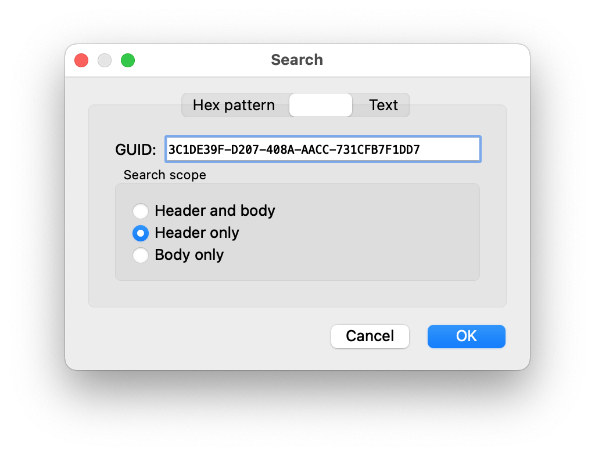
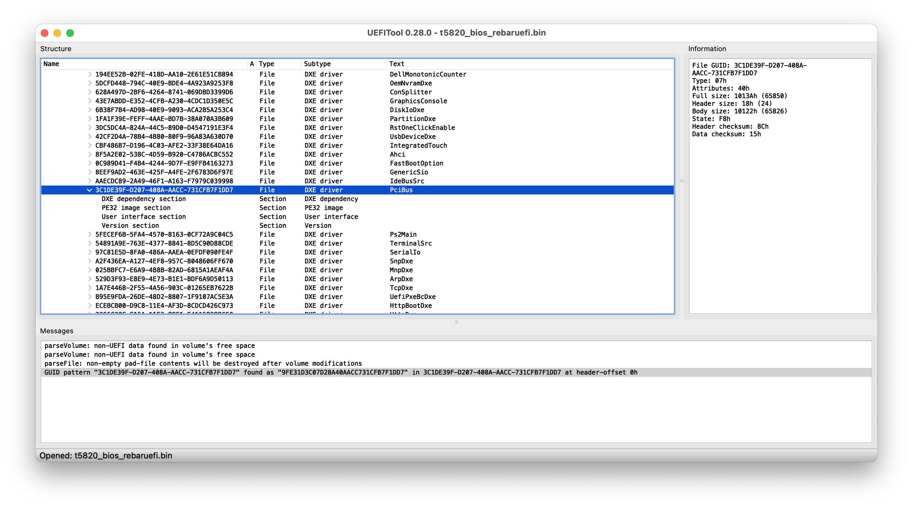
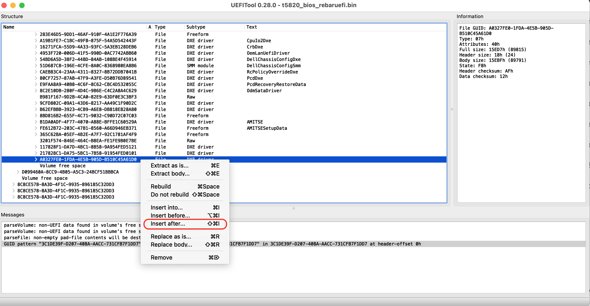
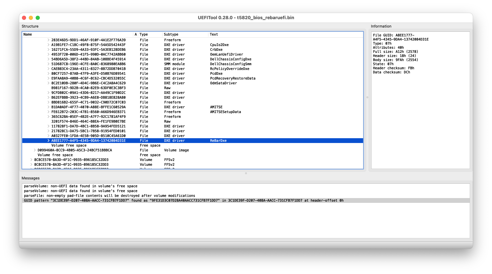

.. _dell_t5820_rebaruefi_again:

===============================================
Dell T5820通过ReBarUEFI工具强制修改BAR(Again)
===============================================

.. warning::

   本文是我再次尝试 :ref:`dell_t5820_rebaruefi` ，但是由于Dell T5820主机内置Boot Guard，对BIOS进行校验，所以修订ReBarUEFI之后的BIOS无法启动主机，本次尝试失败。如果你使用的和我一样的Dell T5820工作站，本文的实践记录仅能提供参考，但无法解决大规格显存的数据中心GPU在T5820上的使用问题。

   最终的解决方法(折腾了好久)其实是更换 :ref:`dell_t5820_mainboard` ，我付出了718元的代价更换第二代主板来解决 :ref:`dell_t5820_gpu` 的异常，非常痛的代价!

准备工作
===========

- 通过 :ref:`flashrom` 获取主机BIOS bin:

.. literalinclude:: dell_t5820_flash_modified_bios/backup
   :caption: 两次执行备份，确保备份的BIOS bin文件正确

- 复制其中一个BIOS bin文件准备进行后续修订:

.. literalinclude:: dell_t5820_rebaruefi/cp_backup1.bin
   :caption: 复制一个新的BIOS文件 ``t5820_bios_rebaruefi.bin`` 待修订

ReBarUEFI
===========

`xCuri0/ReBarUEFI <https://github.com/xCuri0/ReBarUEFI>`_ 提供了 ``ReBarUEFI`` 为官方不支持Resiable BAR的系统提供了一
个UEFI DXE驱动，来实现ReBAR支持。这样就为陈旧的老主机带来了支持最新ReBAR协议的能力，可以安装类似 :ref:`intel_gpu` Arc
系列这样必须使用ReBAR的显卡。

.. note::

   我之前在 :ref:`dell_t5820_rebaruefi` 实践采用了release版本是3年前的旧版本，按照文档执行发现无法启动，所以这次我尝试采用源代码编译方式以便采用最新分支代码，并检验之前的步骤是否存在缺漏或错误。

源代码编译
-------------

完成 :ref:`build_rebaruefi` ，获得:

- ``ReBarDxe.ffs``
- ``ReBarState``

准备
------

- (可选)激活 ``4G Decoding`` : 在BIOS中激活 :ref:`above_4g_decoding` ，没有激活这个选项那么就会被限制在 ``1GB BAR`` 甚至 ``512MB BAR`` ，这种情况下最多可以设置为 ``2GB BAR``
- (可选)BIOS 支持Large BARs : **ReBarUEFI** 能够修复和这个相关的大多数问题

添加FFS模块
==============

修订 ``t5820_bios_rebaruefi.bin`` 需要使用 `LongSoft/UEFITool <https://github.com/LongSoft/UEFITool>`_ ，这是一个图形程序，在Linux环境下需要使用Qt，所以运行环境安装还是比较繁重的，并且在 :ref:`alpine_linux` 下(musl libc)安装比较折腾，需要安装 ``gcompat`` 来运行为glibc编译的Linux预编译包。

为了方便完成，更为简单的方法是在 :ref:`macos` 或 :ref:`windows` 环境使用UEFITool，推荐在Windows平台完成工作，因为 ``MMTool`` 和 ``IFRExtractor`` GUI只有Windows版本

.. note::

   不要下载最新的 ``UEFITool_NE`` 版本，最新的UEFITool只支持查看不支持修改!!!

   只有 `UEFITool non-NE (0.28) <https://github.com/LongSoft/UEFITool/releases/tag/0.28.0>`_ 支持添加模块: 别问我为什么，ReBarUEFI文档是这么写的，我头铁尝试了最新版本， ``Insert after`` 等菜单都是灰色不可用，最后还是乖乖按照文档下载了 指定的 ``0.28`` 版本

   注意，这个 ``0.28`` 版本没有签名，所以需要在 ``System Preferences >> Security & Privacy`` 中设置允许运行这个程序才能使用！

- 使用 UEFITool 打开BIOS文件

- 在UEFITool中使用 ``Search`` 功能，搜索 ``Header only GUID`` 的 ``3C1DE39F-D207-408A-AACC-731CFB7F1DD7`` ，这是 **PciBus** 模块的GUID:

搜索的结果是 ``GUID pattern "3C1DE39F-D207-408A-AACC-731CFB7F1DD7" found as "9FE31D3C07D28A40AACC731CFB7F1DD7" in 9E21FD93-9C72-4C15-8C4B-E77F1DB2D792/.../PciBus at header-offset 00h`` ，此时可以看到在一个 ``PciBus`` 下找到这个GUID

如果没有搜索到任何结果，则可能需要尝试hex搜索 ``CF8034BE`` 或 Unicode text搜索 ``PciBus`` 来定位这个DXE卷。

**如果搜索有2个结果，则需要正在每个卷后面都添加DXE driver** (我的实践只有一个搜索结果)

在这个PciBus所在的Volume的最后就是需要插入 `ReBarDxe.ffs <https://github.com/xCuri0/ReBarUEFI/releases>`_ (<=需要下载该文件)的地方，所以滚动到搜索这个 ``Header only GUID`` 的卷的末尾，选择最后一个 ``module`` 并右击鼠标，选择 ``Insert after`` 菜单:

   在该卷的最后一个模块后面插入 ``ReBarDxe.ffs``

插入 ``ReBarDxe.ffs`` 之后，就可以看到最后增加了一个名为 ``ReBarDxe`` 的模块:

   可以看到卷末尾增加了一个 ``ReBarDxe`` 模块

- 最后使用 ``File -> Save image file`` 保存修改后的BIOS文件，我命名为 ``t5820_bios_rebaruefi.bin``

UEFIPatch
-------------

.. note::

   我在 :ref:`dell_t5820_rebaruefi` 实践中，使用的是几年前Release的 ReBarUEFI 0.3 版本，当时没有Patch和UEFIPatch都尝试了，都没有正确启动 Dell T5820

   所以这次实践前，我查看了issues，看到 `Tesla V100 16G PCIe on Dell Precision 7920T #329 <https://github.com/xCuri0/ReBarUEFI/issues/329>`_ 中，作者xCuri0提示说 ``Dell 7920T should be recent enough to not have the weird issues on older motherboards requiring UEFIPatches.`` 。

考虑到我的 Dell T5820 和 issue 中提到的 T7920 都是2017年发布的:

.. csv-table:: Dell T5820 vs. T7920
   :file: dell_t5820_rebaruefi_again/t5820_t7920.csv
   :widths: 20, 40, 40
   :header-rows: 1

并且两者都是在2019年迎来了第二代 CPU 微码/硬件刷新（T5820 升级支持 Cascade Lake-W 架构的 Xeon W-2200 系列，T7920 升级支持 Cascade Lake 架构的第二代至强可扩展处理器，如 Xeon Gold/Platinum x200 系列）。看起来两者都是同时代的Dell产品，所以我考虑也可能如issue中所述，该产品可能不需要UEFIPatch

.. note::

   询问了gemini，gemini也提示不需要 ``UEFIPatch`` 和 ``DSDT Patching`` :

   - UEFIPatch 的主要作用是利用补丁脚本自动修改 BIOS 文件中的某些特定 C 语言判断分支（例如强行移除某些主板 BIOS 里对 4G 以上解码的硬编码限制，或解除 PCIe 空间分配限制）。

     - 对 T5820 毫无意义：Dell T5820 运行的是 Intel C422 平台，官方 BIOS 在底层本来就原生具备 Above 4G Decoding 的代码与逻辑（只是隐藏或默认分配机制较严）。不需要通过 UEFIPatch 去改写其 DXE 逻辑。
     - 物理挂机的罪魁祸首：UEFIPatch 会直接修改字节码（Bytecode）。在 Dell 这种开启了 Intel Boot Guard (IBB/FIT 校验) 的机器上，改动核心 DXE/PEI 字节码会直接破坏 Hash 值，导致 EC 芯片检测到固件损坏，再次引发之前遇到的黄灯 3 闪死锁。

   - DSDT (Differentiated System Description Table) 是 ACPI 表的一部分，用于向操作系统（Windows/Linux）描述主板硬件资源的分配方式。DSDT 补丁（如添加 Large Memory 窗口）通常用于解决操作系统内提示“资源不足/Code 12/Code 43”的问题。

     - 无法解决“卡自检（POST）”：DSDT 是在 操作系统引导阶段 才由 OS 加载读取的。而 T5820 目前面临的核心瓶颈是插入大显存 GPU 后，主板在 POST 硬件自检阶段就直接死锁，还没到加载 ACPI 表和 OS 的步骤。因此修改 DSDT 对开机自检没有任何帮助。
     - Linux/现代 Windows 的能力：现代 Linux 内核（5.x/6.x）在开启 pci=realloc 时，本身就会动态重构 PCIe MMIO 映射，完全不需要去反编译和硬修改主板的 ACPI DSDT 表。

刷入修订后的BIOS(失败)
========================

.. literalinclude: dell_t5820_rebaruefi_again/flashrom
   :caption: 刷入补充ReBarDxe.ffs的BIOS

然而，很不幸，虽然我仔细核对了步骤以及官方文档，上述刷新BIOS之后，Dell T5820依然出现连续3次琥珀色警告灯闪烁。和之前 :ref:`dell_t5820_rebaruefi` 一样。

咨询了gemini，提示: **Intel Boot Guard（硬件级引导保护）** 是内置在CPU/PCH efuse("电子熔断器", electronic fuse)硬件里的加密技术。开机瞬间，ME(Management Engine)在CPU释放复位信号前，会读取BIOS中的IBB(Initial Boot Block,初始引导块)并对比签名。

虽然我在BIOS .bin文件中插入 ``ReBarDxe.ffs`` 是在卷的空白位置，并确保了整个BIOS文件不增加大小，但是会导致 **BIOS固件校验失败** 。Dell官方BIOS固件在编译时，将DXE卷的头部哈希(Hash)连带写入了FIT（Firmware Interface Table)表中，一旦FIT校验与实际计算值不符，PCH会拒绝释放CPU复位。

.. note::

   **Intel Boot Guard 和 Dell 的硬件级签名锁在物理和密码学层面都是无法关闭或解除的**

   - eFUSE（一次性可编程熔丝）的不可逆性: 在 Dell 主板生产下线时，工厂会将 Dell 官方 RSA 公钥的哈希值（Key Hash）通过高压击穿的方式，永久烧录（Fuse） 到 PCH（芯片组）和 CPU 内部的 eFUSE（一次性可编程寄存器） 中。
   - Boot Guard 的校验发生在 CPU 刚通电、还未读取普通 BIOS 代码的极早期阶段（SEC/PEI 阶段）:

     - 主板通电，微码（Microcode）从 PCH 硬件读取 eFUSE 里硬编码的 Hash 值
     - CPU 提取 BIOS 中 ``IBB`` （Initial Boot Block，初始引导块）的数字签名
     - 如果计算出的签名与硬件 eFUSE 里的 Hash 不匹配，CPU 会立刻拒绝释放复位信号（Reset Signal），硬件直接死锁
     - 由于这个过程发生在任何用户代码执行之前，操作系统、UEFI Shell 或任何设置项都没有机会去"关闭"它

   Dell / HP / Lenovo 品牌机为符合严苛的企业安全规范，出厂时 ``Boot Guard`` 会强制开启状态(Enforcement Mode)。通常只有消费级主板(如华硕、微星、技嘉)在出厂时未激活Boot Guard

下一步
========

既然这次从源代码编译 ReBarUEFI 修改 T5820 BIOS依然失败，原因虽然大概率不是软件原因，但是我依然想要挽救我的这台二手服务器。

gemini提到 **Intel Boot Guard 和 Dell 的硬件级签名锁** 无法关闭，那么一个变通解决的方法是: :ref:`dell_t5820_smbbus_tape_mod_rebar`
