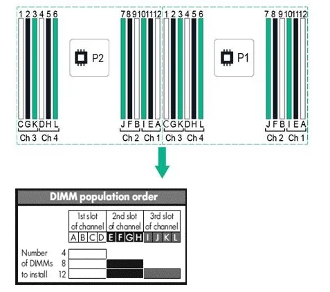

.. _edac:

=========================
EDAC 诊断系统硬件故障
=========================

当前Linux内核和故障检测框架已经转向 Error detection and correction (EDAC) 架构，替代了早期使用的MCE(mcelog)。

.. note::

   EDAC和服务器硬件架构相关，只支持x86架构系统。

mcelog
===============

``mcelog`` 记录了在现代x86 Linxu系统上的硬件的 ``主机检查`` （主要是内存，IO和CPU的硬件错误）日志。当硬件报告了主机自检错误，内核会立即执行操作（例如杀死进程等）然后mcelog就会解码这些错误并且进行一些高级的错误响应，例如屏蔽故障的内存、CPU，或者触发事件。另外，mcelog也能够通过记录日志来处理修正后的错误。

mcelog服务记录 `内存 <http://www.mcelog.org/memory.html>`_ 和 `各种途径 <http://www.mcelog.org/error-flow.png>`_ 搜集的其它错误。

``mcelog --client`` 命令可以用来查询一个运行的 ``mcelog`` 服务。这个服务也可以在可配置的阀值到达时 `触发一些动作 <http://www.mcelog.org/triggers.html>`_ 。这对于一些自动化 `预测故障分析 <http://www.mcelog.org/glossary.html#pfa>`_ 算法：包括 `坏页下线 <http://www.mcelog.org/badpageofflining.html>`_ 和自动化的 `缓存错误处理 <http://www.mcelog.org/cache.html>`_ 。

用户也可以 `配置 <http://www.mcelog.org/config.html>`_ 自己定义的 `动作 <http://www.mcelog.org/triggers.html>`_ 。

所有的错误都被记录到 ``/var/log/mcelog`` 或 ``syslog`` 或 ``journal`` 中。

.. note::

   在线上的实践中，往往会采用日志采集方式，统一采集mcelog日志进行分析，并通过平台触发报警或自动服务器下线维修。上述mcelog自带的trigger机制也不失为一种硬件监控维护手段，可以不用以来统一日志平台，不过，各自服务和组件的独立维护方式可能在小规模或者比较单一简单的应用环境下合适。

``mcelog: warning: 16 bytes ignored in each record``
------------------------------------------------------

在早期的RHEL7/CentOS 7上，有时候执行 ``mcelog`` 会出现如下报错:

.. literalinclude:: edac/mcelog_err
   :caption: 执行 ``mcelog`` 提示需要升级的报错信息
   :emphasize-lines: 1

这个问题在 `Bug 1435338 - mcelog: warning: 16 bytes ignored in each record <https://bugzilla.redhat.com/show_bug.cgi?id=1435338>`_ 有解释，问题出在 mcelog 版本 137 上，上游已经解决，需要升级到 153 版本。

rasdaemon
==============

.. note::

   RAS Daemon( ``rasdaemon`` )是使用EDAC内核驱动实现的HERM(Hardware Events Report Method)，用于替代 ``edac-tools`` 。这个服务作为用户空间工具，可以搜集所有由Linux内核从服务器硬件源头(EDAC, MCE, PCI...)采集到的硬件错误。

   强烈推荐在服务器上部署和运行

以往发行版，如RHEL 5/6 和 arch linux早期版本都提供一个 ``mcelog`` 包包含了mcelog工具，但是这个方式已经不再使用，并且Arch Linux内核不再配置 ``CONFIG_X86_MCELOG_LEGACY`` 选项。现在发行版使用的是 `rasdaemon <https://pagure.io/rasdaemon>`_ ，例如, RHEL 7引入了新的硬件事件报告机制(hardware event report mechanism, HERM)。

arch linux
-----------------

- 安装rasdaemon::

   yay -S rasdaemon

RHEL/CentOS
--------------

- 在CentOS 7上安装 ``rasdaemon`` :

.. literalinclude:: edac/centos_install_rasdaemon
   :caption: 在CentOS 7上安装 ``rasdaemon``

Gentoo
---------

- 在Gentoo平台 ``rasdaemon`` 被标记为unstale，所以需要 ``unmask`` 才能安装(并且建议同时激活 ``sqlite`` 支持):

.. literalinclude:: edac/gentoo_install_rasdaemon
   :caption: 在Gentoo上安装 ``rasdaemon``

使用
---------

rasdaemon可以之际命令启动，此时会在后台运行，并不断通过syslog输出。如果要在前台运行，将日志输出到控制台，则运行:

.. literalinclude:: edac/rasdaemon_run_front
   :caption: 前台运行 ``rasdaemon``

此时输出显示 ``rasdaemon`` 初始化并监听事件，此时就可以等待出现的硬件异常

.. literalinclude:: edac/rasdaemon_run_front_output
   :caption: 前台运行 ``rasdaemon``

如果希望同时将错误记录到数据库(编译时使用了参数 ``--enable-sqlite3``)，则可以增加一个 ``-r`` 参数::

   rasdaemon -f -r

配置rasdaemon
~~~~~~~~~~~~~~~

- 需要启动两个systemd服务: ``ras-mc-ctl.service`` 和 ``rasdaemon.service`` :

.. literalinclude:: edac/centos_enable_rasdaemon
   :caption: 在CentOS 7上激活和启动 ``rasdaemon``

如果在 :ref:`gentoo_linux` 使用 ``openrc`` ，则添加到 **default** run-level:

 .. literalinclude:: edac/gentoo_enable_rasdaemon
    :caption: 在Gentoo上激活和启动 ``rasdaemon``

- 检查服务状态:

.. literalinclude:: edac/systemctl_status_rasdaemon
   :caption: 检查 ``rasdaemon`` 状态

输出信息:

.. literalinclude:: edac/systemctl_status_rasdaemon_output
   :caption: 检查 ``rasdaemon`` 状态
   :emphasize-lines: 32

这里有一个错误提示: ``ras-mc-ctl: Error: No dimm labels for XXXX`` ，实际上在各种服务器上初始时都能看到，需要进一步配置

使用rasdaemon
==================

配置 DIMM labels
------------------

``ras-mc-ctl`` 是RAS内存控制器管理工具，用于执行一些针对EDAC(Error Detection and Correction)驱动的RAS管理任务。

- ``ras-mc-ctl`` 可以查询检测到的错误，例如 ``--error-count`` 可以获取主机错误计数:

.. literalinclude:: edac/ras-mc-ctl_error-count
   :caption: ``ras-mc-ctl`` 使用 ``--error-count`` 获取错误计数

此时输出类似:

.. literalinclude:: edac/ras-mc-ctl_error-count_output
   :caption: ``ras-mc-ctl`` 使用 ``--error-count`` 获取错误计数显示案例

.. note::

   上述 ``--error-count`` 是显示插入了DIMM内存的插槽，没有插内存的DIMM插槽不显示。上述输出是我的 :ref:`hpe_dl360_gen9` 服务器，插入了12根内存，所以显示了12行输出信息。

   我过滤掉分隔字符，仅显示数字::

      0000
      0001
      0010
      0011
      0100
      0110 <= 应该插入 0101 ?
      1000
      1001
      1010
      1011
      1100
      1110 <= 应该插入 1101 ?

   我发现对应数字并没有完全连续，是不是我插错了槽？

``CE`` 列显示了从给定 ``DIMM`` 检测到的可修复错误( ``corrected errors`` )数量； ``UE`` 则表示不可修复错误( ``uncorrectable errors`` )；这里最左边的一列 ``Label`` 表示从 ``/sys/devices/system/edac/mc/`` 中每个DIMM的 ``EDAC`` 路径

要确定哪个DIMM插槽(DIMM slot)对应于哪个 ``EDAC`` 路径，你需要在仅插入一个 ``DIMM`` 的情况下重新启动系统，记录下插入的插槽名称，然后使用  ``ras-mc-ctl --error-count`` 答应出路径，然后比编辑 ``/etc/ras/dimm_labels.d/`` 目录下创建配置文件，格式类似:

.. literalinclude:: edac/ras_dimm_lables_format
   :caption: RAS的dimm_labels配置文件格式

.. warning::

   由于我没有实际采用依次插入DIMM内存来查找插槽和对应的 ``<mc>.<row>.<channel>`` ，这里只是模拟演示。对于生产环境，统一的服务器型号，这个工作只需要完成一次，就可以对线上海量的相同型号的服务器DIMM内存进行监控检查

   具体的方法我在CentOS7的 ``/etc/ras/dimm_labels.d/dell`` 配置文件开头看到注释:

   - 使用 ``dmidecode`` 来获得 Vendor-name 和 model-name
   - 通过物理主板上丝印(silk screen)获得labels: 即你每插入一块内存条，就看一下 ``ras-mc-ctl --error-count`` 输出，就能够知道 ``<mc>.<top>.<mid>.<low>`` 对应物理主板上的哪个DIMM插槽标记

   只要配置好label，今后物理主机DIMM内存一旦故障，就可以根据EDAC输出的labels定位到哪个插槽上的内存故障，就很容易通知IDC机房现场技术支持维修替换

   **很不幸，我没有搜索到 HP服务器的 DIMM labels 配置文件** 网上倒是能够搜索到dell和suppermicro的 ``RASDAEMON Motherboard DIMM labels Database file`` 

- 获取主板厂商和型号名:

.. literalinclude:: edac/ras-mc-ctl_mainboard
   :caption: ``ras-mc-ctl`` 获取主板的厂商和型号

我的二手 :ref:`hpe_dl360_gen9` 服务器输出信息:

.. literalinclude:: edac/ras-mc-ctl_mainboard_output
   :caption: ``ras-mc-ctl`` 获取主板的厂商和型号，这里的案例是我的 :ref:`hpe_dl360_gen9`

- 检查 labels 输出:

.. literalinclude:: edac/ras-mc-ctl_print-labels
   :caption: 检查DIMM输出

此时还没有配置 DIMM labels，显示输出:

.. literalinclude:: edac/ras-mc-ctl_print-labels_output_without_labels
   :caption: 在没有完成 DIMM labels 之前，检查DIMM输出

- 配置 ``/etc/ras/dimm_labels.d/hp`` 内容如下:

.. literalinclude:: edac/hp
   :caption: 配置 ``/etc/ras/dimm_labels.d/hp`` 为DIMM加上标签

- 执行注册label的命令以便和内核识别的插槽对应起来:

.. literalinclude:: edac/ras-mc-ctl_register-labels
   :caption: 注册label

.. warning::

   上述我配置HP DL360 Gen9 的 ``RASDAEMON Motherboard DIMM labels Database file`` 是 **错误的** ，只是为了演示，请不要照抄

   实际上需要一一核对DIMM标记和内核识别的Label才能正确标记好这个配置文件

此时再次检查 labels 输出:

.. literalinclude:: edac/ras-mc-ctl_print-labels
   :caption: 检查DIMM输出

就会看到增加了label标签的DIMM输出(后续DIMM内存故障就容易找到对应问题了):

.. _hpe_dl360_gen9_memory:

HP DL360 Gen9 内存插入顺序
=============================

根据HP的文档 :ref:`hpe_dl360_gen9` 是 4个 Channel ，所以官方文档推荐安装内存条的时候，要按照 ``ABCDEFGHIJKL`` 顺序安装(其实就是先安装白色槽，其次是黑色，最后是绿色)，见下图(参考 `Help with HP DL360 Gen9 memory configuration <https://www.reddit.com/r/homelab/comments/xt37v6/help_with_hp_dl360_gen9_memory_configuration/>`_ )，这样才能确保内存通道均衡:

   HPE DL360 Gen9 内存插槽顺序

参考
======

- `mcelog官方网站 <http://www.mcelog.org>`_
- `Linux x86_64: Detecting Hardware Errors <http://www.cyberciti.biz/tips/linux-server-predicting-hardware-failure.html>`_
- `mcelog: memory error handling in user space <http://www.halobates.de/lk10-mcelog.pdf>`_
- `Machine-check exception <https://wiki.archlinux.org/index.php/Machine-check_exception>`_
- `GitHub: RAS Daemon <https://github.com/mchehab/rasdaemon>`_
- `Monitoring ECC memory on Linux with rasdaemon <https://www.setphaserstostun.org/posts/monitoring-ecc-memory-on-linux-with-rasdaemon/>`_
