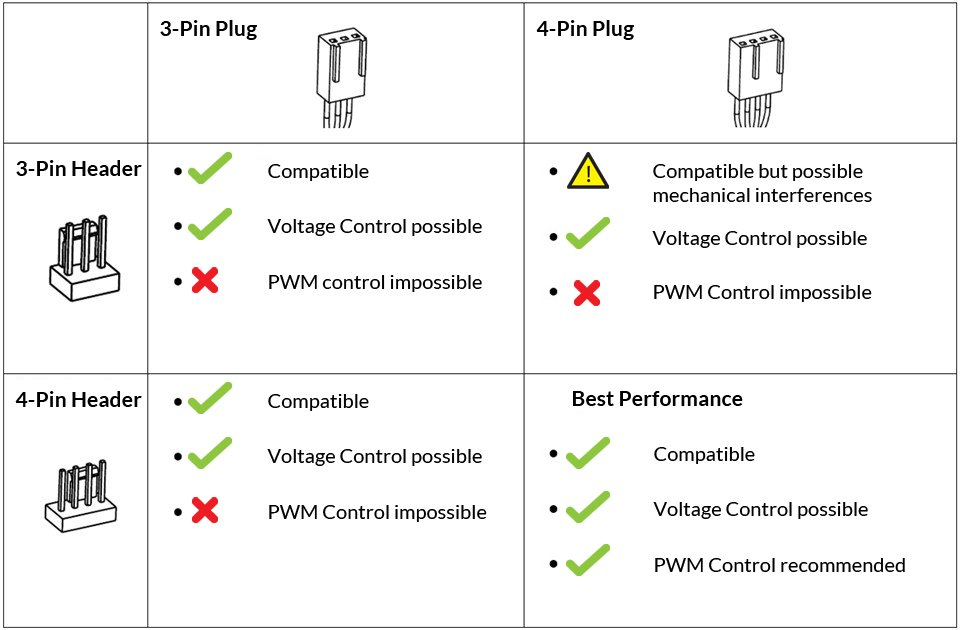

.. _fan_control:

=====================
风扇控制
=====================

我现在组装的 :ref:`freebsd` 服务器安装了多块 :ref:`nvidia_gpu` / :ref:`amd_gpu` ，通过改装的第三方散热器压制GPU温度。这带来一个困扰:

- 涡轮风扇和机架式服务器上气流风扇一样，噪音惊人无法在家用环境中直接使用
- 需要根据GPU实际负载(温度)来控制风扇转速，避免idle情况下噪声过大

.. note::

   目前我在寻找一个合适的方法来侦测和控制风扇转速，实现的环境是FreeBSD，并且主要是控制GPU散热风扇，并且我需要分别控制主板上3个不同的风扇PWM。理想的状态是根据采集的GPU核心温度进行动态调整，而不是固定调整BIOS中的风扇转速。

   这里先汇总查找的资料信息，进行对比验证

我的组装机使用的是AMI BIOS， :ref:`nasse_c246` 使用了 :ref:`intel_c246` :

- AMI BIOS的PWM值从0到127，其中 ``127 PWM`` 是100%风扇转速
- PWM通过电压来调整，我购买的一个配套 :ref:`tesla_p4` 的散热器，卖家提供了一个温控风扇，温度检测头直接插在散热片靠近GPU核心处检测温度，无需软件自动调整(温度上升自动反馈调整电压)

风扇连接类型
===============

- 三针风扇: 通常是固定转速风扇，不过如果主板允许，还是可以实现电窑控制，只不过没有PWM控制那么有效率，最低速度也不能做到PWM控制那么低

- 四针风扇: 通过PWM控制风扇钻书，提供了安静模式下更低的转速

三针和四针的插座相互兼容，但是有一些限制:

.. note::

   这里说明采用铭瑄主板的文档，其他厂商可能类似也可能不同(我这里主要是为了参考借鉴)

在主板上会印刷上 ``CPU_FAN`` 这样标记的连接插座，如果有 ``CPU_OPT`` 插座，则是CPU散热器的第二个风扇插座

风扇转速控制原理
=================

.. note::

   这段以我学习和整理为主，需要不断完善补充

风扇转速是通过电压来调整，控制逻辑:

- 通过 :ref:`ipmitool` (如果主板支持ipmi)的 ``sensor`` 来获取芯片温度，在达到一定范围时按照设定逻辑程序发出指令
- :strike:`指令控制BIOS调整风扇连接器输出的电压，来控制PWM的风扇转速` BIOS并不控制风扇转速，而是通过特定芯片完成:

  - 笔记本系统使用 EC (16位芯片，类似服务器的BMC)
  - 服务器使用 BMC
  - 台式机使用 EC、ME 等

- CPU内部的DTS（Digital Thermal Sensor）会把CPU内核温度反映到MSR中去，访问MSR可以知道CPU内部的温度(带内)
- 带外设备可以通过 PECI (platform environment control interface)读取CPU内部信息，这样带外设备就可以探知CPU内部DTS的温度信息

目前CPU，GPU都提供了非常方便的温度检测命令，所以获取主要芯片的温度值比较容易实现；难点是找到控制BIOS的入口，目前我还在找寻。当然正规的服务器，例如 :ref:`hpe_dl360_gen9` 提供了 :ref:`hp_ilo` 这样的BMC控制，可以通过指令(甚至通过ssh通道直接使用命令)。

我现在遇到的一个困难是，我的组装机使用了一个杂牌主板 :ref:`nasse_c246` ，虽然BIOS是AMI这种非常主流的BIOS，但是我没有资料来控制风扇转速。或许有什么通用的AMI编程接口？

Windows平台有一个免费的 `Fan Control <https://getfancontrol.com/>`_ 软件，后端监控部分使用了开源的 `LibreHardwareMonitor <https://github.com/LibreHardwareMonitor/LibreHardwareMonitor>`_ ，但是我不清楚它如何实现控制。

参考
========

- `PWM Slope Setting <https://forums.freebsd.org/threads/pwm-slope-setting.88552/>`_
- `ARCTIC support: How to do your fan PWM settings properly. <https://support.arctic.de/en/pwm-settings>`_ 铭瑄主板的支持文档
- `How to Change Fan Settings if Bios' Power Options Are Hidden <https://www.wikihow.com/Change-Fan-Settings-if-Bios%27-Power-Options-Are-Hidden>`_ 介绍了通过BIOS，第三方软件(windows版)以及硬件的PC FAN Controller控制风扇转速(淘宝有卖)
- `谁在控制CPU风扇转速？什么是DPTF? <https://mp.weixin.qq.com/s/MA39fy2PfXD4g2c2p8C7gA>`_
