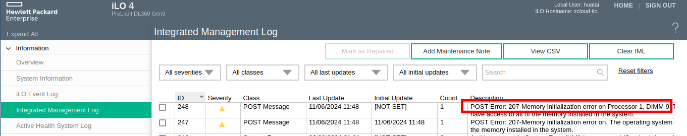
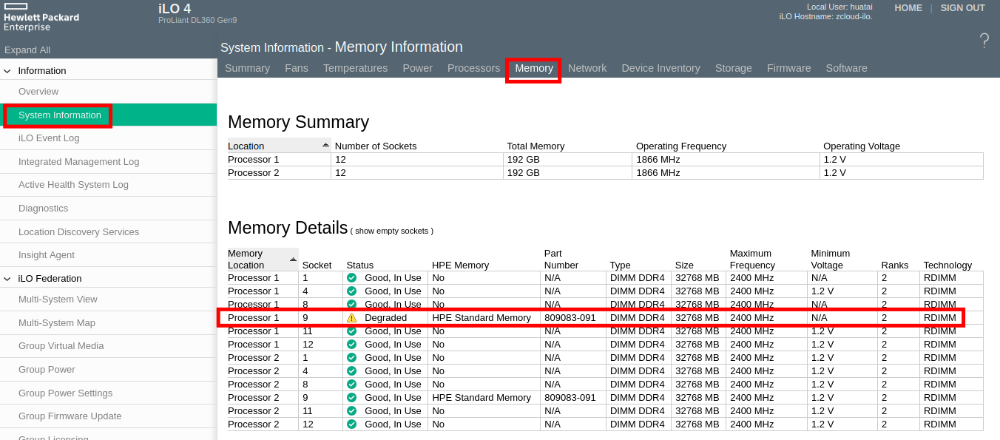
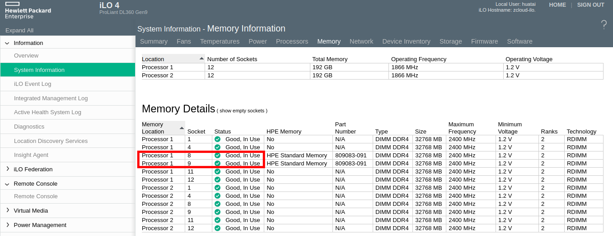

.. _dl360_gen9_pci_bus_error:

=====================================
HPE DL360 Gen9服务器PCI Bus Error
=====================================

.. warning::

   服务器适合长时间加电运行，不适合反复开关:

   我感觉二手服务器尤其脆弱，不适合长时间关机。

我的 HPE DL360 Gen9服务器 是2021年9月购买，算起来持续使用了2年半。不过，最近半年因为失业( :ref:`whats_past_is_prologue` )外出旅行，所以关机了半年。这应该是这台受到伤害的最大原因，受到上海潮湿闷热天气的折磨之后，终于在今天开机出现了严重的错误告警:

从 ``Integrated Management Log`` (CSV格式)可以看到:

.. csv-table:: HPE DL360 gen9服务器PCI总线错误日志
   :file: dl360_gen9_pci_bus_error/integrated_management_log.csv
   :widths: 10, 10, 20, 10, 10, 10, 30
   :header-rows: 1

太不幸了，两个月前还正常启动的服务器罢工了...

排查
=======

- HP服务器的 :ref:`hp_ilo` 提供了非常方便的图形管理，通过检查管理日志可以看到错误集中在 ``Processor 1`` 的两个内存插槽上 ``DIMM 8`` 和 ``DIMM 9`` ，这表明要么是内存条故障了，要么是内存接触不良:

  - 考虑到同时出现两根内存条硬件故障可能性较低，所以我倾向于是内存条插入连接不良，也就是通过内存条重新插拔可能能够解决这个问题

- 需要注意 :ref:`hpe_dl360_gen9_memory` 顺序:

.. figure:: ../../../../_static/linux/server/hardware/hpe/hpe_dl360_gen9_memory.webp

   HPE DL360 Gen9 内存插槽顺序

- 重新多次插拔出现报错的DIMM 内存，然后重新开机。果然，系统内存检测就完全正常，从 :ref:`hp_ilo` 的 ``System Information >> Memory Information`` 查看，可以看到刚才报错的DIMM内存条已经正常工作(状态 ``Good, In Use`` :

