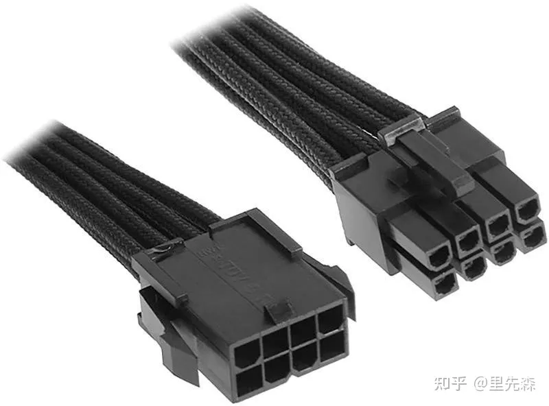
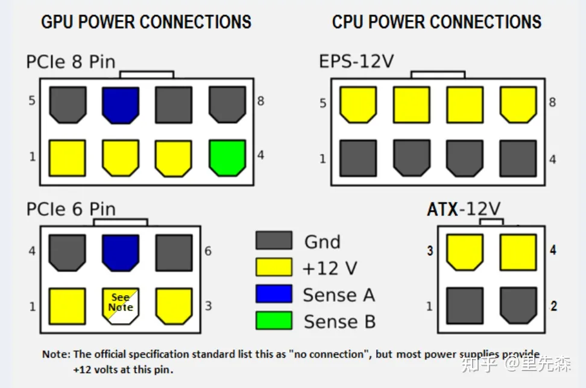
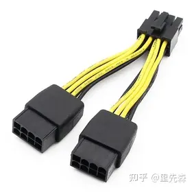
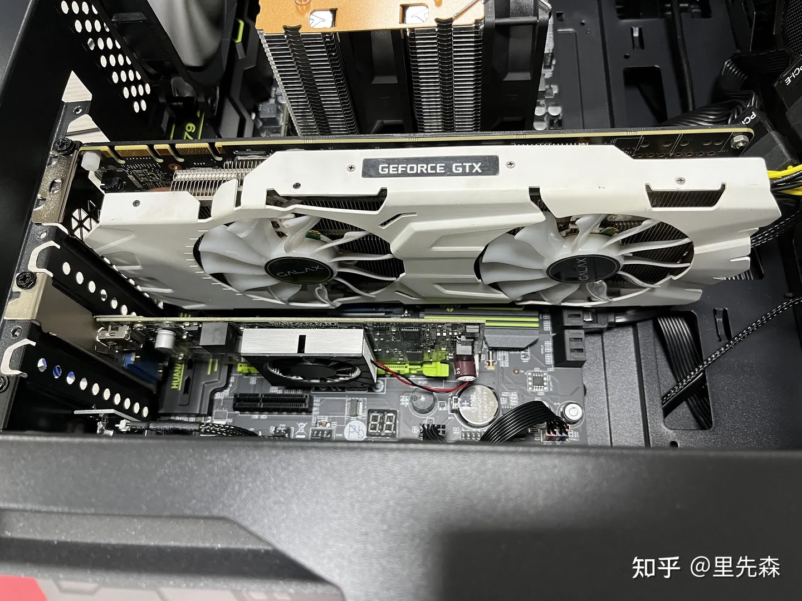
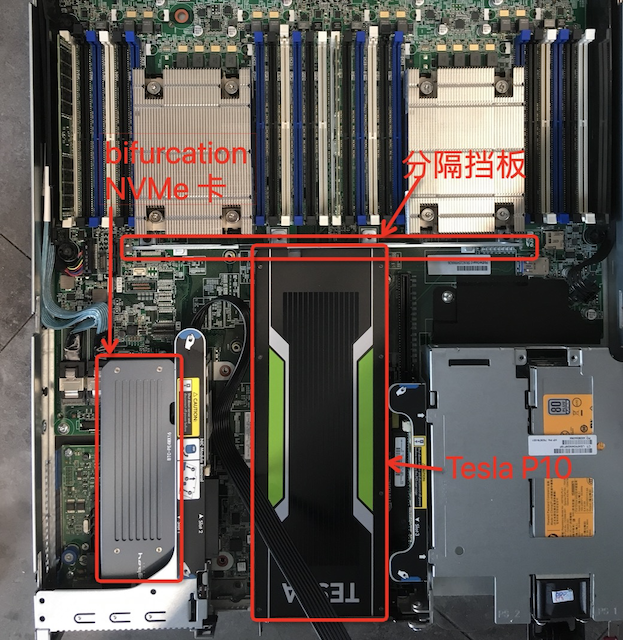
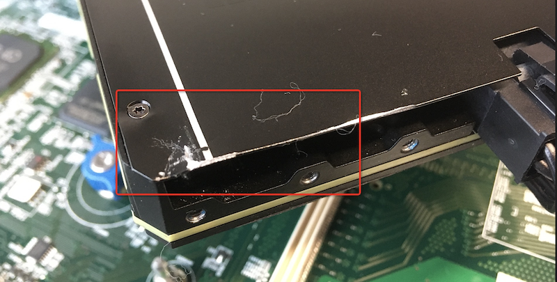
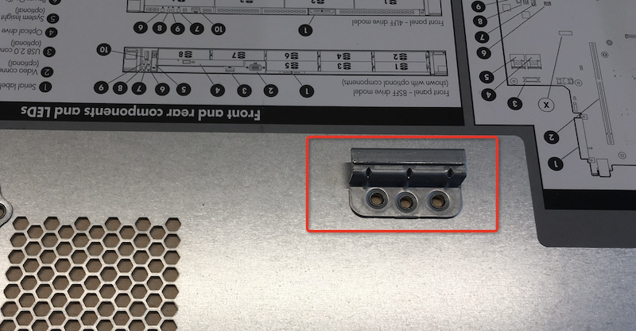

.. _dl360_tesla_p10:

==========================================
HPE DL360 Gen9安装NVIDIA Tesla P10运算卡
==========================================

.. warning::

   HPE DL360 Gen9是内部空间狭窄的 1U 机架服务器，对于安装扩展卡或者GPU卡非常不方便。因为现今的主流NVIDIA显卡都是耗能大户，需要极大的散热空间，所以体积巨大。常见的GPU卡都是双槽位大卡，根本无法安装到1U服务器内部。

   我选择的NVIDIA Tesla P10是少数单槽位刀卡，但是依然长度惊人，达到了 ``267mm`` 长度，恰好是DL360 Gen9内部PCIe 3.0 Slot 1 和 Slot 3安装的极限尺寸。

   实际上，由于GPU卡还需要外接电源，电源线需要占据空间，导致我不得不拆除机箱内部挡板，实际上这个步骤带来了一个意想不到的失误，差点搞坏了机箱和GPU运算卡...

我在购买Tesla P10之前，一直担心在 :ref:`hpe_dl360_gen9` 上安装空间不足。根据淘宝买家介绍的显卡安装案例 ``Quadro K4200 4GB 图形显卡`` 广告中声明 ``支持显卡的最大尺寸：长*宽*高 25*2*11 cm（由于机器是1U尺寸机箱 所以只能插刀卡）`` 。按照 `techpowerup GPU Database - NVIDIA Tesla P10 <https://www.techpowerup.com/gpu-specs/tesla-p10.c3750>`_ 资料， 长宽是 ``267 mm x 97 mm`` 。

按照查询资料，似乎测量板卡尺寸各有不同，有些测量没有包括板卡的固定板，有的则包含，所以尺寸测量实际上是一个迷。我查询了很多Nvidia的GPU卡，发现大量的GPU卡公开资料都显示长度是 ``267 mm`` ，也就是说，这个长度尺寸是标准尺寸。服务器和PC都是标准化设备，有可能还是可以安装(即使看上去只差一点点)。

我仔细测量了一下可能安装GPU卡的Slot1和Slot3安装空间，发现似乎可以放入长度 ``267mm`` 的卡，所以，抱着试一试的心理，还是冒险下单购买了 :ref:`tesla_p10` 。

电源线
=====================

Tesla P10买家是通过顺丰空运，第二天晚上就拿到了，安装到 DL360 Gen9的狭窄1U机箱，果然如我所推测， :strike:`尺寸正好` 尺寸正好能够 "严丝合缝" 安装到 Slot1 或者 Slot3 的 PCIe 3.0 x16 插槽。

但是，遇到一个问题，Nvidia的GPU卡需要外接电源，而DL 360内部没有这个电源线。(后面我还要说因为这个外接电源带来的困扰和失误)

:strike:`问了卖家，这个电源线就是PC机的标准8-pin电源线` (实际不是)。

Tesla计算卡使用EPS供电接口，这个接口是服务器通用接口，通常在主板Raiser上提供。下图是 EPS 8pin 连接线接头:

在HP DL360 gen9的 ``Primary PCIe 3.0 riser for PCIe slot 1 & 2`` (对应CPU 1) 的电路板背面(靠近 slot2)有一个象牙色的电源出输出(8-pin)，可以安装EPS 8pin电源线(上图)输出电流给显卡使用。

下图是PCIe Slot 1 & 2板上电源接口(部件翻转过来看):

.. figure:: ../../../../_static/linux/server/hardware/hpe/dl360_gen9_pcie1.png
   :scale: 70

需要注意EPS 8pin供电接口和普通家用的PCIe供电口不同(通常用于消费级显卡): 下图是PCIe 8pin接口和 EPS 8pin接口 差异比较

对于家用台式机安装数据中心Tesla计算卡，通常需要使用PCIe转EPS接口电源转接线，将两个PCIe电源作为输入来提供GPU计算卡外接电源:

我最初不知道EPS电源线规格(这也是最近和网友jinghuashang交流才注意到的)，好在万能淘宝上能够找到 ``DELL R720 双8针 独立显卡 供电线 8针供电 8P 6+2`` ，虽然卖家反复强调这根电源线只能用于Dell服务器，但是当时(一年前)苦于无法找到HP服务器的显卡供电线，我仔细对比观察了 ``Dell R720 双2针`` 的接口，看起来是标准电源线接口，和我的HPE DL360 Gen9的 ``Primary PCIe 3.0 riser for PCIe slot 1 & 2`` 电源输出接口完全匹配。

考虑到PC服务器大多是标准通用部件，所以我推测Dell的电源线也可以用于HP服务器。价格不贵，10元，但是我也非常担心加电以后错误输电导致显卡或主板烧毁。毕竟，现在显卡实在太昂贵了...

收到显卡电源线之后，仔细检查了 ``PCIe 3.0 riser`` 的电源输出和 Tesla P10 电源输入，确认接口完全一致。连接以后，确实完全匹配。一咬牙，加电启动...还好，没有出现短路或者烧焦的现象出现。

散热
=======

Tesla系列计算卡大多数是被动散热设计，原因是计算卡都是安装在数据中心服务器上，可以利用机架服务器机箱内的暴力风扇提供充足的散热气流(你可以看到计算卡的两头贯通有一排风洞)。

.. note::

   我之前有过 :ref:`think_server_fanless` ，但是和网友jinghuashang交流了解到如果不盖机箱盖，Tesla M40计算卡因为没有散热气流快速升温。所以对于GPU这种高能耗设备，可能较难实现 :ref:`server_fanless` 。可能的解决方案也许就是改造为主动散热，或者降频(浪费硬件资源)

`Tesla M40\P40 训练机组装与散热改造 <https://zhuanlan.zhihu.com/p/536850498>`_ 原文是在家用电脑上安装Tesla计算卡。因为家用电脑没有数据中心服务器那样的气流散热，所以需要改造计算卡的散热结构，通过加装主动散热风扇来解决。虽然我暂时用不上这个方案，但是也觉得很有借鉴: 采用 ``影驰 GTX 1080Ti 大将 (GALAX GTX 1080Ti EXOC)``
散热风扇(淘宝售价当前大约为66元)，改装效果如下:

.. note::

   `Tesla M40\P40 训练机组装与散热改造 <https://zhuanlan.zhihu.com/p/536850498>`_ 提到的几个散热风扇改装方式，可以在油管的 `Craft Computing: How do you cool an nVidia Tesla GPU? <https://www.youtube.com/watch?v=WfKQP2sARGY>`_ 看到视频博主的演示

安装位置
=====================

虽然 :ref:`hpe_dl360_gen9` 提供了2个 PCIe 3.0 x16 插槽，也就是 Slot1 和 Slot 3，看上去位置都能够满足安装 Tesla P10 这样尺寸的刀卡，但是，由于需要在有限的PCIe插槽上安装多个 :ref:`nvme` 来实现分布式存储 :ref:`ceph` ，必须通过 :ref:`pcie_bifurcation` 实现。在 :ref:`hpe_dl360_gen9` ，仅有 Slot 1 支持 :ref:`pcie_bifurcation` (虽然只能一分为二) ，所以限制了只能将GPU运算卡 Tesla P10安装到Slot 3。

经过安装尝试，确实能够将 NVIDIA Tesla P10 GPU运算卡安装到Slot3，见下图: 请注意，在服务器内部的前半边CPU和后半边扩展卡安装位的中间，有一个 ``分隔挡板`` ，埋下了 ``我的失误`` 的隐患:

请注意，由于 :ref:`tesla_p10` 运算卡的长度达到 ``267mm`` ，边缘已经紧贴着 ``分隔挡板`` 。此时要为GPU卡插上 ``电源线`` ，就不得不拆除掉金属制作的 ``分隔挡板`` 。

事实上，我不知道这个分隔挡板的用途，其实服务器内部 ``每个部件都是有其特有用途的`` 。拆除了 ``分隔挡板`` 后，果然可以勉强把GPU运算卡的外接电源线插上了(需要一点空间)。一切看起来十分完美，我完成安装后合上机箱盖板，加电运行。

OK，一切正常，GPU运算卡在操作系统启动后能够正常识别...

等等，机箱盖板...
=====================

然而，第二天，当我想要替换安装NVMe存储时，突然发现一个 ``糟糕`` 的现实： :ref:`hpe_dl360_gen9` 服务器的机箱盖板无法打开了。无论我如何用力，甚至掰断了盖板上的开盖开关，动用了螺丝刀敲棒等手段...

整整折腾了2天，终于在不断尝试下(还试过用小钢锯锯掉机箱边缘的卡扣)，机箱上盖终于 ``嘎吱`` 一下被打开了...

检查之下，意外发现，Tesla GPU运算卡的边缘出现了一点扭曲变形，这是为何？

原来，在 :ref:`hpe_dl360_gen9` 有一个 ``L`` 形的 ``搭扣`` ，这个搭扣就是在机箱盖板合上并推向合拢时勾在 ``分隔挡板`` 中间的孔洞中的。

由于我的Tesla P10卡长度过长，边缘紧贴着 ``分隔挡板`` ，所以这个搭扣在机箱盖合上时候，其实已经压到了 Tesla P10 运算卡的边缘上。所以，当机箱盖需要反向推移以便打开时，这个搭扣恰好抵在 Tesla P10 运算卡 上无法移动。这也就是为何机箱盖板再也打不开的原因。实际上，打开机盖的力气都通过 ``搭扣 => Tesla P10预算卡 => PCIe Slot 3 => 机箱主体`` ，随后都卡死了。

还好，最后总算幸运打开，只是这番折腾，把 Tesla P10运算卡的散热盒边缘挤变形搞坏了。

既然找到了机盖无法打开的原因，接下来就是用老虎钳拆掉这个 ``罪魁祸首`` 搭扣:

.. figure:: ../../../../_static/linux/server/hardware/hpe/dl360_cover_1.png
   :scale: 70

GPU需要服务器large bar内存
============================

硬件安装完成后，首次启动会发现BIOS报错，显示GPU请求太多内存超出限制。这里需要 :ref:`dl360_gen9_large_bar_memory` 配置完成才能正常识别GPU运算卡。之后，我们才能开始进一步 :ref:`vgpu` 以及 :ref:`iommu` 等虚拟化配置。

参考
=======

- `Tesla M40\P40 训练机组装与散热改造 <https://zhuanlan.zhihu.com/p/536850498>`_
