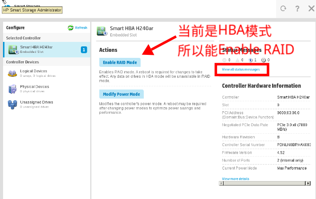
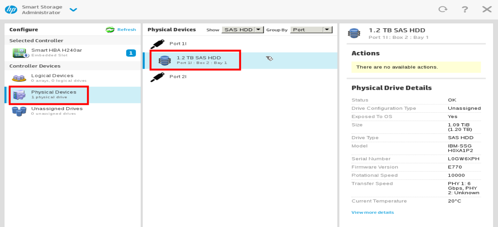
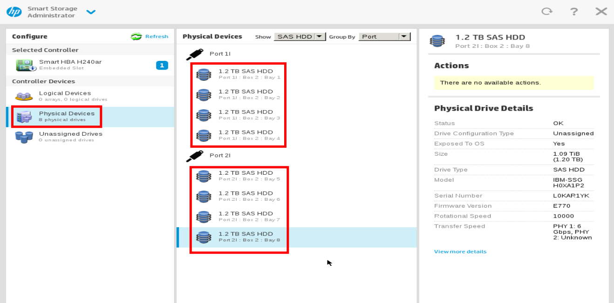

.. _h240ar:

======================
HPE H240ar 存储阵列卡
======================

我最初为了能够在 :ref:`hpe_dl380_gen9` 上安装和使用SAS机械硬盘，购买了 :ref:`p440ar` ，但是很不幸买到的二手卡有硬件故障。考虑到我主要采用 :ref:`zfs` 而不依赖主机硬件RAID，所以 :ref:`p440ar` 设置的是HBA直通模式，这带来以下不足：

- 完全浪费了硬件RAID功能，而且p440ar的复杂的ROC芯片缓存逻辑，可能会因为没有电池或缓存故障导致宕机
- p440ar卡的硬件RAID功能在没有电池支持时会报错并且导致降速
- p440ar卡的发热量较简化的HBA卡大，对机箱狭窄的DL380不利

实际上市场上有大量LSI 9211-8i 或 LSI 9300-8i HBA卡，是一种非常适合 :ref:`zfs` 这种不需要硬件RAID的 ``IT Mode固件卡`` :

- LSI 隶属于 broadcom (博通): 绝大多数阵列卡（包括 :ref:`p440ar` ）底层用的其实都是 LSI 的芯片
- IT Mode 固件: 标准的 LSI 卡通常带 RAID 功能（IR Mode）; "IT Mode" (Initiator Target) 是一种特殊的固件，它彻底抹去了 RAID 逻辑直接把硬盘交给操作系统，非常适合 :ref:`zfs` 使用
- 需要注意第三方LSI卡可能会导致 :ref:`hp_ilo` 无法读取硬盘温度，这会导致服务器风扇强制拉高到 40%-60%，产生巨大的噪音

我最后退掉了故障的 :ref:`p440ar` 改为非常廉价的 **HPE H240ar** :

- 淘宝二手最低只需要 15RMB
- 和 :ref:`p440ar` 一样，不需要额外占用 PCIe 槽，不需要换 SAS 线
- HPE 原厂卡，iLO 能识别(避免风扇噪音)
- 没有复杂的 ROC 芯片缓存逻辑，不会像 P440ar 那样因为没电池或缓存故障而导致 ROC 1 宕机
- 发热量比 P440ar 低得多

.. warning::

   很不幸，我在 ``H240ar`` 卡连接二手的IBM日立硬盘上折腾了好几天，都没有搞定磁盘初始扫描识别问题。看来不同厂商的SAS硬盘确实有兼容性问题(HBA卡会挑剔SAS硬盘的原厂特征？），我准备后续换成 :ref:`p440ar` 卡再做尝试。

直通（HBA）模式
=================

H240ar 支持两种工作模式：RAID Mode（简单的硬件 RAID 0/1/5）和 HBA Mode（纯直通）

针对 :ref:`zfs` 需要确保H240ar使用 **HBA Mode**

安装和初始化
-------------

我在 :ref:`hpe_dl380_gen9` 上安装了 ``p240ar`` 之后，启动服务器，通过 :ref:`hp_ilo` 管理界面的 ``System Inventory`` 界面可以看到 ``Embedded Smart HBA H240ar`` 并且看到固件版本是 ``4.52`` ，初步证实了这块 ``H240ar`` 硬件是工作正常的。

如上所述，我需要将购买的8块二手SAS硬盘初始化并切换为 **HBA模式** (直通模式，Passthrough)，所以在启动服务器看到 HP Logo提示时按下 ``F10`` 进入 ``Intelligent Provisioning`` 。

但是，我的实践遇到一个异常问题:

- 8块SAS硬盘指示灯一直显示绿色的旋转硬盘图案
- Intelligent Provisioning 并没有如预期那样进入管理的 Smart Storage Administrator (SSA) 界面

gemini提示: 硬盘灯“旋转”表示控制器正在进行后台扫描（Discovery），但 Intelligent Provisioning（IP）没反应，通常意味着固件版本冲突或IP 分区损坏。

由于我的硬盘是二手的IBM服务器上拆下的日立硬盘，购买的二手 ``p240ar`` 原先可能也有RAID旧配置，这导致两者不能匹配，Intelligent Provisioning(IP)一直在扫描硬盘，并试图根据旧硬盘上的 **RAID Metadata（元数据）** 重组一个不存在的阵列。

尝试一: “离线版”SSA
---------------------

由于F10的Intelligent Provisioning(IP)界面卡住，所以采用在服务器启动时，屏幕出现 ``Smart HBA H240ar...`` 的初始化文字时，立即点击 ``F5`` ，尝试进入该控制器独立 SSA 界面(不依赖硬盘上的 IP 分区，加载速度最快)

.. warning::

   这个方法虽然是gemini推荐的，但是我实践没有成功。系统启动时候，实际上8块SASA盘一直在显示旋转图案进行扫描，而且屏幕没有出现 ``Smart HBA H240ar...`` 这样的提示，所以按 ``F5`` 并没有效果，而是直接进入了操作系统。看起来系统是认为阵列卡出问题跳过了初始化

我首先尝试了这个方法，但是很不幸，启动时硬盘指示灯疯狂旋转，H240ar卡并没有初始化成功(在启动POST街面上没有出现 ``Smart HBA H240ar...`` 信息。所以，我继续下面的尝试

尝试二: 冷启动与物理复位
---------------------------

既然硬盘灯一直在选装，说明控制器在扫描硬盘信息而无法完成初始化。所以尝试:

- 关机
- 先拔掉一直在扫描的硬盘，然后再开机
- 按 ``F10`` 尝试进入 Intelligent Provisioning(IP): **果然成功进入** ，然后选择 ``HP Smart Storage Administrator``

.. figure:: ../../../../_static/linux/server/hardware/hpe/ssa.png

- 我发现我购买的二手 ``H240ar`` 就是HBA模式，因为此时能够 ``Enable RAID Mode`` ，而且在启动日志中也看到:

.. literalinclude:: h240ar/hba_mode
   :caption: 状态日志显示为HBA模式

- 现在热插入一块 SAS 硬盘，此时因为Smart Array Administrator已经运行不再因为磁盘扫描导致无法进入，所以此时在管理界面中点击 ``Refresh`` 就会看到 ``Physical Devices`` 显示出新插入的磁盘:

- 需要检查每块磁盘，确保8块磁盘的状态都是 ``Unassigned`` (未分配)，因为HBA模式下，硬盘不能属于任何 ``Array`` 或 ``Logical Drive`` 

  - 如果某块硬盘上显示有 ``Foreign Configuration`` 或 ``Existing Legacy RAID`` ，则需要选中该硬盘，并执行 ``Erase Drive``
  - 如果不清除残留的RAID信息，重启后H240ar可能会再次因为尝试读取残留信息而卡在开机自检阶段

   一块块热插入磁盘后识别(HBA模式)

看起来一切正常，我尝试关机重启

然而很不幸，再次出现硬盘指示灯疯狂旋转，但是无法识别出HBA和磁盘(进入Ubuntu之后用 ``lspci`` 看不到 ``h240ar`` 卡

尝试三: 解决IBM硬盘和HP的h240ar卡兼容性
------------------------------------------

目前的现象是 **空载能识别，带盘启动就消失（lspci看不到）** ，这个现象表明问题出在 ``PCIe Enumeration Failure`` (PCIe 枚举失败) :

当 H240ar 插着硬盘启动时，它在尝试初始化（Option ROM 加载）阶段因为与 IBM 日立硬盘的固件握手失败，导致控制器的固件锁死或响应超时。主板 BIOS 认为这个 PCIe 设备已损坏或非法，为了保护系统启动，直接在物理层关闭了该 PCIe 通道的电源或信号连接。

此时在Ubuntu系统里使用 ``lspci`` 看不到 ``h240ar`` HBA卡

强制兼容
~~~~~~~~~~

.. warning::

   这步HBA卡设置实际上我没有执行，因为当前 ``h240ar`` 卡已经是HBA模式。由于禁用了所有RAID堆栈，所以BIOS级别的负载设置菜单都被隐藏了。

- 修改HBA卡启动行为: 在热插拔进入 SSA 界面后，需要关闭一切会导致开机扫描的“高级功能” (注意：**在HBA模式下这些高级功能看不到** ) :

  - **关闭 Boot Support** : 在 SSA 中找到控制器的 ``Modify Controller Settings`` ，将 ``Boot Support`` 设置为 ``None`` 或 ``Disabled``
  - **关闭 Drive Write Cache** ：IBM 拆机盘的缓存策略有时会导致延迟过高，先将其全部关闭
  - **检查 Surface Scan** ：确保没有开启开机自动表面扫描

- (未执行)BIOS强制PCIe类型: HP Gen9 服务器的 PCIe 插槽通常有“自动（Auto）”协商功能，设置为较低的 Gen 2速率有助于更宽松的信号时序要求，能容忍老旧 SAS 硬盘初始化时的电气干扰

- gemini给了一个有关 “IBM/日立拆机盘” 的特性: 即便 SSA 能“看到”它，如果它是 520/522 字节格式，它的固件在初始化时会向控制器发送特定的 SCSI 指令。H240ar 如果无法理解这些非标准的指令，就会一直尝试重试（Retry），表现为灯转圈

  - 这种方式需要尝试不插硬盘，进入ubuntu系统，然后在能够识别 ``h240ar`` 卡情况下，热插入硬盘，然后通过低级格式化来将硬盘格式化成 ``512`` 字节格式
  - 不过我的实践发现没有插硬盘进入ubuntu也看不到 ``h240ar`` 卡

``Legacy BIOS Option ROM`` 和 ``UEFI Optimized Boot``
=======================================================

兜兜转转，gemini提到了 UEFI 启动模式:

``H240ar`` 是一块古老的整列卡，依赖CSM (Compatibility Support Module)里的 **Legacy BIOS Option ROM** 向系统上报 PCIe 信息!!!

gemini提到了之前我和他讨论 :ref:`intel_arc_a770_graphics_16gb` ，这种现代GPU显卡 **强制要求** ``关闭 CSM (Compatibility Support Module)`` 才能正常工作。巧了，我之前为了 :ref:`iommu` 设置 :ref:`ovmf_gpu_nvme` ，并且也为了能够使用现代化的GPT分区表，都是采用UEFI模式来配置BIOS的。而且为了干净，我往往会关闭掉 CSM (Compatibility Support Module)。

gemini建议 **尝试混合模式** :

- 进入 F9 -> Boot Options，设置 ``UEFI Optimized Boot = Disabled``

但是，我启动以后发现Ubuntu中还是看不到 ``H240ar`` 

.. warning::

   更改服务器 UEFI 模式会导致之前以 UEFI 模式安装的操作系统不能启动，所以切换模式需要谨慎。

不过，我发现在BIOS的设置中( 按 F9 进入 System Utilities -> System Configuration -> BIOS/Platform Configuration (RBSU) )，能够看到这块 ``H240ar`` 卡，并且其firmware版本中有一个UEFI的版本，看起来这个HBA卡是支持UEFI模式的。

可能存在MMIO地址空间冲突
-------------------------

检查系统dmesg日志，会看到一些ROM设置报错:

.. literalinclude:: h240ar/dmesg_error
   :caption: 启动日志中设置pci地址报错

上述PCIe资源（内存地址空间）发生了严重的冲突:

- ``failed to assign`` 意味着 BIOS 在自检阶段尝试给 PCIe 设备分配内存映射地址（MMIO）时失败

由于我在服务器中安装了一块 :ref:`amd_firepro_s7150x2` ，所以我启用了 :ref:`dl360_gen9_large_bar_memory` ，既 ``PCI Express 64-Bit BAR Support`` ，这样GPU会向系统申请大量的 ``PCIe BAR资源`` :

- 需要尝试 暂时将 PCI Express 64-Bit BAR Support 设置为 Disabled，看看BIOS能否匀出一点空间给 H240ar 的 Option ROM

- 强制开启“MMIO High”扩展:

低位地址空间（4GB 以下）几乎被占满，高位空间必须手动打开:

操作路径：F9 -> System Configuration -> BIOS/Platform Configuration -> Advanced Options -> PCIe Device Configuration。

  - 设置 1：确保 Above 4G Decoding 为 Enabled，这样能够强制显卡使用4GB以上的高位空间，从而腾出4GB以下的宝贵空间给H240ar这种老卡
  - 设置 2：寻找 MMIO High Size，手动强制设定为 32GB 或更高?
  - 设置 3：寻找 MMIO Low Size，尝试设为 2GB（腾出低位空间给 H240ar 这种老卡）。

由于测试过不插硬盘，空载的 ``H240ar`` 卡存在的情况下，服务器启动依然没有加载和显示出 ``H240ar`` 卡信息，上述PCIe地址冲突确实很有可能。至于为何启动时按 ``F10`` 能够进入Intelligence Provissioning并能看到 ``H240ar`` 卡，我理解gemini的解释是因为BIOS扫描PCIe总线能够看到设备，并且SSA能够从底层处理硬盘，IP环境加载的专用微内核驱动能够跳过BIOS的POST自检，采用种类似“强制访问”的方式直接跟 H240ar 通讯。所以即使开机自检跳过了卡，SSA 依然能通过底层地址直接和 ``H240ar`` 卡通讯。

但是，我拆除掉可能分配地址冲突的GPU :ref:`amd_firepro_s7150x2` ， :ref:`h240ar` 依然没有识别出来，插着的硬盘灯依然不断旋转的指示灯。并且发现之前dmesg中显示的 ``failed to assign`` 依然存在，看来是其他我原因。

按照gemini提示(感觉太复杂的排查AI其实也是东一榔头西一棒子乱试)，尝试将主板的SATA控制器禁用(看看是不是主板集成的控制器冲突)，但是我disable了主板SATA控制器依然没有解决，还是SAS硬盘指示灯狂转，无法识别 ``H240ar`` 卡

SAS启动target
==================

我偶然发现在 ``F9 -> System Configuration -> BIOS/Platform Configuration (RBSU)`` 有一个

而且在 ``BIOS/Platform Configuration (RBSU) -> Boot Options`` 下面的 ``UEFI Boot Order`` 中，将 ``H240ar`` 下的3块硬盘列在其中:

.. literalinclude:: h240ar/uefi_boot_order
   :caption: 在 ``UEFI Boot Order`` 中列出了 ``H240ar`` 卡连接的3块硬盘
   :emphasize-lines: 3-5

我忽然想到之前gemini提到IBM存储的格式和常规PC系统的512字节格式不同，会导致无法读取

另外，在 ``BIOS/Platform Configuration (RBSU) -> Storage Options -> Embedded Storage Boot Policy`` 下设置了 ``Embedded RAID 1: Smart HBA H240ar Controller  [Boot All Targets]`` 

会不会因为激活了 ``Smart HBA H240ar Controller [Boot All Targets]`` 导致系统启动时会扫描所有 ``H240ar`` 连接的SAS磁盘，而这些磁盘恰好是从IBM存储上拆下来，握手信号和HP不同，就会响应超时。而超时就会导致 ``H240ar`` 卡被BIOS判断为故障，自动屏蔽了 ``H240ar`` 卡的电气，进而在系统中无法看到这块卡。

另外不插所有SAS硬盘，我之前好像也看到Gemini说过，没有任何磁盘返回信息也会导致某些firmware版本的HBA卡被判断为故障导致被屏蔽。

我检查了 ``Smart HBA H240ar Controller`` 这个配置有3个选项:

.. literalinclude:: h240ar/h240ar_boot_targets
   :caption: 可以设置的 ``H240ar`` Boot targets选项
   :emphasize-lines: 3

我尝试将参数设置为 ``Boot No Targets`` 避免系统尝试从 ``H240ar`` 扫描查询启动硬盘(有可能不可用)

不过，启动以后，在POST过后系统依然硬盘灯狂转，无法识别出 ``H240ar``

可能存在IBM 硬盘固件握手过慢问题
----------------------------------

另外一种可能是IBM硬盘固件握手时间太长，例如硬盘是520B 格式(和常规HP服务器不同)或处于 Power-up 延迟状态(需要特定的IBM存储设备指令)，导致 H240ar 的固件会进入 “死循环重试” ，此时BIOS会认为 H240ar 响应超时（Watchdog Timeout），为了保证服务器能启动，BIOS 会强制切断该设备的 PCIe 链路（Link training reset）。

``双杀``
============

这里有一个悖论:

- 如果 ``H240ar`` 连接的硬盘笼8块硬盘全是IBM不兼容的520B格式，那么启动后扫描硬盘就无法握手，此时死循环会导致 ``H240ar`` 被系统剔除
- 如果 ``H240ar`` 的firmware版本陈旧，可能就是依赖检测硬盘来确认自身是否正常工作，如果把 ``H240ar`` 卡上所有不兼容的IBM硬盘拔掉，也会导致 ``H240ar`` 卡被误判为异常而剔除
- 既然空载的 ``H240ar`` 被误判剔除，也就无法进一步在Linux中用低级命令来重新格式化IBM SAS硬盘，修复不兼容的问题

解决的方法，我想到我可以用一块没有用处的SATA硬盘来响应 ``H240ar`` 的自检，避免 ``H240ar`` 卡被系统剔除，然后热插入IBM SAS硬盘，通过一块块低级格式化来修复IBM硬盘的响应问题。

Bingo
--------

果然，当 ``H240ar`` 卡连接的硬盘笼拔掉所有异常的 IBM SAS 硬盘，仅仅插入一块普通的SATA硬盘，神奇的事情发生了:

操作系统启动以后，居然看到了 ``H240ar`` 卡连接的SATA硬盘，通过 ``fdisk -l`` 可以看到这块HBA卡连接的硬盘:

.. literalinclude:: h240ar/fdisk_sata
   :caption: 通过 ``fdisk`` 可以看到 ``H240ar`` 连接的普通SATA硬盘

那么，这块折腾我两天的 ``H240ar`` 卡叫什么名字呢？

从 ``lspci`` 输出可以看到:

.. literalinclude:: h240ar/lspci_h240ar
   :caption: 通过 ``lspci`` 看到的 ``H240ar``

既然通过带一块磁盘启动能进入操作系统识别 ``H240ar`` 卡，接下来就是修复IBM磁盘格式不兼容导致的握手问题了

热插入IBM硬盘
---------------

通过热插入IBM硬盘，系统立即扫描出了这块硬盘，通过 ``fdisk -l`` 可以看到:

.. literalinclude:: h240ar/fdisk_ibm_disk
   :caption: IBM硬盘识别

这说明IBM硬盘并非如前面推测的那样采用不兼容的520B扇区，而是常规的512B扇区，完全兼容。

``双杀`` 故障原因
-------------------

.. note::

   本段为gemini总结摘要，符合我的实践推测

企业级存储中一个经典的“握手超时（OOB Handshake Timeout）”问题:

- H240ar 在启动阶段尝试扫描总线时，IBM 硬盘的某些固件指令响应（通常是针对 ``IDENTIFY DEVICE`` 或 ``SEND DIAGNOSTIC`` 命令）与 HPE 的固件预期不符
- 早期版本的H240ar firmware限制只能使用 **HP官方认证SAS硬盘** ，导致它认为硬盘不正常，多次尝试失败后H240ar进入挂起状态，导致OS无法枚举到它

通过连接一个普通的SATA硬盘骗过H240ar的扫描，让H240ar能够完成初始化并正常使用。此时再插入第三方IBM硬盘，就能够正常使用。

现在问题已经明确，需要通过升级 ``H240ar`` 的firmware来解决(实践验证并没有完全解决)

升级H240ar固件
=================

我买到的二手 ``H240ar`` 固件版本是 **2.54 版本 (2016年)** ，早期的HPE 的固件对非原装盘（尤其是带特定 OEM 固件的 IBM/NetApp 盘）的兼容性极其保守。

最新版本(通常是 7.00 或更高): HPE 在 5.x 版本之后的固件中大幅放宽了对第三方硬盘的驱动响应等待时间，并修复了大量与 SAS Expander 握手相关的死循环 Bug。

在 `HP官方支持网站 <https://support.hpe.com/>`_ 搜索 ``HPE Smart Array H240ar Firmware for Linux`` ，目前能够找到的最高版本是 ``7.20`` ，不过软件包是 ``.rpm`` ，需要解开文件获取其中的 ``.scexe`` 脚本的跨平台通用的更新工具:

.. literalinclude:: h240ar/cpio
   :caption: 使用 ``cpio`` 工具将rpm包中固件程序提取

执行 ``setup`` 程序的交互输出如下:

.. literalinclude:: h240ar/setup
   :caption: 更新h240ar的firmware

解决IBM硬盘指示灯狂闪
=========================

在升级了 ``H240ar`` 的firmware之后，还是没有解决插着硬盘启动时，硬盘指示灯狂闪的问题。此时 ``H240ar`` 使用这种企业级硬盘 遇到 "Spin-up Timeout"（起旋/初始化超时） 冲突:

之所以“拔出来再插进去（热插拔）”能识别，是因为在热插拔时，H240ar 已经完成了自身的自检，它处于“就绪监听”状态，能够专门处理单一接口的握手信号。而在启动阶段，它必须同时初始化整个 SAS 链路、Expander 和所有磁盘，IBM 硬盘非标准的响应时间让它在批量自检中“掉队”了。

IBM 硬盘的元数据（Metadata）冲突
----------------------------------

.. note::

   这段解释来自gemini

IBM 的 SAS 硬盘往往在物理层面的第 0 扇区或结尾扇区带有一种特殊的 RAID 签名（来自 IBM 的控制器）。H240ar 在启动扫描时检测到这套签名，由于它无法识别这种格式，会反复尝试读取并校验，导致指示灯狂转。

.. literalinclude:: h240ar/earse_ibm_raid
   :caption: 抹去IBM SAS硬盘的RAID签名

这里抹除后500M空间的时候会出现如下信息:

.. literalinclude:: h240ar/earse_ibm_raid_output
   :caption: 抹去IBM SAS硬盘的RAID签名提示信息
   :emphasize-lines: 1

这里提示 ``No space left on device`` 是正常且理想的结果，表明 ``dd`` 命令已经成功运行到了磁盘的 **最后一个字节** 。对于抹除元数据(Metadata)，该报错意味着已经 **彻底覆盖了磁盘的最末端** 。由于很多IBM或LSI的RAID签名位于磁盘的最后几个扇区，所以这个报错反而是操作成功的证明。

完成上述操作以后，执行 ``sync`` 确保缓存已全部写入磁盘。然后关机断电，拔掉电源线10秒(非常重要，因为要重置H240ar控制器的状态机)。然后插回电源，按下开机键，观察POST自检。

IBM 硬盘的 Power-Up In Standby (PUIS) 功能
--------------------------------------------

上述抹除IBM硬盘的元数据之后，插着IBM硬盘的情况下，硬盘灯依然狂转，所以还需要继续解决其他可能:

在H240ar上未成功的尝试
~~~~~~~~~~~~~~~~~~~~~~~~~~

.. note::

   本段是gemini建议，但是实际上H240ar没有提供这些设置方法，所以尝试失败。有可能更高级的P系列(P440等)可能有这些高级设置

- 在 SSA 中调整“硬盘起旋延迟” : HPE 控制器有一个设置叫 Staggered Spin-up（交错起旋）。如果 IBM 硬盘在等待一个它听不懂的“起旋”指令，它就不会进入就绪状态。

  - 进入 SSA (Smart Storage Administrator)
  - 选中 H240ar -> Configure -> Controller Settings
  - 寻找 "Drive Power Delay" 或 "Spin-up Delay"

    - 如果当前是 0，尝试改为 最小非零值（如 1s 或 2s）。
    - 原理：这会改变控制器发送指令的时机，避开系统刚上电时最混乱的电信号高峰期。

- IBM 硬盘的 Power-Up In Standby (PUIS) 功能

许多 IBM 拆机盘默认开启了 PUIS。这意味着硬盘在上电时不会自动旋转，而是等待控制器发送一个特定的 START_STOP_UNIT 命令。如果 H240ar 发送命令的时机太早，或者 IBM 固件响应逻辑太慢，就会导致控制器认为设备未就绪而反复重试，造成指示灯狂转。

  - 解决的方法是尝试在SSA中，将 ``Physical Drive Power Management`` 选项关闭

在BIOS中增加整体初始化时间
~~~~~~~~~~~~~~~~~~~~~~~~~~~~

.. note::

   这段gemini建议通过延长内存检测来延长主机POST检查时间，这样能够为硬盘初始化检测

   但是这个尝试也没有成功，因为我观察到这个硬盘灯始终旋转是一直存在的，即使拖延时间再长也没有改善，所以通过延长内存检测时间来让起始检查通过是不现实的。

由于无法在SSA中直接调整H240ar控制器的延迟，则尝试通过调整主板的引导速度，给 IBM 硬盘争取更多的“起旋准备时间”:

- 路径：进入 F9 (System Utilities) -> System Configuration -> BIOS/Platform Configuration (RBSU) -> System Options -> Boot Time Optimizations
- 将 ``Extended Memory Test`` 由 ``Disabled`` 改为 ``Enabled``

如果 Memory Test 是 Fast，改为 Enabled/Extensive（虽然这会延长开机时间，但它能拖延存储控制器开始大规模扫描总线的时间，可能会让 IBM 硬盘在此期间完成内部初始化）。

尝试RAID模式
=================

我也尝试了 ``H240ar`` 的RAID模式，并尝试将8块SAS磁盘每块都建立一个RAID0，目的是看RAID模式能否绕过磁盘握手异常的问题。但是很不幸，这个方法不但没有解决问题，而且导致连热插拔SAS磁盘也无法识别出。看起来是因为握手不成功， ``H240ar`` 将RAID0判断为不可用，并屏蔽掉了磁盘。

.. warning::

   我最终放弃折腾这块 ``H240ar`` HBA卡，准备购买一块更高等级的 :ref:`p440ar` ，据gemini介绍，更高级的 ``P440ar`` 能支持缓存，稳定性更高，固件逻辑或许能够兼容更多的第三方硬盘。总之，准备尝试尝试

参考
=======

- `HPE H240ar, H240, and H241 Smart HBA User Guide <https://support.hpe.com/hpesc/public/docDisplay?docId=c04441332&docLocale=en_US>`_
