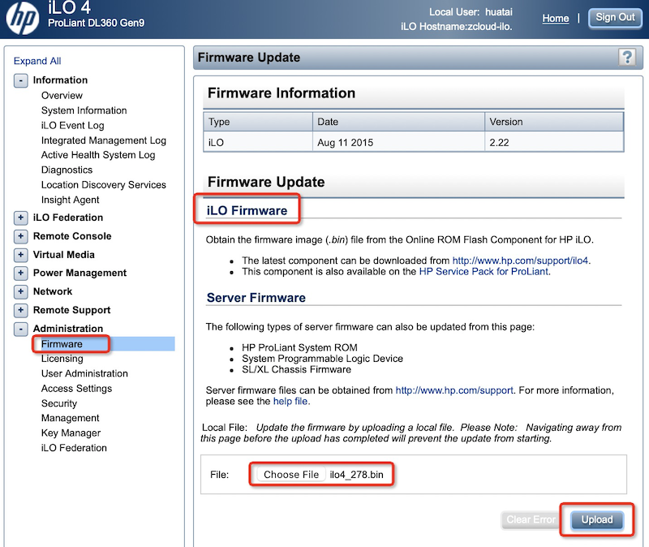
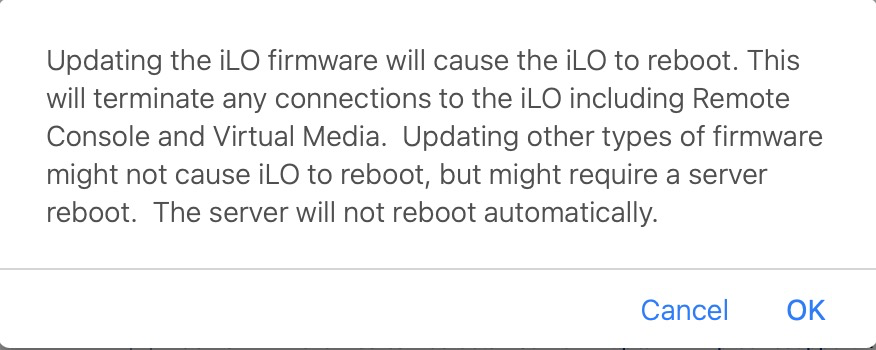
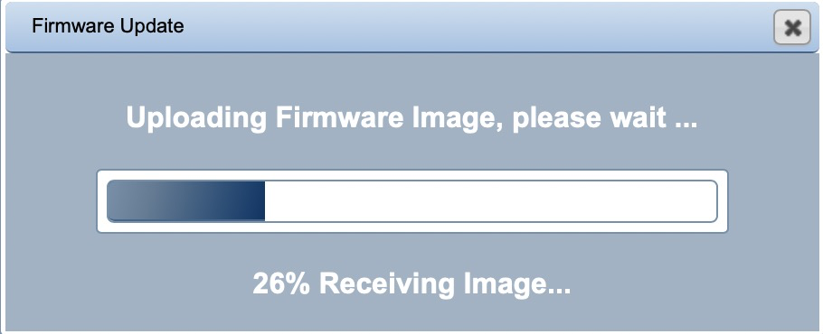
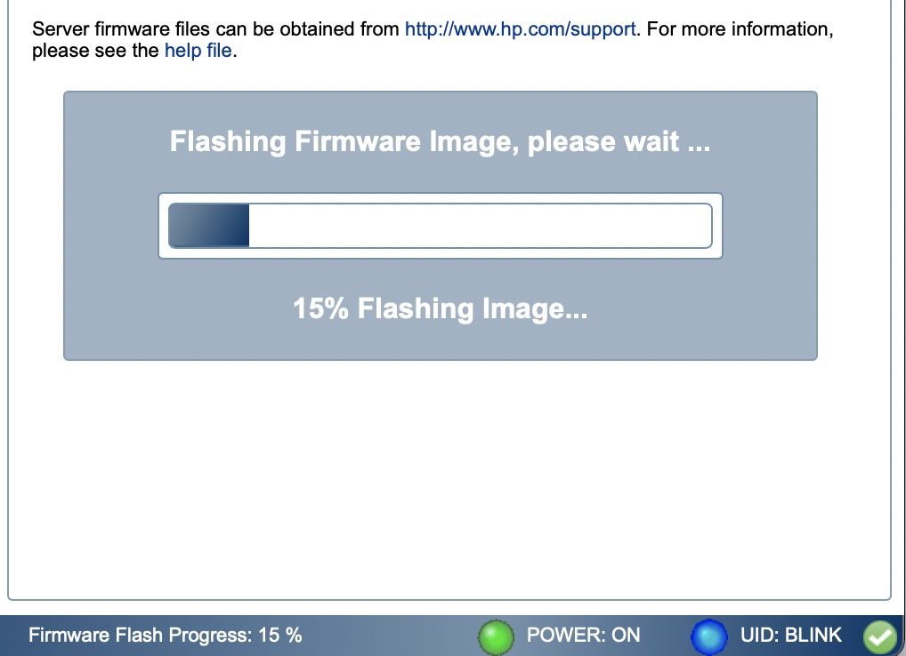

.. _hp_ilo_startup:

===============
HP iLO起步
===============

设置iLO(BIOS)
==============

在服务器启动自检时候，会提示按键进入BIOS设置方法，例如在我的 :ref:`hpe_dl360_gen9` 启动时，按下 ``F9`` 是进入BIOS设置，其中包含了配置 iLO 项目。其他可以参考 `服务器集成 iLO 端口的配置 <https://support.hp.com/cn-zh/document/c01195081>`_ 这篇是HP官方提供的iLO配置(BIOS方式， 即RBSU设置)的方法。

- 配置网络IP地址，我这里配置::

   192.168.6.254 dl360-ilo

- 配置用户账号: 举例，我添加了 ``huatai`` 账号作为系统管理员

WEB访问
==========

通过 https://192.168.6.254 可以使用账号登陆并检查系统，可以非常方便检查系统健康状况，例如，以下是服务器内部温度的监控页面:

.. figure:: ../../../../../_static/linux/server/hardware/hpe/hp_ilo/hp_ilo_web-1.png
   :scale: 50

- 为了能够使用iLO高级功能，建议安装License

Linux驱动和工具
================

在Linux中使用iLO，使用以下驱动和工具:

- ``System Health Application and Command-Line Utilities`` 包含了一系列监控风扇、电源、温度传感器以及管理事件的应用程序，包括 ``hpasmd`` ``hpasmlited`` ``hpasmpld`` 和 ``hpasmxld`` 服务

.. note::

   :ref:`hp_utilities_ubuntu` 安装以后可以获得上述工具

- ``hpilo`` 驱动是Linux内核模块，在Ubuntu系统中会自动加载::

   lsmod | grep hpilo

输出::

   hpilo                  24576  0

- 现在我们能够执行一些 :ref:`hp_utilities_ubuntu` 中交互案例，只需要使用 ``-s`` 参数就可以直接执行::

   sudo hpasmcli -s "show temp"

更新iLO
=========

我发现在目前的macOS平台上使用不同的浏览器都无法加载 ``Remote Console`` ，虽然我已经安装了 JRE (目前是JRE 8)。看起来iLO的虚拟控制台推荐使用的是JRE 6，这已经是非常古老的版本，目前不太好搞。所以我考虑先尝试升级iLO版本到最新，看能否驱动。

查看了 iLO 管理平台，在 ``Administration >> Firmware`` 页面，提供了 ``Firmware Update`` 功能，并且同时支持:

- iLO Firmware
- Server Firmware

只需要上传 ``xxx.bin`` 文件即可升级。

`Latest HP ILO firmwares <https://pingtool.org/latest-hp-ilo-firmwares/>`_ 提供了最新的HP iLO firmware以及提取firmware方法，我使用 ILO4 : `ilo4_278.bin <https://downloads.hpe.com/pub/softlib2/software1/sc-linux-fw-ilo/p192122427/v190650/CP046465.scexe>`_ (iLO4 v 2.78.5 28-Apr-2021) ，实际上这个文件就是从HP仓库下载的，请注意先参考 `** CRITICAL ** Online ROM Flash Component for Linux - HPE Integrated Lights-Out 4
<https://support.hpe.com/hpesc/public/swd/detail?swItemId=MTX_f9793b0af23f47469a0de5be66#tab3>`_ 提供的checksum进行校验::

   sha256sum CP046465.scexe

输出应该是::

   e2ab0c68e372352bc1a0abb5ae467ac43a725f2452aedca1410058b5dac69f70  CP046465.scexe

- 以下方法提取文件::

   chmod +x CP046465.scexe
   ./CP046465.scexe --unpack=/tmp/iLO4

- 然后将解压缩的目录下文件 ``ilo4_278.bin`` 复制出来::

   cp /tmp/iLO4/ilo4_278.bin ./

.. note::

   BIOS 升级参考 :ref:`hpe_dl360_firmware_upgrade`

- 通过iLO WEB方式升级:

- 更新以后版本是 ``2.78 Apr 28 2021`` ，这个版本带来了全新的交互界面，并且提供了 ``HTML5`` 的 ``remote console`` ，这样就不再需要安装java才能运行控制台程序。不过，java支持升级到了jre 8，之前下载安装Oracle JRE 8无法运行控制台的问题终于解决，现在终于可以通过Java Web访问控制台了。

既然提供了HTML5的远程控制台，可以支持更多的浏览器，所以推荐采用 HTML 5 方式。

IPMI tool
=============

参考
======

- `HPE iLO 4 2.78 User Guide <https://support.hpe.com/hpesc/public/docDisplay?docLocale=en_US&docId=sd00001038en_us>`_
- `HPE iLO 4 脚本和命令行指南 <https://support.hpe.com/hpesc/public/docDisplay?docId=c03334060>`_
