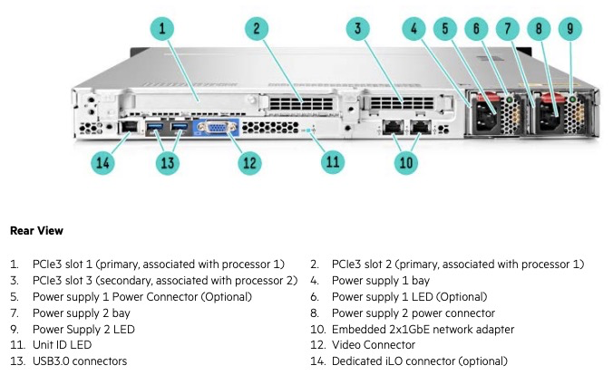
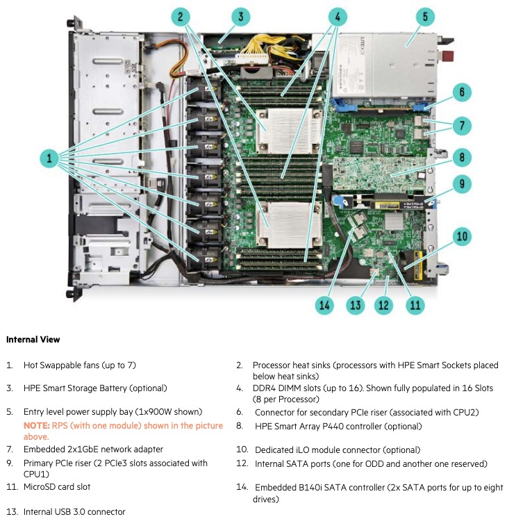

.. _hpe_dl160_gen9:

================================
HPE ProLiant DL160 Gen9服务器
================================

硬件配置
==========

HPE ProLiant DL160 Gen9 服务器类似 :ref:`hpe_dl360_gen9` 的简化版本:

- 主板芯片和 :ref:`hpe_dl360_gen9` 相同，也是 :ref:`intel_c610` 系列，所以基本规格非常相似
- CPU支持和 :ref:`hpe_dl360_gen9` 相同，支持 :ref:`xeon_e5-2600_v3` 和 :ref:`xeon_e5-2600_v4` ，但是根据官方文档，支持的CPU型号要少一些:

.. csv-table:: HPE ProLiant DL160 Gen9 支持E5-2600 v3/v4处理器
   :file: hpe_dl160_gen9/hpe_dl160_gen9_cpu.csv
   :widths: 25, 15, 10, 10, 10, 15, 15
   :header-rows: 1

- 内存支持和 :ref:`dell_r640` 类似，同时支持不同类型(超越了Dell R630)

  - :ref:`lrdimm_ram` 3TB (24 x 128GB LRDIMM @ 2400 MHz)
  - :ref:`rdimm_ram` 768GB (24 x 32GB RDIMM @ 2133 MHz)
  - :ref:`nvdimm_ram` 128GB (16 x 8GB NVDIMM)
  
.. note::

   不过从淘宝可以看到 LRDIMM 内存目前非常昂贵，不如 RDIMM内存 性价比高。不过，技术发展迅速，或许未来也可能进入二手市场的高性价比范围。

服务器结构
==============

前后面板
-----------

HPE ProLiant DL160 Gen9 服务器外观和 :ref:`hpe_dl360_gen9` 非常相似，前面板几乎相同:

.. figure:: ../../../../_static/linux/server/hardware/hpe/hpe_dl160_gen9_front.png
   :scale: 60

后面版则能够看出差异：

可以看到差异点在于:

- 板载千兆网卡从4口缩减为2口
- iLo网络管理接口是可选的
- 少了1个可选的半高板卡安装位(例如DL360可以多装一块4口千兆网卡)
- 双电源看起来比DL 360小一些，应该是支持功率低一些

和DL360相同，都提供了3个PCIe3 扩展卡安装支持:

- 插槽1是全高，插槽2是半高，和CPU 1关联
- 插槽3是半高，和CPU 2关联

内部
-------

对比DL160和DL360服务器内部结构，可以看出DL160的主板比DL360小不少:

- 内存插槽从 24个 减少到 16个，所以最大支持内存 ``缩水`` :

  - RDIMM内存从 768GB 减少到 512GB
  - LRDIMM内存从 3TB 减少到 1TB

- 由于主板面积减少，所以主机存储和内部散热风扇之间有较大空白空间(为何不缩短服务器长度？)

小结
========

- 在二手市场，DL160只比DL360便宜200元，但是扩展性削弱了不少

  - 支持内存容量降低
  - 

参考
=======

- `HPE ProLiant DL160 Gen9 Server <https://support.hpe.com/connect/s/product?language=en_US&ismnp=0&l5oid=7252816&kmpmoid=1009206957&cep=on#t=All>`_
- `HPE ProLiant DL160 Gen9 Server - Overview <https://support.hpe.com/hpesc/public/docDisplay?docLocale=en_US&docId=c04438874>`_
  `HPE ProLiant DL160 Gen9 Quick Spec <https://support.hpe.com/hpesc/public/docDisplay?docLocale=en_US&docId=c04346224>`_
