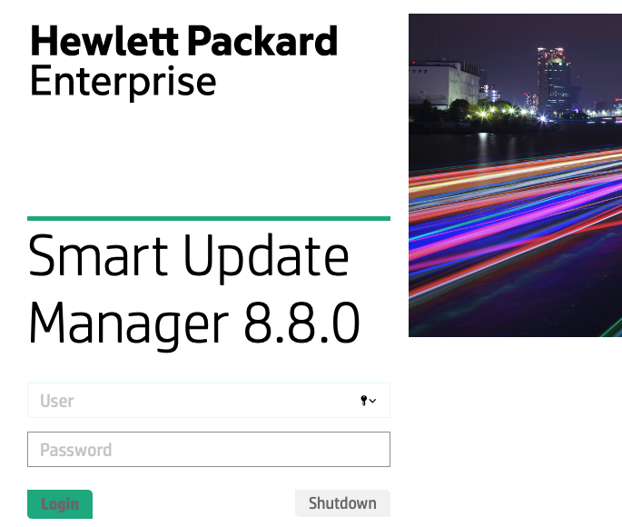
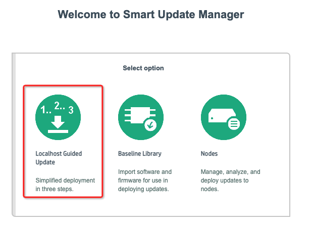
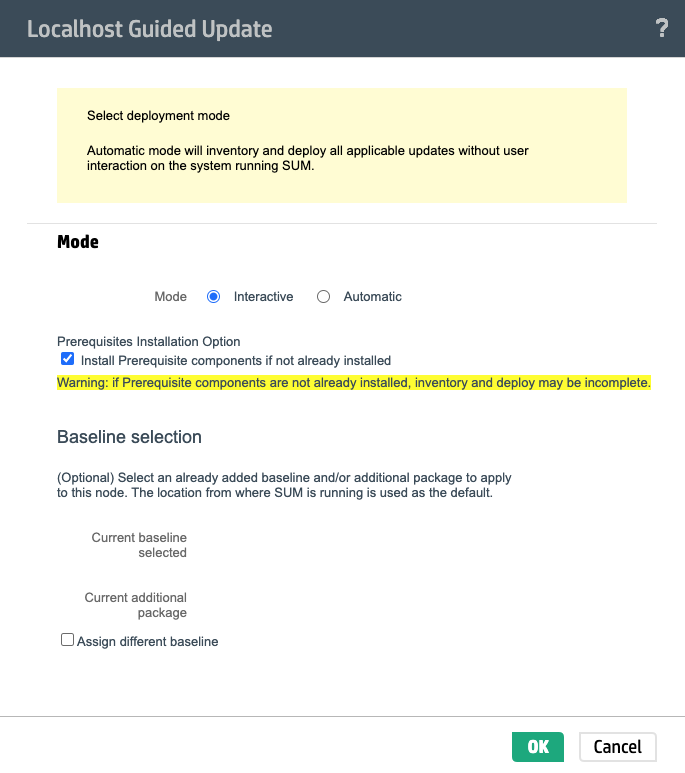
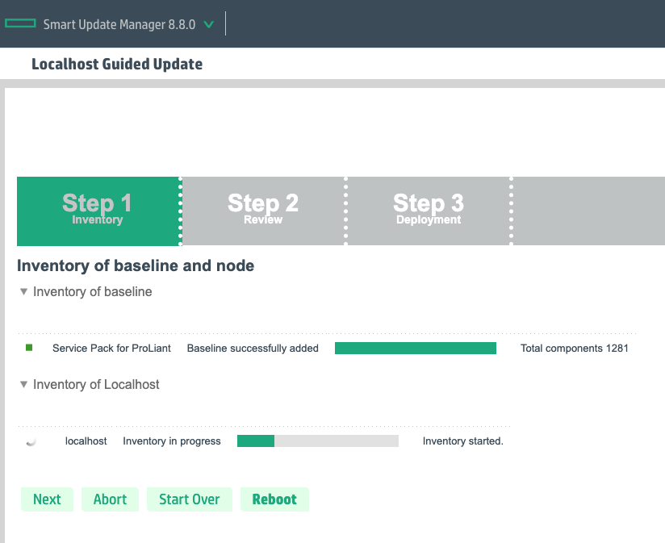
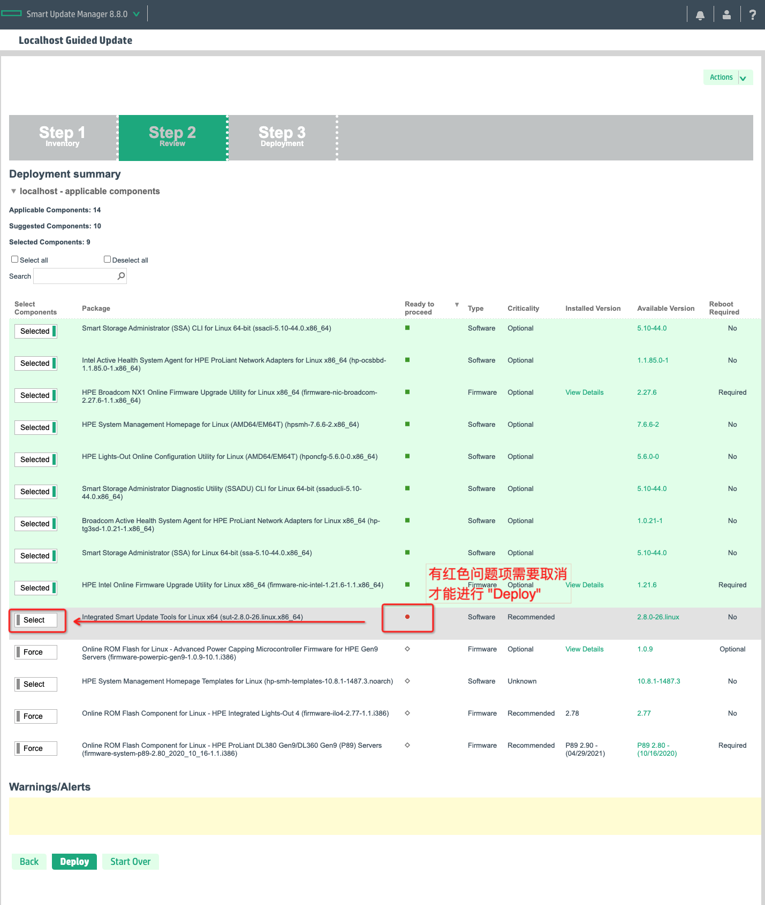
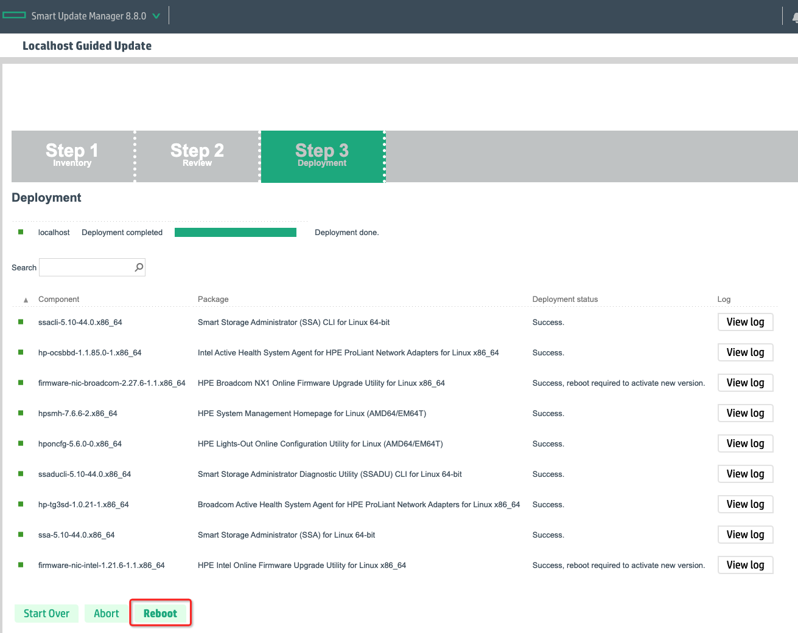

.. _hpe_dl360_firmware_upgrade:

=========================
HPE DL360 firmware升级
=========================

HP服务器的驱动升级以及各种软件包下载都需要购买HPE服务，这对个人购买的二手服务器显然不合适。

我购买的二手 :ref:`hpe_dl360_gen9` 服务器是 2015年8月8日 的BIOS版本，所以我想能够升级到最新的BIOS以便增加稳定性和性能。不过，对于没有HP支持的二手服务器，如何搜索找到下载是一个非常折腾的过程。

.. note::

   在YouTube上 `How to Update HPE Enterprise Server Using a SPP on a USB - 1159 <https://www.youtube.com/watch?v=twNEtYLwCIc>`_ (这位播主讲解很生动)，我没有想到其实HP服务器更新firmware是如此简单的步骤(通过制作USB key启动，点几下鼠标就可以完成升级)。

   强烈建议你观看这个视频，你就可以明白怎么完成HPE服务器的firmware升级了。这比阅读本文要直观很多，也可以节约你很多时间(不用像我花费了太多的摸索时间)

   此外 `How to Update the System BIOS & Firmware in an HP Ptroliant Servers <https://www.youtube.com/watch?v=MTjY5xzUkIk>`_ 是YouTube上另一个操作视频，其实内容差不多，只不过多了一个通过 :ref:`hp_ilo` 步骤。

   如果你想看操作文档，可以参考:

   - `Updating Hewlett-Packard Enterprise servers using HPE SPP <https://www.adaptive.lv/en/2021/07/28/updating-hewlett-packard-enterprise-servers-using-hpe-spp/>`_ 提供了一步步操作截图
   - `Smart Update Manager 8.5.0 User Guide <http://itdoc.hitachi.co.jp/manuals/ha8000v/hard/Gen10/SUM/881504-008_en.pdf>`_ 提供了官方文档

.. warning::

   我在DL360上升级firmware采用了 SPP 光盘升级，在 :ref:`hpe_dl380_firmware_upgrade` 中采用分步骤手工升级

下载
=========

Reddit的帖子 `HPE DL380 Gen 9 Firmware/Bios update <https://www.reddit.com/r/homelab/comments/k037h2/hpe_dl380_gen_9_firmwarebios_update/>`_ 提供了线索: 根据 ``SPP for G9 and G10`` 关键字在Google搜索，果然可以找到下载资源::

   Gen9/Gen10 Production SPP:
   Link: P35938_001_spp-2021.05.0-SPP2021050.2021_0504.129.iso
   Size: 9.99 GB
   MD5: 2a869e4138e2ac0e1cd09cd73c8faf70
   SHA1: 73fbd4f4c97c4928944cd9330132764a09d49de2
   SHA256: b98c578bf96e4ebed8645236a70d5df4d104d37238e5d17d59387888db5ae106

.. note::

   下载建议使用 :ref:`axel` 加速

虽然我开始时候觉得SPP光盘太庞大了，不如单独下载需要的firmware软件进行更新。并且我也是这样做的，见下文 ``下载(更新)`` 。但是后来我发现实际上服务器硬件明细极其繁杂，靠人工一个个查找、核对、下载、更新非常麻烦，而且也很难确定是否要更新。所以我最后还是决定先采用 :ref:`run_centos_in_chroot_under_ubuntu` 在Ubuntu系统是chroot成CentOS，然后就可以使用官方SPP光盘进行系统更新。(见下文)

下载(更新)
===========

后来我发现，实际上完全可以根据HP官方的支持网站提供的BIOS更新文件名，通过google搜索找到下载文件，例如最新的BIOS更新文件是 ``P89_2.90_04_29_2021.signed.flash``

- `reddit: HPE DL360/DL380 gen9 firmware updates out of warranty r/homelab <https://www.reddit.com/user/redvex2460/>`_ 提供了下载资源对应的是 `* RECOMMENDED * Online ROM Flash Component for VMware - HPE ProLiant DL380 Gen9/DL360 Gen9 (P89) Servers <https://support.hpe.com/hpesc/public/swd/detail?swItemId=MTX-d65122cec6514a5d8d6eb7c386#tab2>`_ 

解压缩 ``CP047834.zip`` 文件后，获得的一个文件 ``CP047834.vmfile`` 其实包含了 ``P89_2.90_04_29_2021.signed.flash`` ，但是解压缩比较繁琐，需要通过 ``7zip`` 解压缩::

   7zz x CP047834.vmfile

此时会生成一个临时文件 ``scexe_tmp6469`` ，通过 ``file scexe_tmp6469`` 可以看到这个文件是标准tar::

   scexe_tmp6469: POSIX tar archive (GNU)

再解包::
 
   tar xf scexe_tmp6469

就可以获得最终文件 ``P89_2.90_04_29_2021.signed.flash`` ，请根据HPE官方下载页面 `System ROM Flash Binary - HPE ProLiant DL380 Gen9/DL360 Gen9 (P89) <https://support.hpe.com/connect/s/softwaredetails?language=en_US&softwareId=MTX_6abac704c0e149548008362d7b>`_ 提供的checksum值进行校验::

   sha256sum P89_2.90_04_29_2021.signed.flash

输出应该是::

   5c5aa4afce91fac98cd61ddaa6b86827af94de6f5dfae5afbe6a27868099dce0  P89_2.90_04_29_2021.signed.flash

升级准备
==========

.. note::

   最初虽然我下载了 SPP ISO 文件，但是我发现还不是最终最新版本，所以我采用了上文通过google找到的 ``P89_2.90_04_29_2021.signed.flash`` 来更新BIOS。不过，我发现手工升级实在太繁琐了，所以最后还是采用标准SPP光盘进行自动更新。不过，我的物理服务器操作系统安装的是 :ref:`ubuntu_linux` ，不是HP官方支持系统。所以，我先采用 :ref:`run_centos_in_chroot_under_ubuntu` ，然后再执行本段升级操作。

- 挂载下载的iso文件::

   sudo mount -o loop P35938_001_spp-2021.05.0-SPP2021050.2021_0504.129.iso /media

- 为了方便浏览信息，可以本地启动一个简单的http服务器::

   python3 -m http.server 8080

在 ``README.html`` 说明:

Service Pack for ProLiant 集合了固件以及系统软件元件，均经过测试管理，并且用来一块部署。该套件包含了服务器跟其附件设备所需要的驱动程序、代理程序、 实用程序以及固件元件。 SUM 是用来部署这些固件以及系统软件的工具。

如要在Windows底下启动SUM：

双击文档::

   launch_sum.bat

如要在Linux底下启动SUM::

   ./launch_sum.sh

如需更进一步的 Service Pack for ProLiant 信息，可以访问这个网站： https://www.hpe.com/servers/spp

.. note::

   运行 ``launch_sum.sh`` 会检查系统是否具备一些基础工具，例如对于 :ref:`run_centos_in_chroot_under_ubuntu` ，还需要安装以下工具::

      sudo yum install -y pciutils dmidecode unzip

.. note::

   ``launch_sum.sh`` 脚本实际上执行的是 ``packages/smartupdate`` ，该脚本只支持在 ``redhat`` 和 ``SuSE`` 平台运行

我是在 :ref:`hp_ilo` 提供的终端控制台执行 ``launch_sum.sh`` 脚本，原本以为通过iLo控制台可以避免升级过程中网络断开或者磁盘中断等问题，但是没想到提示信息::

   Copying sum files to /var/tmp/localsum
   sum_service_x64 started successfully on port 63001 and secure port 63002. FTP is disabled.
   auditLog[93095]: Disabling blocked firewall rules
   Error: cannot launch browser

更新步骤(Step by Step)
========================

- 此时可以通过访问服务器IP的63002端口来打开 ``Smart Update Manager`` 管理界面: https://192.168.6.200:63002/

- 输入 ``root`` 用户账号密码，登陆到Smart Update Manager界面，然后点击 ``Localhost Guided Update`` :

.. note::

   这里似乎有一点点异常，页面没有自动显示出来，不过刷新一下chrome页面就可以看到下一步

- 在下一个页面选择更新类型，这里选择 ``Interactive`` 交互模式:

- 此时开始检测:

- 检查完成后，点击下一步，进入 ``review`` 步骤:

``注意`` 存在红色点的问题项必须取消选择才能进入下一步 ``Deploy``

在这个 ``review`` 页面检查无误后点击 ``Deploy`` 按钮

- 由于我只需要更新firmware(所有OS系统软件是安装在 :ref:`run_centos_in_chroot_under_ubuntu`  :strike:`所以对我的案例么有用处，我仅需要更新firmware，其他系统软件都依赖Ubuntu系统发行版，或者后续根据需要通过alien转换DEB包独立安装` ，考虑到可以 ``chroot`` 到CentOS系统中运行，所以我还是按照默认推荐安装)

- 安装完成后显示如下页面，按照提示重启系统就可以完成整个服务器系统更新:

通过iLO WEB更新firmware
==========================

以下步骤是只使用 firmware 文件通过iLO WEB界面上传来更新，这个步骤一次只能更新一个组件，效率较低。不过，如果只是更新BIOS的话，这个方法是比较方便的。要完整更新服务器所有firmware，还是采用上文 ``更新步骤(Step by Step)``

rpm包升级(未完成)
--------------------

需要找到服务器对应的BIOS firmware文件名，可以根据HPE支持网站搜索看到 `* RECOMMENDED * Online ROM Flash Component for Linux - HPE ProLiant DL380 Gen9/DL360 Gen9 (P89) Servers <https://support.hpe.com/hpesc/public/swd/detail?swItemId=MTX_75e3e6e7f3484a39a8bf19fa24>`_ 文件名是::

   firmware-system-p89-2.90_2021_04_29-1.1.i386.rpm (6.1 MB)

所以在SPP光盘中对应搜索 P89 (也就是服务器 DL360 gen9) 的软件包::

   ls *.rpm | grep firmware | grep p89

可以看到是::

   firmware-system-p89-2.80_2020_10_16-1.1.i386.rpm

版本稍微旧一些

此外该ISO镜像提供的firmware版本也稍微低一点::

   firmware-ilo4-2.78-1.1.i386.rpm (13 MB)

.. note::

   由于我实际上最终找到了最新的BIOS和iLO升级firemware，所以我实际升级方法见下文 ``.flash文件升级``

.flash文件升级
------------------

通过google找到的VMware的升级包解压缩，找寻到 ``P89_2.90_04_29_2021.signed.flash`` ，然后通过和 :ref:`hp_ilo_startup` 升级iLO firmware版本相同方法进行升级。

升级完成后，需要关机(reset)重启才能使新版本 System ROM 生效(单纯在Host OS中使用 ``reboot`` 命令不会切换到新刷入的system rom)，然后观察iLO WEB页面的 ``Information >> Overview`` 可以看到::

   System ROM P89 v2.90 (04/29/2021)
   System ROM Date 04/29/2021
   Backup System ROM 08/08/2015

即证明升级成功，并且提供了备份System ROM，在出现问题时可以回滚。

通过BIOS工具升级
==================

按照官方文档说明，还可以通过系统工具来完成BIOS升级:

- Copy the binary file to a USB media or iLO virtual media.
- Attach the media to the server.
- In POST, press F9 to enter System Utilities and select Embedded Applications.
- Select “Firmware Update” and then “System ROM”.
- Choose “Select Firmware File”, and then select the device and the flash file.   
- Select “Start Firmware Update” and allow running to completion.

升级前后性能对比
==================

使用 :ref:`sysbench` 进行BIOS升级前后性能对比，目前初步观察似乎cpu性能测试相当::

   before - events per second: 12371.95
   after - events per second: 12419.41

具体等后续我研究内核性能以及 Intel 处理器 Meltdown和Spectre安全漏洞 对性能的影响再做对比测试

.. note::

   - `针对Intel处理器芯片存在的Meltdown和Spectre安全漏洞，应该如何规避？ <https://support.huaweicloud.com/ecs_faq/ecs_faq_0714.html>`_
   - `Information leak via speculative execution side channel attacks <https://wiki.ubuntu.com/SecurityTeam/KnowledgeBase/SpectreAndMeltdown>`_

其他系统firmware升级
======================

:ref:`hp_ilo` 提供了非常好的系统观察页面，其中 ``System Information >> Firmware`` 可以显示系统中所有firmware版本，也就是如果必要，这些firmware都应该更新到最新，以提供最大优化:

.. csv-table:: HPE DL360 gen9 Firmware Version
   :file: hpe_dl360_firmware_upgrade/dl360_firmware.csv
   :widths: 25, 25, 20, 15, 15
   :header-rows: 1

.. note::

   - BIOS软件需要注册HP服务才能下载最新版本，否则只能下载早期版本； iLO软件可以直接官方下载，但是需要SN才能激活使用
   - 可以通过firmware的文件名通过google找到下载源: `RU-BOARD: HP Service Pack for ProLiant (SPP) <http://forum.ru-board.com/topic.cgi?forum=81&topic=8803&glp>`_ 提供了各个版本的下载信息，其中可以找到 `DL380 Gen9 iLO 2.80 + BIOS P89_2.96_05_17_2022 <https://disk.yandex.ru/d/nlsqpYbuMrnLcg>`_ (和 DL360 Gen9共用)
   - 网卡的firmware则可以直接下载，无需注册
   - 存储firmware可以更新以获得更好的性能和稳定性

推荐更新:

- 存储firmware
- 网卡firmware

参考
=======

- `HPE DL380 Gen 9 Firmware/Bios update <https://www.reddit.com/r/homelab/comments/k037h2/hpe_dl380_gen_9_firmwarebios_update/>`_
