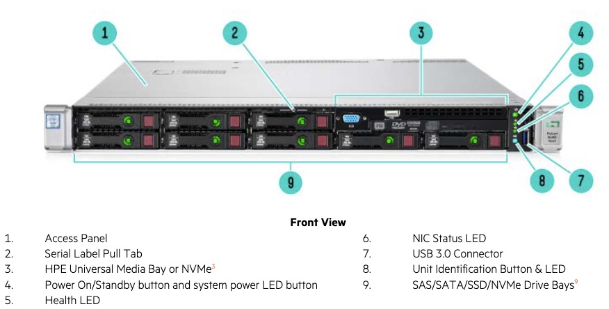
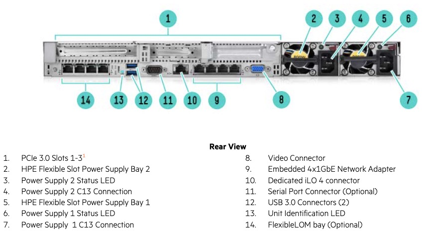
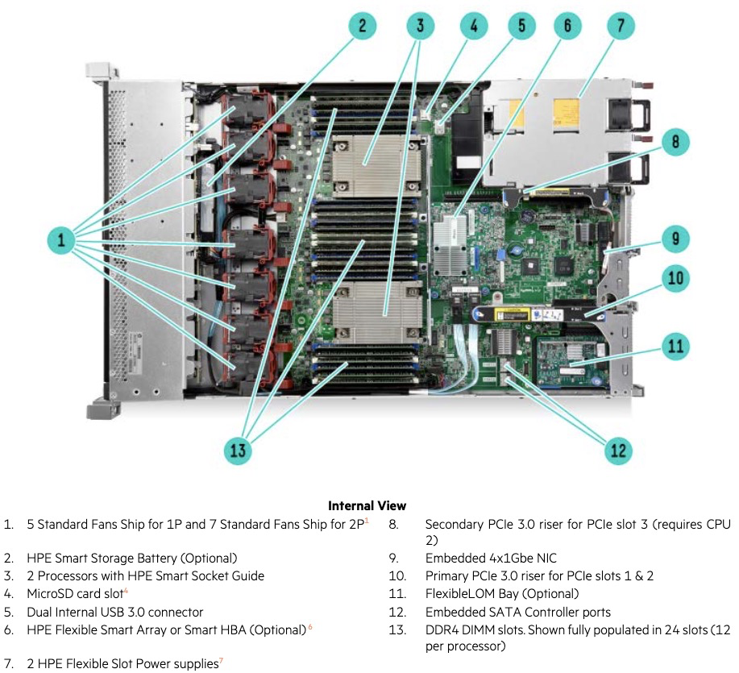
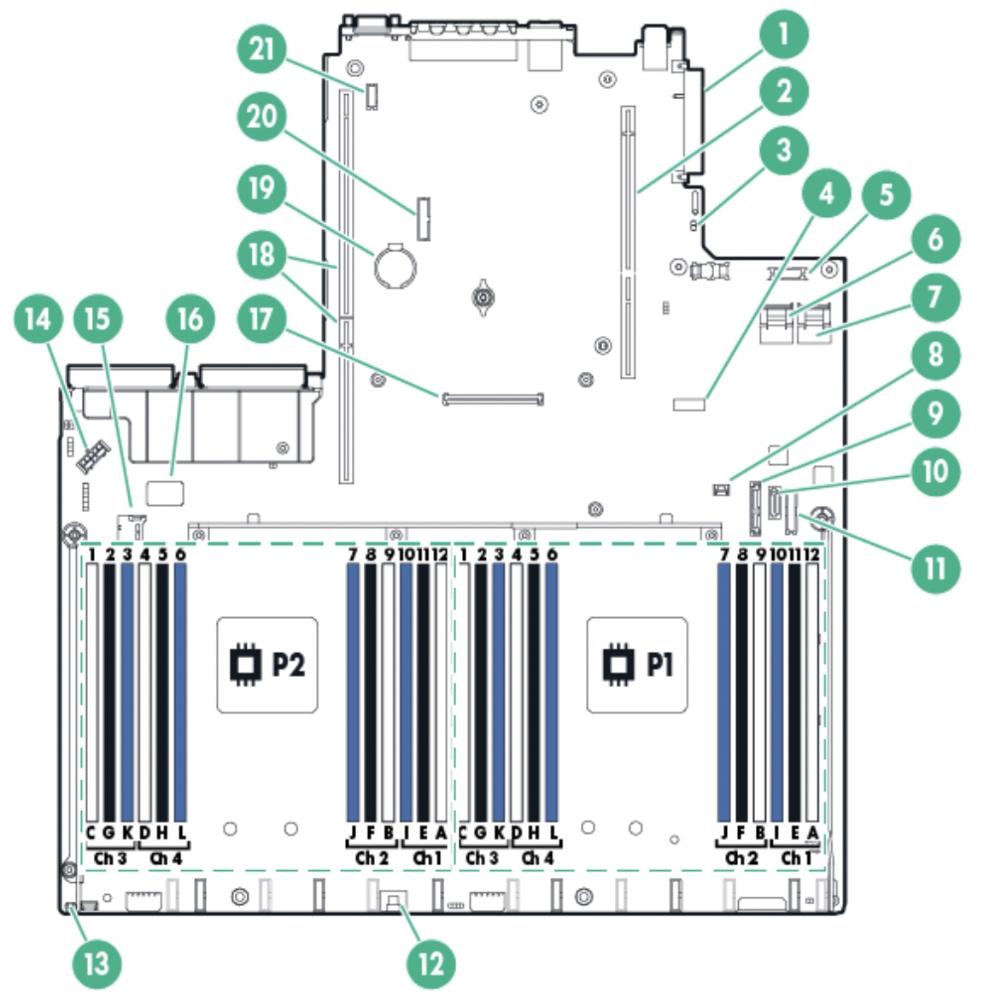
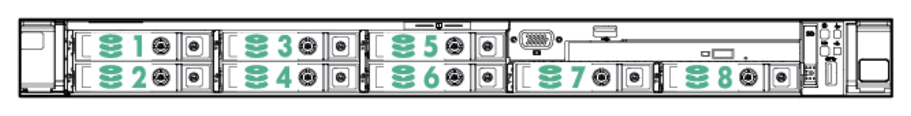
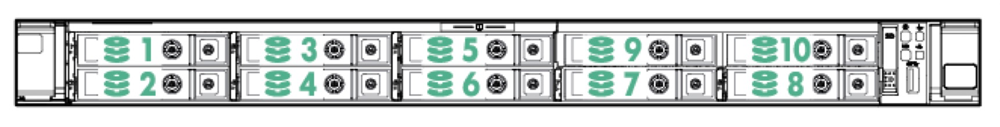

.. _hpe_dl360_gen9:

================================
HPE ProLiant DL360 Gen9服务器
================================

DL360服务器外观
=================

前面板
----------

HPE ProLiant DL360 Gen9服务器是通用型1U机架式服务器，提供了不错的计算能力和高密度存储(目前SSD存储技术已经向微型化发展，所以即使1U服务也能提供非常高的存储容量)。

标准配置是采用 8 个SFF，也可以订购不同 :ref:`storage_spec` 组合，其中比较有特色的是:

- 4 SAS/SATA (Drive 1-4)+6 NVMe (Drive 5-10)

我觉得可以配置成:

- Drive 1-2 采用常规SATA SSD (企业级SAS SSD价格惊人，个人无法承受)

  - 方法一: 双盘组成RAID1，构建操作系统，确保本机服务器始终可用
  - 方法二: 两个SSD磁盘分别用于文件系统不同职责，例如数据和log分离，加速ZFS/Btrfs的性能

- Drive 3-5 采用大容量 HDD ，构建基于 :ref:`gluster` 的镜像近线存储，提供NAS文件存储功能

  - 采用大容量的机械磁盘可以降低存储成本，并且对于连续写入的大文件，机械磁盘性能在可接受范围
  - 注意 :ref:`hdd_pmr_cmr_smr` ，应该购买CMR结构的HDD，并尽可能选择CMR大容量磁盘(小规格CMR HDD已经和SSD价格相近毫无优势)

- (取消这条建议，原因见后)Drive 6-8 采用 SATA SSD，通过虚拟化构建 :ref:`ceph` 存储集群，提供整个虚拟化 :ref:`openstack` 分布式存储，实现云计算底层存储

企业级服务器的部件价格是家用计算机部件的2倍价格，例如同样1T容量的NVMe家用型只需要600元，但是U.2接口的NVMe SFF存储(2.5" NVMe SSD)则售价在1200~1800元，对于组件模拟分布式存储，还是推荐采用家用NVMe设备(转接卡+M.2 NVMe)。此外，根据资料，要在 Drive 5-10 使用 U.2 接口的NVMe SSD需要满足:

  - 使用专用背板(价格非常昂贵)
  - 内部改造连线，从PCIe接口引出联线

.. note::

   实际上我最终没有采购CMR HDD机械磁盘，因为我发现目前由于磁记录技术停滞发展，已经没有超过2T规格的 ``2.5"`` CMR HDD了。小规格HDD售价和SSD相差无几，性能又大为落后，所以如果要实现高性能分布式集群，还是采用 NVMe SSD实现更佳。

   目前我先临时采用旧有的500GB 笔记本HDD磁盘来模拟实验，并且采购 PCIe 3.0 slot 转接 :strike:`4个` 3个NVMe SSD磁盘(原因是 DL360 Gen9 :ref:`pcie_bifurcation` 只能在slot1上设置，并且只支持分成2个 x8，导致加上 slot 2，我只能安装3个NVMe - :ref:`samsung_pm9a1` )，来实现高性能 :ref:`ceph` 集群:

   - PCIe 3.0 x16 (slot1) 转接 :strike:`4个` 2个 NVMe SSD磁盘(需要主板支持 :ref:`pcie_bifurcation` )
   - 需要升级 :ref:`hpe_dl360_gen9` BIOS 才能支持 ``PCIe Bifurcation Options``

后面版
---------

值得关注点:

- 板载集成4端口千兆网卡，可以组建network bonding实现高速网络交换，或者可以尝试实践一个以Linux为基础的高速交换网络，学习SDN技术
- 可选的FlexibleLOM bay可以安装附加的4口网卡，扩展性更强的交换网络 (建议采购，因为主板自带的Broadcom NetXtreme BCM5719不支持 :ref:`sr-iov` ，而配套的 FlexibleLOM 4口网卡是 Intel I350千兆网卡，可以完美支持Intel主推的 :ref:`sr-iov` 技术，用于部署更多采用IOMMU/SR-IOV的虚拟机)
- 电源可能需要购买高功率，因为如果使用高性能CPU没有大功率电源支持会导致不稳定 - 我最后订购了800w规格，目前使用下来比较稳定，后续观察GPU运行情况再补充

内部
--------

重点:

- 主板内部提供了Micro-SD卡接口，功能待查
- 支持2种存储卡: HPE Flexible Smart Array 和 Smart HBA，型号是 H240ar 和 P440ar
- PCIe 规格是 3.0，需要注意插槽1和2和处理器1关联，插槽3和处理器2关联
- 提供了2个主板SATA控制器插口
- 主板内建4个千兆网口，使用的是 Broadcom BCM5719 网卡芯片
- 可选4口千兆 ``FlexibleLOM Bay`` 网卡(有多种规格，千兆、万兆和25Gb各种)，常见的是Intel 4口千兆网卡 ``HP Ethernet 1Gb 4-port 366FLR Adapter`` (部件编号 ``665240-B21``) (从淘宝购买二手服务器时，这块可选网卡被拆除了，需要单独购买 220 元)

.. csv-table:: HPE ProLiant DL360 Gen9 主板组件
   :file: hpe_dl360_gen9/hpe_dl360_gen9_mainboard.csv
   :widths: 25, 75
   :header-rows: 1

.. note::

   我在 :ref:`edac` 实践中了解到，内存插槽和硬件检测故障定位有密切关系，需要注意 :ref:`hpe_dl360_gen9_memory` ，并且确保 ``DIMM labels`` 数据配置文件和实际服务器DIMM插槽正确对应，这样才能帮助运维人员快速定位故障内存

PCIe
--------

:ref:`pcie` 通道是和CPU连接的，主机受限于处理器并不能添加过多的PCIe插槽(添加过多也只是分享cpu通道，反而无法获得最高速度)。不过，对于 :ref:`intel_c610` 也就是X99平台，支持2个志强处理器，所以可以通过将不同的PCIe分别连接到2个处理器获得全速运行性能。需要注意，在 `HPE ProLiant DL360 Gen9 Server QuickSpecs <https://support.hpe.com/hpesc/public/docDisplay?docLocale=en_US&docId=c04346229>`_ 明确指出主机所支持到3个PCIe slot，其中 PCIe slot 1-2 连接CPU 1，而 PCIe slot 3 连接到CPU 2 :

- 由于DL 360是一个1U的紧凑型机架服务器，所以需要使用 ``PCIe 3.0 riser for PCIe slot X`` 也就是PCIe扩展板，将插槽由垂直转为水平。需要注意的是，DL 360默认配置只提供了 ``Primary PCIe 3.0 riser for PCIe slot 1 & 2`` (对应CPU 1) ，而第二块PCIe扩展板 ``Secondary PCIe 3.0 riser for PCIe slot 3 (requires CPU 2)`` 需要另外购买
- 只有购买了 ``Secondary PCIe 3.0 riser for PCIe slot 3 (requires CPU 2)`` 才能充分发挥DL 360的PCIe性能，也就是把PCIe数据访问分担到两个CPU上，性能最佳
- 我推测如果购买并安装第二块PCIe扩展板，实际上DL360可以安装2块 PCIe 3.0 x16 的显卡，理论上可以组建一个性能更强 :ref:`dl_hardware` 平台 (不过，因为PCIe插槽有限，我最终用slot1+slot2安装 :ref:`nvme` ，slot3安装 :ref:`tesla_p10` 。很可惜，扩展性不足，后续有机会要采购扩展性更好的服务器，组件GPU集群 )
- 根据 `HPE ProLiant DL360 Gen9 Server - Option Parts <https://support.hpe.com/hpesc/public/docDisplay?docId=emr_na-c04444424>`_ 可以查询到上述第二块PCIe riser扩展板部件:

  - HP DL360 Gen9 Low Profile PCIe Slot CPU2 Kit 部件编号是 ``764642-B21`` 在淘宝上能够找到价格为400元 (已买，已成功转接安装 :ref:`tesla_p10` )
  - HP DL360 Gen9 Full Height PCIe Slot CPU2 Kit 部件编号是 ``764644-B21`` (淘宝上没有，ebay上售价极高，放弃)

FlexibleLOM Adapter
-----------------------

可选的 ``FlexibleLOM Bay`` 网卡有多种规格，千兆、万兆甚至25Gb。常见的是:

- Intel 4口千兆网卡 ``HP Ethernet 1Gb 4-port 366FLR Adapter`` (部件编号 ``665240-B21`` )
- Intel 82599控制芯片 ``HPE Ethernet 10Gb 2-port 560SFP+ Adapter`` (部件编号 ``665249-B21`` ) 

不过我从淘宝购买二手DL360服务器，这块可选网卡被拆除了，需要单独购买 220 元。虽然有些小贵，但是考虑到不用占用服务器宝贵的PCIe插槽，并且是Intel网卡芯片，可以结合Intel开发的驱动以及DPDK技术加速网络虚拟化性能，我准备用来构建Linux交换设备，来连接我的多个 :ref:`pi_cluster` ，实现混合架构 :ref:`kubernetes` 。

.. note::

   部件选择以 `HPE ProLiant DL360 Gen9 Server QuickSpecs <https://support.hpe.com/hpesc/public/docDisplay?docLocale=en_US&docId=c04346229>`_ 为准。HPE服务器网络配件 `HPE Ethernet 10Gb 2-port 530FLR-SFP+ Adapter (手册) <https://www.hpe.com/psnow/doc/c04111479>`_ 采用 QLogic 控制芯片，适配列表是 (DL360p) Gen8 ，没有包含在 (DL360) Gen9 兼容列表中。

内部改造
-----------

.. note::

   这个内部改造暂时放弃，我计划购买二手Cisco交换机来实践企业网络组网

考虑到DL360服务器内部有一些尚未利用到空间，我准备将 :ref:`pi_4` 和 :ref:`jetson_nano` 安装到DL 360内部，结合上述Intel 4口千兆网卡所构建的Linux交换机，组建成一台混合架构模拟集群的服务器。

配置
========

HPE ProLiant DL360 Gen9 服务器综合配置介于 :ref:`dell_r630` 和 :ref:`dell_r640` 之间:

- 主板芯片和 :ref:`dell_r630` 相同，采用 :ref:`intel_c610` 系列
- CPU支持和 :ref:`dell_r630` 相同，支持 :ref:`xeon_e5-2600_v3` 和 :ref:`xeon_e5-2600_v4` ，这款服务器支持的CPU型号较多(比DL160):

.. csv-table:: HPE ProLiant DL360 Gen9 支持E5-2600 v3/v4处理器
   :file: hpe_dl360_gen9/hpe_dl360_gen9_cpu.csv
   :widths: 20,10,10, 10, 10, 10, 10, 20
   :header-rows: 1

- 内存支持和 :ref:`dell_r640` 类似，同时支持不同类型(超越了Dell R630)

  - :ref:`lrdimm_ram` 3TB (24 x 128GB LRDIMM @ 2400 MHz)
  - :ref:`rdimm_ram` 768GB (24 x 32GB RDIMM @ 2133 MHz)
  - :ref:`nvdimm_ram` 128GB (16 x 8GB NVDIMM) - 我对比 Intel Optane :ref:`linux_pmem` 资料，发现这种非易失RAM在特定应用加速上有极大优势， :strike:`所以可能还是想实践一下` 

.. note::

   不过从淘宝可以看到 LRDIMM 内存目前非常昂贵，不如 RDIMM内存 性价比高。不过，技术发展迅速，或许未来也可能进入二手市场的高性价比范围。

存储
========

DL360服务器有两种大小规格的磁盘 - 4LFF(3.5") 和 8SFF(2.5")/10SFF(2.5")

我购买的二手DL 360是常见的8FF配置版本，其数据盘位置如下:

可以扩展到10SFF配置(需要另外购置一个 ``HP DL360 Gen9 2SFF SAS/SATA Universal Media Bay Kit 764630-B21`` (约230-300元) 以安装第9-10磁盘)

10SFF配置有一种性能极致的配置: ``HP DL360 Gen9 6 NVMe + 4 SAS/SATA Express Bay Enablement Kit  817676-B21`` 背板替换后，可以支持 4个SAS/SATA 加上 6个NVMe (U.2接口)设备，但是这个配件的价格约在 800 刀到 1000 刀， :strike:`并且万能淘宝也找不到，只有海外直购，所以并不现实。 ``实际上也有非官方的解决方案`` : **现在淘宝上已经普及了 PCIe 转 U.2 NVMe 扩展卡** : 

- PLX8749/PLX8748免拆分PCIe扩展卡: 可以在服务器内部/外部连接GPU卡和U.2 SSD
- SFF8654转U.2数据线

使用场景包括通过 ``双卡槽底座+支架`` 安装2块GPU / 服务器内部通过 ``SFF8654转U.2数据线`` 连接4块 U.2 SSD存储组建阵列等等...

.. note::

   由于 ``4SAS/SATA + 6NVMe`` 的扩展模块售价极高，对于二手设备已没有可能。所以如果要通过NVMe存储充分发挥DL 360服务器性能，可行的方法是采用PCIe转M.2 NVMe，实现高性能 :ref:`ceph` 存储，用于 :ref:`openstack` 构建云计算集群。

存储控制器
-------------

主板内置存储控制芯片: HPE Dynamic Smart Array B140i控制器 (对于E5-2600v3 CPU处理器，主板集成的B140i只能工作在UEFI模式)。默认B140i设置为AHCI模式，如果要使用SATA only模式则需要配置激活。

支持2种阵列卡：

- H240ar 阵列卡，适合少量硬盘，只支持RAID 0和1模式，硬盘也可以设置为无阵列模式
- H440ar 阵列卡，配置2G缓存和电池，支持多硬盘RAID 5,6,10,50,60等模式，硬盘也可以设置为无阵列模式

HP官方支持网站提供了部件安装视频指南，例如 `HP Smpart Array Controller <https://support.hpe.com/hpesc/public/docDisplay?docId=psg000107aen_us&page=GUID-F16DC03B-D44C-4C4C-B314-BD207D305DF1.html>`_ 介绍了如何替换阵列卡。其他组件的安装替换也有相应指导，非常方便

.. note::

   现代云计算已经采用 :ref:`gluster` 和 :ref:`ceph` 这样的分布式存储来替代早期的RAID存储技术，所以我的不使用硬件RAID设备，没有购买相应的阵列卡。

电源支持
=========

- 500W标配
- 800W - 考虑到后续将升级添加显卡(耗能大户)以及满配多个存储设备，所以在购买二手DL360时，加价购买了800w电源
- 1400W
- 750W +

UEFI
========

Unified Extensible Firmware Interface (UEFI)是服务器启动管理，HP提供了 `HPE UEFI支持 <http://www.hpe.com/servers/uefi>`_ :

- 结合UFEI安全启动(通过内建可信任密钥签名)，并且HPE ProLiant Gen10服务器还支持Trusted Platform Module(TPM)
- 嵌入的UEFI Sheel 和 `iLo RESTful API <https://www.hpe.com/us/en/servers/restful-api.html>`_ ，可以管理UEFI以及BIOS
- UEFI支持PXE从IPv6网络启动，这样可以通过网络快速部署大量服务器

我的服务器组合
=================

- HPE ProLiant DL360 Gen9 Server
- :ref:`xeon_e5-2670_v3`
- 三星 32G DDR4 2R*4 2400MHz 内存 (实际上v3只支持2133MHz，考虑到后续可能升级v4处理器支持2400MHz)

  - DL360支持每个DIMM插槽最高32GB RDIMM内存，满配24根最高768GB。为了不浪费插槽和内存，选择2根32G

- 硬盘暂时采用原先的购买的笔记本2.5" SSD SATA硬盘，并购置2块2.5" HDD来构建 :ref:`gluster` 虚拟机

- 存储: 采用 :ref:`pcie_bifurcation` 安装3块 :ref:`nvme` :ref:`samsung_pm9a1` 构建 :ref:`ceph` ( :ref:`iommu` )

- GPU: 采购 Nvidia GPU卡 实现 :ref:`sr-iov` 组建GPU虚拟化集群

参考
=======

- `HPE ProLiant DL360 Gen9 Server <https://support.hpe.com/connect/s/product?language=en_US&ismnp=0&l5oid=7252836&kmpmoid=7252838&cep=on#t=All>`_
- `HPE ProLiant DL360 Gen9 Server QuickSpecs <https://support.hpe.com/hpesc/public/docDisplay?docLocale=en_US&docId=c04346229>`_
- `HPE ProLiant DL360 Gen9 Server - Option Parts <https://support.hpe.com/hpesc/public/docDisplay?docId=emr_na-c04444424>`_
- `HPE ProLiant DL360 Gen9 Server User Guide <https://support.hpe.com/hpesc/public/docDisplay?docLocale=en_US&docId=c04441974>`_
