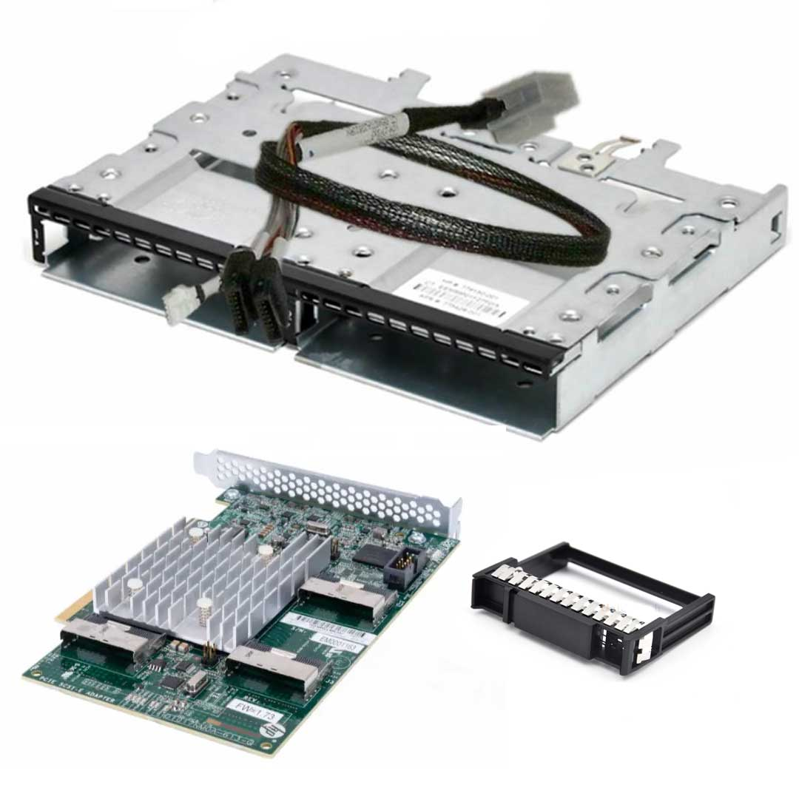
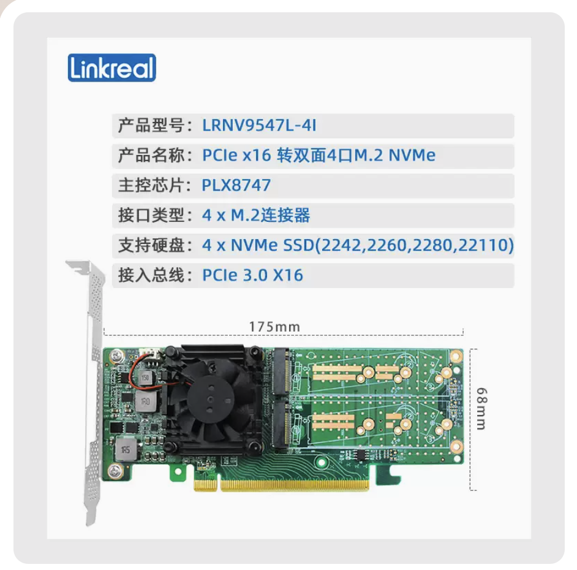
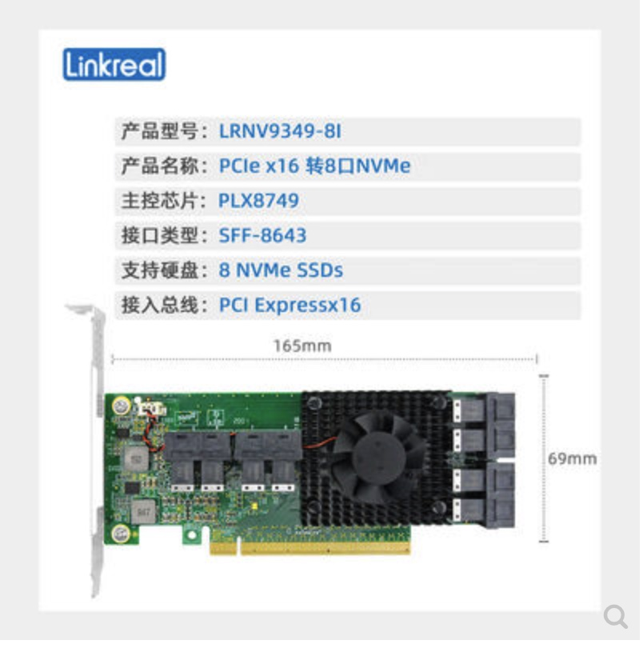

.. _hpe_dl160_gen9_hard_drive_kits:

===================================
HPE DL360 Gen9服务器硬盘组件
===================================

根据 `HPE ProLiant DL360 Gen9 Server - Option Parts <https://support.hpe.com/hpesc/public/docDisplay?docId=c04444424&docLocale=en_US>`_ 可以了解到我在去年购买的 :ref:`hpe_dl360_gen9` 可扩展的存储结构:

- 默认提供8个 2.5"硬盘安装，采用SATA/SAS架构，这种硬盘架构性能受限于SATA/SAS接口，实际上并不能完全发挥现在 :ref:`nvme` 存储的性能。但是胜于通用性较好，无需再购买扩展硬盘组件
- :ref:`hpe_dl360_gen9` 支持通过 :ref:`pcie` 插槽转接 :ref:`u2` 或者 :ref:`m2` 接口的 :ref:`nvme` ，可以实现存储性能的极大提升:

.. csv-table:: :ref:`hpe_dl360_gen9` 存储性能加速 :ref:`nvme` 扩展套件
   :file: hpe_dl160_gen9_hard_drive_kits/hard_drive_kits.csv
   :widths: 80,20
   :header-rows: 1

NVMe双SSD扩展套件
=====================

`HPE DL360 Gen9 NVMe 2 SSD Express Bay Enablement Kit | 764628-B21 <https://www.expresscomputersystems.com/products/764628-b21>`_ 支持2个NVMe SSD设备，通过PCIe转接卡链接服务器。这需要占用一个PCIe插槽安装转接卡。

实际上仔细看HPE的扩展套件，也是采用了 PCIe 转接卡转接 :ref:`u2` 接口的NVMe SSD硬盘，所以你完全可以淘宝自购转接卡来代替官方的扩展套件(但是可能不能固定好插线，所以热插拔会有影响)

最佳方案(构想)
=================

如果你想将 :ref:`hpe_dl360_gen9` 转化成高性能存储服务器，可以采用 :ref:`pcie` :ref:`nvme` 存储方案:

:ref:`hpe_dl360_gen9` 扩展性不佳，即使升级了BIOS，也仅能实现 :ref:`pcie` slot 1 :ref:`pcie_bifurcation` 拆分成 两个 x8 ，实际上还是浪费了 PCIe x16 的高速带宽。所以升级存储服务的方案是充分使用服务器的两个 PCIe 3.0 slot :

- :ref:`hpe_dl360_gen9` 的 PCIe slot 1 (x16) 和 slot 2 (x8) 是连接CPU 1，PCIe slot 3(x16) 连接CPU 2: 所以要充分发挥存储性能，就需要采用 slot 1 + slot 3 (都 :ref:`pcie_bifurcation` 拆分成4个 x4)能够实现满配运行的8个 PCIe 3.0 NVMe 存储(采用 :ref:`m2` 或 :ref:`u2` )

性价比方案
-----------

:ref:`hpe_dl360_gen9` 扩展性不佳，即使升级了BIOS，也仅能实现 :ref:`pcie` slot 1 :ref:`pcie_bifurcation` 拆分成 两个 x8 ，实际上还是浪费了 PCIe x16 的高速带宽。比较理想的 :ref:`pcie_bifurcation` 拆分是将 x16拆分成 4个 x4 PCIe lane，这样每个 x4 PCIE lane可以实现 4GB/s (每个PCIe 3.0 lane是 8Gbps，相当于1GB/s)带宽，可以满足 PCIe 3.0 NVMe 3.5GB/s 传输:

- 如果不追求热插拔(数据中心需求)，可以采用 :ref:`m2` 接口 :ref:`nvme` 的 :ref:`pcie_bifurcation` 拆分卡，性价比最高:

  - :ref:`m2` 接口 :ref:`nvme` 大多数民用级存储价廉物美，购买二手企业级 m.2 接口NVMe存储也非常经济

最佳方案
--------------

我个人认为最好的方案是采用 :ref:`u2` 接口的企业级NVMe SSD磁盘，二手的也不贵，用来组建高性能存储是最佳选择:

- :ref:`u2` 接口支持热插拔，并且U.2接口SSD磁盘几乎都是企业级，可靠性和耐久性远超民用级SSD磁盘
- 需要对 :ref:`hpe_dl360_gen9` 做一些改造，拆除掉默认的 SATA/SAS 接口背板，直接将 ``SFF-8643转U.2 (SFF-8639) NVMe U2转接线`` 和 :ref:`u2` 接口SSD硬盘对接
- 同样使用 slot 1 和 slot 3 :ref:`pcie_bifurcation` 硬件拆分卡拆分成 4个 x4(共计8个转接口)，连接8块 U.2接口SSD磁盘

.. note::

   `SFF-8643转U.2 (SFF-8639) NVMe U2转接线SSD硬盘数据线65CM <https://item.taobao.com/item.htm?spm=a230r.1.14.59.22ee7127XZPbE9&id=654397297783&ns=1&abbucket=17#detail>`_ 大约300元 (每根 36.50 元 x8)

   .. figure:: ../../../../_static/linux/server/hardware/hpe/sff-8643_u.2.jpg

参考
=======

- `HPE ProLiant DL360 Gen9 Server - Option Parts <https://support.hpe.com/hpesc/public/docDisplay?docId=c04444424&docLocale=en_US>`_
- `HPE DL360 Gen9 NVMe 2 SSD Express Bay Enablement Kit | 764628-B21 <https://www.expresscomputersystems.com/products/764628-b21>`_
