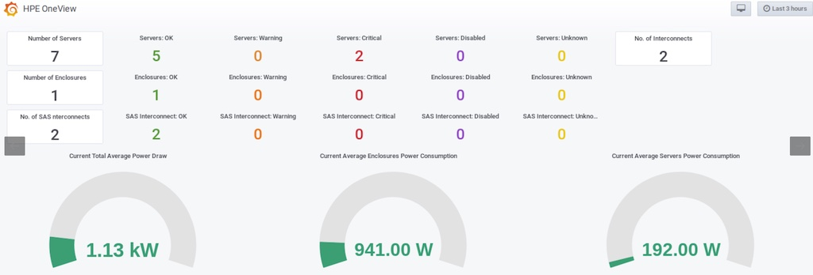
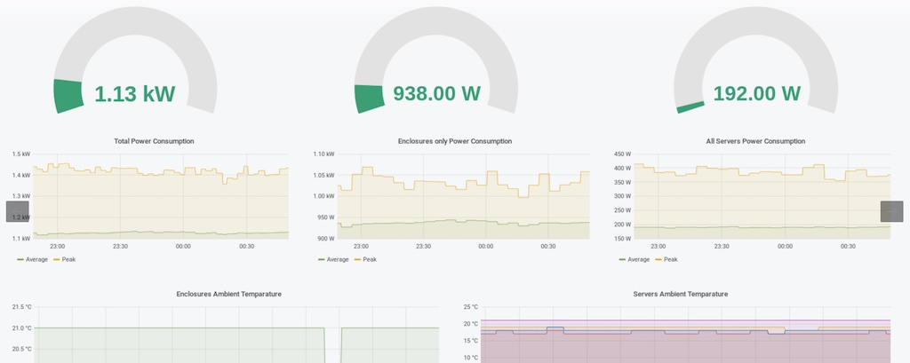

.. _hpe_server_monitor:

========================
HPE服务器监控
========================

我在自己的 :ref:`hpe_dl360_gen9` 服务器上构建硬件监控，基于 :ref:`grafana` 来观察:

- 硬件是否工作正常，例如内存模块、风扇、主板等
- 监控服务器温度，特别是处理器和GPU以及磁盘

HPE公司提供了一个

处理器
=========

Intel 和 AMD 都开发了针对自家处理器的性能监控调试工具:

- :ref:`intel_pcm`
- :ref:`amd_uprof`

如果要采用通用型监控处理器温度，则可以采用 :ref:`lm_sensor`

基于 :ref:`pcm-exporter`
--------------------------

采用 :ref:`intel_pcm` 官方提供的 :ref:`pcm-exporter` 可以精细化监控Intel处理器(脑洞: 对于 :ref:`kvm` 虚拟化的处理器，能否模拟使用Intel PCM来监控?)，直接输出 :ref:`grafana`

基于 :ref:`amd_smi_exporter`
-----------------------------

由于 :ref:`amd_uprof` 尚未支持 :ref:`metrics` ， 目前还不能基于uProf来构建AMD处理器的监控。不过，AMD开源了基于AMD SMI库输出为metrics的 :ref:`amd_smi_exporter` ，目前还没有完整方案，但可以尝试。

基于 :ref:`hp_ilo`
====================

结合 :ref:`prometheus`
------------------------

:ref:`hp_ilo` 提供了大量的基础监控数据，有人开发了 `HP iLO Metrics Exporter (GitHub) <https://github.com/infinityworks/hpilo-exporter/>`_ 可以直接将 :ref:`hp_ilo` 监控数据输出为 :ref:`metrics` 。并且这个 :ref:`prometheus_exporters` 被 `greenweb-cloud prometheus_exporters (GitHub) <https://github.com/greenweb-cloud/prometheus_exporters>`_ (这个项目综合了很多开源的exporter)收录。对应于 ``HP iLO Metrics Exporter`` 有一个 :ref:`grafana` `Dashboard HP iLo <https://github.com/infinityworks/hpilo-exporter/>`_ 可以观察硬件设备是否工作正常::

   0 - OK
   1 - Degraded
   2 - Dead (Other)

结合 :ref:`influxdb`
----------------------

:ref:`influxdb` 有一个更好的结合 :ref:`hp_ilo` 监控方案，对应的 :ref:`grafana` Dashboard案例:

- `Grafana Dashboard: HP ProLiant MicroServer Gen8 <https://grafana.com/grafana/dashboards/11832-hp-proliant-microserver-gen8/>`_
- `Grafana Dashboard: HP ProLiant DL380p Gen8 <https://grafana.com/grafana/dashboards/10192-hp-proliant-dl380p-gen8/>`_

可以看到社区提供的 InfluxDB 有丰富的iLo集成数据，可以精细化监控服务器的温度和主频。

基于 :ref:`ipmi`
======================

- :ref:`prometheus_exporters` 有一个官方 ``ipmi_exporter`` 可以基于 :ref:`ipmi` 输出 :ref:`metrics` 。使用 :ref:`grafana` `Dashboard IPMI Exporter <https://grafana.com/grafana/dashboards/15765-ipmi-exporter/>`_

- :ref:`node_exporter` with :ref:`ipmitool` text plugin 可以使用 :ref:`grafana` `Dashboard IPMI for Prometheus <https://grafana.com/grafana/dashboards/13177-ipmi-for-prometheus/>`_ 

这样可以用来监控大规模服务器集群，并且生成告警。

基于 :ref:`lm_sensor`
========================

`sensor-exporter (GitHub) <https://github.com/ncabatoff/sensor-exporter>`_ 基于 :ref:`lm_sensor` 提供了温度和风扇转速的 :ref:`metrics` 输出。对应 `Grafana Dashboard: Sensors <https://grafana.com/grafana/dashboards/237-sensors/>`_ 提供了监控案例

基于 HPE OneView
===================

HPE OneView 是HPE官方开发的监控服务器硬件和电路连接模块的软件，提供了 REST API 来搜集信息: power consumption (average and peak), ambient temperature, CPU utilization 等。基于 HPE OneView 有一些第三方监控插件:

- `hpe-oneview-prometheus (GitHub) <https://github.com/mpolski/hpe-oneview-prometheus>`_ 输出可以被 :ref:`prometheus` 采集的 :ref:`metrics` ，并且有一个配套的 :ref:`grafana` `Dashboard ID 10233 <https://grafana.com/dashboards/10233>`_ 提供各个组件的状态监控:

不过这个监控主要是布尔值，也就是主要判断设备是否工作正常。

HPE Storage Array Exporter
===========================

`Get started with Prometheus and Grafana on Docker with HPE Storage Array Exporter <https://developer.hpe.com/blog/get-started-with-prometheus-and-grafana-on-docker-with-hpe-storage-array-exporter/>`_ 提供了采用官方 ``HPE Storage Array Exporter`` 实现 :ref:`prometheus` 集成监控。这是一个企业级解决方案，适合集成到 Kubernetes 监控系统。

不过，我没有 ``HPE Storage Array`` 硬件设备，这里仅记录备用。

`Integration of HPE OneView with Prometheus <https://hewlettpackard.github.io/hpe-solutions-openshift/44-synergy/Additional-Features-and-Functionality/Integration-HPE-OneView-with-Prome.html>`_ 是HPE提供的集成到 :ref:`openshift` 部署方案，也可以参考。

.. note::

   根据资料对比，我准备实现:

   - 采用 :ref:`prometheus` 结合 ``ipmi_exporter`` 实现一个通用的服务器监控(适合任意服务器品牌)
   - 采用 :ref:`influxdb` 结合 ``iLo`` 实现一个针对HP服务器的特定监控
   - 采用 :ref:`lm_sensor` 结合 `sensor-exporter (GitHub) <https://github.com/ncabatoff/sensor-exporter>`_ 尝试做一个简化版温度监控
