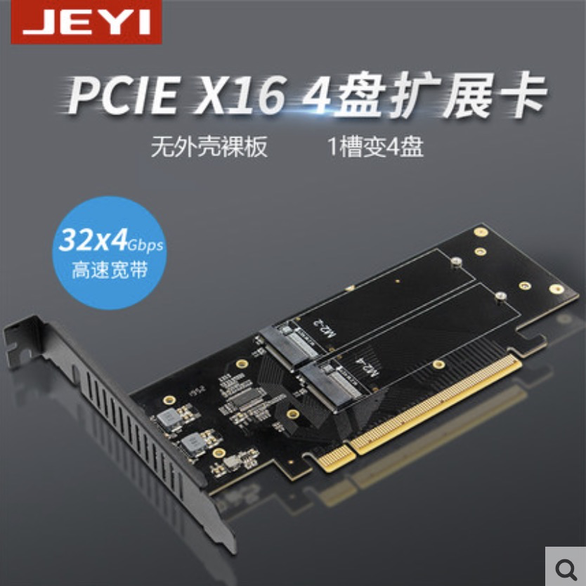
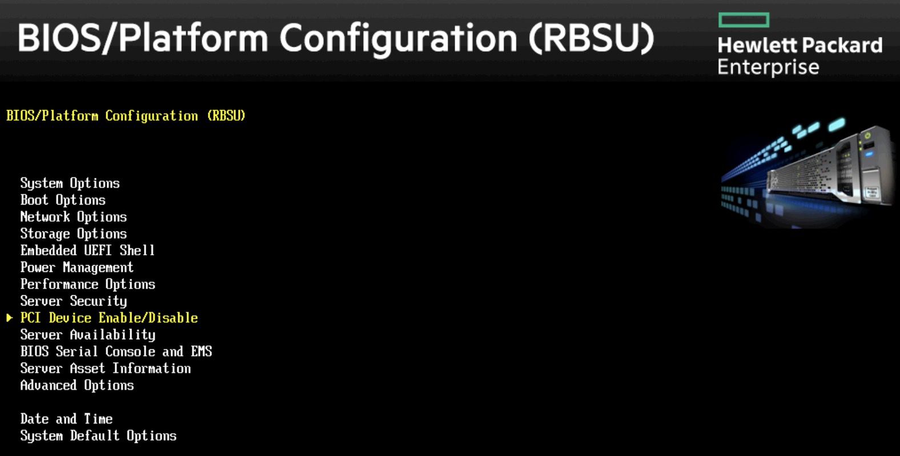
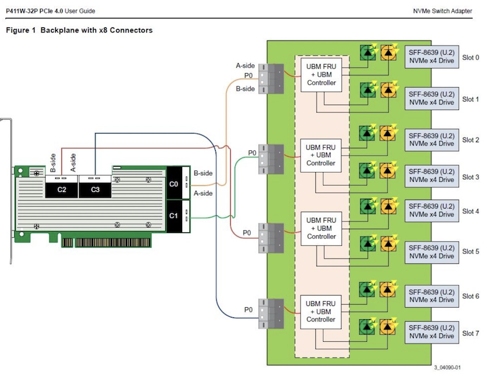

.. _pcie_bifurcation:

=========================
PCIe bifurcation
=========================

:ref:`hpe_dl360_gen9` 支持PCIe直接使用NVMe存储，这样可以在服务器上实现高性能存储集群。(原厂的 U.2 接口NVMe SSD存储升级套件实在成本太高)

最初构想方案(验证存在限制)
===========================

.. warning::

   请注意， :ref:`hpe_dl360_gen9` 只支持第一个PCIe 3.0 x16的bifurcation功能，并且只支持 ``Dual PCIe x8 slot`` ，也就是只能切分成2个 ``x8`` 。所以最多只能在Slot 1上支持2块NVMe SSD。

   请购买 ``双盘NVMe扩展卡`` ，我购买4盘位NVMe扩展卡实际上上浪费了资源，并不是很好的选择。

在淘宝上可以购买到 PCIe X16 四盘NVMe扩展卡:

.. figure:: ../../../../_static/linux/server/hardware/hpe/pcie_nvme_extendcard-1.png
   :scale: 40

.. figure:: ../../../../_static/linux/server/hardware/hpe/pcie_nvme_extendcard-2.png
   :scale: 40

PCIe bifurcation
====================

需要注意，扩展卡是 PCIe x16 规格的，为了能够支持4个NVMe m.2 存储，需要将这个 X16 分成4个 X4 才能支持4个NVMe盘。需要主板支持一种称为 ``PCIe bifurcation`` 技术，这样在主板BIOS中可以将 PCIe X16 改成 ``x4x4x4x4``

.. figure:: ../../../../_static/linux/server/hardware/hpe/pcie_bifurcation-1.png
   :scale: 40

参考HP官方文档，DL360 gen10 是支持 PCIe Bifurcation 的:

``System Configuration > BIOS/Platform Configuration (RBSU) > PCIe Device Configuration > PCIe Bifurcation Options``

对于 :ref:`hpe_dl360_gen9` 我执行完成 :ref:`dl360_bios_upgrade` 然后经过多方验证，发现 :ref:`hpe_dl360_gen9` 对 ``PCIe bifurcation`` 支持有限，见下文。

.. note::

   :ref:`hpe_dl360_gen9` 的第一个 ``主PCIe3.0 x16`` 只支持对半分，如果不想投入太高成本，则可以选择购买 双盘位NVMe直通扩展卡，配合 ``Slot 2`` 的第3个NVMe SSD，也能够实现成本最低性能最好的存储扩展方案。

PCIe设备和bifuration
=======================

参考 `HPE Proliant dl160 gen9 bifurcation <https://community.hpe.com/t5/Servers-General/HPE-Proliant-dl160-gen9-bifurcation/td-p/7133232#.YXdM-y8RppQ>`_ 提到:

- 有人提出 DL360和DL380更新到最新的Bios 2.90也没有出现 ``pcie options`` 选项，不过， ``dual bifuration`` 支持是从 2016 年开始的，在 `HPE UEFI System Utilities and Shell Release Notes for HPE ProLiant Gen9 Servers <https://support.hpe.com/hpesc/public/docDisplay?docLocale=en_US&docId=c05060771>`_ 文档第5页(2016年文档)有说明::

   Addedsupportto configurethe systemto bifurcatePCIe Slot 1 on the DL360Gen9 or PCIeSlot 2 on the DL380Gen9

也就是说对于 DL360 Gen9 是支持Slot 1的 ``PCIe bifurcation`` ，对于 DL380 Gen9 则支持 Slot 2的 ``PCIe bitfurcaton``

- HP的人说DL360和DL380 Gen9是支持，但是需要PCIe扩展卡厂商的部件适配bifurcate，部件需要和firmware和驱动适配正确的速率才能实现 x8 / x4 。所以，这可能是没有插入PCIe扩展卡就看不到 ``PCIe Device Configuratio`` 选项的原因？

参考 `HPE Gen9 with asus hyper m.2 x16 card v2 <https://linustechtips.com/topic/1279595-hpe-gen9-with-asus-hyper-m2-x16-card-v2/>`_ 提到有人购买了 Asus hyper m.2 x16 card v2 以及 4块 Samsung 970 plus:

- ``PCIe bifurcation`` 需要CPU和主板同时支持，Intel E5 v3处理器支持 ``40个`` PCIe 路径(lanes)

参考 `Setting Gpu Configurations; Selecting Pcie Bifurcation Options; Configuring Specific Pcie Devices - HPE ProLiant Gen10 User Manual <https://www.manualslib.com/manual/1391841/Hpe-Proliant-Gen10.html?page=120>`_ 说明了对于GPU设备::

   System Configuration > BIOS/Platform Configuration(RBSU) > PCIe Device Configuration > GPU CFG

有2个选项::

   4:1—Maps 4 PCIe slots to each installed processor
   8:1—Maps all slots to a single processor

我的选择
============

直通扩展卡(部分实现bifurcation)
----------------------------------

我购买了 3个 :ref:`samsung_pm9a1` 以及 佳翼M2X16四盘NVMe扩展卡( 宣传称 ``支持PCIE 4.0 GEN4， 向下兼容PCIE3.0 GEN3`` )。我比较担心能否配合DL 360 Gen9实现 ``PCIe bifurcation``

- 我最初尝试将 NVMe扩展卡 安装在 Slot 3上(因为我想能在 Slot 1上安装显卡，然后可以还留出空间在Slot 2上安装第二个NVMe扩展卡)，但是确实启动以后没有找到PCIe配置选项

- 将 NVMe 扩展卡 改到安装到 Slot 1，重新启动系统，检查 ``BIOS/Platform Configuration(RBSU)`` 配置选项，依然没有看到 ``PCIe Device Configuration`` 配置入口(只看到 ``PCI Device Enable/Disable`` 激活关闭设置):

`HPE Proliant dl160 gen9 bifurcation <https://community.hpe.com/t5/Servers-General/HPE-Proliant-dl160-gen9-bifurcation/td-p/7133232#.YXdM-y8RppQ>`_ 中答复中也提到了，这个功能需要扩展卡厂商支持firmware，有人换了6个扩展卡都没有看到BIOS能够显示出 ``PCIe Device Configuration`` 配置项。

看起来我购买的 ``佳翼M2X16四盘NVMe扩展卡`` 也同样没有适配成功???

真是让人非常沮丧，折腾这么久，查询很多资料都没有明确的 HPE Gen9 解决 PCIe bifurction 的解释和适配方法，虽然2016年 `HPE UEFI System Utilities and Shell Release Notes for HPE ProLiant Gen9 Servers <https://support.hpe.com/hpesc/public/docDisplay?docLocale=en_US&docId=c05060771>`_ 提到了支持，但是该文档最新2021年版本已经找不到这项说明了。

柳暗花明又一村...

我在DL360 Gen9服务器上安装 :ref:`tesla_p10` 启动时遇到需要 :ref:`dl360_gen9_large_bar_memory` 问题，HPE DL360 Gen9的 ``PCI Express 64-Bit BAR Support`` BIOS配置选项隐藏在没有任何提示的 ``Service Options`` 菜单中(需要在 ``ROM-Based Setup Utility (RBSU)`` 界面通过 ``Ctrl-A`` 激活)，但是没有任何菜单引导。我是通过Google文档才找到方法...

原来在这个隐藏的 ``Service Options`` 中提供了很多高级功能，其中就包括了 ``Primary Riser PCIe x16 Bifurcation``

HPE DL360 Gen9 BIOS设置Bifurcatio
~~~~~~~~~~~~~~~~~~~~~~~~~~~~~~~~~~

- 启动服务器，在BIOS提示时，按下 ``F9`` 进入 ``ROM-Based Setup Utility (RBSU)``
- 在RBSU中，按下 ``Ctrl + A`` ，进入 ``Service Options``
- 通过上下键移动菜单高亮，选择 ``Primary Riser PCIe x16 Bifurcation`` ，然后按下回车
- 此时可以看到提供了2个选项:

  - ``PCIe x16 slot`` 保持默认的 ``PCIe 3.0 x16`` 直接输出
  - ``Dual PCIe x8 Slot`` 将 ``第一个主 PCIe 3.0 x16`` 分成2个 ``x8`` 通道

.. figure:: ../../../../_static/linux/server/hardware/hpe/rbsu_pcie_bifurcation.png
   :scale: 40

.. warning::

   很不幸，HPE DL360 Gen9的 ``PCIe Bifurcation`` 有很大的限制，不能将 ``x16`` 切分成 ``x4x4x4x4`` ，只能对半分成 ``x8x8`` ；并且 ``Bifurcation`` 仅限于第一个主 PCIe 插槽。

   也就是说，实际上即使使用了第一个插槽的 ``PCIe Bifurcation`` 也就只能增多一个 NVMe SSD存储，实现价值大打了折扣，并没有我最初设想的能够在一个 ``PCIe 3.0 x16`` 上连接4个NVMe SSD存储实现阵列。

很遗憾，HP DL360只能实现在第一个PCIe 3.0x16分成2个 ``x8`` ，所以我最初想通过 ``佳翼M2X16四盘NVMe扩展卡`` 并行使用 ``4个 NVMe SSD`` 的方案并不能实现。通过直通方式只能连接 ``2个 NVMe SSD`` 使得这个方案非常鸡肋(不过也许性能可以较好)。

出于成本和性能，我还是决定采用此方案:

- 主 ``PCIe 3.0 x16`` Slot 1 通过DL 360 Gen9内置 PCIe bifurcation 分成 ``x8 x8`` ，安装 ``佳翼M2X16四盘NVMe扩展卡`` (沉没成本，虽然不能充分利用4盘位) ，使用 2 块 :ref:`samsung_pm9a1`
- ``PCIe 3.0 x8`` Slot 2不支持PCIe bifurcation，所以购买单盘NVMe扩展卡
- 主机总共安装3个NVMe SSD:

  - 由于 Slot 1 和 Slot 2 都是直连在 CPU 1上，所以可以获得极佳的互访性能
  - 采用 :ref:`iommu` 由第一层 :ref:`kvm` 虚拟机读写，力求能够实现 native 性能
  - 运行3个 :ref:`ceph` 虚拟机分别处理 pass-through 的NVMe存储，虚拟机采用cpuset方式绑定到CPU 1上，结合 :ref:`numa` 实现性能最大化

我有一个疑问，对于4盘位的 ``佳翼M2X16四盘NVMe扩展卡`` ，BIOS只支持 ``x8 x8`` ，那么究竟是安装在哪个盘位的磁盘被识别出来呢，实践记录如下:

- 按照上文配置好 ``Primary Riser PCIe x16 Bifurcation >> Dual PCIe x8 slot`` ，重新启动服务器，登陆系统
- 检查磁盘 ``fdisk -l | grep nvme`` 可以看到现在识别了2块NVMe SSD::

   Disk /dev/nvme0n1: 953.89 GiB, 1024209543168 bytes, 2000409264 sectors
   Disk /dev/nvme1n1: 953.89 GiB, 1024209543168 bytes, 2000409264 sectors

PLX主控扩展卡
----------------

根据网上搜索到到信息了解到，HP gent9 的服务器可以使用PLX主控芯片扩展卡( PLX 是PCIe交换和桥接芯片供应商 )，从淘宝上搜索无需主板支持 ``bifurcation`` 的扩展卡有两种芯片:

- ASM2824
- PLX8747 ( `Broadcom PEX8747 <https://www.broadcom.com/products/pcie-switches-bridges/pcie-switches/pex8747>`_ 就是收购PLX的产品线的PLX8747)

`Multi-NVMe (m.2, u.2) adapters that do not require bifurcation <https://forums.servethehome.com/index.php?threads/multi-nvme-m-2-u-2-adapters-that-do-not-require-bifurcation.31172/>`_ 汇总了国外网友搜集的无需主板bifurcation功能就可以支持多个NVMe存储的PCIe扩展卡(aliexpress上由2家中国销售公司售卖的)，主控芯片绝大多数是PLX 8724/8747/8748，少量是ASM芯片。

我购买了 ``M.2 NVMe SSD扩展卡 PCIe3.0 X8X16扩2口4口M2 PLX8747`` ：

- 目前google到的英文资料基本都是采用PLX芯片成功的
- PLX是专注于PCIe连接的厂商，被很多NVMe Extend Card采用

  - `SUNWEIT PCI-E 3.0 X16 PEX8747 4-M.2 NVMe Extend Card <http://www.sunweit.com/product/251-en.html>`_
  - `华擎X99 WS-E/10G <http://www.asrock.com/news/index.cn.asp?id=2565>`_ (华擎是从华硕分出的主板制造厂商，售价较低但做工还比较扎实，比不上华硕但是同价位质量较优 `感觉华擎的东西做工用料都很扎实呀，为什么都说是二线？ <https://www.zhihu.com/question/354822608>`_ ) ，在HP论坛中有信息显示华擎ASrocck的NVMe PLX芯片扩展卡可以在HP gen9服务器上正确工作

.. note::
   PLX是半导体行业巨头新博通(Broadcom)旗下企业，原先是安华高公司于2014年收购PLX，2016年安华高公司收购Broadcom后改名Broadcom Limited(新博通)。( `博通又准备收购芯片公司？|半导体行业观察 <https://zhuanlan.zhihu.com/p/70074321>`_ )

- 需要注意，接口应该是 PCIe3.0 X16 ，这样拆分4个以后才是 x4x4x4x4 ，可以满足较高速的 NVMe 读写

.. figure:: ../../../../_static/linux/server/hardware/hpe/plx8747_pcie_switch_card.jpg
   :scale: 80

既然通过PLX主控芯片实现 ``bifurcation`` ，所以也就无所谓安装在 ``Slot 1`` 还是 ``Slot 3`` ；考虑到 ``Slot 2`` 和 ``Slot 3`` 之间空间较大，可以安装2个 PLX主控扩展卡 :

- ``Slot 2`` 是 ``x8`` 接口，可以安装 双盘位 扩展卡
- ``Slot 3`` 是 ``x16`` 接口，可以安装 四盘位 扩展卡
- 总共可以扩展安装 ``6个`` NVMe SSD存储: 需要注意 ``Slot 2`` 和 ``Slot 3`` 分别属于 CPU1 和 CPU2，所以应该分配给不同的虚拟化存储集群:

  - ``Slot 2`` 上2个 NVMe SSD 可以组合成 ``RAID 0`` (性能最强) 或者 ``RAID 1`` (数据安全性高)；或者分配给2个 :ref:`gluster` 虚拟机组件镜像模式的GlusterFS集群提供大容量近线数据归档
  - ``Slot 3`` 上4个 NVMe SSD 可以选择3个分配给3个 :ref:`ceph` 虚拟机组建成 Ceph 高可用高性能虚拟化存储集群；另外1个则分配给物理主机，作为 :ref:`docker` 和 :ref:`kvm` 的镜像存储，以及容器和虚拟机本地挂载存储，以获得性能最大化

.. note::

   为了降低成本，并且能够使用原生的PCIe NVMe存储访问，所以我最终退掉了新购买的 ``M.2 NVMe SSD扩展卡 PCIe3.0 X8X16扩2口4口M2 PLX8747`` 扩展卡，还是采用HP DL360 Gen9直接访问存储。也就是采用前一个方案。

PCIe switches性能
==================

Intel的北桥集成在CPU里面，所以原生PCIe通道的数量由CPU决定，主板可以根据需要对这些通道进行重新组合(比方x16 = 1x16 或 1x8+1x8 或 1x8+1x4+1x4)以满足多个pci的需要。

.. note::

   我所使用的二手服务器 :ref:`hpe_dl360_gen9` 使用的处理器是 :ref:`xeon_e5-2670_v3` ，每个处理器提供了 40 个PCIe Lanes

PCIE Switch (pcie扩充器/转换器/桥) 提供了通道数扩充以及拆分功能，例如 PLX 8747 就可以将一组x16扩充成两组x16，也可以拆分成 x8x8 或者 x4x4x4x4。网上资料显示两路扩展(两组x16)性能可能有损失。

注意配置的拓扑 `Exploring the PCIe Bus Routes <https://link.zhihu.com/?target=http%3A//www.cirrascale.com/blog/index.php/exploring-the-pcie-bus-routes/>`_ :

- 如果主板使用PLX芯片，则应该将需要通讯的两个GPU位于同一个PLX芯片下面
- 如果两个gpu位于不同的PLX芯片下, 但位于同一个cpu下, 性能次之: 有7%的带宽损失(9.8 vs 10.6 gb/s) 和 7.9 vs 7.7微秒的延迟
- 两个gpu位于不同cpu下(自然也不同plx下)性能最次: 有62%的带宽损失和316%的延迟增加 (4 vs 10.6 gb/s, 32.1 vs 7.7)

我的连接构思:

- 由于 Slot1 和 Slot2 是连接在CPU 1上的PCIe，所以如果考虑多个GPU，可以在Slot1和Slot2上安装2块PGU卡，在Slot 3上安装NVMe存储卡，这样确保GPU之间通讯快速。
- 如果使用1个GPU卡 :ref:`tesla_p10` ，则安装在 Slot 3上，在Slot 1 和 Slot 2上安装NVMe存储扩展开(我就采用这个模式)

神奇PCIe拆分NVMe存储
=======================

在服务器领域，例如 :ref:`hpe_dl360_gen9` 提供了SFF安装模式 ``4 SAS/SATA (Drive 1-4)+6 NVMe (Drive 5-10)`` ，可以将主机最后6个盘位替换成U.2接口的NVMe SSD磁盘。在 `Dell PowerEdge R640：NVMe直连、NDC网卡、PERC10一览
<https://mp.weixin.qq.com/s?__biz=MzAwODExNjI3NA==&mid=2649776369&idx=1&sn=6d90101ad858822ee1ce42db2560edea&chksm=837701acb40088ba205a9d1f29c19ae62dea57bccd1c60e5b36ba67b02181e953827bb290ed8&token=511876318&lang=zh_CN&scene=21#wechat_redirect>`_ 可以看到Dell服务器也是通过将 Xeon 处理器内置的 PCIe lanes 分出一部分专用于连接 NVMe SSD。这种模式节约了宝贵的PCIe插槽，同时又提供了满足大量NVMe存储分别连接不同的PCIe lanes的需求，可以实现直通连接，在 :ref:`iommu_infra` 实现pass-through给虚拟机，实现高性能虚拟化存储。

:ref:`pcie` :

- 3.0 的单通道性能是传输速率 984.6MB/s ，使用 ×4 规格已经达到 3.938GB/s ，可以满足 PCIe 3.0 NVMe 的带宽需求
- 4.0 的单通道性能是传输速率 1.969GB/s ，使用 ×4 规格达到 7.877GB/s ，可以满足最快的PCIe 4.0 NVMe :ref:`samsung_pm9a1` 以及对应企业级 980 Pro的带宽

传统的RAID技术，在不断推陈出新的NVMe存储技术发展下，也出现了NVMe RAID卡，通过NVMe switch可以实现更多的NVMe设备直连。如果HBA卡没有提供内置的RAID功能，可以采用 :ref:`intel_vroc` 技术，实现全速率的NVMe组件RAID。在使用PEX88048主控芯片的NVMe Switch Adapter (Broadcom P411W-32P)，默认将PCIe 4.0 x16拆分成 4个x8 SFF-8654接口:

在不集联下一级PCIe Switch情况下，Broadcom P411W-32最多可拆分为32个PCIex1来连接SSD(牺牲了单盘带宽)，可以想象一下使用32个NVMe组建的阵列。

参考
===========

- `PCIe Switch Adapter：不只是NVMe HBA？ <https://zhuanlan.zhihu.com/p/219831641>`_
- `硬件杂谈：关于pcie拆分与plx芯片 <https://zhuanlan.zhihu.com/p/103929939>`_
- `请问pcie x16/x8以及sli/cfx对运算卡性能的影响? <https://www.zhihu.com/question/50238393/answer/120399606>`_
- `PCIe 4.0 SAS+NVMe RAID/HBA卡：最高读IOPS 300万、写24万 <https://mp.weixin.qq.com/s?__biz=MzAwODExNjI3NA==&mid=2649780116&idx=1&sn=a833bb9ffcb9b95b1b081321412e50f0&chksm=83770ec9b40087dfa2f3ac411bd66698e73580df088f5b40e9a6a25c814e41264bf2b7dd9133&token=934250801&lang=zh_CN&scene=21#wechat_redirect>`_
