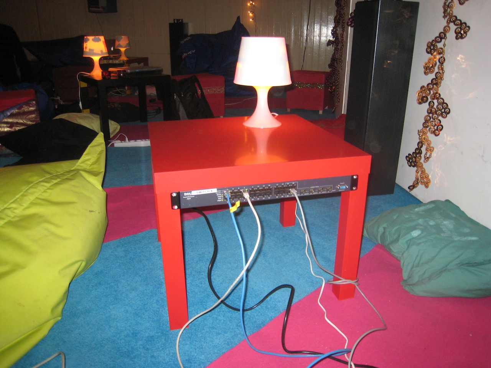
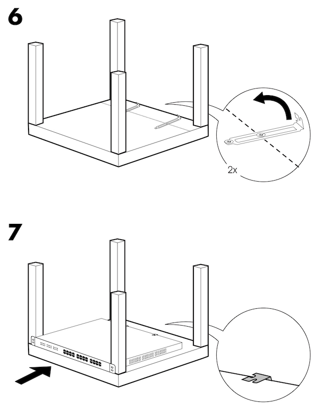
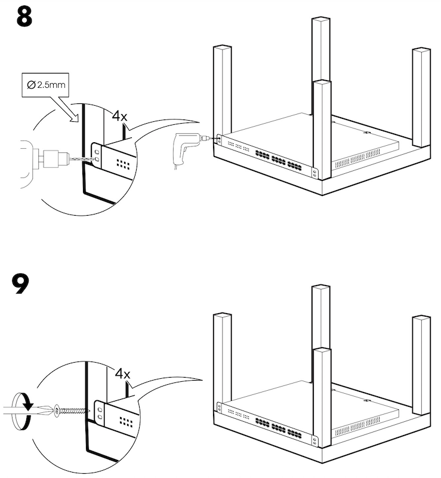

.. _lackpack:

==================
LackPack
==================

``LackRack`` 这个单词是 ``Lack`` 和 ``Rack`` 的组合，所谓 ``Lack`` 是指瑞典家具公司宜家推出的一款价廉物美的边桌(side table)，由于易于组装，并且尺寸正好适合机架服务器和交换机( ``Rack`` )组装成一个廉价机架，所以最早2010年被 `eth0:2010 Winterlan <https://wiki.eth0.nl/index.php/Eth0:2010_Winter>`_ 在客厅展示给大家。据 eth0:2010 说他们曾经在2009年见过Google工程师捣鼓过这种Lack table。

宜家提供了不同色彩的 Lack table:

.. figure:: ../../../_static/linux/server/hardware/lack_table.jpg

.. note::

   中国市场销售的 ``Lack`` 产品称为 ``拉克`` ，不仅有 ``55x55`` 的方形结构(99元，部分颜色促销价格49元)，还有 ``55x90`` 的长条形结构(199元)。看起来长条形比较适合机架式服务器，只是架构比较高。我感觉可以将2个促销价格(49x2=98元)组合成一个 ``55x110`` 的长桌来构建服务器堆叠。

经过简单的组装就可以实现一个非常完美的个人服务器机架，eth0.nl 甚至在官网提供了一个组装的经验手册 `lackrack.pdf <http://eth-0.nl/lackrack.pdf>`_ ，其中使用台式机的PCI插卡挡板作为固定部件的构思非常巧妙:

- 使用挡板弯折形成挂钩:

.. figure:: ../../../_static/linux/server/hardware/lackrack_1.png
   :scale: 80

- 勾住交换机边缘:

- 固定交换机:

- 组装使用经验:

  - 如果设备比较沉重，可以把LackRack翻过来面朝下，这样可以托住设备
  - 在装配时，第一个设备建议贴着桌面底部，这样比较容易对齐(当然如果LackRack是翻过来安装，这就比较容易了)
  - 可以在桌子上放一个灯来帮助你查看设备
  - 如果使用较多的LackRack，你可以用不同颜色的Lack Table来表示设备用途:

    - ``红色`` 表示关键服务
    - ``灰色`` 表示办公自动化
    - ``绿色`` 表示文件服务器
    - ``黑色`` 表示系统和网络管理
    - ...

参考
========

- `eth0: LackRack <https://wiki.eth0.nl/index.php/LackRack>`_