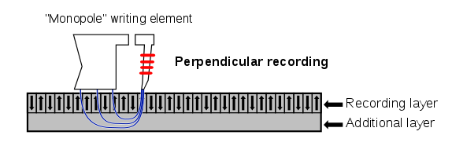
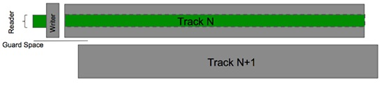
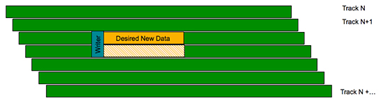

.. _hdd_pmr_cmr_smr:

============================================
机械硬盘(HDD)磁头PMR、CMR、SMR的区别和选择
============================================

最近几年，选购机械硬盘，常常会看到网上文章说 "千万不要选叠瓦盘" "性能差、易损坏" ，诸如此类。我在购买了 :ref:`hpe_dl360_gen9` 二手服务器做实验时，考虑构建一个虚拟化的 :ref:`gluster` ，想采用大容量机械硬盘来组成镜像卷glusterfs。当时没仔细调研，差点就交了学费，还好搜索补课，及时止损。以下简要说明所谓叠瓦、垂直，以及淘宝卖家的宣传甄别。

简单来说:

- 只有明确采用 ``CMR`` 技术的才是所谓的 **传统** ``垂直磁记录技术`` ，特点是缓存很小(不超过32MB)，目前市场上能够买到的最大CMR笔记本硬盘(2.5")只有希捷(三星)的2T 2.5"笔记本硬盘，其他厂商如西部数据最大规格只有1TB
- 如果没有说明，默认1T以上规格都是 ``SMR`` ，即所谓的 ``叠瓦式磁记录技术`` (叠瓦盘) ，性能差，使用寿命也差，唯一优势是容量大，只适合保存静态不反复修改和写入的数据
- 现在所有磁记录磁盘(机械硬盘，HDD)都是采用 ``PMR`` (Perpendicular recording) 垂直记录，因为在发明SMR之前，只有一种PMR记录技术，但是在发明了SMR之后，原先的PMR磁记录技术被重新命名成 ``CMR`` ，而 ``PMR`` 同时包括了 ``CMR`` 和 ``SMR``

总之，都是 ``PMR`` 垂直记录，只是原先保守但性能好寿命长的磁记录技术改名成 ``CMR`` ，而最新的叠瓦磁记录 ``SMR`` 都被包括在 ``PMR`` 大旗之下。

- PMR

- CMR

- SMR

叠瓦式有点相当于房屋铺屋顶瓦片，磁道之间小幅重叠，这样存储密度自然就增加了。但是叠瓦式磁记录技术牺牲的是稳定性和部分性能以及寿命：

叠瓦式擦除+覆写数据的操作需要磁头写入两次数据，需要先擦掉然后再写入，这样一来无疑是增加了硬盘的负载，让硬盘在工作的时候噪音更大，其寿命也会受到一定影响。

.. warning::

   淘宝买家在推销机械磁盘时候，都会说自己是垂直盘 ``PMR`` ，但如果没有表明是 ``CMR`` 就是 **假** 垂直盘，也就是 ``SMR`` 磁盘

WD西部数据
============

2020年初，WD西部数据公开了旗下硬盘使用SMR或CMR技术的型号规格( `Western Digital Comes Clean, Shares Which Hard Drives Use SMR <https://www.extremetech.com/computing/309730-western-digital-comes-clean-shares-which-hard-drives-use-smr>`_ )，目前在 `西部数据官方网上商城 <https://shop.westerndigital.com/>`_ 销售的机械硬盘产品的规格说明中都包含了 ``Recording Technology`` 说明，具体到每个型号采用CMR或SMR，所以你只要到官方网站查询一下就可以知道。

例如 `WD Blue PC Mobile Hard Drive <https://shop.westerndigital.com/products/internal-drives/wd-blue-mobile-sata-hdd>`_ 可以看到:

  - CMR: WD3200LPCX, WD5000LPCX, WD5000LPVX
  - SMR: WD10SPZX, WD20SPZX

.. note::

   西部数据使用色调风格来区分不同型号的硬盘使用场景::

   - 黑盘: 高性能
   - 蓝盘: 平衡
   - 绿盘: 节能(已并入蓝盘)
   - 红盘: NAS 级
   - 紫盘: 监控级
   - 金盘: 数据中心专用

参考
========

- `PMR, SMR, CMR, I-JUST-WANT-A-HDD-MR <https://blag.nullteilerfrei.de/2018/05/31/pmr-smr-cmr-i-just-want-a-hdd-mr/>`_
- `What WD and HGST hard drives are SMR? <https://hddscan.com/blog/2020/hdd-wd-smr.html>`_
- `Western Digital Comes Clean, Shares Which Hard Drives Use SMR <https://www.extremetech.com/computing/309730-western-digital-comes-clean-shares-which-hard-drives-use-smr>`_
- `WD Blud PC Mobile Hard Drive（WD在线商城) <https://shop.westerndigital.com/products/internal-drives/wd-blue-mobile-sata-hdd#WD20SPZX>`_
- `西部数据硬盘 篇一：绿盘、红盘、蓝盘、紫盘、黑盘和金盘的区别 <https://post.smzdm.com/p/aoow85z7/>`_
