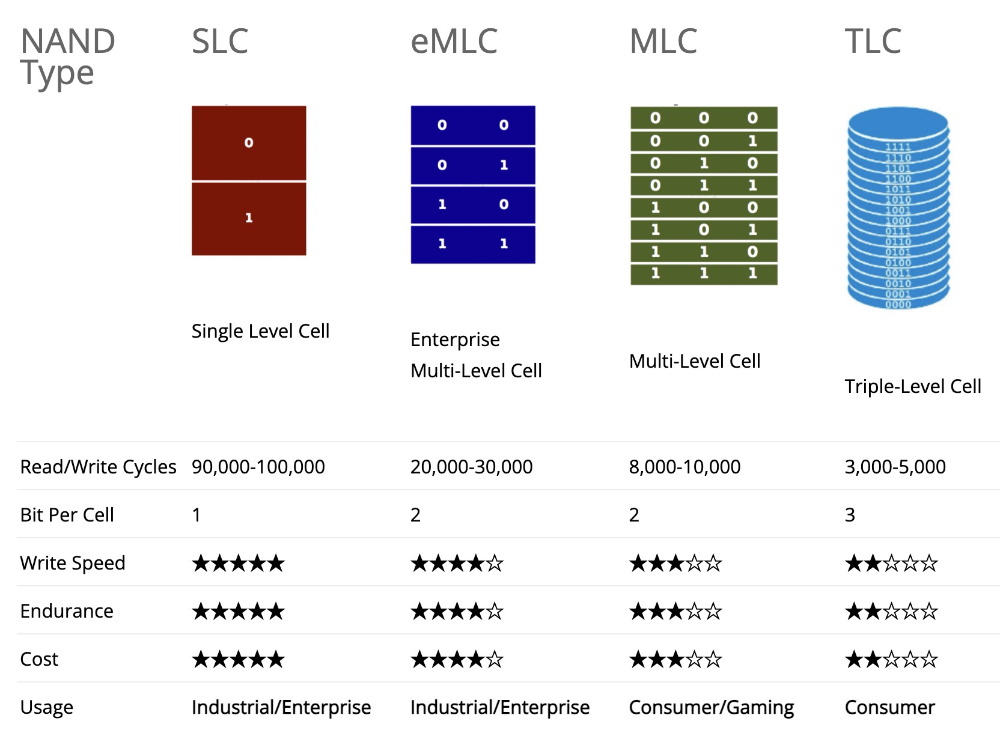
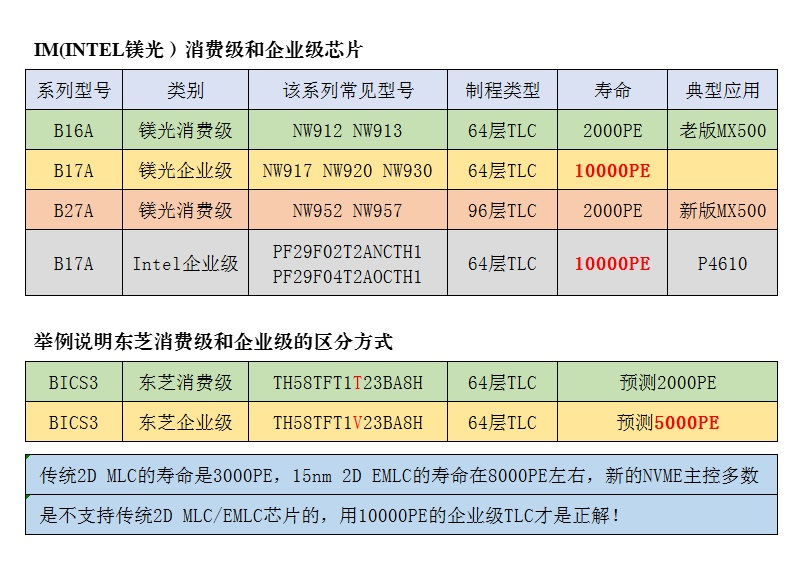
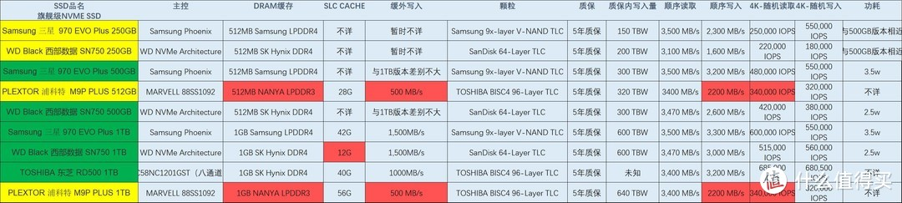

.. _nvme:

===============
NVMe存储
===============

在 SSD 技术领域，根据Memory Cells不同，分为 SLC, MLC, TLC, QLC 。目前(2021)，最主流的SSD存储技术是TLC，不过未来QLC将会取而代之成为主流。此外，根据接口协议不同，SSD又分为SATA和NVMe。

Multi-Layer SSDs
===================

NAND flash cell按照每个cell的bit数量划分为:

- Single-Level Cell (SLC) : 每个cell存储1个bit
- Multi-Level Cell (MLC)  : 每个cell存储2个bit
- Triple-Level Cell (TLC) : 每个cell存储3个bit
- Quad-Level Cell (QLC) : 每个cell存储4个bit

.. figure:: ../../../../_static/linux/server/hardware/storage/nand_cell_bits.jpg
   :scale: 70

QLC可以在一个cell中存储4倍于SLC的数据，所以容量可以做到更大。但是也带来了速度相对缓慢和稳定可靠性下降的问题。通常情况下SLC SSD更为快速和可靠，但是价格昂贵，仅用于企业级存储。通常同样容量的MLC(例如三星980evo pro就是MLC，售价是采用TLC技术的980evo plus的2倍)。

此外SLC > MLC > TLC 主要性能差异在于一定容量写入后出现掉速。原因是cell单元的电位(bits)越多，控制就越负载，写入数据时间就越长，导致性能大幅下滑。

目前市场上已经很少见到SLC NVMe存储，而MLC则仅见于高性能数据中心使用场景(eMLC 也就是 Enterprise Multi-Level Cell)。TLC是现在最主流的NVMe存储，并且通过3D NAND技术弥补了性能和耐用性不足，实现了较好的性价比。QLC也逐渐开始流行，虽然和TLC相比速度和稳定性有差距，但是胜在售价低廉。

现代SSD为了优化性能，采用了多种方法：

- ``SLC-caching`` 加上 ``DRAM`` 缓存，也就是在NVMe SSD上添加一个 pseudo-SLC NAND (二级缓存)以及DRAM缓存(一级缓存)，这样可以在短时间，爆发类型工作负载是达到较好的性能。这种场景也是大多数PC和客户计算环境常见的。SLC缓存的模拟方式也有全盘模拟和部分空间模拟，全盘模拟效果最好，但是浪费空间，部分模拟是多数厂商的选择。除了全盘模拟和部分模拟，实际上还有动态及静态SLC Cache之分。静态SLC Cache往往在缓存用完后力不从心，而动态模拟SLC后来居上，速度曲线始终平滑。
- ``Garbage collection`` (垃圾回收)，也称为GC机制。具体就是将有效数据的block合并在一起形成更大的有效块，而将无效的block进行完全擦除，留出大量空白块。这种方式是的数据寻址更容易，降低主控压力；另一方面也是最重要的，为磨损均衡提供更多空白数据块，从而提升闪存颗粒的寿命和固态硬盘的使用寿命。
- ``TRIM``

.. note::

   更大的容量也会有更多的闪存颗粒，所以写入量也会变高。

在购买之前，请关注耐久性，也就是TBW，或者Maximum Terabytes Written(即可写多少太字节)

`TLC vs. QLC SSDs: What are the differences? <https://blog.synology.com/tlc-vs-qlc-ssds-what-are-the-differences>`_ 提供了性能评测，可以看到规律：

- 通常情况下，没有写满磁盘时，企业级TLC和消费级TLC的性能差距不大，但是QLC性能要差不少，特别是较深的队列(queue depths)
- 企业级TLC的优势在于接近满盘(65%)，比消费级TLC的连续读性能高65%(QLC接近TLC)，但是顺序写入反而是消费级TLC比企业级TLC略高；需要注意，此时QLC的性能跌倒非常差的地步
- 如果持续写磁盘，消费级TLC只能在开始时保持较高写入速率，但是迅速恶化只能达到企业级TLC的22%的写入性能，而QLC的性能更差

总之，如果要购买TLC的NVMe，建议购买企业级TLC，可以获得较为平衡的性能；实在经费紧张，也要购买消费级TLC 而不要购买消费级 QLC

SATA vs NVMe (m.2接口)
=========================

- SATA接口的最大传输速率是 600MB/s (对于机械硬盘最大200MB/s不成问题)，对于SATA SSD来说这个接口速度太慢了
- NVMe SSD的读取速度可以轻易超过 3500MB/s ，当前 PCIe Gen 4驱动器则推高到 7000MB/s

SATA依赖Advanced Host Controller Interface(AHCI)，在单个队列中只能处理32个指令；而在NVMe接口，最高有64k队列，每个队列可以同时处理最高64k条指令。同时，NVMe的CPU资源占用也远低于复杂的SATA。NVMe就像一个多核处理器，将较长的任务分割成较小的块并行处理，当使用32位队列深度时能够处理44万随机读IOPS和36万随机写IOPS。

M.2 接口是一种较新的接口类型。注意M.2 接口也有SATA SSD 和 NVMe SSD区分。

.. figure:: ../../../../_static/linux/server/hardware/storage/m.2_sata_nvme.jpg

3D NAND和VNAND
=================

传统的NAND cell是2D排列的，现代的3D NAND结合了TLC和QLC技术，达到了价格和容量以及性能和耐用性的平衡

选购思路
==========

- 对于重负载的存储，例如需要运行多个虚拟机的主机，需要采用较为稳定的MLC存储
- 对于性能要求不高且需要节约费用的大容量存储，则可以采用TLC（例如游戏盘，需要存储大量的游戏数据但是不会反复重写)
- 普通应用程序运行，可以采用平衡各方面较完善的 3D TLC

.. note::

   以下选购分类摘自

高端NVMe
---------------

推荐 ``三星970 EVO Plus`` 读取和写入纷纷超过3000MB/s，1TB版本拥有42G SLC缓存，缓外速度也是维持在1500MB/s，性能无可挑剔。

其次推荐西部数据的黑盘，不过SLC缓存少校，性能基本接近 三星970 EVO Plus

东芝RD500 1TB版本拥有40G 的SLC缓存，即使缓存用完也能保持1000MB/s以上的速度

中端NVMe
----------------

.. figure:: ../../../../_static/linux/server/hardware/storage/compare_nvme-1.jpg

推荐 ``西部数据的SN550（500G容量以上版本）`` 价格适中，虽然采用了无DRAM的方案，但是由于出色的缓外速度和SLC缓存，并未对SSD的性能造成比较大的影响。

此外，INTEL的660P，采用的QLC颗粒，提供了120G 的SLC缓存，如果价格非常低廉的话，作为游戏盘比较适合（没有频繁的写入，所以对寿命影响不大)

性价比NVMe
------------

- 三星 PM981a 256G

不是正规渠道货，是品牌组装机的配件，没有办法享受官方质保。最高连续读取速度可以上3000MB/S，写入速度1800MB/S，其性能不输三星自家的970EVO Plus，但价格上还要便宜100多。同容量同价位段找不到比这款性能更好的了，256g仅售279元，3年店保。

- 三星 PM981a 512G

PCIe 3.0 写入速度 2900MB/s，读取速度3500MB/s，当前售价 479 元

- 三星 PM981a 1TB (性能参数和 三星 970EVO Plus相同 1049元)

PCIe 3.0 写入速度 3000MB/s, 读取速度3500MB/s，当前售价 775/819 元

.. figure:: ../../../../_static/linux/server/hardware/storage/samsung_pm981a.jpg

.. note::

   参考 `PM981还真香吗？ <https://zhuanlan.zhihu.com/p/68177236>`_ :

   根据OEM产品的经验，这个PN码后缀的四个零代表非限制通用版本，可以看作渠道零售版本

   - 000L1 联想（Lenovo）
   - 000H1 惠普（HP）
   - 000D1 戴尔（DELL）
   - 000MV 微软（Microsoft）

   M.2 Socket 2接口，走PCI-E 3.0 x4通道，NVME1.2协议

   HMB技术，这个技术可以达到自带缓存的效果: NVME固态从主机内存上借用一部分内存当作自己的缓存，这里的NVME固态需要满足NVME1.2及以上的规范

- 三星 PM9A1 (PCIe 4.0x4) - 性能极佳，价格和 PM981a 相差不大，可惜我的DL360没有这么高速的PCIe 4.0x4

.. figure:: ../../../../_static/linux/server/hardware/storage/samsung_pm9a1.png

.. note::

   三星 PM9A1 (PCIe 4.0x4) 固件有bug会导致掉速，需要获得OEM升级firmware，例如 `联想拯救者笔记本三星 PM9A1 SSD 固件更新：修复写入掉速问题 <https://www.ithome.com/0/571/591.htm>`_

   我购买的PM9A1已经是2021年9月生产，固件是 ``7401`` ，可能已经修复上述问题，待验证

我最终购买的是 :ref:`samsung_pm9a1` ，主要原因是:

  - 目前能够购买到的三星NVMe OEM版本PM981a和PM9A1都是消费级TLC，本质上使用寿命没有差别，但是PM9A1的工艺(8nm)和性能要远超上一代PM981a，发热量也降低不少
  - 企业级NVMe采用MLC，但是售价是TLC的2倍，实在超出经济能力，并且我主要是技术磨练，对于数据持久化的要求相对较低(主要通过 :ref:`ceph` 分布式存储多副本保障)

- 金士顿 KC2000 500GB

读取写入分别是2200MB/s、2000MB/s,容量500G仅售400元，1g的价格不到1元，对于不追求超高性能的值友，性价比超高

- 西部数据黑盘SN750 500G

顺序读取速度高达3430MB/s，写入也达到了了2600MB/s，容量500G的价格仅为459元，只比金士顿高一丢丢。

- 三星970 EVO PLUS 500G & 三星970 EVO 500G

plus版本是最新款，两者在性能上有些差距，价格相差不到100元，三星渠道货，可以享受官方售后质保

.. figure:: ../../../../_static/linux/server/hardware/storage/samsung_970_evo.png

- 三星970 PRO 512G(太贵了)

970系列旗舰款，采用企业级MLC颗粒，拥有更好的性能和更长的使用寿命。

- 三星性能怪兽 —— 三星980 PRO (太贵了)

在pcie-4.0通道上，读取速度达到7000MB/s

参考
=======

- `Multi-Layer SSDs: What Are SLC, MLC, TLC, QLC, and PLC? <https://www.howtogeek.com/444787/multi-layer-ssds-what-are-slc-mlc-tlc-qlc-and-mlc/>`_
- `TLC vs. QLC SSDs: What are the differences? <https://blog.synology.com/tlc-vs-qlc-ssds-what-are-the-differences>`_ 提供了性能评测
- `Difference Between SLC, MLC, TLC & QLC NAND SSDs: Which One is Better? <https://www.hardwaretimes.com/difference-between-slc-mlc-tlc-qlc-nand-ssds-which-one-is-better/>`_
- `Understanding SSD NAND Chips – SLC Vs MLC Vs TLC Vs QLC <https://nascompares.com/2021/04/06/understanding-ssd-nand-chips-slc-vs-mlc-vs-tlc-vs-qlc/>`_
- `2020 SSD 固态硬盘超全选购指南之二——主流NVME硬盘数据解析 <https://post.smzdm.com/p/andlqo62/>`_
