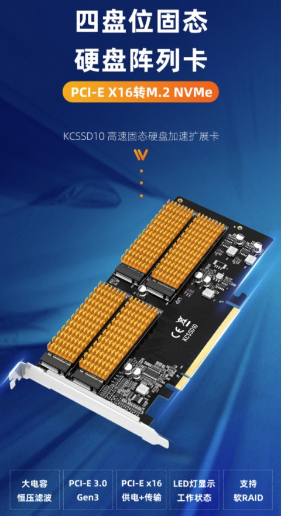
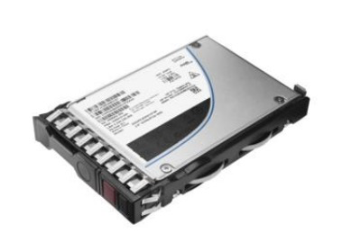
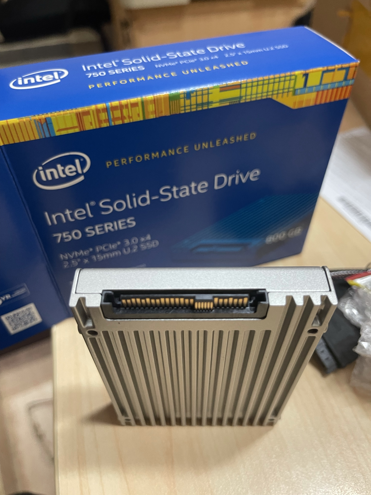

.. _storage_spec:

===================
存储设备规格
===================

我在查阅 :ref:`hpe_dl360_gen9` 文档时，有关存储接口以及标准需要系统整理和学习，以便选择服务器以及部件。

SAS和SATA
============

- SAS：串行scsi接口，能够兼容sata接口，这是服务器上常见的高性价比硬盘接口，多见于企业级机械磁盘(HDD)。
- SATA：串行ata接口，也就是我们生活中常见的台式机和笔记本硬盘接口，SATA采用串行连接方式，SATA总线使用嵌入式时钟信号，具备更强纠错能力，结构简单，支持热插拔

  - SATA实际上是SAS标准的子集，两者可以兼容
  - SAS由于强大的SCSI指令集，并且支持双向全双工模式(可同时发生读写操作提供了两路活动通道)
  - SATA只能提供单通道和半双工模式，所以性能较弱
  - SATA接口速度6Gb/s (SAS也是6Gb/s但是速度更快)

- LFF：3.5寸，就是我们一般见到的那种台式机硬盘的大小，这里 ``L`` 表示Large
- SFF：2.5寸，类似笔记本硬盘尺寸

在HP服务器文档中会经常看到 ``SFF`` 和 ``LFF`` 磁盘，实际上就是 2.5寸和3.5寸磁盘。所谓 ``SFF`` 意思是 small form factor ，即小形状因素，指的是小型化的电脑组件和接口。在服务器相关文档，一般SFF硬盘就是指2.5"硬盘。此外，在网络领域，有专业术语 ``SFP`` 表示 small form-factor pluggable(SFP)，是一种紧凑型，热插拔网络接口模块，通常是光线接口，或者电缆。( `Small form-factor pluggable transceiver <https://en.wikipedia.org/wiki/Small_form-factor_pluggable_transceiver>`_ )

NVMe和SSD
=============

SSD即Solid Storage Device（固态存储设备)，是目前主流的存储设备，具有高性能和高稳定性，在台式机、笔记本以及服务器领域都有广泛使用。

NVMe 是 NVM Express (Non-Volatile Memory Express)规范，是访问高速存储介质接口协议，目前已经逐渐替代了传统的 SATA/SAS 接口。NVMe协议可以基本不用修改现有的硬盘(HDD)存储系统，并且对于新型高速存储介质(SSD)，NVMe通过高速的PCIe接口直接访问存储设备。并且NVMe针对多核处理器有优化，因为该协议是 :ref:`numa` 优化协议，允许多个处理器核心共享队列、优先级。

NVMe 接口形状和标准
-----------------------

NVMe规范了一系列工业标准PCIe SSD标准，包括:

- 标准2.5寸 ``U.2`` 存储硬件接口
- 内部安装 ``M.2`` 接口
- 安装在卡上(Add In Card, AIC)
- 以及不同的EDSFF形式接口

我最初看到淘宝卖家介绍 :ref:`hpe_dl360_gen9` ，提到该服务器支持NVMe协议(实际上是因为 :ref:`intel_c610` 支持NVMe)，咨询了卖家告知我需要通过转接卡来使用 ``M.2`` 的NVMe SSD。这种转接卡在淘宝和京东上都有售卖，价格低廉（几十到几百元），可以支持 ``1 ~ 4`` 个M.2 NVMe 存储，并且多个M.2 NVMe可以组件软RAID。

这种转接卡的优点是可以使用廉价的家用型 M.2 NVMe SSD存储，并且可以采用多个NVMe组建 :ref:`ceph` 或 :ref:`gluster` 分布式存储(不建议使用RAID)，缺点是对于服务器占用了宝贵的PCIe插槽(通常用于GPU显卡或者高性能多口网卡)，也没有使用原先规划的热插拔磁盘位。

.. note::

   由于通过 PCIe转NVMe扩展卡 ( `京东: 麦沃 MAIWO M.2转接卡Nvme四盘位PCIEX16转固态硬盘阵列转接卡 <https://item.jd.com/10021208284029.html>`_ 售价约340元 ) 可以使用价格较为低廉的家用型 M.2 接口NVMe SSD，相同存储容量是服务器 U.2 存储的一半，所以对于个人使用较为合适，能够组件一个小规模的 :ref:`ceph` 存储虚拟化集群。 

上述转接卡方式使用NVMe是非常实用的技术，已经有实践案例 `Add NVMe capability to an HPE Proliant DL360p Gen8 Server <https://www.stephenwagner.com/2020/05/26/add-nvme-capability-hpe-proliant-server/>`_ 为非常古老的DL360 Gen8服务器实现了NVMe存储。

不过，需要注意的是，服务器厂商，例如HPE并没有在官方提供上述转接卡形式的NVMe存储方案，而是采用 标准2.5寸 ``U.2`` 存储硬件接口，这种标准方式和传统的机架服务器热插拔磁盘兼容，就像安装传统的SAS/SATA磁盘一样。在 `HPE ProLiant DL360 Gen9 Server QuickSpecs <https://support.hpe.com/hpesc/public/docDisplay?docLocale=en_US&docId=c04346229>`_ 只说明了支持 Hot Plug SFF NVMe PCIe SSD ::

   4 SAS/SATA (Drive 1-4)+6 NVMe (Drive 5-10)

但是没有说明NVMe存储设备部件的形式。不过，搜索可以找到 `HPE 2TB NVMe Gen3 High Performance Read Intensive SFF SCN U.2 P4510 SSD <https://buy.hpe.com/us/en/options/solid-state-drives/hpe-nvme-high-performance-read-intensive-solid-state-drives/hpe-2tb-nvme-gen3-high-performance-read-intensive-sff-scn-u-2-p4510-ssd/p/P13695-B21>`_ ，详细技术规格见 `SFF SCN U.2
P4510 SSD (P13695-B21) <https://www.hpe.com/psnow/doc/PSN1011637521USEN.pdf>`_

万能淘宝可以找到 `惠普 UX3500 1T 2TB Nvme U.2 U2 2.5英寸 SSD 服务器固态硬盘 <https://item.taobao.com/item.htm?id=645689610557>`_ 以及 `Intel 750 800G 1.2T 2T u.2接口固态 nvme MLC 服务器固态 <https://item.taobao.com/item.htm?id=565802045326>`_ 可以让我们一窥真相:

参考
========

- `SAS、SATA、SFF、LFF <https://blog.moper.net/2163.html>`_
- `What is NVMe™ and why is it important? A Technical Guide <https://blog.westerndigital.com/nvme-important-data-driven-businesses/>`_
