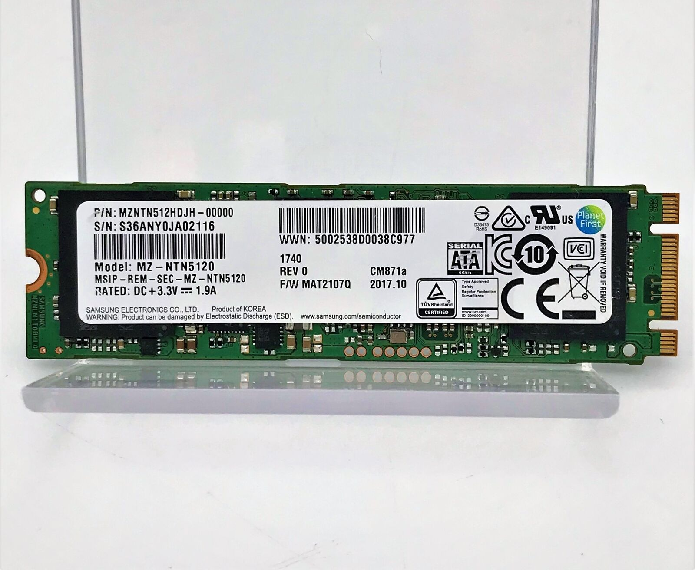

.. _orico_m2_nvme_sata_udisk:

=============================================
奥睿科（ORICO）M.2 NVMe/SATA双协议移动硬盘盒
=============================================

我使用 :ref:`mba11_late_2010_update_sata` ，由于 :ref:`mba11_late_2010` 的硬件有异常，启动无法使用 ``option`` 键切换启动设备，导致我我发直接从U盘安装 :ref:`gentoo_linux` 。所以我想了一个变通方法，先完成 :ref:`install_gentoo_on_mbp` ，然后通过购买的 ``奥睿科（ORICO）M.2 NVMe/SATA双协议移动硬盘盒`` 来 :ref:`clone_gentoo` 完成安装。最后，再将安装好 :ref:`gentoo_linux` 的SATA硬盘安装到 :ref:`mba11_late_2010` 。

三星 CM871a 512GB MZ-NTN5120 (注意，这款是 :ref:`m2` SATA存储，非 :ref:`nvme` )

移动硬盘盒
============

``奥睿科（ORICO）M.2 NVMe/SATA双协议移动硬盘盒`` 主控芯片是 `Realtek RTL9210B-CG <https://www.realtek.com/en/products/connected-media-ics/item/rtl9210b-cg>`_ ，我发现一个奇怪的地方，就是 ``fdisk -l`` 看到的磁盘情况:

.. literalinclude:: orico_m2_nvme_sata_udisk/fdisk_output
   :caption: 初始时安装好SATA磁盘的 ``fdisk -l`` 输出
   :emphasize-lines: 4,5

这里比较奇特的是 ``I/O size`` 的 ``optimal`` 格式是 ``33553920`` 字节，也就是大约 32MB (但是不是整数) 。一般我们见到的参数都是 ``I/O size (minimum/optimal): 4096 bytes / 4096 bytes`` 

另外，我尝试 ``parted -a optimal /dev/sdc`` 为磁盘创建分区，总是提示不能对齐:

.. literalinclude:: orico_m2_nvme_sata_udisk/parted_align_err
   :caption: 使用 ``parted -a optimal`` 提示不能对齐
