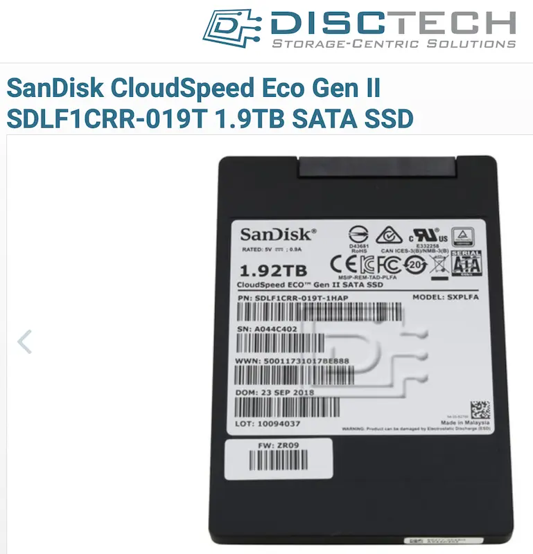

.. _sandisk_cloudspeed_eco_gen_ii_sata_ssd:

=======================================================
SanDisk CloudSpeed Eco Gen. II SATA SSD企业级固态硬盘
=======================================================

和 :ref:`intel_ssd_dc_series` 早期MLC 3520 系列耐用度相当，当前(2023年1月)在美亚上售价 $499 ，淘宝上二手拆机(健康度90%以上，写入200T-900T)售价650元左右。

   SanDisk CloudSpeed Eco Gen. II SATA SSD 1.9T

我准备用来扩容 :ref:`hpe_dl360_gen9` ，构建 :ref:`zfs` 存储来作为服务器的底层数据保存

参考
========

- `CloudSpeed EcoTM Gen. II SATA SSD Hyperscale Data Center Flash Storage <https://www.sandisk.com/content/dam/sandisk-main/en_us/assets/resources/enterprise/data-sheets/cloudspeed-eco-genII-sata-ssd-datasheet.pdf>`_
