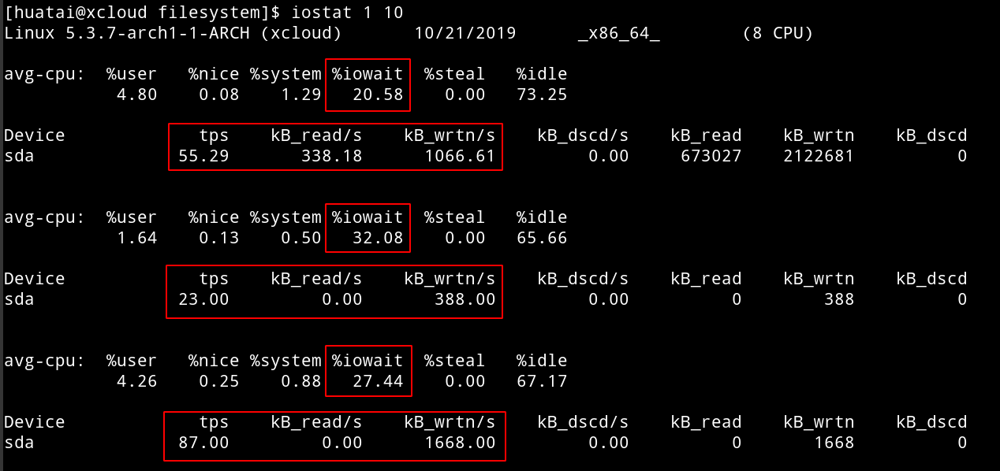
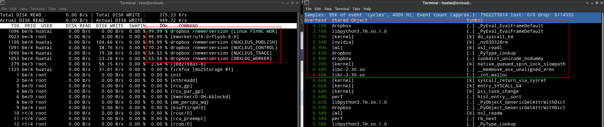

.. _dropbox_ext4:

============================
Ext4文件系统上Dropbox疑问
============================

.. note::

   目前Ext4文件系统上运行Dropbox的高iowait问题我还没有解决，有时间我会再做尝试。目前暂时改成采用 :ref:`lvm_xfs_in_studio` 运行。

   Dropbox在2018年有一段时间放弃了Linux Ext4之外的文件系统，所以 `
   How To Use Dropbox On Non-Ext4 Filesystems (Btrfs, Ext3, XFS, ZFS, Etc.) On Linux <https://www.linuxuprising.com/2018/11/how-to-use-dropbox-on-non-ext4.html>`_ 提供了解决方法。不过，2019年Dropbox又恢复了Linux下多种文件系统支持(详情见 `What are the system requirements to run Dropbox? <https://help.dropbox.com/installs-integrations/desktop/system-requirements#desktop>`_ )

在 :ref:`archlinux_on_mbp` 遇到一个奇怪的问题，磁盘性能似乎极差，特别是当启动 Dropbox 同步网盘数据之后，虽然dropbox网络流量极低，但是 ``top`` 检查 iowait 非常高导致系统相应缓慢：

.. figure:: ../../../../_static/linux/storage/filesystem/ext/dropbox_high_iowait.png
   :scale: 50

但是，通过 ``iostat`` 检查却发现磁盘读写非常小，完全达不到SSD的性能:

之前在 :ref:`archlinux_on_thinkpad_x220` 同样的Arch Linux，但是运行 Dropbox 没有丝毫问题，数据很快就同步完。那么，两者的差异是什么？

文件系统差异
==============

:ref:`archlinux_on_thinkpad_x220` ，我做了 :ref:`lvm_xfs_in_studio` ，将完整的 ``/home`` 目录迁移到 XFS 文件系统中存储。但是，我觉得，默认安装的Arch Linux所使用的 ``ext4`` 文件系统不会弱到连个人目录都无法支持吧。

观察了一下 :ref:`archlinux_on_mbp` ，默认通过安装程序 ``genfstab -U /mnt >> /mnt/etc/fstab`` 生成的配置::

   # <file system> <dir> <type> <options> <dump> <pass>
   # /dev/sda3
   UUID=e38d80cc-4044-4d34-b730-1f0c874ad765/               ext4        rw,relatime  0 1

这里 ``ext4`` 文件系统挂载参数 ``relatim`` 似乎和以往推荐的 ``noatime`` 挂载参数不同。

.. note::

   参考 `Mount options – atime vs relatime <https://blog.confirm.ch/mount-options-atime-vs-relatime/>`_ :

   参数 ``relatime`` 和 ``atime`` 不同之处在于，每次文件访问时，``relatime`` 不是马上修改访问时间(atime)，仅在以下条件之一满足时才修改atime:

   - 文件修改时间(modified time, mtime)或者文件修改时间状态(change time status, ctime) 比文件访问时间(atime)更新的时候
   - 文件访问时间(atime)比定义间隔更旧(在RHEL系统中默认是1天)

   ``relatime`` 参数是介于 ``atime`` 和 ``noatime`` 选项之间的一个较好的混合参数，对于大多数需要获取文件访问时间的应用非常有用。如果使用 ``relatime`` 选项，即使一个文件经常访问也不会产生大量的磁盘流量。例如，对于WEB服务器， ``relatime`` 就是一个很好的磁盘挂载参数方案，因为这种情况下有大量的读活动，而仅仅每天更新一次 ``atime`` 。

   对于固态硬盘(SSD)，如果没有应用程序需要atime，则可以修改成 ``noatime`` 。

Dropbox挂载Ext4要求
====================

参考 `Dropbox: ext4 isn't ext4 <https://askubuntu.com/questions/1066045/dropbox-ext4-isnt-ext4>`_ 介绍了Dropbox在Linux的Ext4文件系统工作需要满足以下要求：

- (文档明确要求的)Dropbox需要使用 ``ext4`` 文件系统，并且 **不能** 设置 ``ecryptfs`` ，即文件系统不能加密
- 其他没有明确文档的文件系统要求有：
  - ``ext4`` 文件系统需要使用 ``ext_attr`` 激活的方式进行格式化，这是一个默认特性，你可以通过 ``debugfs -R features /dev/sda1`` 检查。
  - ``ext4`` 文件系统需要使用 ``user_xattr`` 选项挂载。这个参数可以通过 ``/etc/fstab`` 检查，或者使用 ``mount`` 命令检查挂载参数。
  - 另外 Dropbox 目录需要位于二层目录

- 检查 ``/dev/sda3`` 文件系统格式化参数情况::

   debugfs -R features /dev/sda3

显示输出::

   Filesystem features: has_journal ext_attr resize_inode dir_index filetype needs_recovery extent 64bit flex_bg sparse_super large_file huge_file dir_nlink extra_isize metadata_csum

.. note::

   使用 ``tune2fs -l /dev/sda3`` 能够检查文件系统的详细信息，也包括了 ``Filesystem features``

- 检查 ``/`` 文件系统挂载参数::

   mount

显示::

   /dev/sda3 on / type ext4 (rw,relatime)

这个挂载参数是因为默认的安装对于ext4的挂载就是这个参数 ``ext4       rw,relatime``

.. note::

   ``user_xattr`` 是Ext4的用户扩展属性支持参数。

   使用 ``tune2fs -l /dev/sda3`` 可以看到输出信息现实::

      Filesystem features:      has_journal ext_attr resize_inode dir_index filetype needs_recovery extent 64bit flex_bg sparse_super large_file huge_file dir_nlink extra_isize metadata_csum
      Filesystem flags:         signed_directory_hash 
      Default mount options:    user_xattr acl

   这表明，Ext4文件系统默认挂载参数包括了 ``user_xattr acl`` ，所以不需要特别指定。

虽然 ``tune2fs -l /dev/sda3`` 显示默认就已经激活了 ``user_xattr`` 选项，不过 ``mount`` 输出没有，所以我还是尝试显式挂载文件系统::

   mount -n -o rw,relatime,user_xattr,remount /

然后检查 ``mount`` 命令输出显示::

   /dev/sda3 on / type ext4 (rw,relatime)

难道没有生效？手工修改 ``/etc/fstab`` 添加这个参数::

   UUID=e38d80cc-4044-4d34-b730-1f0c874ad765/               ext4        rw,relatime,user_xattr  0 1   

然后重启系统。但是发现，这个 ``user_xattr`` 挂载参数并不会显示在 ``mount`` 输出中，依然显示::

   /dev/sda3 on / type ext4 (rw,relatime)

修改Ext4文件系统noatime
--------------------------

- 尝试将 ``relatime`` 修订成 ``noatime`` ::

   mount -n -o rw,noatime,remount /

检查确认 ``mount`` 输出已经是 ``/dev/sda3 on / type ext4 (rw,noatime)`` ，然后尝试重新启动 Dropbox ，但是发现没有改善性能。

fio性能测试
==================

参考 `How to use Fio (Flexible I/O Tester) to Measure Disk Performance in Linux <https://dotlayer.com/how-to-use-fio-to-measure-disk-performance-in-linux/>`_ 做一个磁盘性能测试::

   sudo fio --randrepeat=1 --ioengine=libaio --direct=1 --gtod_reduce=1 --name=test --filename=random_read_write.fio --bs=4k --iodepth=64 --size=4G --readwrite=randrw --rwmixread=75

发现磁盘性能很好::

   test: (g=0): rw=randrw, bs=(R) 4096B-4096B, (W) 4096B-4096B, (T) 4096B-4096B, ioengine=libaio, iodepth=64
   fio-3.16
   Starting 1 process
   test: Laying out IO file (1 file / 4096MiB)
   Jobs: 1 (f=1): [m(1)][100.0%][r=221MiB/s,w=73.2MiB/s][r=56.5k,w=18.8k IOPS][eta 00m:00s]
   test: (groupid=0, jobs=1): err= 0: pid=2144: Tue Oct 22 00:42:32 2019
     read: IOPS=58.7k, BW=229MiB/s (241MB/s)(3070MiB/13385msec)
      bw (  KiB/s): min=219472, max=247088, per=100.00%, avg=235071.08, stdev=7541.43, samples=26
      iops        : min=54868, max=61772, avg=58767.77, stdev=1885.36, samples=26
     write: IOPS=19.6k, BW=76.7MiB/s (80.4MB/s)(1026MiB/13385msec); 0 zone resets
      bw (  KiB/s): min=73592, max=82296, per=100.00%, avg=78584.31, stdev=2656.22, samples=26
      iops        : min=18398, max=20574, avg=19646.08, stdev=664.06, samples=26
     cpu          : usr=12.85%, sys=42.51%, ctx=43501, majf=0, minf=7
     IO depths    : 1=0.1%, 2=0.1%, 4=0.1%, 8=0.1%, 16=0.1%, 32=0.1%, >=64=100.0%
        submit    : 0=0.0%, 4=100.0%, 8=0.0%, 16=0.0%, 32=0.0%, 64=0.0%, >=64=0.0%
        complete  : 0=0.0%, 4=100.0%, 8=0.0%, 16=0.0%, 32=0.0%, 64=0.1%, >=64=0.0%
        issued rwts: total=785920,262656,0,0 short=0,0,0,0 dropped=0,0,0,0
        latency   : target=0, window=0, percentile=100.00%, depth=64
   
   Run status group 0 (all jobs):
      READ: bw=229MiB/s (241MB/s), 229MiB/s-229MiB/s (241MB/s-241MB/s), io=3070MiB (3219MB), run=13385-13385msec
     WRITE: bw=76.7MiB/s (80.4MB/s), 76.7MiB/s-76.7MiB/s (80.4MB/s-80.4MB/s), io=1026MiB (1076MB), run=13385-13385msec
   
   Disk stats (read/write):
     sda: ios=773765/258693, merge=216/54, ticks=599183/117277, in_queue=178790, util=98.03%

测试过程 ``top`` 显示没有任何 iowait。

看起来就是 Dropbox 的 iowait 高。

参考 `Arch Linux running on my MacBook <https://medium.com/@philpl/arch-linux-running-on-my-macbook-2ea525ebefe3>`_ 介绍参数修改成::

   rw,relatime,data=ordered,discard

但是我实际测试依然没有解决ext4文件系统在Dropbox下iowait极高的问题。

iotop和perf top
=================

从 ``iotop`` 就可以看到 ``jdb2/sda3-8`` 内核线程始终极高cpu占用率。

不过参考 `ropbox is compatible with Ext4 but doesn't recogn <https://www.dropboxforum.com/t5/Installs-integrations/Dropbox-is-compatible-with-Ext4-but-doesn-t-recognize-ext4-drive/td-p/292228/page/4>`_ 提示，需要修改挂载参数::

   ext4 rw,user,exec,auto,user_xattr

尝试执行::

   mount -n -o remount,rw,user,exec,auto,user_xattr /dev/sda3 /

然后检查挂载 ``mount`` 输出::

   /dev/sda3 on / type ext4 (rw,nosuid,nodev,noatime,discard,commit=60)

但是，上述方法依然没有解决负载过高问题，问题依旧。另外，上述挂载参数 ``nosuid`` 会导致文件系统无法使用 ``sudo`` ，请谨慎使用。

暂时放弃
=============

目前还没有找到解决方案，我准备暂时切换到 :ref:`lvm_xfs_in_studio` 方案看看能否改善这个性能问题。
