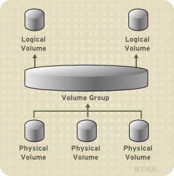
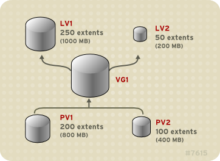
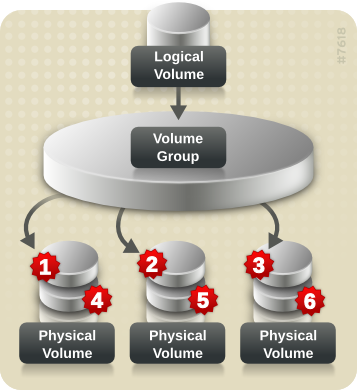

.. _lvm_infra:

================
LVM架构
================

逻辑卷LVM
===========

LVM是基于Linux kernel的逻辑卷管理，通过将多个磁盘或类似的存储设备组合成大存储。LVM最初由Heinz Mauelshagen公司开发，基于HP-UX的LVM设计。多数Linux发行版本已经支持在逻辑卷上的根文件系统上安装一个启动系统。

通过使用逻辑卷(LVM)可已在物理存储上创建一个抽象层，比直接使用物理存储具有更大灵活性: LVM软件抽象层隐藏了底层硬件存储，使得调整文件系统大小以及移动，无需停止应用或卸载文件系统。

相比直接使用物理存储，逻辑卷具有以下优势:

- 灵活的容量: 使用逻辑卷时，文件系统可以跨多个物理磁盘或分区(物理卷, physical volumes, PV)，而且底层物理磁盘添加对上层文件系统无感知，可以实现不停机动态在线扩展 - 很多项目在初步上线的时候，为了节约投资并根据业务扩展情况逐步扩展存储，通过LVM卷管理可以实现动态在线扩容
- 调整存储池大小: 可以扩展或减小逻辑卷，无需重新格式化或者重新分区基础磁盘设备
- 在线数据重定位( ``需要实践`` ): 可以在系统在线使用时移动数据，重新分配磁盘，清空热插拔磁盘(维护)，对运维硬件替换具有极大用途
- 方便的设备命名: 可以使用用户自己定义的设备命名
- 条带化: 通过条带化在多个磁盘(PV)上构建条带化分布数据的逻辑卷，可以显著提高吞吐量 - 类似 ``RAID 0``
- 镜像: 通过数据镜像提供硬件故障防范 - 类似 ``RAID 1``
- 快照: 设备快照可以用于数据备份以及测试更改对系统的影响 - LVM快照可以在秒级完成超大容量存储瞬间clone，从而为后续备份提供支持
- 精简卷(Thin volumes): LVM的精简模式配置，可以创建大于实际硬件容量的逻辑卷 - 这个功能在虚拟化 ``存储超买`` 上有很大用途，可以快速创建极大的卷并在逻辑上分配超过物理存储的容量，随着业务发展可以逐步扩容
- 缓存卷(Cache volumes) :ref:`lvmcache` : 缓存逻辑卷使用更快的块设备(如SSD)组成小型逻辑卷，通过将热点数据存储在快速的缓存卷来提高较慢的大容量存储(如机械硬盘)的性能 

LVM架构
=========

- LVM在每个物理卷( ``PV`` )的开头部分维护一个 ``metadata`` 头，每个 ``metadata`` 头通过UUID来唯一标识。
- 每个 ``PV`` 头部包含一个完整的整个卷组( ``VG`` )布局副本，包括所有其他 ``PV`` 的 ``UUID`` ，以及所有逻辑卷( ``LV`` )的 ``UUID`` 和 ``PE`` 至 ``LE`` 的分配映射关系表。这实现了当 ``PV`` 损坏时候可以实现简单的数据恢复。
- LVM实现是通过一个 ``device mapper`` 概念来实现的，这是一个简单的基于块级别的方案，实现通过创建虚拟块设备和映射这些块内容到另外其他块设备。LVM的这种 ``device mapper`` 也允许 ``I/O`` 重定向服务，这样可以和其他卷管理共享（如 ``EVMS`` ）。

下图是 LVM 逻辑卷组件，可以看到 ``PV => VG => LV`` 的层次结构: 

   LVM逻辑卷组件

逻辑卷管理提供了磁盘存储的高层视图，以便管理员能够灵活分配存储给应用程序和用户。逻辑卷管理允许以用户定义组来分配存储卷，允许将存储设置为卷组名如"development"和"sales"，而不用使用设备名，如"sda"和"sdb"。

定义
------

.. csv-table:: LVM概念表
   :file: lvm_infra/lvm.csv
   :widths: 40, 60
   :header-rows: 1

物理卷(Physical Volumes, PV)
--------------------------------

卷管理在物理存储之上创建了一个抽象层，允许创建逻辑存储卷。逻辑卷功能比直接使用物理存储提供一系列更具伸缩性。当使用逻辑卷，可以不受到物理磁盘大小的限制。并且，由于物理存储的配置被软件所隐蔽，所以可以不停止应用程序或不unmount文件系统进行卷扩展或移动。物理卷可以是分区也可以是整个磁盘，不过从实践上来说，推荐采用整个磁盘:

- 因为当磁盘损坏时，很大概率是整个磁盘上多个分区同时无法使用；通常我们使用LVM卷是希望获得数据冗余来保障数据安全，如果使用了同一个物理磁盘上的多个分区来构建一个LVM，则有可能出现多副本同时毁坏。
- LVM并不知晓两个物理卷位于同一个物理磁盘，此时组建的条代化逻辑卷的性能会降低(因为两个逻辑分区读写实际上位于同一个物理磁盘，带来读写带宽争抢)

在构建LVM卷时，物理卷是首先创建的，也就是要使用磁盘，必先初始化成物理卷(PV)。这个快设备初始化为物理卷时，会在接近设备起始的位置放一个标签。默认情况下，LVM标签存放在物理设备的 ``第二个512字节扇区`` 。在创建物理卷时候，可以通过将标签放在 ``任何前4个扇区`` 来覆盖此默认值。如果需要，LVM卷可以与其他使用这些扇区的用户共同存在。

- LVM标签为物理设备提供正确标识和设备顺序: 需要注意，物理主机启动时，磁盘识别顺序是不能保证顺序的(加电初始化时间不固定导致识别顺序随机)，所以必须使用唯一的UUID来识别设备。LVM标签可以在主机重启后保持持久性并且在整个集群中可用
- LVM标签可以将设备识别为LVM物理卷，包含物理卷的随机 唯一识别符(UUID)；同时LVM标签还以字节为单位保存块设备的大小，并记录LVM元数据存储在该设备中的位置
- LVM元数据包含系统中LVM卷组的配置详情，默认情况下，卷组中每个物理卷的元数据区域都会保留一个一样的元数据副本，这为磁盘故障时回复LVM卷组提供依据。LVM元数据很小，以ASCII格式保存
- LVM允许每个物理卷中保存0, 1 或者 2个元数据副本。默认为1个副本，当在物理卷中配置元数据副本数量之后，无法再更改该号码。如果不小心覆盖了磁盘的起始部分，则可以使用设备末尾的元数据的第二个副本来恢复元数据

.. figure:: ../../../_static/linux/storage/lvm/physvol.png

   LVM物理卷

卷组(Volume Groups, VG)
-----------------------------

物理卷组合成卷组（volume groups, ``VGs`` ），卷组是准备用于分配逻辑卷的磁盘空间池:

- 在一个卷组，磁盘空间分配是基于划分为一个固定大小的单元extent来实现的。一个extent是磁盘分配的最小空间单元。在一个物理卷中，extent就是物理extent。
- 一个逻辑卷所使用的逻辑extent和物理extent的大小相同
- 在一个卷组中，所有逻辑卷的extent的大小都是相同的
- 卷组把逻辑extent映射到物理extent

LVM逻辑卷(Logical Volumes, LV)
---------------------------------

.. note::

   在 AMD、Intel、ARM 和 IBM Power Systems 服务器中,引导装载程序无法读取 LVM 卷:

   必须将 ``/boot`` 分区创建为一个标准的非LVM磁盘分区

LVM逻辑卷分类
^^^^^^^^^^^^^^^^^

线性逻辑卷
""""""""""""""""""

线性逻辑卷就是聚合多个物理卷成为一个逻辑卷，目的就是扩展磁盘空间:

   线性逻辑卷，卷组VG1上构建LV1和LV2逻辑卷

条带化逻辑卷( :ref:`striped_lvm` )
""""""""""""""""""""""""""""""""""""""

当在LVM逻辑卷上写入数据，文件系统把数据分布到底层的物理卷。可以通过创建一个条带化的逻辑卷来控制数据写入到物理卷。对于大型的顺序读写，可以提高数据I/O的效率。

条带化通过 ``round-robin`` 方式将数据写入不同物理卷，磁盘 ``I/O`` 是并行的。某些情况下，可以达到物理卷性能的线性叠加。

   条代化逻辑卷: 数据条代1,2,3分别写入3个物理卷，而从条代4～6又分别写入3个磁盘，从而达到并发提高性能

RAID逻辑卷
""""""""""""""""""

LVM 支持 RAID 0、1、4、5、6 和 10：

  - LVM 创建和管理的 RAID 逻辑卷利用多设备（MD）内核驱动程序
  - LVM RAID 卷支持快照
  - 创建 RAID 逻辑卷时，LVM 会为阵列中的每个数据或奇偶校验子卷创建一个元数据子卷

精简配置逻辑卷( :ref:`lvmthin` )
""""""""""""""""""""""""""""""""""""""""

精简模式置备的逻辑卷可以创建大于可用扩展的逻辑卷:

  - 可过量使用物理存储，从而避免购买额外的存储
  - 使用精简配置时，存储管理员务必要监控存储池，并在其被完全占用时添加更多容量
  - LVM 支持数据丢弃功能。这允许重复使用丢弃文件或其他块范围使用的空间
  - 精简卷支持新的复制时写入（COW）快照逻辑卷部署，这将允许很多虚拟设备在精简池中共享相同数据

快照逻辑卷(snapshot)
""""""""""""""""""""""""""""

``snapshot`` 提供了不中断服务的情况下瞬间创建一个设备虚拟映像的方式。如果在一个snapshot执行之后对原始设备进行的修改，则snapshot将生成一个变化数据区域的副本，这样可以用来重构设备的状态。

  - 由于一个snapshot副本只是snapshot创建后数据变化的区域，所以snapshot功能只要求最少的存储。例如，对于一个很少修改的系统，3-5%的空间就能够满足维护snapshot。
  - ``snapshot`` 只是一个文件系统的虚拟copy，并不是实际备份文件系统，所以不能作为备份手段。
  - ``snapshot`` 

``snapshot`` 提供了不中断服务的情况下瞬间创建一个设备虚拟映像的方式。如果在一个snapshot执行之后对原始设备进行的修改，则snapshot将生成一个变化数据区域的副本，这样可以用来重构设备的状态。

  - 由于一个snapshot副本只是snapshot创建后数据变化的区域，所以snapshot功能只要求最少的存储。例如，对于一个很少修改的系统，3-5%的空间就能够满足维护snapshot。
  - ``snapshot`` 只是一个文件系统的虚拟copy，并不是实际备份文件系统，所以不能作为备份手段。
  - ``snapshot`` 占用的磁盘空间大小取决于原始卷的数据变化: 如果被填满，则该 ``snapshot`` 将损坏，此时这个 ``snapshot`` 将不能跟踪原始卷的变化。需要经常监控 ``snapshot`` 的大小。 ``snapshot`` 支持完善的重定义大小，所以，如果存储空间充足可以增加 ``snapshot`` 的大小来避免该snapshot被破坏。相反，如果发现 ``snapshot`` 比需要的大，则可以缩减 ``snapshot`` 的大小。

有关 ``snapshot`` 的一些有用的特性：

  - 多数情况下，一个 ``snapshot`` 可以用来执行原始逻辑卷的备份，而不需要停止在线系统。
  - 可以在一个 ``snapshot`` 文件系统上执行 ``fsck`` 命令来检查文件系统的完整性和检查是否需要修复系统。
  - 由于 ``snapshot`` 是可以读写的，可以在 ``snapshot`` 上测试生产环境数据的应用程序，运行在线测试，而不会影响真实的生产数据。
  - LVM 快照可用来创建虚拟客体镜像的快照。这些快照可方便修改现有客户虚拟机或者使用最小附加存储创建新客户虚拟机。
  - 可以使用 ``lvconvert`` 的 ``--merge`` 选项将快照合并到原始卷中。这个功能的一个作用是在丢失数据或者文件或者需要将系统恢复到之前的状态时执行系统恢复。

精简配置的快照逻辑卷
""""""""""""""""""""""""

精简配置的快照逻辑卷(精简快照卷)可以将很多虚拟设备保存在同一个数据卷，这不仅简化了管理过程，也允许在快照卷之间共享数据:

- 使用相同原始卷的多个快照时，精简快照卷可以减少磁盘用量
- 对于同一个来源的多个快照，对原始卷的写入采用COW操作保留数据。增加原始卷的快照数量应该不会导致很大的性能下降(我理解对于大量的快照，写时复制特性就是只有快照也有写入操作才会叠加原始卷的数据修改，否则理论上只有一个原始卷有数据变动，而快照卷只读情况下几乎不会触发数据写)
- 精简快照卷可以作为另一个快照的逻辑卷来源，也就是任意深度的递归快照(一个快好的快照的快照...)
- 精简逻辑卷的快照也是一个精简逻辑卷。在有求COW操作前，或者到快照已写入前，不会消耗数据空间
- 当删除精简配置快照卷的原始卷是，该原始卷的每个快照都会变成独立的精简卷。

精简快照卷的限制:

- 不能更改精简卷的快大小: 如果精简卷的快大小较大(例如，1MB)，并且需要一个短期存在的快照且使用大块的效率不高时，建议使用旧的快照功能
- 不能限制精简快照卷的大小: 如果需要，快照将使用完精简池中所有空间，这可能不适合某些业务场景

.. warning::

   在使用精简配置时，存储管理员 ``必须`` 监控存储池，并且在存储池被完全耗尽前添加更多存储容量!!!

:ref:`lvmcache`
""""""""""""""""""""""""

LVM支持在较慢的块设备中使用快速快设备(例如SSD驱动器)作为写入或写入缓存。可以通过创建缓存逻辑池来提高现有逻辑卷的性能，或者创建新的缓存逻辑卷。这种解决方案通过小的、快速设备结合大型且缓慢的存储，可以经济地实现海量存储。

参考
=======

- `Logical Volume Manager (Linux) <http://en.wikipedia.org/wiki/Logical_Volume_Manager_(Linux)>`_
- `A Beginner's Guide To LVM <http://www.howtoforge.com/linux_lvm>`_
- `Red Hat Enterprise Linux 8.0 > 配置和管理逻辑卷 <https://access.redhat.com/documentation/zh-cn/red_hat_enterprise_linux/8/html/configuring_and_managing_logical_volumes>`_
- `Linux Logical Volume Manager (LVM) on Software RAID <http://aplawrence.com/Linux/lvm.html>`_
- `Managing RAID and LVM with Linux (v0.5) <http://www.gagme.com/greg/linux/raid-lvm.php>`_
- `LVM HOWTO <http://www.ibiblio.org/pub/Linux/docs/HOWTO/other-formats/html_single/LVM-HOWTO.html>`_
- `学习Linux LVM <http://www.ibm.com/developerworks/cn/linux/filesystem/lvm/lvm-1/index.htm>`_
- `逻辑卷管理-使用 LVM2 工具执行卷的构建和管理、建立备份快照等各种功能 <http://www.ibm.com/developerworks/cn/linux/l-lvm2/>`_
